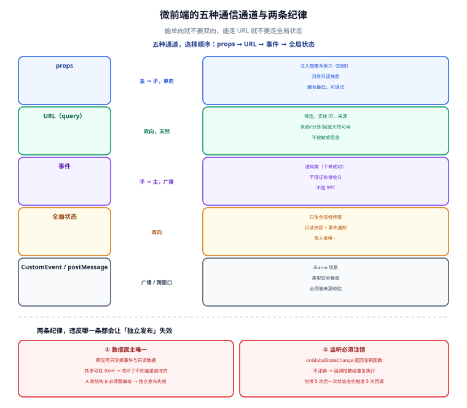

# 通信与状态共享

一句话定位：微前端的通信设计有一个总原则——**能单向就不要双向，能走 URL 就不要走全局状态，能传「事件」就不要传「可变对象」**。违反这些原则的代价不是「写起来麻烦」，而是**子应用之间被隐式绑死，独立发布失效**。



## 一、五种通道对照

| 通道 | 方向 | 类型安全 | 可调试 | 耦合度 | 适用 |
| --- | --- | --- | --- | --- | --- |
| **props（主 → 子）** | 单向 | 中（TS 接口） | 好（可打印） | **最低** | 主应用注入配置、回调（登出、跳转） |
| **事件（子 → 主 / 子 ↔ 子）** | 单向广播 | 弱（约定字符串） | 中 | 低 | 通知类（下单成功、登录过期） |
| **URL（query / hash）** | 双向（天然） | 弱 | **最好**（可见可复制） | 低 | 筛选条件、当前实体 ID、可分享状态 |
| **全局状态（共享 store）** | 双向 | 中 | 差（来源不可追溯） | **高** | 跨应用强一致的状态（当前用户、主题） |
| **`CustomEvent` / `postMessage`** | 广播 / 跨窗口 | 弱 | 中 | 低 | iframe 场景、需要跨窗口 |

::: tip 选择顺序
**props → URL → 事件 → 全局状态**。绝大多数需求前两者就够了。当你想用全局状态时，先问一句：「把这个值放到 URL 的 query 里行不行？」如果行，就用 URL——它天然支持刷新、分享、回退，还不用写任何代码。
:::

## 二、props：主 → 子的单向注入

主应用注册子应用时通过 `props` 注入，子应用在 `mount` 里接收。

```typescript [主应用]
registerMicroApps([{
  name: 'sub-order',
  entry: '//order.example.com/sub/order/',
  container: '#micro-container',
  activeRule: '/order',
  props: {
    // 只注入「能力」与「只读数据」，不要注入可变对象
    routerBase: '/order',
    apiBase: '/api',
    currentUser: { id: 1001, name: '张三' },   // 只读快照
    onLogout: () => logout(),                   // 回调：能力下沉
    onError: (e: Error) => reportError(e),
  },
}])
```

```typescript [子应用]
let injected: MainAppProps = {}

export async function mount(props: MainAppProps) {
  injected = props
  const app = createApp(App, { /* 通过 provide 注入 */ })
  app.provide('mainApp', props)
  app.mount(container ? container.querySelector('#app')! : '#app')
}
```

### props 的三条纪律

| 纪律 | 原因 |
| --- | --- |
| **只传只读快照，不传可变对象** | 传了 `store` 或 `ref`，子应用直接改它 → 数据属主消失，调试时不知道谁改的 |
| **传「能力」而不是「实现」** | 传 `onLogout: () => {...}` 而不是 `authStore`，子应用不需要知道主应用怎么实现的登出 |
| **props 变化要能被感知** | qiankun 的 `props` 在 `mount` 时传一次；后续变化需用 `update` 生命周期或改用 `initGlobalState` |

::: danger 注意：`props` 只在 `mount` 时传一次，后续不会自动更新
常见错误：主应用把 `currentUser` 放进 `props`，用户切换账号后子应用还是老用户。

三种解法：
1. **用 `loadMicroApp` 的手动模式**：`micro.update({ currentUser })` 主动更新（需子应用实现 `update`）。
2. **用 `initGlobalState`**：主应用 `setGlobalState` 时子应用通过 `onGlobalStateChange` 收到通知。
3. **让子应用自己去取**：主应用只传 `apiBase` 与 token 获取方式，子应用挂载时自己请求当前用户。**这条最稳**——把「谁的数据谁去拿」的原则贯彻到底。

第三种做法看起来多一次请求，但它消除了「主应用忘了更新 props」整类问题。
:::

## 三、事件：子 → 主的通知通道

### qiankun 的 `initGlobalState`

```typescript [主应用]
import { initGlobalState, type MicroAppStateActions } from 'qiankun'

const actions: MicroAppStateActions = initGlobalState({
  user: { id: 1001, name: '张三' },
  theme: 'light',
  // 约定：只放「全局且低频变化」的值，不放业务数据
})

// 统一订阅（调试时能一眼看到是谁改的）
actions.onGlobalStateChange((state, prev) => {
  console.log('[global] changed', { state, prev })
}, true)   // true = 立即触发一次
```

```typescript [子应用]
let actions: MicroAppStateActions | null = null
let offStateChange: (() => void) | null = null

export async function mount(props: MainAppProps) {
  actions = props as unknown as MicroAppStateActions

  // onGlobalStateChange 返回的是「注销函数」，必须保存并在 unmount 调用
  offStateChange = actions.onGlobalStateChange?.((state) => {
    if (state.theme !== currentTheme) applyTheme(state.theme)
  }, true) ?? null
}

export async function unmount() {
  offStateChange?.()          // 不注销 → 每次挂载都新增一个监听 → 回调执行 N 次
  offStateChange = null
}
```

::: danger 注意：`onGlobalStateChange` 的返回值必须保存并在 `unmount` 里调用
不注销的后果是**回调指数级重复执行**：进入 /order → 1 个监听；切到 /user 再切回 /order → 2 个监听；切换 5 次后一个状态变化触发 5 次回调。表现为「切了几次页面后，主题切换要卡好几秒」。

这是 qiankun 项目里最高频的 bug，且几乎无法从「功能不正常」直接联想到「监听没注销」，**必须在代码模板里就把注销写好**。
:::

### 自建事件总线（不依赖 qiankun）

```typescript
// 共享包 @company/micro-bus（主应用与子应用都依赖它，但只依赖「协议」不依赖「实现」）
type Events = {
  'order:created': { orderId: string; amountCents: number }
  'auth:expired':  void
  'user:switched': { userId: number }
}

const handlers = new Map<keyof Events, Set<(p: any) => void>>()

export const bus = {
  on<K extends keyof Events>(evt: K, fn: (p: Events[K]) => void) {
    if (!handlers.has(evt)) handlers.set(evt, new Set())
    handlers.get(evt)!.add(fn)
    return () => handlers.get(evt)!.delete(fn)      // 返回注销函数（约定）
  },
  emit<K extends keyof Events>(evt: K, payload: Events[K]) {
    handlers.get(evt)?.forEach((fn) => {
      try { fn(payload) } catch (e) { console.error(`[bus] handler error on ${String(evt)}`, e) }
    })
  },
}
```

三个设计要点：

1. **`on` 返回注销函数**，把「是否清理」的责任明确交给调用方，且在语法上就能看出该做什么。
2. **`emit` 里对每个 handler 做 try/catch**：一个子应用的 handler 抛错不能影响其他订阅者。
3. **事件类型集中定义**（`Events` 类型），让「跨应用协议」有唯一的类型来源。

::: warning 说明：事件不是 RPC
事件总线**不保证有接收方、不返回结果**。它只适合「通知」，不适合「我要拿到 X 的值」。如果子应用需要「问主应用要一个值」，正确做法是用 props 注入的能力（回调），或走 URL/接口。

把事件总线当 RPC 用（`emit` 一个请求事件、另一个应用 `emit` 一个响应事件）会写出极难维护的代码：时序不确定、无超时、无法追踪。
:::

## 四、URL：被低估的最佳通道

很多「需要跨子应用通信」的场景，本质上只是**「让另一个子应用知道当前上下文」**，这时 URL 是最优解。

```typescript
// 场景：从订单子应用跳转到用户子应用，并让后者定位到某个用户
// ❌ 用全局状态：刷新页面后状态丢失，用户看到空白；链接无法分享
globalState.setUser({ id: 42 })

// ✅ 用 URL：刷新、分享、回退全部天然工作
router.push(`/user/profile?userId=42&from=order`)
```

| 用 URL 表示 | 好处 |
| --- | --- |
| 筛选与排序条件 | 刷新不丢、可分享、可做书签 |
| 当前实体 ID | 深链直达、可被外部系统引用 |
| 分页游标 | 浏览器前进后退天然正确 |
| 来源标识（`from=order`） | 便于埋点与「返回来源」 |

```typescript [子应用：读取并监听 URL 变化]
const route = useRoute()

// 只在 URL 里读上下文，不依赖任何全局状态
const userId = computed(() => Number(route.query.userId) || null)

watch(() => route.query.userId, (id) => {
  if (id) loadProfile(Number(id))
}, { immediate: true })
```

::: tip URL 当通道的三个前提
1. **主应用负责「路由属主」的唯一性**（见 [边界设计](../Overview/index.md)），否则 `/user/profile` 可能被两个子应用争抢。
2. **参数要做校验与转义**：从 URL 来的值都是「不可信输入」，必须校验类型与范围，不能直接拼进 SQL/接口路径。
3. **不要用 URL 传敏感信息**：URL 会进浏览器历史、Referer、日志、监控系统。**Token、手机号、身份证一律禁止放 URL。**
:::

## 五、去中心化状态：什么时候该共享

### 三条判断原则

| 原则 | 说明 | 例 |
| --- | --- | --- |
| **全局低频 → 可以共享** | 变化少、所有应用都要 | 当前用户、主题、语言、权限点列表 |
| **业务高频 → 各自维护** | 变化频繁、有明确属主 | 订单列表、购物车、表单状态 |
| **权威来源唯一** | 共享的状态必须有一个「写入者」 | 用户信息只能由主应用写；子应用只读 |

### 正确形态：只读快照 + 事件通知

```typescript
// 主应用：唯一的写入者
const actions = initGlobalState({
  user: { id: 1001, name: '张三', roles: ['buyer'] },
  theme: 'light',
})

// 登录成功后更新（主应用是唯一写入点）
async function onLoginSuccess(u: User) {
  actions.setGlobalState({ user: { id: u.id, name: u.name, roles: u.roles } })
}
```

```typescript
// 子应用：只读 + 订阅，绝不调用 setGlobalState
export async function mount(props: MainAppProps) {
  offState = props.onGlobalStateChange?.((state) => {
    if (state.user.id !== lastUserId) {
      lastUserId = state.user.id
      // 用户变了：清掉本应用里的用户维度缓存，重新拉自己的数据
      clearUserScopedCache()
      reload()
    }
  }, true) ?? null
}
```

::: danger 注意：允许子应用写全局状态，等于放弃数据属主
一旦两个子应用都能 `setGlobalState`，就会出现：
- **覆盖竞争**：A 改了 `user.name`、B 又改回去，谁最后写谁生效；
- **无法定位来源**：出了问题不知道是哪个应用改的（共享 store 的 devtools 只能看到「值变了」，看不到「谁改的」——除非每个字段都记来源，成本很高）；
- **独立发布失效**：A 改了 state 结构，B 不跟着改就崩。

**收敛做法：全局状态只暴露读接口。** 需要改，通过事件通知「属主」去改：

```typescript
// 子应用不能直接改用户信息，而是发一个「请求」事件
bus.emit('user:update-requested', { nickname: '新昵称' })
// 主应用收到后更新全局状态（它是唯一的写入者）
```
:::

## 六、跨应用的契约：共享类型与共享包

```text [共享协议包（唯一的跨应用依赖）]
@company/micro-contracts/
├─ src/
│  ├─ props.ts        # 主应用注入子应用的 props 类型
│  ├─ events.ts       # 事件名与 payload 类型（Events 类型映射）
│  ├─ state.ts        # 全局状态的类型（只读）
│  └─ routes.ts       # 路由属主表（防重叠的唯一来源）
└─ package.json       # 无运行时依赖，纯类型 + 常量
```

```typescript [props.ts]
export interface MainAppProps {
  routerBase: string
  apiBase: string
  currentUser: Readonly<{ id: number; name: string }>
  onLogout: () => void
  onError: (e: Error, context?: Record<string, unknown>) => void
  onGlobalStateChange?: (cb: (s: GlobalState) => void, immediate?: boolean) => () => void
  setGlobalState?: never          // 显式禁止：子应用不得写全局状态
}
```

::: tip 契约包的三条设计约束
1. **零运行时依赖**：只有类型与常量。有运行时代码就会引入版本兼容问题，违背「契约稳定、实现自由」的初衷。
2. **只增不改**：新增字段可选（`field?: T`）；删字段或改语义必须走大版本，且要**同时**升级所有应用。
3. **`Readonly<T>` 与 `never` 是有效工具**：用类型系统表达「只读」和「禁止写入」，比写在文档里强得多。上面 `setGlobalState?: never` 就是让子应用在编译期就写不出来。
:::

## 七、常见问题与排错

| 现象 | 高概率原因 | 定位手段 |
| --- | --- | --- |
| 状态变化后回调执行多次 | `onGlobalStateChange` 返回值未注销 | 在代码里搜是否保存了注销函数并在 `unmount` 调用 |
| 刷新后上下文丢失 | 上下文放在全局状态而非 URL | 改成 URL query |
| 用户切换后子应用还是旧用户 | props 只在 mount 时传一次 | 用 globalState 通知，或子应用自己拉取当前用户 |
| 两个子应用互相覆盖数据 | 共享了可变对象 | 改只读快照 + 事件通知 |
| 事件发了没人收到 | 订阅方还没挂载 | 事件只用于「通知已知存在的一方」；需要可靠投递就用轮询/接口 |
| 一个 handler 报错导致其他不执行 | `emit` 里没做 try/catch | 逐个隔离处理 |
| 共享包升级后某个子应用崩 | 契约做了破坏性变更 | 改为只增不改；破坏性变更走大版本 |

## 八、验证方式

```shell
# 1. 契约包无运行时依赖（防止它变成第二个共享库）
node -e "
const p = require('./packages/micro-contracts/package.json');
const bad = Object.keys({ ...(p.dependencies||{}), ...(p.peerDependencies||{}) });
console.log(bad.length ? '契约包有依赖: ' + bad.join(', ') : 'OK 契约包零依赖');
process.exit(bad.length ? 1 : 0);
"
# 期望：OK 契约包零依赖

# 2. 搜索违规写入（子应用不应调用 setGlobalState）
grep -rn "setGlobalState" apps/sub-*/src && echo "发现子应用写全局状态" || echo "OK 子应用未写全局状态"

# 3. 搜索未注销的监听（on 的返回值是否被使用）
grep -rn "onGlobalStateChange" apps/sub-*/src
# 人工核对：每处都必须把返回值保存下来，并在 unmount 里调用
```

```javascript
// 4. 在浏览器控制台验证「重复切换后回调次数不增长」
//    连续切换子应用 5 次，然后触发一次主题切换，观察 console 里 [global] changed 的出现次数
//    期望：每次状态变化只打印与「当前挂载的应用数量」相同的次数，而不是 5 倍
```

## 参考资料

- [qiankun 官方：`initGlobalState` 与 `onGlobalStateChange`](https://qiankun.umijs.org/zh/api#initglobalstatestate)
- [qiankun 官方：应用间通信](https://qiankun.umijs.org/zh/guide#%E5%BA%94%E7%94%A8%E9%97%B4%E9%80%9A%E4%BF%A1)
- [single-spa：跨应用通信方案对比](https://single-spa.js.org/docs/recommended-setup/#shared-dependencies)
- [MDN：CustomEvent](https://developer.mozilla.org/zh-CN/docs/Web/API/CustomEvent)
- [MDN：URLSearchParams](https://developer.mozilla.org/zh-CN/docs/Web/API/URLSearchParams)
- [web.dev：URL 作为状态](https://web.dev/articles/state-of-the-url)

## 相关页面

- [拆分策略与边界设计](../Overview/index.md) —— 「数据属主唯一」这条原则的来源
- [运行时集成：qiankun 与沙箱](../Runtime/index.md) —— props 与生命周期的机制
- [工程化、独立部署与实战](../Practice/index.md) —— 契约包怎么发布与升级
- [前端工程化](../../Others/FrontendEngineering/index.md) —— 共享包与 monorepo 的工程实践
- [前端安全](../../Others/Security/index.md) —— URL 与存储相关的安全边界
