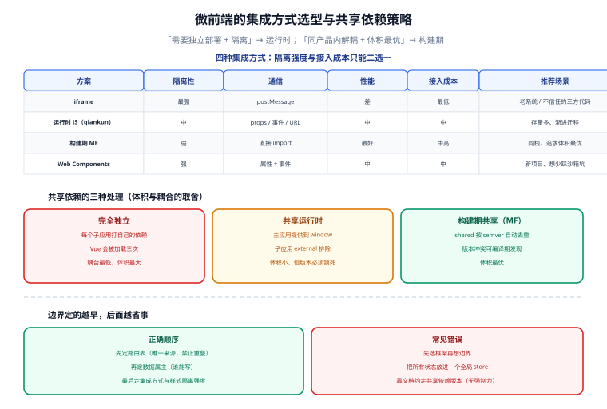

# 拆分策略与边界设计

一句话定位：微前端的成败**在拆分那一刻就决定了 80%**。拆得对，后面是工程问题；拆得错（比如按技术层次拆、或者两个子应用共享同一份数据），后面全是无解的组织问题。



## 一、先做减法：四个前置条件

在决定用微前端之前，先确认真的满足这四条。**任何一条不满足，都有更简单的方案。**

| 前置条件 | 不满足时的替代方案 |
| --- | --- |
| **有多个团队**，各自有独立的发布节奏 | 单团队 → 用 monorepo + 包级拆分 |
| **需要独立部署**（一个子应用改了不用等别人） | 不需要 → 用 monorepo，统一发版 |
| **技术栈需要异构**（或存量应用无法重写） | 同栈 → 用 monorepo + 统一构建 |
| **页面需要在运行时组合**（不同用户的首页可能挂载不同模块） | 静态组合即可 → 构建期集成（Module Federation） |

::: danger 注意：三种「为微前端而微前端」的典型场景
1. **「项目太大，想拆开」**：这是构建性能与模块化问题，用 monorepo + 按需构建解决。微前端只会让你多维护一套通信与隔离机制。
2. **「想渐进式重构老系统」**：这确实是一个合理场景，但要注意——**先确认你要嵌进来的老应用能被容器化**（有独立入口、不依赖主应用的全局变量、样式不是全局覆盖式的）。很多老应用三样都不满足，硬嵌进去比继续维护更糟。
3. **「想让不同团队用不同框架」**：技术自由是有代价的，代价是**每个子应用的依赖都要独立加载**（三个子应用各带一份 Vue，体积直接三倍）。如果目的只是「业务团队想试新框架」，成本远高于收益。
:::

## 二、四种拆分维度

| 维度 | 拆法 | 适用 | 风险 |
| --- | --- | --- | --- |
| **按路由** | 一条路由前缀一个子应用（`/order/**`、`/user/**`） | **最常见、最推荐** | 页面内需要多个子应用同屏时不够用 |
| **按业务域** | 按领域边界拆（商品域、交易域、会员域） | 领域模型清晰时 | 跨域操作多，通信协议会变厚 |
| **按团队** | 一个团队一个子应用（康威定律驱动） | 组织边界与业务边界基本重合 | 组织调整时拆分会失真 |
| **按技术栈** | 老系统保留、新功能用新栈 | 渐进式重构 | 长期维护两套技术栈 |

::: tip 拆分的第一原则：从「路由边界」开始
**路由边界是最容易识别的边界**：用户从 `/order` 跳到 `/user`，中间的整页切换天然就是一个集成点。它带来三个好处：

1. **URL 即契约**：刷新、分享、回退都由浏览器天然支持，不需要额外协议；
2. **同屏冲突少**：一次只挂载一个子应用，样式与全局变量的冲突面小得多；
3. **可以逐个替换**：先接一个子应用试点，跑通再接第二个。

只有当「同屏需要多个子应用」成为硬需求（比如主应用框架里嵌业务模块）时，才考虑更细粒度的拆分。
:::

## 三、边界怎么定：三条判据

### 判据一：路由属主唯一

每条路由只能有一个子应用负责。**不要出现「两个子应用都想接管 `/order/list`」**——表现为随机出现两种页面（取决于挂载顺序），且问题无法稳定复现。

维护一张显式的路由表（放在主应用里，是唯一来源）：

```typescript [main-app/src/micro/routes.ts]
export const microRoutes = [
  { prefix: '/order',  entry: '//order.example.com/entry.js',  activeRule: '/order',  owner: 'order-team' },
  { prefix: '/user',   entry: '//user.example.com/entry.js',   activeRule: '/user',   owner: 'user-team' },
  { prefix: '/report', entry: '//report.example.com/entry.js', activeRule: '/report', owner: 'data-team' },
] as const
```

### 判据二：数据属主唯一

**一个业务实体的写权限只属于一个子应用**。订单数据只能由订单子应用写；如果用户子应用需要改订单状态，只能通过：
- 调用订单子应用暴露的接口（推荐）；
- 或发一个「事件」，由订单子应用自己处理。

::: danger 注意：共享一份全局 store 是最常见的错误设计
「把所有子应用的状态放进一个全局 Redux/Pinia，大家随便读写」看起来方便，实际后果是：
- **数据属主消失**：改坏了没人知道是谁改的；
- **独立的发布不再独立**：A 改了 state 结构，B 必须跟着改，两个子应用被隐式绑死；
- **调试极难**：store 里有几百个字段，不知道哪个子应用写的。

正确做法是 **每个子应用维护自己的状态，跨应用只交换「事件」与「只读数据」**，见 [通信与状态共享](../Communication/index.md)。
:::

### 判据三：样式属主明确

| 级别 | 做法 | 隔离强度 | 代价 |
| --- | --- | --- | --- |
| 约定级 | BEM 命名 + 前缀（`.order-xxx`） | 弱（靠人守规矩） | 零 |
| 构建级 | CSS Modules / scoped | 中（组件内隔离） | 需改构建配置 |
| 运行时级 | Shadow DOM / qiankun 沙箱 | 强 | 弹窗、第三方组件的挂载点问题 |
| 进程级 | iframe | 最强 | 通信、路由、性能代价最大 |

::: warning 说明：全局样式必须由主应用统一管
`body` 的字号、`reset.css`、主题变量（`--primary-color`）这些东西**只能由主应用定义**。子应用各自定义一份 `body { font-size: 14px }`，就会出现「进入某个子应用后整个页面字号变了」——这是微前端最经典的样式事故。

约定写法：子应用**禁止**写 `body`、`html`、`*` 选择器；需要主题变量就从主应用继承（CSS 自定义属性天然可继承，可以穿透 Shadow DOM）。
:::

## 四、共享依赖的三种处理

这是体积与耦合的核心权衡。

| 方案 | 做法 | 体积 | 耦合度 | 适用 |
| --- | --- | --- | --- | --- |
| **完全独立** | 每个子应用打包自己的全部依赖 | 最大（Vue 会被加载三次） | 最低 | 技术栈异构、子应用数量少 |
| **共享运行时** | 主应用提供 Vue/React 到 `window`，子应用用 external 排除 | 小 | **高**（版本必须一致） | 同栈、且主应用是唯一入口 |
| **构建期共享** | Module Federation 的 `shared` 配置，按 semver 自动选版本 | 最优（去重） | 中 | 构建期集成、子应用是「模块」而非「应用」 |

```javascript [子应用 build 配置：把框架设为 external]
// vite.config.ts
export default defineConfig({
  build: {
    rollupOptions: {
      external: ['vue', 'vue-router'],   // 不打进产物，用主应用提供的
      output: { format: 'system', entryFileNames: 'entry.js' },
    },
  },
})
```

::: danger 注意：共享运行时的版本必须「锁死」而不是「尽量一致」
如果主应用用 Vue 3.5、子应用用 Vue 3.4，共享同一个运行时会**静默出现行为差异**（响应式内部实现变了），而且只在特定交互路径上暴露。

两种可靠做法：
1. **用 Module Federation 的 `shared` 声明版本范围**（`{ vue: { requiredVersion: '^3.5.0', singleton: true } }`），让构建时就报错，而不是运行时出问题；
2. **用 peerDependencies 声明**，在 CI 里校验主应用实际版本落在范围内，不满足直接失败。

**不要靠「文档里写一句要保持一致」**——这类约定没有强制力。
:::

## 五、集成方式选型矩阵

| 方案 | 隔离性 | 通信 | 性能 | SEO | 接入成本 | 推荐场景 |
| --- | --- | --- | --- | --- | --- | --- |
| **iframe** | 最强 | `postMessage`，较繁琐 | 差（每个应用一份运行时） | 差 | 最低 | 老系统、第三方页面、极度不信任的代码 |
| **运行时 JS（qiankun / single-spa）** | 中（沙箱 + 样式隔离） | props / 事件 / URL | 中 | 一般 | 中 | **存量多、需要渐进迁移** |
| **构建期 MF** | 弱（共享运行时） | 直接 import | **最好** | 取决于宿主 | 中高 | 同栈、要极致体积优化 |
| **Web Components（micro-app / wujie）** | 强（Shadow DOM / iframe） | 属性 + 事件 | 中 | 一般 | 中 | 新项目、想少踩沙箱的坑 |

::: tip 选型结论
- **存量系统迁移** → qiankun（文档与案例最多，沙箱踩坑经验容易找到）。
- **新项目、同栈、追求性能** → Module Federation（没有沙箱开销，依赖去重最优）。
- **需要强隔离、或子应用会用不可控的三方代码** → Web Components 方案或 iframe。

三者的分工再强调一次：**Module Federation 是「构建期集成」，qiankun 是「运行时集成」**。MF 的子应用被当作「模块」加载，不享有独立运行时的隔离；qiankun 的子应用被当作「应用」加载，有生命周期与沙箱。**需要「独立部署 + 运行时组合」就得用运行时方案**。
:::

## 六、技术栈异构的现实约束

| 组合 | 可行性 | 注意点 |
| --- | --- | --- |
| Vue 主应用 + Vue 子应用 | 简单 | 共享运行时时要锁版本 |
| Vue 主应用 + React 子应用 | 可行 | 两套运行时都要加载；路由各自管理，靠 activeRule 切换 |
| 不同 CSS 方案混用（Tailwind + CSS-in-JS） | 可行但麻烦 | 全局样式冲突面大，必须沙箱隔离 |
| 老 jQuery 应用 | 可行 | jQuery 的全局事件与选择器会跨应用污染；必须样式与 DOM 双隔离 |
| 一份代码同时跑在两个主应用里 | **不建议** | 子应用要同时适配两套生命周期与通信协议，复杂度翻倍 |

::: warning 说明：异构栈的验收标准只有一条
**子应用在独立运行时与嵌入后表现一致**。这条要在 CI 里做成两个环境都跑一遍 E2E（独立入口跑一次、作为子应用跑一次）。不做这条检查时，最常见的线上问题是「嵌入后弹窗被主应用的容器裁剪掉了」——独立跑完全正常。
:::

## 七、常见问题与排错

| 现象 | 高概率原因 | 定位手段 |
| --- | --- | --- |
| 子应用随机出现两种页面 | 路由表有重叠，挂载顺序不确定 | 打印当前 activeRule 命中的子应用 |
| 进入子应用后全站字号变了 | 子应用写了全局选择器 | 搜子应用 CSS 里的 `body` / `html` / `*` |
| 弹窗被裁剪 | 主应用容器有 `overflow: hidden` 或 `transform` | 弹窗挂到 `document.body`；或去掉父级 `transform` |
| 切换子应用后事件重复触发 | 卸载时未解绑全局事件/定时器 | 在 `unmount` 生命周期里清理 |
| 共享的 Vue 版本不一致 | 未锁版本 | 看 `window.__VUE__` 或直接检查构建产物版本 |
| 子应用资源 404 | `publicPath` 未设为绝对地址或未用自动推断 | 见 [运行时集成](../Runtime/index.md) |

## 八、验证方式

```shell
# 1. 路由属主无重叠（把路由表当数据校验，而不是靠人看）
node -e "
const rs = require('./main-app/src/micro/routes.json');
const seen = new Set(); let bad = [];
for (const r of rs) for (const s of rs) {
  if (r !== s && s.prefix.startsWith(r.prefix)) bad.push([r.prefix, s.prefix]);
}
console.log(bad.length ? '发现重叠前缀: ' + JSON.stringify(bad) : 'OK 路由前缀无重叠');
process.exit(bad.length ? 1 : 0);
"
# 期望：OK 路由前缀无重叠

# 2. 子应用独立可跑（脱离主应用也能启动与访问）
cd sub-app-order && pnpm dev
curl -s -o /dev/null -w '%{http_code}\n' http://127.0.0.1:8081/
# 期望：200

# 3. 子应用产物里不该有框架本体（共享运行时方案）
cd sub-app-order && pnpm build && \
grep -c 'createElementBlock' dist/entry.js || true
# 期望：只在共享方案下该文件体积明显更小（对比 externals 前后体积）

# 4. 全局样式污染检查（子应用产物里不应有 body/html 选择器）
grep -rE '(^|[},])\s*(body|html|\*)\s*\{' sub-app-order/dist/assets/*.css && echo "发现全局选择器" || echo "OK 无全局选择器"
```

## 参考资料

- [qiankun 官方文档](https://qiankun.umijs.org/zh)
- [single-spa 官方文档：微前端概念与路由设计](https://single-spa.js.org/docs/microfrontends-concept)
- [webpack 5 Module Federation 官方文档](https://webpack.js.org/concepts/module-federation/)
- [micro-app 官方文档](https://micro-zoe.github.io/micro-app/)
- [Martin Fowler：Micro Frontends](https://martinfowler.com/articles/micro-frontends.html)
- [MDN：Web Components（Shadow DOM）](https://developer.mozilla.org/zh-CN/docs/Web/API/Web_Components)

## 相关页面

- [运行时集成：qiankun 与沙箱](../Runtime/index.md) —— 选定方案之后的实现细节
- [通信与状态共享](../Communication/index.md) —— 边界定好之后，跨边界怎么说话
- [工程化、独立部署与实战](../Practice/index.md) —— 版本契约与部署流水线
- [Webpack Module Federation](../../Basic/BuildTool/Webpack/ModuleFederation/index.md) —— 构建期集成的配置细节
- [前端工程化](../../Others/FrontendEngineering/index.md) —— monorepo 这条替代路线的完整讨论
- [前端性能优化](../../Others/PerformanceOptimization/index.md) —— 微前端的体积代价与优化
