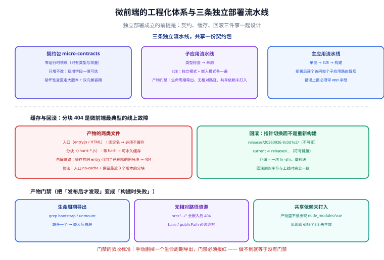

# 工程化、独立部署与实战

一句话定位：微前端的「独立部署」不是「各发各的」那么简单——真正的难点是**产物格式、缓存策略、版本契约、回滚能力**四件事必须一起设计。少设计一个，上线当天就会遇到「某个用户打开页面白屏」这类只能靠清缓存解决的事故。



## 一、仓库策略：多仓库 vs monorepo

| 策略 | 独立部署 | 契约同步 | 依赖复用 | 适用 |
| --- | --- | --- | --- | --- |
| **多仓库** | 天然独立 | **难**（契约包要发到私服） | 靠包管理 | 团队边界清晰、组织上本来就分仓 |
| **monorepo（pnpm workspace）** | 需 CI 按目录判断变更 | **容易**（契约包是本地包） | 天然复用 | 同一组织、希望统一工具链 |
| 混合（契约包独立仓库 + 应用 monorepo） | 独立 | 中 | 中 | 契约稳定、应用频繁改动 |

::: tip 推荐起点：monorepo + 按变更范围发布
```text [pnpm workspace 结构]
micro-frontends/
├─ apps/
│  ├─ main/                 # 主应用
│  ├─ sub-order/            # 子应用：订单
│  └─ sub-user/             # 子应用：用户
├─ packages/
│  ├─ micro-contracts/      # 跨应用契约（零运行时依赖）
│  ├─ ui/                   # 共享组件库（可选）
│  └─ tsconfig/             # 共享 TS 配置
├─ pnpm-workspace.yaml
└─ turbo.json               # 任务编排与缓存
```

好处是**契约包改动可以和应用改动在同一个 PR 里完成**，不用先发包再升级。代价是需要一套「只构建/部署变更的包」的 CI 逻辑（用 Turborepo / Nx 的 affected 能力）。多仓库方案省了这套逻辑，但把成本转移到了「契约版本管理」上。
:::

## 二、版本契约：唯一的强耦合点

微前端里**唯一允许的强耦合就是契约**，所以它必须被严格管理。

### 契约升级的两条规则

| 规则 | 内容 |
| --- | --- |
| **只增不改** | 新增字段一律可选（`field?: T`）；不改已有字段名与语义 |
| **双向兼容期** | 破坏性变更必须支持「新旧共存」至少一个发布周期 |

```typescript
// v1 → v2 的兼容写法：保留旧字段一个周期，用注释标注废弃
export interface MainAppProps {
  routerBase: string
  apiBase: string
  /** @deprecated 自 2.0 起改用 currentUser，3.0 将移除 */
  userId?: number
  currentUser?: Readonly<{ id: number; name: string; roles: string[] }>
  onLogout: () => void
}
```

```typescript
// 子应用侧：兼容读取（既能跑在 v1 主应用上，也能跑在 v2 上）
function resolveUser(props: MainAppProps): { id: number; name: string } | null {
  if (props.currentUser) return props.currentUser
  if (props.userId != null) return { id: props.userId, name: '未知' }   // 旧主应用
  return null
}
```

::: danger 注意：契约的破坏性变更会让「独立部署」变成「必须同时发版」
假如契约包从 `user: User` 改成 `user: { id, name }`（去掉 `email` 字段），且不保留兼容：

- 主应用升级后立刻生效（它是最新代码）；
- 还在线上的子应用（旧版本，读 `user.email`）**立刻开始报错**；
- 你被迫「主应用与所有子应用同时发布」，**独立部署的意义当场归零**。

正确流程是**三步**：
1. 契约包发新版本，**只增字段**；
2. 所有子应用逐个升级并发布（各自按自己的节奏，主应用不受影响）；
3. 确认全部升级完成后，再发一个「移除旧字段」的契约大版本。

这个过程慢，但它是「独立部署」能成立的前提。**想省这一步，就要放弃独立部署。**
:::

## 三、独立部署与缓存：一次白屏事故的完整解释

### 产物的两类文件

| 文件 | 命名 | 缓存策略 | 理由 |
| --- | --- | --- | --- |
| **入口**（`entry.js`、HTML） | 通常固定名 | **不缓存**（`no-cache`）或极短 | 必须每次拿到最新版本 |
| **分块**（`chunk-*.js`、CSS） | 带内容 hash | `immutable`，永久缓存 | 内容变了名字就变 |

### 白屏事故的根因

```text
1. 子应用 v1 发布：entry.js 引用了 chunk-a1b2.js
2. 用户访问，缓存了 entry.js（Cache-Control: max-age=3600）
3. 子应用 v2 发布：entry.js 现在引用 chunk-c3d4.js，旧 chunk-a1b2.js 被删除
4. 1 小时内，老用户仍用缓存的 entry.js → 去请求 chunk-a1b2.js → 404 → 白屏
```

**三处都要修，缺一处就会复发**：

| 修复点 | 做法 |
| --- | --- |
| 入口不强缓存 | `entry.js` 与 HTML 响应头设 `Cache-Control: no-cache`（协商缓存），或文件名带 hash |
| 旧分块不立即删 | 部署时**保留最近 N 个版本的分块**（N ≥ 3），别名共存 |
| 子应用侧兜底 | 加载分块失败时上报错误并提示用户刷新（而非白屏） |

```nginx [Nginx：入口不缓存，分块长缓存]
location ~* /sub/order/entry\.js$ {
    add_header Cache-Control "no-cache, must-revalidate";
}
location ~* /sub/order/.*\.[0-9a-f]{8,}\.(js|css)$ {
    add_header Cache-Control "public, max-age=31536000, immutable";
}
```

::: danger 注意：`chunk` 404 是微前端最典型的线上故障
它的可怕之处在于**只影响「在发布前后恰好停留过的少量用户」**，本地与测试环境完全复现不了，日志里只有一堆 404。

上线前必做的两项核对：
1. **`entry.js` 的响应头里没有 `max-age` 大于 60 的值**；
2. **部署脚本保留旧版本分块**（至少 3 个版本），而不是 `rm -rf` 后全量覆盖。

第 2 条尤其容易被忽略——很多部署脚本写的是「同步覆盖远端目录」，旧分块直接消失。
:::

### 回滚：指针切换，而不是重新构建

```text [推荐目录结构]
/sub/order/
├─ releases/
│  ├─ 20260920-1a2b3c4/        # 每次发布一个新目录（不可变）
│  ├─ 20260925-5e6f7a8/
│  └─ 20260926-9c0d1e2/        # 当前版本
└─ current -> releases/20260926-9c0d1e2   # 符号链接（回滚只改这个）
```

```shell
# 发布
tar -xzf sub-order-9c0d1e2.tar.gz -C /sub/order/releases/
ln -sfn /sub/order/releases/20260926-9c0d1e2 /sub/order/current

# 回滚（秒级）
ln -sfn /sub/order/releases/20260925-5e6f7a8 /sub/order/current

# 清理：只保留最近 5 个版本（保留分块，避免老用户的 chunk 404）
cd /sub/order/releases && ls -1t | tail -n +6 | xargs -r rm -rf
```

::: tip 为什么必须是「不可变目录 + 指针」
如果回滚是「重新构建上一个 commit 的产物」，会遇到三个问题：构建环境可能已变（依赖升级）、构建耗时（几分钟到几十分钟）、构建本身也可能失败。

**不可变目录 + 指针切换**让回滚变成一次 `ln -sfn`，耗时毫秒级，且**回滚到的字节与当时上线的一模一样**。这条与后端服务的「镜像 tag 不可变」是同一条原则。
:::

## 四、三条 CI 流水线

| 流水线 | 触发条件 | 关键步骤 |
| --- | --- | --- |
| **契约包** | `packages/micro-contracts/**` 变更 | 类型检查 → **契约兼容性校验**（`api-extractor` 或自定义脚本）→ 发布 |
| **子应用** | `apps/sub-*/**` 变更 | 单测 → E2E（**独立模式 + 嵌入模式各一次**）→ 构建 → 上传不可变目录 → 切指针 |
| **主应用** | `apps/main/**` 变更 | 单测 → E2E → 构建 → 部署 → 冒烟（逐个访问每个子应用路由） |

```yaml [.github/workflows/sub-app.yml（要点摘录）]
name: sub-order
on:
  push:
    paths: ['apps/sub-order/**', 'packages/micro-contracts/**']
jobs:
  build:
    steps:
      - uses: actions/checkout@v4
      - run: pnpm install --frozen-lockfile
      - run: pnpm --filter @company/micro-contracts build   # 契约先构建
      - run: pnpm --filter sub-order typecheck
      - run: pnpm --filter sub-order test
      # E2E 双环境：这条是「嵌入后表现一致」的自动化保障
      - run: pnpm --filter sub-order e2e:standalone
      - run: pnpm --filter sub-order e2e:embedded
      - run: pnpm --filter sub-order build
      - name: 校验入口不强缓存 & 产物格式
        run: bash scripts/verify-artifact.sh apps/sub-order/dist
      - run: bash scripts/deploy-immutable.sh sub-order apps/sub-order/dist
```

```bash [scripts/verify-artifact.sh（产物门禁）]
#!/usr/bin/env bash
set -euo pipefail
DIST="${1:?用法: verify-artifact.sh <dist目录>}"

# 1. 入口必须存在且导出三个生命周期
grep -q 'bootstrap' "$DIST/entry.js" || { echo "FAIL: entry.js 未导出 bootstrap"; exit 1; }
grep -q 'unmount'   "$DIST/entry.js" || { echo "FAIL: entry.js 未导出 unmount"; exit 1; }

# 2. 不允许出现相对路径资源引用（会导致嵌入后 404）
if grep -qE '(src|href)="\./' "$DIST/index.html" 2>/dev/null; then
  echo "FAIL: index.html 含相对路径资源（嵌入后会 404）"; exit 1
fi

# 3. 共享依赖不应被打进产物（共享运行时方案）
for f in vue react react-dom; do
  if grep -q "node_modules/$f" "$DIST/entry.js" 2>/dev/null; then
    echo "FAIL: $f 被打进了产物（externals 未生效）"; exit 1
  fi
done

echo "OK 产物校验通过"
```

::: tip 产物门禁是这套体系的「免疫系统」
上面三条检查（生命周期导出、无相对路径、共享依赖未打入）各自对应一类线上故障。成本是几百毫秒的 grep，收益是把「发布后才发现」变成「构建时就失败」。

**验收标准：手动把 `entry.js` 的 `unmount` 导出删掉，门禁必须报红。** 做不到这一点的门禁等于没有门禁。
:::

## 五、实战：从零跑起来

```shell
# ---------- 主应用 ----------
pnpm create vite apps/main --template vue-ts && cd apps/main
pnpm add qiankun vue-router

# 主应用改造（src/main.ts）：
#   createApp(App).use(router).mount('#app')
#   registerMicroApps([...]); start()
# 并在 App.vue 里加容器：<div id="micro-container"></div>

# ---------- 子应用 1：订单 ----------
cd ../.. && pnpm create vite apps/sub-order --template vue-ts
cd apps/sub-order && pnpm add vite-plugin-qiankun -D
# 改造 src/main.ts 导出 bootstrap/mount/unmount（见运行时集成篇）
# vite.config.ts 设置 base: '//127.0.0.1:8081/' 与 format: 'system'

# ---------- 子应用 2：用户 ----------
cd ../.. && pnpm create vite apps/sub-user --template vue-ts
cd apps/sub-user && pnpm add vite-plugin-qiankun -D
# 同上改造，端口 8082

# ---------- 启动（三个终端，或 pnpm -r --parallel dev）----------
pnpm --filter sub-order dev     # http://127.0.0.1:8081
pnpm --filter sub-user  dev     # http://127.0.0.1:8082
pnpm --filter main      dev     # http://127.0.0.1:5173
```

### 分步验证

```shell
# 1. 子应用独立可跑（这条必须首先通过）
curl -s -o /dev/null -w 'order standalone=%{http_code}\n' http://127.0.0.1:8081/
curl -s -o /dev/null -w 'user  standalone=%{http_code}\n' http://127.0.0.1:8082/
# 期望：都是 200

# 2. 子应用导出生命周期
curl -s http://127.0.0.1:8081/src/main.ts | grep -o 'bootstrap\|mount\|unmount' | sort -u
# 期望：三个都有

# 3. 主应用首页可访问
curl -s -o /dev/null -w 'main=%{http_code}\n' http://127.0.0.1:5173/
# 期望：200

# 4. 浏览器访问 http://127.0.0.1:5173/order
#    期望：Network 里能看到子应用 entry.js 被加载；页面显示订单内容
#    在 Console 里执行：window.__POWERED_BY_QIANKUN__
#    期望：true（在子应用执行上下文中）

# 5. 切换 /order → /user → /order，观察 Console
#    期望：每次切换有 beforeLoad / beforeMount / afterUnmount 日志，
#          且 unmount 后定时器与事件已清理（无重复请求）
```

::: danger 注意：开发环境下 `document.querySelector` 的作用域会被沙箱改变
qiankun 的 JS 沙箱会代理 `document`，导致子应用里 `document.querySelector('#app')` 可能**查不到自己挂载的容器**（查到的是子应用自己的影子 DOM）。所以子应用的挂载写法必须优先用 `props.container`：

```typescript
app.mount(container ? container.querySelector('#app')! : '#app')
```

**不要**在子应用里写 `document.getElementById('app')`——独立运行时能跑，嵌入后返回 `null`，表现为「白屏且无报错」。
:::

## 六、监控：把「哪个子应用出问题」变成可查询的字段

```typescript
// 主应用：给所有错误上报打上 app 标识
window.addEventListener('error', (e) => {
  report({
    type: 'js_error',
    app: currentMicroApp ?? 'main',     // 关键字段：出错的是谁
    msg: e.message,
    filename: e.filename,
    line: e.lineno,
    traceId: getTraceId(),
  })
})

window.addEventListener('unhandledrejection', (e) => {
  report({ type: 'promise_rejection', app: currentMicroApp ?? 'main', msg: String(e.reason) })
})
```

::: tip 三个必须采集的字段
| 字段 | 为什么必要 |
| --- | --- |
| `app`（子应用名） | 没有它，错误列表里分不清是谁的错——这是微前端监控与普通前端监控最大的差别 |
| `traceId` | 与后端日志对齐。微前端场景下「一次用户操作跨主应用 + 子应用 + 后端」，靠 traceId 串起来 |
| `route`（含子应用路由） | 定位到具体页面；只记主应用路由会丢失子应用内部的路径信息 |
:::

同时要采集**加载性能**：子应用从「路由切换」到「首次可交互」的耗时。这个指标会随子应用数量与体积增长而恶化，是最容易失控的微前端专属指标。

## 七、常见问题与排错

| 现象 | 高概率原因 | 定位手段 |
| --- | --- | --- |
| 发布后部分用户白屏，清缓存即好 | 入口被强缓存 / 旧分块被删 | 查 `entry.js` 响应头；查部署脚本是否保留旧版本 |
| 子应用静默白屏、无报错 | 用了 `document.getElementById` 而非 `props.container` | 全局搜 `document.get` |
| 嵌入后图片/chunk 404 | `base` 或 `publicPath` 与部署路径不一致 | 对比产物里的资源 URL 与实际路径 |
| 回滚后问题依旧 | 回滚的是源码而不是产物 / CDN 缓存未失效 | 核对指针指向的目录；对入口做缓存刷新 |
| 契约升级后某个子应用崩 | 破坏性变更未留兼容期 | 搜契约包里被删的字段是否仍被引用 |
| 主应用与子应用互相覆盖 `localStorage` | 未加前缀 | 约定 `order:` / `user:` 前缀 |
| 版本发布顺序错了导致短暂异常 | 先发了契约大版本，子应用还没升 | 契约变更走三步流程（第二节） |

## 八、上线验收清单

| 检查项 | 判据 |
| --- | --- |
| 每个子应用独立可访问 | 直接打开子应用地址返回 200 |
| 嵌入后可访问且**表现一致** | 独立模式与嵌入模式各跑一遍 E2E，结果一致 |
| 入口不强缓存 | `curl -sI .../entry.js` 无 `max-age` 或 `max-age ≤ 60` |
| 旧分块保留 ≥ 3 个版本 | 部署目录里能看到历史版本 |
| 回滚可执行且 < 1 分钟 | 实际演练一次（改指针 + 验证页面） |
| 重复切换 10 次无泄漏 | DOM 节点数与堆内存回到基线附近 |
| 契约包零运行时依赖 | 门禁脚本通过 |
| 错误上报带 `app` 字段 | 触发一次子应用错误，看上报数据里有 `app` |
| 样式未污染主应用 | 子应用里加一条 `body` 规则，主应用样式不变 |
| 完成一次「停掉子应用」演练 | 子应用服务不可用时，主应用其余部分仍可用、给出友好提示 |

::: danger 注意：最后一条最常被忽略，但它在故障时的价值最大
子应用部署失败、CDN 波动、域名解析异常都会让某个子应用**加载不了**。如果没有兜底，主应用会白屏或卡在 loading。

正确做法是 `loadMicroApp` / `registerMicroApps` 的错误回调里做三件事：**捕获加载失败 → 渲染占位提示（不影响主应用其他区域）→ 上报错误**。这条必须在上线前演练一次，否则真出事时才发现没写。
:::

## 参考资料

- [qiankun 官方：部署与 Nginx 配置建议](https://qiankun.umijs.org/zh/faq)
- [single-spa 官方：部署与缓存策略建议](https://single-spa.js.org/docs/recommended-setup/)
- [webpack 官方：缓存（内容 hash 与长效缓存）](https://webpack.js.org/guides/caching/)
- [MDN：HTTP 缓存](https://developer.mozilla.org/zh-CN/docs/Web/HTTP/Caching)
- [Turborepo 官方：affected 与任务缓存](https://turborepo.com/docs)
- [pnpm workspace 官方文档](https://pnpm.io/workspaces)

## 相关页面

- [拆分策略与边界设计](../Overview/index.md) —— 边界与共享依赖的决策
- [运行时集成：qiankun 与沙箱](../Runtime/index.md) —— 生命周期与沙箱机制
- [通信与状态共享](../Communication/index.md) —— 契约包的类型定义
- [Webpack Module Federation](../../Basic/BuildTool/Webpack/ModuleFederation/index.md) —— 构建期集成的替代路线
- [前端工程化](../../Others/FrontendEngineering/index.md) —— monorepo、CI 与依赖治理
- [前端性能优化](../../Others/PerformanceOptimization/index.md) —— 微前端的加载代价核算
- [微服务](../../../Backend/Microservices/index.md) —— 独立部署与回滚的后端对照
