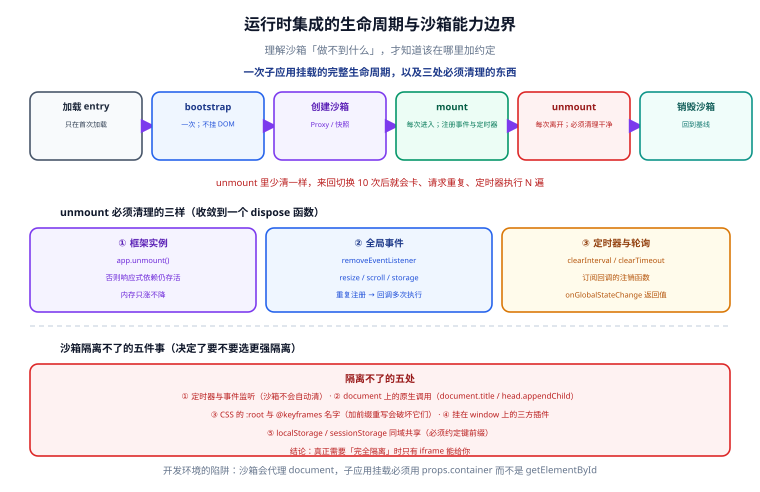

# 运行时集成：qiankun 与沙箱

一句话定位：运行时集成的核心是**「主应用在恰当的时机，把子应用的代码拉下来、执行、挂载到一块 DOM 上；切换时再卸载干净」**。所谓「沙箱」就是让这个「执行」过程不污染全局。理解不了沙箱的能力边界，就会在样式与全局变量上反复踩坑。



## 一、完整生命周期

```text
主应用启动
   │
   ├─ registerMicroApps([...])    注册子应用（只登记，不加载）
   ├─ start()                     启动监听路由变化
   │
   └─ 路由变为 /order
        ├─ 1. 加载子应用入口 JS（entry，只在首次加载）
        ├─ 2. 执行 → 子应用模块导出 { bootstrap, mount, unmount }
        ├─ 3. 调用 bootstrap（只调用一次）
        ├─ 4. 创建沙箱
        ├─ 5. 调用 mount({ container, props })
        │      └─ 子应用把自己的根组件挂到 container 上
        │
        └─ 路由变为 /user
             ├─ 6. 调用 unmount()     子应用自行清理（解绑事件、清定时器）
             ├─ 7. 销毁沙箱
             └─ 8. 重复上面流程挂载 /user 的子应用
```

四个阶段的实际调用次数：

| 生命周期 | 调用次数 | 该做什么 |
| --- | --- | --- |
| `bootstrap` | **一次**（应用生命周期内） | 一次性初始化（读全局配置、初始化 SDK），**不要在这里挂 DOM** |
| `mount` | 每次进入该路由 | 创建 Vue/React 应用实例并挂载、注册事件 |
| `unmount` | 每次离开该路由 | **销毁实例、解绑事件、清定时器**、移除 DOM |
| `update` | 可选，手动更新 props 时 | 响应主应用传下来的 props 变化 |

::: danger 注意：`unmount` 没清干净是最常见的泄漏源
典型症状：**来回切换子应用 10 次后页面变卡、控制台有重复的网络请求、定时器执行 N 遍**。

原因通常是三样东西没清理：
1. **Vue/React 应用实例没销毁**（`app.unmount()` 没调）→ 响应式依赖仍存活；
2. **全局事件没解绑**（`window.addEventListener('resize', ...)`）；
3. **定时器/轮询没清**（`setInterval`）。

正确写法是「把清理逻辑收敛到一个函数里」，任何在 `mount` 里注册的东西，都必须在 `unmount` 里注销：

```typescript [子应用 src/main.ts]
let app: App<Element> | null = null
let dispose: (() => void) | null = null

function render(props: QiankunProps = {}) {
  const { container } = props
  app = createApp(App)
  app.use(router)
  app.mount(container ? container.querySelector('#app')! : '#app')

  // 所有需要清理的注册都返回一个 dispose，统一在 unmount 里调用
  const onResize = () => { /* ... */ }
  window.addEventListener('resize', onResize)
  const timer = window.setInterval(poll, 30_000)

  dispose = () => {
    window.removeEventListener('resize', onResize)
    window.clearInterval(timer)
  }
}

export async function bootstrap() { /* 一次性初始化，如读取全局配置 */ }

export async function mount(props: QiankunProps) { render(props) }

export async function unmount() {
  dispose?.()
  dispose = null
  app?.unmount()
  app = null
}

// 独立运行时：直接挂载（脱离主应用也能访问）
if (!(window as any).__POWERED_BY_QIANKUN__) render()
```

**最后那段「独立运行时直接挂载」必须保留**：它保证子应用脱离主应用也能开发与调试，这是 [边界设计](../Overview/index.md) 里那条「独立运行时与嵌入后表现一致」验收标准的前提。
:::

## 二、入口协议与 `publicPath`

### 子应用需要做什么

以 Vite + Vue 为例，用 `vite-plugin-qiankun` 或手写 UMD 产物：

```typescript [子应用 vite.config.ts]
import { defineConfig } from 'vite'
import vue from '@vitejs/plugin-vue'
import qiankun from 'vite-plugin-qiankun'

export default defineConfig({
  base: '/sub/order/',            // 关键：与部署路径一致，见下方说明
  server: { port: 8081, cors: true, origin: 'http://127.0.0.1:8081' },
  plugins: [vue(), qiankun('sub-order', { useDevMode: true })],
  build: {
    target: 'esnext',
    rollupOptions: {
      // qiankun 需要 UMD/System 格式的入口，且不能把框架打进来（共享运行时方案）
      external: ['vue', 'vue-router'],
      output: { format: 'system', entryFileNames: 'entry.js' },
    },
  },
})
```

### `publicPath` 是子应用资源 404 的头号原因

子应用被嵌入后，它的静态资源（图片、异步 chunk、字体）是**相对于主应用的地址**解析的。如果子应用代码里写的是相对路径 `./chunk-1.js`，浏览器会去主应用的域名下找，结果 404。

三种处理方式，按推荐顺序：

| 方式 | 做法 | 说明 |
| --- | --- | --- |
| **构建期绝对路径** | `base: '//cdn.example.com/sub/order/'` | 最稳，明确无歧义 |
| **运行时自动推断** | 从 `import.meta.url` / `document.currentScript.src` 推断 | 灵活，但需保证入口脚本的 URL 正确 |
| 约定相对根路径 | `base: '/sub/order/'` | 要求主应用与子应用同域 |

```typescript
// 运行时推断的通用写法（qiankun 官方推荐思路）
if ((window as any).__POWERED_BY_QIANKUN__) {
  // eslint-disable-next-line no-underscore-dangle
  __webpack_public_path__ = (window as any).__INJECTED_PUBLIC_PATH_BY_QIANKUN__
}
```

::: danger 注意：`vite` 的 `base` 与部署路径不一致会静默出错
`base` 设成 `/` 时产物里引用的是 `/assets/xxx.js`；如果子应用实际部署在 `/sub/order/` 下，这些资源全部 404。**症状是「独立访问正常、嵌入后图片与异步 chunk 全丢」**——因为独立访问时浏览器地址栏恰好匹配，嵌入后 URL 变了。

检查方法：构建后打开产物 HTML，看里面的 `src` / `href` 是不是以 `base` 开头。
:::

## 三、沙箱机制：JS 与样式两套

### JS 沙箱的三种模式

| 模式 | 原理 | 兼容性 | 能力边界 |
| --- | --- | --- | --- |
| **快照沙箱（SnapshotSandbox）** | 激活时把 `window` 上的改动**存快照**，离开时**还原** | 无 Proxy 也能用 | **同一时刻只能有一个子应用运行**；无法隔离 `document` 上的操作 |
| **Proxy 沙箱** | 用 `Proxy` 代理 `window`，读写落到子应用自己的上下文 | 需 Proxy | 每个子应用独立，可多实例；**无法拦截 `document` 的原生方法调用** |
| **legacy 模式** | 不做沙箱，直接跑在真实 `window` 上 | — | 只用于「沙箱导致问题、临时关闭」 |

qiankun 会自动选择：能用 Proxy 就用 Proxy 沙箱，否则退化为快照沙箱。

### 样式隔离的两种强度

| 配置 | 做法 | 副作用 |
| --- | --- | --- |
| `experimentalStyleIsolation` | 给子应用所有样式**加前缀**（重写 CSS 选择器） | 重写后 `:root`、`@keyframes` 等可能失效；`!important` 优先级冲突 |
| `strictStyleIsolation` | 用 **Shadow DOM** 包裹子应用容器 | **最彻底**；但弹窗/下拉挂到 `document.body` 时会脱离 Shadow 而丢样式 |

```typescript [主应用 src/main.ts]
import { registerMicroApps, start, initGlobalState } from 'qiankun'

registerMicroApps(
  [
    {
      name: 'sub-order',
      entry: '//order.example.com/sub/order/',
      container: '#micro-container',
      activeRule: '/order',
      props: {
        // 传给子应用的能力（子应用不直接依赖主应用的具体实现）
        routerBase: '/order',
        onLogout: () => { /* 主应用提供登出 */ },
      },
    },
  ],
  {
    beforeLoad: [(app) => { console.log('[qiankun] before load', app.name); return Promise.resolve(); }],
    beforeMount: [(app) => Promise.resolve()],
    afterUnmount: [(app) => { console.log('[qiankun] unmounted', app.name); return Promise.resolve(); }],
  },
)

start({
  // 预加载：空闲时预取子应用资源。'all' 适合子应用少而稳；子应用多时用具体名单
  prefetch: 'all',
  sandbox: {
    strictStyleIsolation: false,
    experimentalStyleIsolation: true,   // 先从这个开始，出问题再评估 Shadow DOM
    // 显式放行：某些库必须访问真实 window
    // loose: false,
  },
  singular: false,                       // 允许同一时刻多个子应用实例
})
```

::: danger 注意：沙箱不是万能的，有五个明确的「隔离不了」
1. **定时器与事件监听**：沙箱不会自动清理，必须子应用自己在 `unmount` 里清（`Proxy` 沙箱能记录一部分，但不可靠）。
2. **`document` 上的操作**：`document.title`、`document.head.appendChild` 等原生调用**不被 Proxy 拦截**——这是灰度的、无法彻底隔离的。
3. **CSS 的 `:root` 与 `@keyframes` 名字**：加前缀重写会破坏这些规则；两个子应用定义同名 `@keyframes` 会互相覆盖。
4. **第三方库挂在 `window` 上的插件**（如 jQuery 插件、地图 SDK）：沙箱给了它一个假的 `window`，可能反而更乱。
5. **`localStorage` / `sessionStorage` 是同域共享的**：沙箱默认不隔离，两个子应用可能互相覆盖同名键。**约定所有存储键带前缀**。

真正需要「完全隔离」时，**只有 iframe 能给你**。这就回到 [选型矩阵](../Overview/index.md)：隔离强度与接入成本必须二选一。
:::

## 四、主应用侧的两种挂载方式

| 方式 | API | 适用 |
| --- | --- | --- |
| **路由驱动（自动）** | `registerMicroApps` + `start` | 按路由切换的整页子应用（最常见） |
| **手动挂载** | `loadMicroApp({ name, entry, container })` | 一个页面里嵌一个模块、弹窗里嵌一个子应用 |

```typescript
// 手动挂载：一个页面里嵌多个子应用（如仪表盘嵌三个业务模块）
import { loadMicroApp } from 'qiankun'

let micro: MicroApp | null = null

onMounted(async () => {
  micro = loadMicroApp({
    name: 'widget-realtime',
    entry: '//widget.example.com/realtime/',
    container: '#widget-realtime',
    props: { apiBase: '/api' },
  })
})

onUnmounted(async () => {
  await micro?.unmount()          // 必须卸载，否则组件销毁后子应用还在跑
  micro = null
})
```

::: warning 说明：手动挂载要注意「组件销毁」与「子应用卸载」的时序
Vue 的 `onUnmounted` 是同步调用的，而 `micro.unmount()` 是异步的。如果只写 `micro.unmount()` 而不 `await`，可能出现「DOM 已被 Vue 移除，子应用还在往里写」的报错。**在 `onBeforeUnmount` 里 `await` 卸载，比在 `onUnmounted` 里更安全。**
:::

## 五、与 Module Federation 的分工

| 维度 | 运行时集成（qiankun） | 构建期集成（Module Federation） |
| --- | --- | --- |
| 子应用的形态 | **应用**（有生命周期、有容器） | **模块**（被 `import` 的代码） |
| 独立路由 | 有自己的路由与 URL | 通常没有（作为宿主的子路由） |
| 隔离 | 有沙箱 | **无**（共享运行时，全局变量直接互通） |
| 依赖去重 | 需手动管理（external + 全局挂载） | **`shared` 自动按 semver 去重** |
| 远程更新 | 子应用重新部署，主应用刷新即生效 | 远程模块重新部署，宿主刷新即生效（需注意缓存） |
| 版本冲突 | 可能加载两份框架 | **可编译期检测**（`requiredVersion`） |
| 技术栈异构 | 支持 | 支持，但共享依赖会很别扭 |
| SEO / 首屏 | 运行时才知道要加载什么，首屏更慢 | 构建期可知，可预加载优化 |

::: tip 一句话分工
**「需要独立部署的应用，且有隔离需求」→ qiankun；「同一个产品里分包解耦，追求体积最优」→ Module Federation。**

两者**可以组合**：用 Module Federation 共享基础库（Vue、组件库），用 qiankun 做应用级集成。但组合会同时引入两套复杂度，只在确有必要时使用。
:::

## 六、常见问题与排错

| 现象 | 高概率原因 | 定位手段 |
| --- | --- | --- |
| 子应用白屏 | 入口 JS 404 / `publicPath` 错 / 入口不是 UMD 格式 | Network 面板看 entry 与 chunk 的 404 |
| 独立访问正常、嵌入后样式全丢 | `publicPath` 或 `base` 与部署路径不一致 | 比对产物里的资源 URL 与实际路径 |
| 反复进入后越来越卡 | `unmount` 未清理定时器/事件/实例 | 切换 10 次后看 Performance 的内存与 DOM 数量 |
| 弹窗跑到页面外面 / 被裁剪 | 主容器有 `overflow` 或 `transform` | 弹窗挂 `document.body`；或用 `strictStyleIsolation` 后注意挂载点 |
| 子应用路由与主应用路由打架 | 两边都监听 `popstate` | 子应用路由使用 `history` 的 base 模式并只在激活时监听 |
| 沙箱报 `xxx is not a function` | 某个库必须在真实 `window` 上运行 | 用 `loose` 或把该库挂到真实 `window` 上 |
| 同名 `@keyframes` 动画错乱 | 两个子应用定义了同名动画 | 动画名加子应用前缀 |
| `localStorage` 键值互相覆盖 | 存储未加前缀 | 约定 `order:` / `user:` 前缀 |

::: danger 注意：qiankun 的 `prefetch: 'all'` 在小流量页面会拖慢首屏
`prefetch: 'all'` 会在**第一个子应用挂载后立刻预取所有子应用资源**。子应用多时，首页会突然产生大量并发请求，抢带宽、影响首屏指标。

建议：子应用 ≤ 3 个且都常用 → `'all'`；子应用多或有大体积依赖 → 列出明确名单（`prefetch: ['sub-order']`），或直接用 `false` 靠路由切换时按需加载。
:::

## 七、验证方式

```shell
# 1. 子应用独立可跑（脱离主应用）
cd sub-app-order && pnpm dev
curl -s -o /dev/null -w 'standalone=%{http_code}\n' http://127.0.0.1:8081/

# 2. 子应用产物是入口可识别的格式（有生命周期导出）
pnpm build && grep -o 'bootstrap\|mount\|unmount' dist/entry.js | sort -u
# 期望：三个都被导出（bootstrap / mount / unmount）

# 3. 主应用侧：切换两次并观察卸载是否干净（DevTools Console）
#    performance.memory.usedJSHeapSize 切换前后对比，增长应有限且有回落
```

```javascript
// 4. 在浏览器控制台验证「重复切换不泄漏」：连续切换 10 次后人工触发 GC
//    对比 performance.memory.usedJSHeapSize 与 DOM 节点数（document.querySelectorAll('*').length）
//    期望：DOM 数量回到基线附近；堆内存回落（不单调增长）

// 5. 验证样式隔离：在子应用里写一条 body 规则，看是否影响主应用
//    期望：experimentalStyleIsolation 下主应用 body 样式不变
```

## 参考资料

- [qiankun 官方文档：API 与生命周期](https://qiankun.umijs.org/zh/api)
- [qiankun 官方文档：沙箱机制](https://qiankun.umijs.org/zh/guide#%E6%B2%99%E7%AE%B1)
- [single-spa 官方：应用生命周期](https://single-spa.js.org/docs/building-applications)
- [webpack 5 Module Federation](https://webpack.js.org/concepts/module-federation/)
- [MDN：Proxy](https://developer.mozilla.org/zh-CN/docs/Web/JavaScript/Reference/Global_Objects/Proxy)
- [MDN：Shadow DOM](https://developer.mozilla.org/zh-CN/docs/Web/API/Web_components/Using_shadow_DOM)

## 相关页面

- [拆分策略与边界设计](../Overview/index.md) —— 集成方式怎么选
- [通信与状态共享](../Communication/index.md) —— 生命周期里 props 与事件的用法
- [工程化、独立部署与实战](../Practice/index.md) —— 产物格式与部署流水线
- [Webpack Module Federation](../../Basic/BuildTool/Webpack/ModuleFederation/index.md) —— 构建期方案的配置细节
- [浏览器原理](../../Basic/Browser/index.md) —— Proxy、Shadow DOM、事件循环的基础
