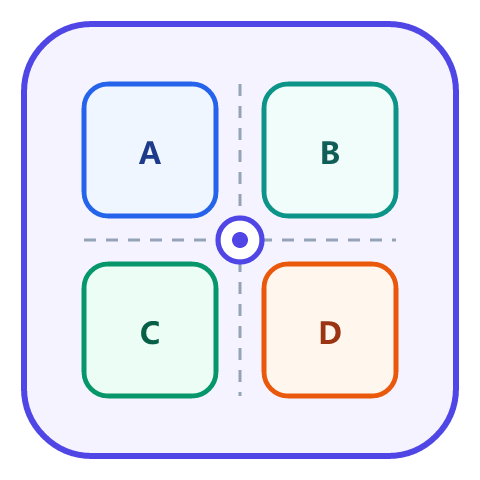
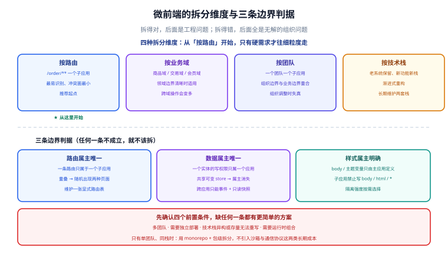

# 微前端

微前端解决的问题很具体：**一个页面里要放多个团队、多个技术栈、独立发布的代码**。它不是「拆分前端代码」的同义词——如果只有一个团队、一个技术栈，拆成微前端只会带来版本契约、样式隔离、通信协议这三类长期成本。本专题讲的是**什么时候该拆、怎么拆、拆了以后怎么管**。

## 目录

### 决策与架构

- [拆分策略与边界设计](Overview/index.md)

### 集成与协作

- [运行时集成：qiankun 与沙箱](Runtime/index.md)
- [通信与状态共享](Communication/index.md)

### 落地

- [工程化、独立部署与实战](Practice/index.md)

::: info 技术现状
本专题以**运行时集成**为主线，覆盖三条主流路线：

- **qiankun**（蚂蚁，基于 single-spa 的封装）：沙箱、样式隔离、生命周期约定最完整，兼容存量应用最省事。
- **Webpack Module Federation**（webpack 5 / Rspack 内置）：**构建期集成**，共享依赖去重效果最好；与运行时方案的分工见 [运行时集成](Runtime/index.md)。
- **micro-app / wujie**：新一代方案，用 Web Components（wujie 用 iframe + 代理）解决隔离问题，接入成本更低。

库内已有的 [Webpack Module Federation](../Basic/BuildTool/Webpack/ModuleFederation/index.md) 讲的是「模块联邦本身怎么配」；本专题讲的是**「一个应用群里怎么选集成方案、怎么定契约、怎么独立部署」**。
:::

::: tip 阅读前提
需要先掌握：Vue 或 React 的项目搭建与路由、构建工具基础（[Webpack](../Basic/BuildTool/Webpack/index.md) 或 [Vite](../Basic/BuildTool/Vite/index.md)）、以及浏览器的基础知识（[浏览器原理](../Basic/Browser/index.md) 中的模块加载、`iframe` 与 `Shadow DOM` 概念）。
:::

## 各篇定位

| 页面 | 回答什么问题 |
| --- | --- |
| [拆分策略与边界设计](Overview/index.md) | 什么时候该用微前端、按什么维度拆、共享依赖怎么处理、边界怎么定 |
| [运行时集成：qiankun 与沙箱](Runtime/index.md) | qiankun 的生命周期与沙箱怎么做、`Module Federation` 与运行时方案的分工 |
| [通信与状态共享](Communication/index.md) | 四种通信通道的取舍、全局状态该不该共享、去中心化 store 怎么做 |
| [工程化、独立部署与实战](Practice/index.md) | 版本契约、独立部署与回滚、主应用与子应用的可运行示例、排错 |

## 与既有专题的分工

| | 归属 | 关系 |
| --- | --- | --- |
| [Module Federation](../Basic/BuildTool/Webpack/ModuleFederation/index.md) | 构建工具能力 | 讲「怎么配出一个远程模块」，本专题讲「用它来做微前端时的架构取舍」 |
| [前端工程化](../Others/FrontendEngineering/index.md) | 工程体系 | monorepo、包管理、CI；微前端是「多仓库独立部署」路线的对立面 |
| [前端性能优化](../Others/PerformanceOptimization/index.md) | 性能 | 微前端的体积与加载代价要在这一层核算 |
| [微服务](../../Backend/Microservices/index.md) | 后端对照 | 组织维度的问题同构（康威定律），但技术手段完全不同 |

::: warning 说明：先试「模块化 monorepo」，再考虑微前端
两条路线的对比：

| | monorepo（包级拆分） | 微前端（应用级拆分） |
| --- | --- | --- |
| 独立部署 | 否（通常一起发） | **是** |
| 技术栈自由 | 否（同一构建体系） | **是** |
| 依赖去重 | 天然 | 需专门处理 |
| 隔离性 | 无（共享运行时） | 有（沙箱） |
| 适用 | 同一团队、同栈 | **多团队、异构栈、必须独立发布** |

**如果团队规模没到「多个团队各自有发布节奏」的程度，微前端带来的成本大于收益。**
:::

## 相关专题

- [Webpack Module Federation](../Basic/BuildTool/Webpack/ModuleFederation/index.md)：构建期集成的实现细节
- [Vue 框架](../Frame/Vue/index.md) 与 [React 框架](../Frame/React/index.md)：子应用最常用的两套技术栈
- [前端工程化](../Others/FrontendEngineering/index.md)：monorepo、依赖管理与 CI
- [前端性能优化](../Others/PerformanceOptimization/index.md)：微前端带来的加载开销与优化手段
- [浏览器原理](../Basic/Browser/index.md)：`Shadow DOM`、`iframe`、模块加载机制
- [微服务](../../Backend/Microservices/index.md)：组织维度的对照阅读（康威定律）
