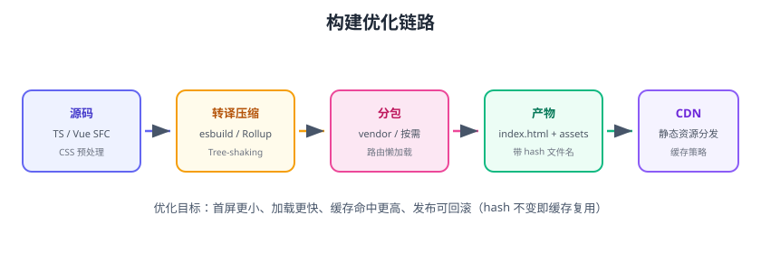

# 构建优化

构建优化解决两个问题：**构建慢**（开发体验）和**产物大**（用户加载体验）。Vite 8 基于 esbuild/Rollup，天然快，但分包、压缩、懒加载、缓存策略仍需人工设计。本页给出可落地的优化清单与配置。



## 优化目标

| 指标 | 目标 |
| --- | --- |
| 开发启动 | 秒级（依赖预构建） |
| 构建时长 | 大项目 ≤ 5 分钟 |
| 首屏 JS | ≤ 200KB（gzip） |
| 缓存命中 | hash 不变即复用 |
| 可回滚 | 旧版本产物随时可用 |

## 1. 依赖预构建与缓存

Vite 自动把 node_modules 依赖预构建为 ESM，配合缓存：

```ts [vite.config.ts]
export default defineConfig({
  optimizeDeps: {
    include: ['vue', 'vue-router', 'pinia', 'axios'],
  },
  build: {
    cacheDir: 'node_modules/.vite',
  },
})
```

## 2. 代码分包（Code Splitting）

把第三方库、业务代码、按路由拆成独立 chunk：

```ts [vite.config.ts]
export default defineConfig({
  build: {
    rollupOptions: {
      output: {
        manualChunks: {
          vue: ['vue', 'vue-router', 'pinia'],
          echarts: ['echarts'],
          vendor: ['axios', 'dayjs'],
        },
      },
    },
  },
})
```

::: tip 分包原则
1. 长期不变的大依赖单独 chunk（vue、echarts），浏览器缓存命中率高。
2. 按路由懒加载页面组件，首屏只加载必要代码。
3. 不要分得太碎：HTTP 请求数太多反而慢。
:::

## 3. 路由懒加载

```ts [src/router/index.ts]
const routes = [
  {
    path: '/order',
    component: () => import('@/views/OrderList.vue'),  // 按需加载
  },
  {
    path: '/dashboard',
    component: () => import('@/views/Dashboard.vue'),
  },
]
```

## 4. 压缩与 Tree-shaking

```ts [vite.config.ts]
export default defineConfig({
  build: {
    minify: 'esbuild',          // 或 'terser'
    target: 'es2020',
    reportCompressedSize: true, // 输出 gzip 大小
  },
})
```

Tree-shaking 注意点：

- 只 import 需要的成员：`import { get } from 'lodash-es'`，不用 `import _ from 'lodash'`。
- ESM 库天然可摇树（lodash-es、dayjs）；CJS 库难摇树。
- 使用 `vite-plugin-analyzer` / `rollup-plugin-visualizer` 看体积构成。

```shell
pnpm add -D rollup-plugin-visualizer
```

```ts
import { visualizer } from 'rollup-plugin-visualizer'

plugins: [visualizer({ open: true, gzipSize: true })]
```

## 5. CDN 与缓存策略

产物文件名带内容 hash，配合 CDN 缓存：

```text
assets/index-a1b2c3d4.js   ← 内容变 hash 变
assets/vue-8f9e0d1c.js     ← 依赖不变 hash 不变（长期缓存）
```

部署到 Nginx/CDN 的缓存规则：

```nginx
location /assets/ {
    expires 30d;          # hash 文件名可长缓存
    add_header Cache-Control "public, max-age=2592000, immutable";
}
```

`index.html` 不缓存（或短缓存），保证发版后立即拉到新页面。

## 6. 图片与静态资源

| 手段 | 说明 |
| --- | --- |
| 图片压缩 | pngquant / webp / avif |
| 懒加载 | `loading="lazy"` |
| 小图内联 | Vite `assetsInlineLimit`（默认 4KB）自动转 base64 |
| SVG 压缩 | svgo |
| 字体子集 | 只打包用到的字形 |

## 7. 构建分析工作流

```text
构建 → visualizer 报告 → 找出最大 chunk
→ 按路由懒加载 / 分包 / 换轻量库
→ 对比前后体积与首屏时间
```

## 易错点与最佳实践

::: danger 常见错误
1. **全量引入 UI 库/图表库**：`import * as ECharts` 带来几百 KB；用按需引入。
2. **分包把业务代码塞进 vendor**：业务代码频繁变，缓存失效；vendor 只放稳定依赖。
3. **忽略 gzip/brotli**：服务器开压缩能再省 60~70%。
4. **hash 策略错误**：文件名不带 hash 时 CDN 缓存旧文件，发版不生效。
5. **只看构建成功不看体积**：产物 2MB 也“成功”，首屏 5 秒。
6. **生产与开发依赖混装**：`devDependencies` 没分好，构建包进生产依赖。
:::

::: tip 最佳实践
1. 每次发版记录体积基线，建立趋势监控。
2. 核心页面目标：首屏 JS ≤ 200KB（gzip）+ 资源并行加载。
3. 用 CDN + 长缓存 + 内容 hash，兼顾速度与发版。
4. 构建优化纳入 CI：体积超阈值告警。
5. 分析先于优化：用 visualizer 找到真实瓶颈再动手。
:::

## 验证方式

1. `pnpm build` 后查看 `dist/assets` 文件大小与数量，对比优化前后。
2. 用 `rollup-plugin-visualizer` 查看 chunk 构成。
3. 打开 `dist/index.html`，确认路由页面被拆成独立 chunk（懒加载生效）。
4. 用 Lighthouse 测一次首屏性能，记录 FCP/LCP。

## 参考资料

- Vite 构建配置：https://vitejs.dev/config/build-options.html
- Rollup manualChunks：https://rollupjs.org/configuration-options/#output-manualchunks
- 前端性能优化清单：https://web.dev/learn/performance/
- Lighthouse：https://developer.chrome.com/docs/lighthouse/
