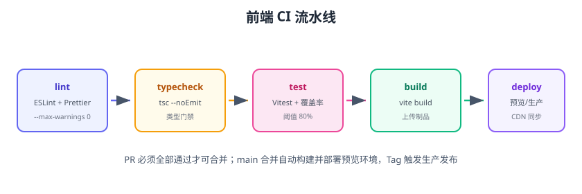

# CI 集成

前端 CI 把「规范、测试、构建」变成每次提交的自动关卡：PR 不通过不能合并，main 合并自动发布预览环境，打 Tag 触发生产发布。本页以 GitHub Actions 为例给出完整的前端流水线，并覆盖质量门禁与预览部署。



## 前端 CI 要做什么

```text
lint（规范）→ typecheck（类型）→ test（单测+覆盖率）→ build（产物）→ preview（预览）→ deploy（生产）
```

| 阶段 | 命令 | 失败影响 |
| --- | --- | --- |
| lint | `pnpm lint` | 阻断合并 |
| typecheck | `tsc --noEmit` | 阻断合并 |
| test | `vitest run --coverage` | 阻断合并 |
| build | `pnpm build` | 阻断合并 |
| preview | 部署到预览环境 | 阻断生产发布 |
| deploy | 上传 CDN/服务器 | - |

## 完整流水线示例

```yaml [.github/workflows/ci.yml]
name: Frontend CI

on:
  push:
    branches: [main]
  pull_request:
    branches: [main]

concurrency:
  group: ci-${{ github.ref }}
  cancel-in-progress: true

jobs:
  quality:
    runs-on: ubuntu-latest
    steps:
      - uses: actions/checkout@v5
      - uses: pnpm/action-setup@v4
        with:
          version: 11
      - uses: actions/setup-node@v6
        with:
          node-version: 22
          cache: pnpm
      - run: pnpm install --frozen-lockfile
      - run: pnpm lint
      - run: pnpm typecheck

  test:
    runs-on: ubuntu-latest
    needs: quality
    steps:
      - uses: actions/checkout@v5
      - uses: pnpm/action-setup@v4
        with:
          version: 11
      - uses: actions/setup-node@v6
        with:
          node-version: 22
          cache: pnpm
      - run: pnpm install --frozen-lockfile
      - run: pnpm test -- --coverage
      - uses: actions/upload-artifact@v7
        with:
          name: coverage
          path: coverage/
          if-no-files-found: error

  build:
    runs-on: ubuntu-latest
    needs: test
    steps:
      - uses: actions/checkout@v5
      - uses: pnpm/action-setup@v4
        with:
          version: 11
      - uses: actions/setup-node@v6
        with:
          node-version: 22
          cache: pnpm
      - run: pnpm install --frozen-lockfile
      - run: pnpm build
      - uses: actions/upload-artifact@v7
        with:
          name: dist
          path: dist/

  preview:
    runs-on: ubuntu-latest
    needs: build
    if: github.event_name == 'pull_request'
    steps:
      - uses: actions/download-artifact@v8
        with:
          name: dist
          path: dist/
      # 部署到 Vercel/Netlify/OSS 预览环境
      - run: echo "部署 PR 预览环境"
```

## 质量门禁

### 覆盖率阈值（CI 强制）

```ts [vitest.config.ts]
test: {
  coverage: {
    thresholds: {
      lines: 80,
      functions: 80,
      branches: 70,
    },
  },
}
```

### 分支保护（GitHub）

Settings → Branches → Add rule：

- Require pull request reviews before merging（至少 1 人）
- Require status checks to pass before merging（勾选 quality/test/build）
- Require branches to be up to date

## 预览环境

| 平台 | 方式 |
| --- | --- |
| Vercel / Netlify | 自动为 PR 生成预览 URL |
| GitHub Pages | Actions 部署到 `gh-pages` |
| 云 OSS/对象存储 | 按 PR 号上传独立目录 |
| 自建 Nginx | 上传 `preview/<pr号>/` 目录 |

预览环境让评审人**直接点开页面验收**，比只看代码更有效。

## 生产发布

```yaml [.github/workflows/deploy.yml]
on:
  push:
    tags: ["v*"]

jobs:
  deploy:
    runs-on: ubuntu-latest
    steps:
      - uses: actions/checkout@v5
      - run: pnpm install --frozen-lockfile && pnpm build
      - name: 同步到 CDN
        env:
          OSS_ACCESS_KEY: ${{ secrets.OSS_ACCESS_KEY }}
        run: ./scripts/sync-cdn.sh
      - name: 触发监控检查
        run: ./scripts/smoke-test.sh
```

发布要点：

1. **同一产物原样上线**：PR 验证过的 dist 与生产一致，不重新构建。
2. **回滚方案**：CDN 保留上一版 hash 文件，`index.html` 指回旧版本即可。
3. **部署后冒烟**：curl 首页 + 关键接口探活。
4. **发布窗口与通知**：上线成功/失败通知到 IM。

## 缓存加速

```yaml
- uses: actions/cache@v5
  with:
    path: node_modules/.pnpm-store
    key: pnpm-store-${{ hashFiles('pnpm-lock.yaml') }}
    restore-keys: |
      pnpm-store-
```

::: tip 缓存注意
`pnpm install --frozen-lockfile` 依赖 lockfile 完全一致；本地改依赖后必须提交 lockfile，否则 CI 报错——这本身就是一种规范约束。
:::

## 易错点与最佳实践

::: danger 常见错误
1. **CI 里用 `npm install`**：会更新 lockfile 产生漂移；用 `--frozen-lockfile` / `npm ci`。
2. **本地过 CI 挂**：Node/pnpm 版本不一致；用 `actions/setup-node` 固定版本 + `package.json` 的 `engines`。
3. **覆盖率不设阈值**：CI 只跑测试不查覆盖率，门禁形同虚设。
4. **每个 job 重复安装**：耗时长；合并 job 或缓存 pnpm store。
5. **生产重新构建**：PR 验证的代码和上线的不一致；同一制品上线。
6. **忽略预览环境**：评审只看代码不点页面，交互问题漏检。
:::

::: tip 最佳实践
1. 三条流水线：PR 校验（快）、main 构建+预览（中）、Tag 发布（慢而全）。
2. 质量门禁全部进 CI：lint 0 警告、typecheck 通过、覆盖率达标。
3. 分支保护强制：PR 评审 + status checks + up-to-date。
4. 构建产物上传制品，发布 job 直接下载，保证同一产物。
5. 记录构建时长与失败率，持续优化（参考 [CI/CD 专题](../../../../Tools/CICD/index.md)）。
:::

## 验证方式

1. 提交一个 PR，确认 quality/test/build 三个 job 全部通过。
2. 故意让 lint 失败，确认 PR 无法合并（分支保护生效）。
3. 打一个 `v1.0.0` tag，确认生产发布流水线触发并部署成功。
4. 打开 PR 预览 URL，确认页面可访问。

## 参考资料

- GitHub Actions：https://docs.github.com/zh/actions
- pnpm 与 CI：https://pnpm.io/zh/continuous-integration
- Vitest CI 集成：https://cn.vitest.dev/guide/continuous-integration
- 分支保护：https://docs.github.com/zh/repositories/configuring-branches-and-merges-in-your-repository/managing-protected-branches
