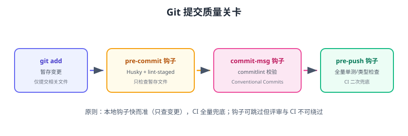

# Git 规范

Git 规范把“提交”变成可读、可查、可自动化的信息流：**分支模型**约定怎么分工，**Conventional Commits** 约定怎么写提交信息，**Husky + lint-staged + commitlint** 在提交前自动把关。



## 分支模型

### 推荐：Trunk-based（主干开发）+ 功能分支

```text
main（主干，始终可发布）
  └── feat/order-list     功能分支（PR 后合并）
  └── fix/checkout-bug    修复分支
  └── release/1.2.0       发布分支（可选）
```

| 分支 | 命名 | 生命周期 |
| --- | --- | --- |
| main | `main` | 常驻，只允许合并，始终可发布 |
| 功能 | `feat/xxx` | 短期，从 main 切出，合并即删除 |
| 修复 | `fix/xxx` | 短期 |
| 发布 | `release/x.y.z` | 发布周期内存在 |
| 热修 | `hotfix/xxx` | 从 main 切出紧急修复 |

## Conventional Commits

提交信息格式：

```text
<type>(<scope>): <subject>

[body]
[footer]
```

| type | 含义 |
| --- | --- |
| `feat` | 新功能 |
| `fix` | 修复 bug |
| `docs` | 文档 |
| `style` | 格式（不影响代码逻辑） |
| `refactor` | 重构 |
| `test` | 测试 |
| `chore` | 构建/依赖/杂项 |
| `perf` | 性能优化 |

示例：

```text
feat(order): 新增订单列表虚拟滚动

解决千级订单渲染卡顿问题
```

::: tip 为什么重要
规范的提交信息让 `git log` 可读、`git blame` 可查，还能自动生成 CHANGELOG、按 type 触发 CI（`fix:` 触发热修发布）。
:::

## Husky + lint-staged + commitlint

### 安装配置

```shell
pnpm add -D husky lint-staged @commitlint/cli @commitlint/config-conventional
pnpm exec husky init
```

### 配置 lint-staged

```json [package.json]
{
  "lint-staged": {
    "*.{js,ts,vue}": ["eslint --fix", "prettier --write"],
    "*.{css,scss}": ["stylelint --fix", "prettier --write"],
    "*.{json,md}": ["prettier --write"]
  }
}
```

### pre-commit 钩子

```shell [.husky/pre-commit]
pnpm exec lint-staged
```

### commit-msg 钩子

```shell [.husky/commit-msg]
pnpm exec commitlint --edit "$1"
```

### commitlint 配置

```js [commitlint.config.js]
export default {
  extends: ['@commitlint/config-conventional'],
  rules: {
    'type-enum': [2, 'always', ['feat', 'fix', 'docs', 'style', 'refactor', 'test', 'chore', 'perf']],
    'subject-case': [0],
  },
}
```

### pre-push 钩子（可选）

```shell [.husky/pre-push]
pnpm typecheck
pnpm test
```

## MR/PR 协作流程

```text
1. 从 main 切功能分支：git switch -c feat/xxx
2. 小步提交（每次一个逻辑变更）
3. push 后创建 PR/MR
4. CI 自动运行：lint → typecheck → test → build
5. 至少 1 人评审通过
6. 合并（推荐 squash merge 保持历史整洁）
```

PR 模板：

```markdown [.github/pull_request_template.md]
## 变更内容
<!-- 这次改动做了什么 -->

## 关联需求
- issue #

## 测试验证
- [ ] 本地运行测试通过
- [ ] 手动验证关键路径

## 影响范围
<!-- 哪些页面/功能受影响 -->
```

## 版本与 CHANGELOG

按 Conventional Commits 自动生成 CHANGELOG：

```shell
pnpm add -D conventional-changelog-cli
pnpm exec conventional-changelog -p angular -i CHANGELOG.md -s
```

版本规则：

```text
feat → 次版本 +1（1.2.0 → 1.3.0）
fix  → 补丁 +1（1.2.0 → 1.2.1）
破坏性变更 → 主版本 +1（1.2.0 → 2.0.0）
```

## 易错点与最佳实践

::: danger 常见错误
1. **一次性提交所有文件**：一个 PR 十个功能一个 commit，无法回滚单个变更；小步提交。
2. **提交信息写“update”**：无法定位问题；用 Conventional Commits。
3. **钩子只拦格式不跑测试**：提交前至少跑 typecheck + 受影响测试。
4. **`--no-verify` 绕过钩子**：可以但不该；CI 是最后防线。
5. **直接推 main**：主干必须走 PR + 评审 + CI。
6. **merge 方式混乱**：团队统一用 squash merge（或 rebase merge），历史保持线性。
:::

::: tip 最佳实践
1. 一个 commit 一个逻辑变更，message 说“为什么改”而不仅是“改了什么”。
2. 用 lint-staged 只检查暂存文件，本地钩子保持秒级。
3. CI 全量检查兜底，钩子可跳过但 CI 不可绕过。
4. 分支命名规范统一，配合自动化清理已合并分支。
5. 用 AI 工具辅助生成规范提交信息，但人工确认内容。
:::

## 验证方式

1. 提交一条 `fix:` 信息，确认 commitlint 通过；提交 `update xxx` 确认被拦截。
2. 暂存一个未格式化文件，确认 pre-commit 自动格式化后再提交。
3. 创建一个 PR，确认 CI 全部通过后才可合并。
4. 运行 CHANGELOG 生成命令，确认版本历史正确归类。

## 参考资料

- Conventional Commits：https://www.conventionalcommits.org/zh-hans/
- Husky：https://typicode.github.io/husky/
- lint-staged：https://github.com/lint-staged/lint-staged
- commitlint：https://commitlint.js.org/
- GitHub 分支保护：https://docs.github.com/zh/repositories/configuring-branches-and-merges-in-your-repository/managing-protected-branches
