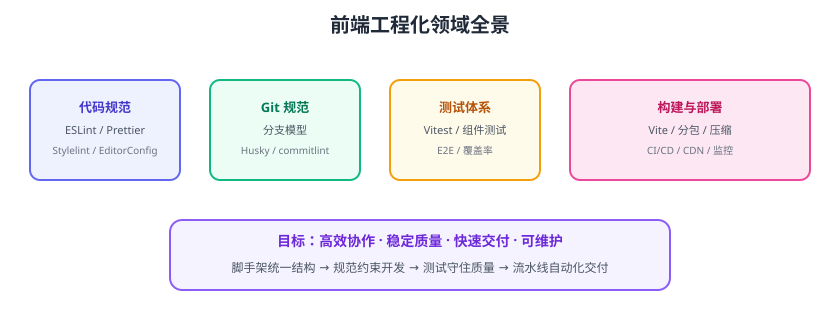

# 前端工程化概览

前端工程化（Frontend Engineering）指用**工程手段**管理前端开发全流程：统一代码规范、标准化 Git 协作、建立测试体系、优化构建产物、接入 CI/CD，最终目标是让团队“多人协作不混乱、质量可度量、交付可重复”。



## 为什么需要工程化

项目小的时候，一个人写、一个人发布，“能跑就行”。团队和项目变大后：

| 痛点 | 工程化解法 |
| --- | --- |
| 每个人代码风格不同 | ESLint + Prettier 统一规范 |
| 提交信息乱七八糟，历史不可读 | Conventional Commits + commitlint |
| 改 A 功能把 B 功能改坏了 | 单元测试 + 组件测试兜底 |
| 构建产物越来越大，页面越来越慢 | 分包、压缩、懒加载优化 |
| 发布靠人肉，容易漏步骤 | CI/CD 流水线自动化 |
| 新人上手慢，目录随心所欲 | 脚手架 + 统一目录结构 |

## 工程化六大领域

| 领域 | 工具 | 目标 |
| --- | --- | --- |
| 代码规范 | ESLint、Prettier、stylelint、EditorConfig | 风格统一、尽早发现低级错误 |
| Git 规范 | Husky、lint-staged、commitlint | 提交可读、质量前移 |
| 测试体系 | Vitest、Vue Test Utils、Playwright | 回归可控、质量可度量 |
| 构建优化 | Vite、Rollup、压缩/分包 | 快构建、小体积、高缓存命中 |
| CI/CD | GitHub Actions、GitLab CI | 自动化验证与交付 |
| 脚手架 | create-vite、模板工程 | 结构统一、快速启动 |

## 工程化演进阶段

```text
阶段一：人工时代
  手写 HTML/JS，无构建、无测试，直接部署

阶段二：工具化
  Webpack/Vite 构建、npm 依赖、代码压缩

阶段三：规范化
  ESLint/Prettier、Git Flow、单元测试、代码评审

阶段四：自动化
  CI 门禁、CD 部署、预览环境、质量指标（覆盖率/构建时长）

阶段五：智能化
  AI 辅助编码、自动化测试生成、持续性能监控
```

::: tip 一句话理解
工程化不是“上多少工具”，而是把「靠自觉」变成「靠机制」：规范自动执行、质量自动检查、交付自动完成。
:::

## 技术栈现状（2026-08 核对）

| 工具 | 版本 | 说明 |
| --- | --- | --- |
| Vite | 8.x | 当前主流构建工具，8.0 于 2026-03 发布 |
| Vitest | 4.x | 与 Vite 同源的单测框架 |
| ESLint | 10.x | flat config（`eslint.config.js`）为唯一配置方式 |
| Prettier | 3.x | 代码格式化事实标准 |
| pnpm | 11.x | 当前推荐包管理器，Store v11 提升安装效率 |
| Husky | 9.x | Git 钩子管理 |
| lint-staged | 17.x | 只检查暂存文件 |
| Playwright | 最新 | E2E 测试主流选择 |

## 落地路线

```text
第 1 步：脚手架 + 目录规范（统一项目结构）
第 2 步：ESLint + Prettier（规范自动执行）
第 3 步：Husky + commitlint（质量前移到提交）
第 4 步：Vitest 单元测试 + 覆盖率门禁
第 5 步：构建优化（分包、懒加载、CDN）
第 6 步：CI/CD（lint → test → build → 预览 → 发布）
```

## 易错点与最佳实践

::: danger 常见错误
1. **工具堆砌不落地**：装了 ESLint 但没人跑、CI 不检查，等于没装。
2. **规范一刀切**：旧项目直接全量强制新规范，改动爆炸；先新代码生效，再逐步迁移。
3. **测试只写不跑**：有测试文件但 CI 不执行，回归照样发生。
4. **构建只看“能打包”**：不关注产物体积与加载性能。
5. **忽略团队共识**：规范是团队约定，要评审后执行，不是个人喜好。
6. **工程化过度**：小项目也上全套重型工具，学习与维护成本超过收益。
:::

::: tip 落地建议
1. 从“最痛的环节”开始：发布混乱先上 CI，风格混乱先上 ESLint。
2. 规范文档化并随仓库提交（如 CONTRIBUTING.md）。
3. 关键指标进 CI 门禁：lint 0 警告、类型检查通过、覆盖率 ≥ 80%。
4. 工具版本锁定（lockfile + 统一 Node 版本），避免“本地能跑 CI 挂”。
5. 定期复盘：构建时长、测试时长、CI 失败率持续优化。
:::

## 验证方式

1. 用模板脚手架创建项目，确认 lint/typecheck/test/build 四个命令全部可用。
2. 故意提交一段不规范代码，确认本地钩子拦截、CI 标红。
3. 统计一次完整流水线耗时，对照目标（lint+test+build ≤ 10 分钟）。

## 相关专题

- [包管理器深入](../../../../Tools/PackageManager/index.md)：npm/pnpm/Yarn 选型、lockfile 与 monorepo，是工程化基线的前置依赖

## 参考资料

- Vite 文档：https://vitejs.dev/
- ESLint 文档：https://eslint.org/docs/latest/
- Vitest 文档：https://cn.vitest.dev/
- pnpm 文档：https://pnpm.io/zh/
- 前端工程化体系（InfoQ 系列文章）
