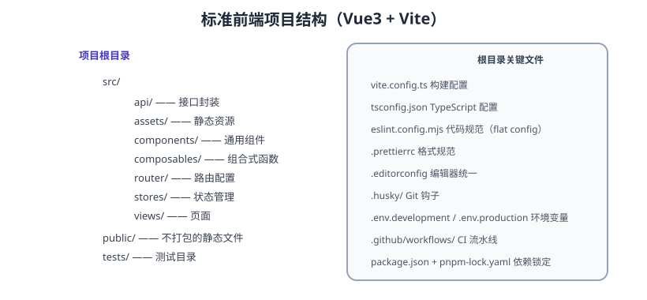

# 脚手架与工程结构

脚手架解决“每个新项目从零搭环境”的重复劳动：统一目录结构、统一工具链、统一环境变量，让团队每个项目开箱即用。本页给出基于 Vite + pnpm 的标准工程结构、多环境配置与 Monorepo 方案。



## 创建项目

### create-vite

```shell
pnpm create vite my-app --template vue-ts
cd my-app
pnpm install
pnpm dev
```

常用模板：`vue-ts`、`react-ts`、`vanilla-ts`。

### 团队模板（推荐）

维护一个“公司级模板仓库”，用 degit 或自定义 CLI 拉取：

```shell
pnpm dlx degit your-org/frontend-template#main my-app
```

模板仓库包含：目录结构、ESLint/Prettier、Husky、Vitest、CI 流水线、多环境配置——新项目开箱即全。

## 标准目录结构

```text
src/
├── api/            # 接口封装（按模块）
├── assets/         # 静态资源
├── components/     # 通用组件（按功能拆分）
├── composables/    # 组合式函数（Vue）
├── hooks/          # 自定义 Hooks（React）
├── router/         # 路由配置与守卫
├── stores/         # 状态管理
├── styles/         # 全局样式
├── types/          # 全局类型
├── utils/          # 工具函数
├── views/          # 页面
└── main.ts         # 入口
```

命名规范：

| 对象 | 规范 | 示例 |
| --- | --- | --- |
| 目录 | 小写复数 | `components`、`utils` |
| 组件 | PascalCase | `OrderList.vue` |
| 工具函数 | camelCase | `formatPrice.ts` |
| 常量 | UPPER_SNAKE | `MAX_PAGE_SIZE` |
| 接口文件 | 按模块 | `api/order.ts` |

## 多环境配置

```text
.env.development       # pnpm dev
.env.production        # pnpm build
.env.staging           # 预发布构建
.env.test              # 测试环境
```

```ini [.env.development]
VITE_API_BASE_URL=/api
VITE_ENV=development
```

```ini [.env.production]
VITE_API_BASE_URL=https://api.example.com
VITE_ENV=production
```

代码中通过 `import.meta.env` 读取：

```ts
const baseURL = import.meta.env.VITE_API_BASE_URL
```

::: danger 环境变量安全
只有以 `VITE_` 开头的变量会暴露到客户端代码！密钥、Token 一律放服务端环境变量，`VITE_` 前缀的变量任何人打开 devtools 都能看到。
:::

## 路径别名

```ts [vite.config.ts]
import { fileURLToPath, URL } from 'node:url'

export default defineConfig({
  resolve: {
    alias: {
      '@': fileURLToPath(new URL('./src', import.meta.url)),
    },
  },
})
```

```json [tsconfig.json]
{
  "compilerOptions": {
    "baseUrl": ".",
    "paths": { "@/*": ["src/*"] }
  }
}
```

## Monorepo（pnpm workspace）

多项目共享依赖与规范：

```yaml [pnpm-workspace.yaml]
packages:
  - packages/*
  - apps/*
```

```text
repo/
├── apps/
│   ├── web/          # 主应用
│   └── admin/        # 管理后台
├── packages/
│   ├── ui/           # 共享组件库
│   ├── utils/        # 共享工具
│   └── config/       # 共享 eslint/tsconfig
└── pnpm-workspace.yaml
```

```shell
pnpm --filter web dev
pnpm --filter @repo/ui build
```

::: tip Monorepo 收益
共享代码不发布 npm 包也能跨项目引用、一次提交跨包改动、统一版本与 CI。
:::

## 模板必带清单

::: tip 新项目模板自查表
1. 目录结构与命名规范
2. ESLint + Prettier + stylelint（flat config）
3. Husky + lint-staged + commitlint
4. Vitest + 覆盖率配置
5. 多环境 .env 文件与示例（.env.example）
6. CI 流水线（lint/typecheck/test/build）
7. README：启动、测试、发布流程
8. 基础目录页/路由/请求封装示例
:::

## 易错点与最佳实践

::: danger 常见错误
1. **模板过期不维护**：模板没人更新，新项目一堆老依赖；把模板纳入版本管理与 CI。
2. **每个项目手工改环境变量**：缺少 `.env.example`，新人不知道要配什么。
3. **路径别名只在 Vite 配**：tsconfig 不配，IDE 报错；两处都要。
4. **密钥进 `VITE_` 变量**：客户端暴露，等于公开。
5. **Monorepo 过早引入**：小团队单项目别硬上 Monorepo，复杂度大于收益。
6. **版本不锁定**：模板依赖漂移，一年后不可复现；lockfile 提交。
:::

::: tip 最佳实践
1. 模板仓库带 CI 与发布流程，保证模板本身可构建、可测试。
2. 环境变量统一 `VITE_` 前缀 + `.env.example` 注释说明。
3. 用 pnpm 的 `catalog`（版本目录）集中管理依赖版本（pnpm 10+）。
4. 新项目从模板创建后先跑一遍 lint/test/build 再提交。
5. 定期升级模板依赖并发布版本记录，让旧项目可参照迁移。
:::

## 验证方式

1. 用模板创建新项目，确认 `pnpm dev`、`pnpm lint`、`pnpm test`、`pnpm build` 全部可用。
2. 切换 `.env.development` 与 `.env.production`，确认 `import.meta.env` 值变化。
3. 在 Monorepo 中跨包引用组件，确认类型与构建通过。

## 参考资料

- create-vite：https://github.com/vitejs/vite/tree/main/packages/create-vite
- pnpm Workspace：https://pnpm.io/zh/workspaces
- pnpm Catalog：https://pnpm.io/catalogs
- degit：https://github.com/Rich-Harris/degit
- Turborepo：https://turborepo.com/
