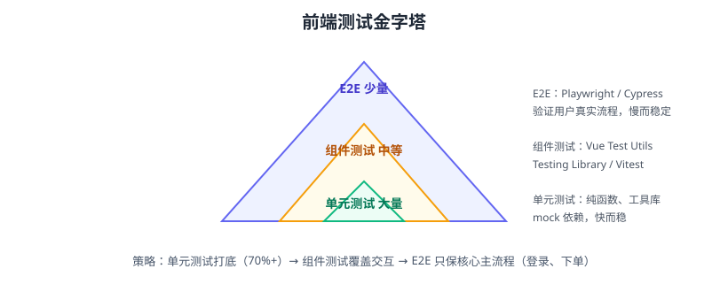

# 单元测试与组件测试

测试是前端工程化的“安全网”：重构不怕改坏、新功能不破坏旧逻辑。前端测试按金字塔组织：**单元测试（多而快）→ 组件测试（中等）→ E2E（少而全）**。本页以 Vitest 4 + Vue Test Utils / Testing Library 为主。



## 测试层级

| 层级 | 对象 | 工具 | 数量 | 速度 |
| --- | --- | --- | --- | --- |
| 单元测试 | 纯函数、工具、store | Vitest | 多 | 毫秒级 |
| 组件测试 | 组件渲染与交互 | Vue Test Utils / Testing Library | 中 | 秒级 |
| E2E | 用户真实流程 | Playwright / Cypress | 少 | 分钟级 |

## 安装 Vitest

```shell
pnpm add -D vitest @vue/test-utils jsdom @vitest/coverage-v8
```

```ts [vitest.config.ts]
import { defineConfig } from 'vitest/config'
import vue from '@vitejs/plugin-vue'

export default defineConfig({
  plugins: [vue()],
  test: {
    environment: 'jsdom',
    globals: true,
    coverage: {
      provider: 'v8',
      reporter: ['text', 'html'],
      thresholds: {
        lines: 80,
        functions: 80,
      },
    },
  },
})
```

```json [package.json]
{
  "scripts": {
    "test": "vitest run",
    "test:watch": "vitest",
    "test:coverage": "vitest run --coverage"
  }
}
```

## 单元测试：纯函数

```ts [src/utils/format.ts]
export function formatPrice(amount: number): string {
  return `¥${(amount / 100).toFixed(2)}`
}
```

```ts [src/utils/__tests__/format.test.ts]
import { describe, it, expect } from 'vitest'
import { formatPrice } from '../format'

describe('formatPrice', () => {
  it('分转元并保留两位小数', () => {
    expect(formatPrice(1000)).toBe('¥10.00')
  })

  it('处理 0', () => {
    expect(formatPrice(0)).toBe('¥0.00')
  })
})
```

## 组件测试：Vue Test Utils

```vue [src/components/Counter.vue]
<script setup lang="ts">
import { ref } from 'vue'
const count = ref(0)
</script>

<template>
  <button data-test="counter" @click="count++">点击 {{ count }} 次</button>
</template>
```

```ts [src/components/__tests__/Counter.spec.ts]
import { mount } from '@vue/test-utils'
import { describe, it, expect } from 'vitest'
import Counter from '../Counter.vue'

describe('Counter', () => {
  it('初始渲染 0 次', () => {
    const wrapper = mount(Counter)
    expect(wrapper.text()).toContain('点击 0 次')
  })

  it('点击后计数加一', async () => {
    const wrapper = mount(Counter)
    await wrapper.get('[data-test="counter"]').trigger('click')
    expect(wrapper.text()).toContain('点击 1 次')
  })
})
```

## Mock 外部依赖

```ts
import { vi } from 'vitest'

// mock 接口请求
vi.mock('@/api/order', () => ({
  fetchOrder: vi.fn().mockResolvedValue({ id: 1, status: 'PAID' }),
}))

// mock 定时器
vi.useFakeTimers()
```

::: tip 测试原则
1. 组件测试关注“输入 → 输出”，不关注实现细节。
2. 尽量 mock 网络与第三方，保证测试确定性。
3. 用 `data-test` 属性定位元素，比 class 稳定。
:::

## React 组件测试（Testing Library）

```shell
pnpm add -D @testing-library/react @testing-library/jest-dom
```

```tsx [src/components/__tests__/Greeting.test.tsx]
import { render, screen } from '@testing-library/react'
import { describe, it, expect } from 'vitest'
import Greeting from '../Greeting'

describe('Greeting', () => {
  it('渲染用户名', () => {
    render(<Greeting name="张三" />)
    expect(screen.getByText('你好，张三')).toBeInTheDocument()
  })
})
```

## E2E：Playwright

```shell
pnpm add -D @playwright/test
pnpm exec playwright install
```

```ts [e2e/checkout.spec.ts]
import { test, expect } from '@playwright/test'

test('用户完成下单主流程', async ({ page }) => {
  await page.goto('/')
  await page.getByRole('button', { name: '加入购物车' }).click()
  await page.getByRole('button', { name: '去结算' }).click()
  await expect(page).toHaveURL(/\/checkout/)
  await page.getByRole('button', { name: '提交订单' }).click()
  await expect(page.getByText('下单成功')).toBeVisible()
})
```

## 覆盖率与质量门禁

```shell
pnpm test:coverage
```

覆盖率阈值建议（按**新增代码**统计）：

| 指标 | 建议 |
| --- | --- |
| lines | ≥ 80% |
| functions | ≥ 80% |
| branches | ≥ 70% |
| 核心模块（支付、权限） | ≥ 90% |

覆盖率不达标 → CI 失败 → 门禁生效（详见 [CI 集成](../CIIntegration/index.md)）。

## 易错点与最佳实践

::: danger 常见错误
1. **测试依赖真实网络**：跑一次慢、不稳定；mock 掉请求。
2. **只测 happy path**：边界、异常、loading/error 状态都要测。
3. **断言写死文本细节**：文案一改测试就挂；用语义化定位（role/data-test）。
4. **快照滥用**：大快照 diff 噪音大；快照只用于稳定结构。
5. **E2E 与单测混跑**：E2E 慢，单独流水线/阶段执行。
6. **覆盖率数字游戏**：为凑数字写无效断言；关键逻辑优先。
:::

::: tip 最佳实践
1. 测试文件与被测文件同目录 `__tests__/` 或 `.spec.ts` 后缀，便于发现。
2. 逻辑抽纯函数 → 好测；组件保持薄。
3. 本地 `vitest run` 快跑，CI 全量 + 覆盖率。
4. Flaky Test 当天处理：先隔离、再修根因，不“跳过”。
5. 新组件必须带测试才能合 PR（约定 + CI 门禁）。
:::

## 验证方式

1. `pnpm test` 全部通过；`pnpm test:coverage` 生成报告且达阈值。
2. 故意改坏一个组件逻辑，确认对应测试失败（测试真的有效）。
3. 用 Playwright 跑一次下单 E2E，确认用户主流程可用。

## 参考资料

- Vitest 文档：https://cn.vitest.dev/
- Vue Test Utils：https://test-utils.vuejs.org/
- Testing Library：https://testing-library.com/
- Playwright：https://playwright.dev/
- 测试金字塔（Martin Fowler）：https://martinfowler.com/bliki/TestPyramid.html
