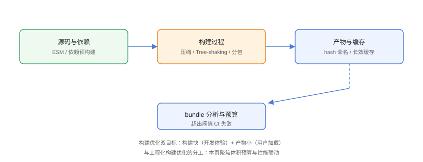

# 构建优化与体积预算

构建优化的双目标是**构建快**（开发体验）与**产物小**（用户加载）。工程化篇已覆盖构建流程与缓存，本页聚焦**体积预算**：代码分割、tree-shaking、按需引入与 CI 门禁，把「体积」变成可守护的指标。

## 体积预算机制



## 1. 代码分割

### 路由级懒加载

```typescript
// Build/router-lazy.ts
const routes = [
  {
    path: '/report',
    component: () => import('@/views/Report.vue'),   // 独立 chunk
  },
  {
    path: '/admin',
    component: () => import('@/views/Admin.vue'),
  },
];
```

### 手动分包

```typescript
// Build/manual-chunks.ts
export default defineConfig({
  build: {
    rollupOptions: {
      output: {
        manualChunks(id) {
          if (id.includes('node_modules')) {
            // 大而独立的三方库单独分包
            if (id.includes('echarts')) return 'charts';
            if (id.includes('lodash')) return 'lodash';
            return 'vendor';
          }
        },
      },
    },
  },
});
```

::: tip 分包原则
按**更新频率**分包：框架（vue/react）几乎不变 → 长缓存；业务代码高频变 → 独立 chunk；体积大且按需 → 拆出。
:::

## 2. Tree-shaking

```javascript
// Build/tree-shaking.js
// 前提：ESM 静态导入 + sideEffects 声明
import { debounce, throttle } from 'lodash-es';   // 只打包用到的

// package.json 中声明（供打包器识别）
{
  "sideEffects": false
}
```

避免破坏 tree-shaking 的写法：

- 不要 `import * as lodash` 全量导入；
- 不要通过「入口文件再导出」中转（`export * from './a'; export * from './b';`）；
- 样式文件如需保留，`sideEffects` 中单独列出。

## 3. 按需引入组件库

```typescript
// Build/on-demand.ts（Vue + Vite 示例）
import Components from 'unplugin-vue-components/vite';
import { ElementPlusResolver } from 'unplugin-vue-components/resolvers';

export default defineConfig({
  plugins: [
    Components({
      resolvers: [ElementPlusResolver()],
    }),
  ],
});
```

```javascript
// 图表库按需（ECharts）
import { BarChart, LineChart } from 'echarts/charts';
import { GridComponent, TooltipComponent } from 'echarts/components';
import { use } from 'echarts/core';

use([BarChart, LineChart, GridComponent, TooltipComponent]);
```

## 4. 产物压缩

```typescript
// Build/compress.ts
export default defineConfig({
  build: {
    // Vite 默认 esbuild 压缩；需要更小可换 terser
    minify: 'terser',
    terserOptions: {
      compress: { drop_console: true },   // 生产移除 console
    },
  },
});
```

```nginx
# 传输层压缩（服务端）
gzip on;
gzip_static on;          # 直接返回预压缩文件
brotli on;               # 更优（若支持）
```

## 5. 体积分析与预算 CI

```bash
# 安装体积分析插件
npm install -D rollup-plugin-visualizer
```

```typescript
// Build/analyzer.ts
import { visualizer } from 'rollup-plugin-visualizer';

export default defineConfig({
  plugins: [
    visualizer({ open: true, gzipSize: true }),
  ],
});
```

### CI 体积门禁

```yaml
# Build/budget.yml
name: Bundle Size Check
on: [pull_request]

jobs:
  check:
    runs-on: ubuntu-latest
    steps:
      - uses: actions/checkout@v6
      - uses: pnpm/action-setup@v5
        with: { version: 9 }
      - uses: actions/setup-node@v6
        with: { node-version: 24, cache: pnpm }
      - run: pnpm install --frozen-lockfile
      - run: pnpm build
      - name: Check bundle size
        run: |
          SIZE=$(du -sk dist/assets | cut -f1)
          echo "Bundle size: ${SIZE}KB"
          if [ "$SIZE" -gt 1500 ]; then
            echo "❌ 超过预算 1500KB"
            exit 1
          fi
```

更精细的方案用 [size-limit](https://github.com/ai/size-limit)：

```json
// package.json
{
  "scripts": {
    "size": "size-limit"
  },
  "size-limit": [
    {
      "path": "dist/assets/index-*.js",
      "limit": "200 KB"
    }
  ]
}
```

## 6. 首屏 JS 目标

| 项目规模 | 首屏 JS（gzip）目标 |
| --- | --- |
| 小站/文档 | ≤ 100KB |
| 中大型业务 | ≤ 200KB |
| 复杂后台 | ≤ 300KB（超出需论证） |

## 易错点与最佳实践

::: danger 常见坑
1. **手动分包过细**：chunk 太多反而增加请求与缓存碎片，一般 10~20 个 chunk 内。
2. **`drop_console` 误伤调试**：只在生产构建启用，保留 `error` 级日志。
3. **size-limit 只看主包**：路由 chunk 也要设预算，防止某个页面偷偷膨胀。
4. **忽视 sourcemap**：生产可不上传或只在内部保留，避免源码泄露与体积。
5. **预算形同虚设**：不接入 CI 的预算等于没有。
:::

::: tip 最佳实践
- 体积预算从「现状 + 20% 余量」起步，逐步收紧；
- 每次 PR 自动跑体积对比（size-limit 输出前后差异）；
- 定期用 visualizer 看依赖分布，清理无用依赖与重复库。
:::

## 验证方式

```shell
pnpm build
pnpm size          # 输出各包体积与预算对比
npx vite-bundle-visualizer
```

预期：构建产物各 chunk 在预算内；visualizer 展示依赖体积分布；故意引入一个大库（如完整 echarts）再跑 size，确认门禁失败。

## 参考资料

- [size-limit](https://github.com/ai/size-limit)
- [rollup-plugin-visualizer](https://github.com/btd/rollup-plugin-visualizer)
- [web.dev：代码分割](https://web.dev/articles/reduce-javascript-payloads-with-code-splitting)
- [Vite 构建配置](https://cn.vite.dev/config/build-options)
