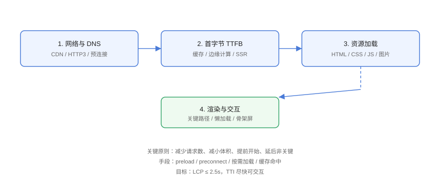

# 加载优化

加载优化覆盖从「用户输入 URL」到「页面可交互」的全链路：网络、首字节、资源加载与关键渲染路径。核心手段是**减少请求、减小体积、提前开始、延后非关键**。

## 加载链路



## 1. 网络层

### DNS 预解析与预连接

```html
<!-- Loading/preconnect.html -->
<!-- 提前建立与关键第三方源的连接 -->
<link rel="preconnect" href="https://api.example.com">
<link rel="dns-prefetch" href="https://img.example.com">
```

| 手段 | 作用 | 适用 |
| --- | --- | --- |
| `dns-prefetch` | 提前解析 DNS | 任意第三方域 |
| `preconnect` | DNS + TCP + TLS 握手 | 关键第三方源（API、CDN） |
| `preload` | 提前加载关键资源 | LCP 图片、关键字体 |
| `prefetch` | 空闲时加载下一跳资源 | 预测用户下一步 |

### HTTP/2 / HTTP/3

- HTTP/2 多路复用：减少连接数、头部压缩；
- HTTP/3（QUIC）：弱网下更快，2026 年主流 CDN 已支持；
- 配置：CDN 开启即可，前端无需改动。

## 2. 首字节（TTFB）

| 手段 | 说明 |
| --- | --- |
| CDN 边缘缓存 | 静态资源就近返回 |
| 页面缓存 | 整页缓存 / 流式 SSR |
| 后端提速 | 查询优化、响应体精简 |
| 边缘渲染（ESR） | 首屏 HTML 在边缘生成 |

## 3. 资源加载顺序

### 关键 CSS 内联

```html
<!-- Loading/inline-css.html -->
<!-- 首屏关键样式内联，减少渲染阻塞请求 -->
<style>
  .header { display: flex; ... }
</style>
<!-- 非关键样式异步加载 -->
<link rel="stylesheet" href="/styles.css" media="print" onload="this.media='all'">
```

### 脚本 defer / async

```html
<!-- Loading/script-defer.html -->
<!-- defer：HTML 解析完再执行，保持顺序 -->
<script defer src="/app.js"></script>

<!-- async：下载完立即执行，不保证顺序 -->
<script async src="/analytics.js"></script>
```

::: danger script 放在 head 且不带 defer
同步脚本会**阻塞解析与渲染**；非首屏脚本一律 `defer`/`async` 或动态加载。
:::

### 关键资源 preload

```html
<!-- Loading/preload-lcp.html -->
<!-- LCP 图片提前加载 -->
<link rel="preload" as="image" href="/hero.webp">
```

## 4. 懒加载

```html
<!-- Loading/lazy.html -->
<!-- 图片：视口外延迟加载（原生支持） -->


<!-- iframe：同样支持 -->
<iframe src="https://example.com/embed" loading="lazy"></iframe>
```

```javascript
// Loading/lazy-js.js
// 路由级代码分割（Vue 示例）
const routes = [
  {
    path: '/dashboard',
    component: () => import('@/views/Dashboard.vue'),   // 按需加载
  },
];
```

::: danger LCP 图片不要懒加载
首屏 LCP 图片如果 `loading="lazy"`，会被推迟加载导致 LCP 变差。**只有视口外图片才懒加载**，LCP 元素用 preload。
:::

## 5. 骨架屏与流式渲染

```html
<!-- Loading/skeleton.html -->
<!-- 骨架屏：先占位，内容到达后替换，减少 CLS -->
<div class="skeleton">
  <div class="skeleton__line"></div>
  <div class="skeleton__block"></div>
</div>
```

```css
/* Loading/skeleton.css */
.skeleton__line {
  height: 16px;
  background: linear-gradient(90deg, #eee 25%, #f5f5f5 50%, #eee 75%);
  background-size: 200% 100%;
  animation: shimmer 1.5s infinite;
}

@keyframes shimmer {
  to { background-position: -200% 0; }
}
```

## 6. 缓存策略

```nginx
# Loading/cache.conf
# 带 hash 的静态资源：长缓存
location /assets/ {
  expires 1y;
  add_header Cache-Control "public, immutable";
}

# HTML：短缓存 + 协商
location / {
  add_header Cache-Control "no-cache";
}
```

| 资源 | 缓存策略 |
| --- | --- |
| 带 hash 的 JS/CSS/图片 | `immutable` + 1 年 |
| HTML | `no-cache`（每次校验） |
| API 响应 | 按业务设置 `max-age` 或 `ETag` |

## 易错点与最佳实践

::: danger 常见坑
1. **过度 preload**：preload 太多会抢带宽，只对 LCP 等关键资源用。
2. **懒加载位置错误**：首屏内容被懒加载，LCP 恶化。
3. **CDN 缓存了 HTML**：页面更新后用户拿旧版，HTML 不要长缓存。
4. **`defer` 与 `async` 混用**：依赖顺序的脚本必须 defer（保序）。
5. **忽略字体加载阻塞**：字体未优化会影响 FCP/LCP，见资源优化篇。
:::

::: tip 最佳实践
- 加载顺序优先级：关键 HTML/CSS → LCP 图片 → 功能 JS → 非关键资源；
- 用 DevTools Network 的「Blocking」与优先级列验证资源加载顺序；
- 把「LCP 资源 preload + 非关键资源懒加载」做成模板默认。
:::

## 验证方式

在 DevTools Network 面板开启 4G 节流与「Slow 4G」，对比优化前后：

1. LCP 资源是否被 preload（Priority 显示 High）；
2. 非首屏图片是否延迟加载（懒加载后滚动才请求）；
3. 脚本是否 defer（不阻塞 DOMContentLoaded）；
4. 二次访问是否全部命中缓存（Size 显示 disk cache）。

## 参考资料

- [web.dev：关键路径](https://web.dev/articles/critical-rendering-path)
- [MDN：preload 与 prefetch](https://developer.mozilla.org/zh-CN/docs/Web/HTML/Attributes/rel/preload)
- [MDN：懒加载](https://developer.mozilla.org/zh-CN/docs/Web/Performance/Lazy_loading)
