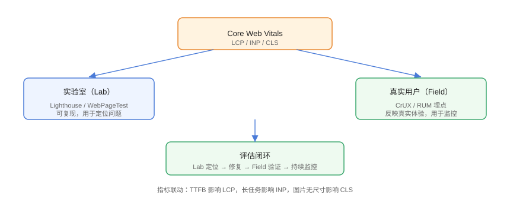

# 性能指标与评估

性能优化的前提是**可测量**。Core Web Vitals（核心 Web 指标）是行业通用的量化基准：LCP、INP、CLS；配合 TTFB、FCP、TBT 等辅助指标，可以定位「慢在哪一环」。评估分**实验室（Lab）**与**真实用户（Field）**两个维度，各有用途。

## 指标地图



## 核心 Web Vitals（2026 标准）

| 指标 | 含义 | Good | Needs Improvement | Poor |
| --- | --- | --- | --- | --- |
| LCP | 最大内容绘制（首屏最大元素加载完成） | ≤ 2.5s | ≤ 4.0s | > 4.0s |
| INP | 交互到下一次绘制延迟 | ≤ 200ms | ≤ 500ms | > 500ms |
| CLS | 累计布局偏移（视觉稳定性） | ≤ 0.1 | ≤ 0.25 | > 0.25 |

::: tip INP 取代 FID
FID 只度量「首次输入」的延迟，INP 度量**整个会话中最差的一次交互**，2024 年 3 月起正式取代 FID 成为 Core Web Vitals。
:::

## 辅助指标

| 指标 | 含义 | 优化方向 |
| --- | --- | --- |
| TTFB | 首字节时间（网络 + 服务器） | CDN、缓存、后端响应 |
| FCP | 首次内容绘制 | 关键 CSS、HTML 精简 |
| TBT | 主线程阻塞总时间 | 长任务拆分、减少 JS 执行 |
| SI | 视觉稳定性 | 骨架屏、加载顺序 |
| TTI | 可交互时间 | JS 减量、懒加载 |

## Lab 评估：Lighthouse

```shell
# 本地安装并运行
npm install -g lighthouse
lighthouse https://example.com --view

# 移动端模拟 + 输出 JSON
lighthouse https://example.com --form-factor=mobile --output=json --output-path=report.json
```

关注分数与诊断项：

| 审计项 | 对应优化 |
| --- | --- |
| 消除阻塞渲染的资源 | 内联关键 CSS、defer 脚本 |
| 图片尺寸合适 | srcset + 裁剪 |
| 减少主线程工作 | 拆分长任务 |
| 预加载 LCP 资源 | preload |
| 未使用 JS/CSS | 代码分割 + 按需引入 |

::: warning Lab 的局限
Lighthouse 在固定环境下模拟（节流 4G、固定设备），结果**可复现但不等同真实用户**。低端设备、弱网、用户交互场景要用 Field 数据补充。
:::

## Field 评估：CrUX 与 RUM

### CrUX（Chrome 用户体验报告）

用 [PageSpeed Insights](https://pagespeed.web.dev/) 输入 URL，直接看真实用户聚合数据（28 天窗口）：

```text
LCP: 2.1s（Good 78%）
INP: 180ms（Good 85%）
CLS: 0.08（Good 90%）
```

### 自建 RUM（真实用户监控）

```javascript
// Metrics/rum.js
import { onLCP, onINP, onCLS, onTTFB, onFCP } from 'web-vitals';

function report(metric) {
  const body = JSON.stringify({
    name: metric.name,
    value: metric.value,
    rating: metric.rating,
    page: location.pathname,
    ua: navigator.userAgent,
    t: Date.now(),
  });
  // sendBeacon 在页面卸载时也能可靠上报
  navigator.sendBeacon('/api/rum', body);
}

onLCP(report);
onINP(report);
onCLS(report);
onTTFB(report);
onFCP(report);
```

```bash
# 安装 web-vitals
npm install web-vitals
```

::: tip 统计口径
Core Web Vitals 以 **p75（75 分位）** 为准：75% 的访问达标才算 Good。真实用户数据按设备类型、网络类型分层看，移动端往往比桌面差。
:::

## 评估闭环

```text
Lab 定位问题（Lighthouse / Performance 面板）
→ 实施优化
→ Field 验证真实效果（RUM / CrUX）
→ 性能预算防止回归（CI）
```

## 易错点与最佳实践

::: danger 常见坑
1. **只看总分不看指标**：Lighthouse 分数是加权，先看 LCP/INP/CLS 是否达标。
2. **只看平均值**：被少数快用户拉平，用 p75 且分层。
3. **Lab 与 Field 割裂**：Lab 满分 ≠ 用户快，必须看真实数据。
4. **测量时机不对**：无缓存 vs 有缓存、冷启动 vs 热启动要分别记录。
5. **优化无基线**：没有前后对比，无法判断是否有效。
:::

::: tip 最佳实践
- 建立**性能基线文档**：每月记录关键指标与变动原因；
- Lab 用于开发期快速验证，Field 用于上线后监控；
- 一次只改一个变量，改完立即复测。
:::

## 验证方式

运行 Lighthouse 记录性能分数与 CWV 值；在页面接入 web-vitals 埋点后，用 DevTools 的 Network 面板确认 `/api/rum` 请求正常发出（keepalive）；在 PageSpeed Insights 输入线上 URL 对比真实用户数据。

## 参考资料

- [web.dev：Core Web Vitals](https://web.dev/articles/vitals)
- [web-vitals npm 包](https://www.npmjs.com/package/web-vitals)
- [Lighthouse 文档](https://developer.chrome.com/docs/lighthouse)
- [PageSpeed Insights](https://pagespeed.web.dev/)
