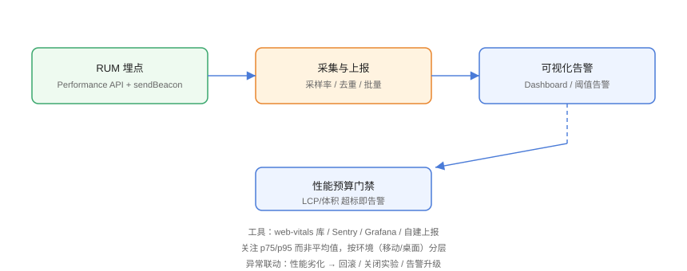

# 监控与性能预算

性能优化的长期有效性靠**监控**与**预算**：埋点采集真实用户指标（RUM）、可视化与告警、用性能预算在 CI 拦截回归。没有监控的优化只是「碰运气」。

## 监控体系



## 1. RUM 埋点

### 采集核心指标

```javascript
// Monitoring/rum.js
import { onLCP, onINP, onCLS, onTTFB, onFCP } from 'web-vitals';
import { getFCP } from 'web-vitals/attribution';   // 归因版本便于定位

const session = crypto.randomUUID();

function report(metric) {
  const payload = {
    session,
    name: metric.name,
    value: metric.value,
    rating: metric.rating,
    page: location.pathname + location.search,
    viewport: `${innerWidth}x${innerHeight}`,
    device: /Mobile|Android|iPhone/i.test(navigator.userAgent)
      ? 'mobile' : 'desktop',
    ts: Date.now(),
  };

  // sendBeacon：页面卸载、后台切换也能可靠发送
  navigator.sendBeacon('/api/rum', new Blob(
    [JSON.stringify(payload)], { type: 'application/json' }));
}

onTTFB(report);
onFCP(report);
onLCP(report);
onINP(report);
onCLS(report);
```

### 采样与去重

```javascript
// Monitoring/sampling.js
// 采样率 10%，避免全量上报打爆接口
if (Math.random() > 0.1) {
  // 不采集
} else {
  registerVitals(report);
}

// 同一页面会话只报一次 LCP/CLS，INP 报最差值
```

## 2. 服务端接收与存储

```javascript
// Monitoring/server.js（Express 简化示例）
import express from 'express';
const app = express();
app.use(express.json({ limit: '64kb' }));

app.post('/api/rum', (req, res) => {
  const data = req.body;
  // 校验 + 落库（时序库 / ClickHouse / 对象存储）
  ingest(data);
  res.status(204).end();
});
```

::: tip 采集要点
- 限制 body 大小、做来源校验，防伪造上报；
- 批量写入或异步落库，避免拖慢业务接口；
- 保留原始数据 30~90 天，聚合表长期保留。
:::

## 3. 可视化与告警

### 自建看板（Grafana 示例查询）

```sql
-- p75 LCP（按天）
SELECT
  date(ts) AS day,
  approx_percentile(value, 0.75) AS p75_lcp
FROM rum_events
WHERE name = 'LCP'
GROUP BY 1
ORDER BY 1 DESC
LIMIT 30;
```

### 告警规则

| 指标 | 告警条件（示例） |
| --- | --- |
| LCP | 连续 1 小时 p75 > 3.5s |
| INP | 连续 1 小时 p75 > 350ms |
| CLS | 连续 1 小时 p75 > 0.2 |
| 错误率 | JS 错误率 > 2% 且环比翻倍 |

## 4. 性能预算（Performance Budgets）

预算分为**指标预算**与**体积预算**：

| 类型 | 示例 |
| --- | --- |
| 指标预算 | LCP ≤ 2.5s、INP ≤ 200ms、CLS ≤ 0.1 |
| 体积预算 | 首屏 JS ≤ 200KB、总资源 ≤ 1.5MB |
| 请求预算 | 首屏请求 ≤ 50 |

### Lighthouse CI 接入

```bash
# 安装 Lighthouse CI
npm install -D @lhci/cli
```

```javascript
// lighthouserc.js
module.exports = {
  ci: {
    collect: {
      url: ['http://localhost:4173/'],
      numberOfRuns: 3,
    },
    assert: {
      assertions: {
        'categories:performance': ['warn', { minScore: 0.9 }],
        'largest-contentful-paint': ['error', { maxNumericValue: 2500 }],
        'cumulative-layout-shift': ['error', { maxNumericValue: 0.1 }],
        'total-blocking-time': ['error', { maxNumericValue: 300 }],
      },
    },
    upload: {
      target: 'temporary-public-storage',
    },
  },
};
```

```yaml
# Monitoring/lhci.yml
name: Lighthouse CI
on: [pull_request]

jobs:
  lhci:
    runs-on: ubuntu-latest
    steps:
      - uses: actions/checkout@v6
      - uses: pnpm/action-setup@v5
        with: { version: 9 }
      - uses: actions/setup-node@v6
        with: { node-version: 24, cache: pnpm }
      - run: pnpm install --frozen-lockfile
      - run: pnpm build
      - run: npx lhci autorun
```

## 5. 现成平台

| 平台 | 特点 |
| --- | --- |
| Sentry Performance | 与错误监控一体，接入快 |
| Vercel Speed Insights | Vercel 部署零配置 |
| Grafana + 自建 | 灵活可控 |
| CrUX API | 免费真实用户数据（聚合） |

## 易错点与最佳实践

::: danger 常见坑
1. **埋点影响性能**：上报代码本身要轻（web-vitals 约 2KB），用 sendBeacon。
2. **全量上报**：高流量站点要采样，否则存储与接口压力大。
3. **只看均值**：必须 p75/p95 分层。
4. **告警疲劳**：阈值太紧导致狼来了，先观察两周定基线。
5. **预算不接 CI**：没有门禁的预算只是文档。
:::

::: tip 最佳实践
- 先跑 2~4 周收集基线，再设告警与预算；
- 告警分级：P1（严重劣化）/ P2（趋势恶化）；
- 性能劣化自动联动：回滚、关闭实验、通知负责人。
:::

## 验证方式

1. 在本地页面触发 RUM 上报，确认 `/api/rum` 收到数据（Network 面板 + 服务端日志）；
2. 用 Grafana（或自建查询）确认 p75 LCP/INP/CLS 曲线出现；
3. 故意把一张大图设为 LCP，跑 Lighthouse CI，确认 LCP 断言失败（预算拦截）。

## 参考资料

- [web.dev：性能预算](https://web.dev/articles/performance-budgets-101)
- [Lighthouse CI 文档](https://github.com/GoogleChrome/lighthouse-ci)
- [web-vitals npm 包](https://www.npmjs.com/package/web-vitals)
- [Sentry Performance](https://docs.sentry.io/product/performance/)
