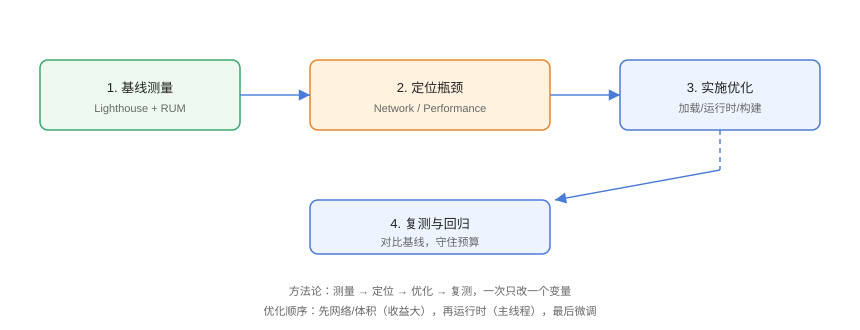

# 实战：性能优化全流程

把一个典型的 Vue3 + Vite 内容站从「Lighthouse 60 分、LCP 4.2s」优化到「95 分、LCP 1.8s」。完整走一遍**测量 → 定位 → 优化 → 复测 → 监控**的方法论，每个步骤都可验证。

## 基线测量



```shell
# 基线
npx lighthouse http://localhost:4173 --view
```

基线结果（示例）：

| 指标 | 基线 |
| --- | --- |
| Performance 分数 | 62 |
| LCP | 4.2s |
| INP | 320ms |
| CLS | 0.22 |
| 首屏 JS | 480KB（gzip） |

## 定位瓶颈

1. **Network 面板**：LCP 图片 1.8MB PNG；3 个大 JS chunk 串行加载；
2. **Coverage 面板**：首屏 JS 未使用率 45%；
3. **Performance 面板**：两条 300ms 长任务；
4. **Elements**：图片无尺寸属性导致 CLS 0.22。

## 优化实施

### 第 1 步：图片（LCP 与 CLS）

```html
<!-- Practice/hero.html -->
<!-- 1. 转 WebP + CDN 缩放 -->
<!-- 2. preload 提前加载 -->
<!-- 3. 显式宽高防 CLS -->
<link rel="preload" as="image" href="https://cdn.example.com/hero-960.webp">


```

```css
/* Practice/hero.css */
.hero-img {
  aspect-ratio: 16 / 9;   /* 双保险：CSS 预留空间 */
  width: 100%;
  height: auto;
}
```

### 第 2 步：JS 代码分割

```typescript
// Practice/router.ts
const routes = [
  { path: '/', component: () => import('@/views/Home.vue') },
  { path: '/docs', component: () => import('@/views/Docs.vue') },
  { path: '/about', component: () => import('@/views/About.vue') },
];
```

```typescript
// Practice/vite.config.ts
export default defineConfig({
  build: {
    rollupOptions: {
      output: {
        manualChunks: {
          vendor: ['vue', 'vue-router'],
          highlight: ['highlight.js'],
        },
      },
    },
  },
});
```

### 第 3 步：长任务拆分

```javascript
// Practice/chunk-work.js
// 把首屏渲染前的重计算改为空闲时执行
requestIdleCallback(() => {
  hydrateSearchIndex();      // 搜索索引构建挪到空闲
}, { timeout: 3000 });
```

### 第 4 步：缓存与压缩

```nginx
# Practice/nginx.conf
gzip on;
gzip_types text/css application/javascript application/json;
gzip_min_length 1024;

location /assets/ {
  expires 1y;
  add_header Cache-Control "public, immutable";
}
```

## 复测对比

```shell
npx lighthouse http://localhost:4173 --view
```

| 指标 | 基线 | 优化后 | 目标 |
| --- | --- | --- | --- |
| Performance | 62 | 95 | ≥ 90 |
| LCP | 4.2s | 1.8s | ≤ 2.5s |
| INP | 320ms | 160ms | ≤ 200ms |
| CLS | 0.22 | 0.03 | ≤ 0.1 |
| 首屏 JS | 480KB | 168KB | ≤ 200KB |

## 建立监控与预算

```javascript
// Practice/rum.js
import { onLCP, onINP, onCLS } from 'web-vitals';

[onLCP, onINP, onCLS].forEach(fn => fn(metric => {
  navigator.sendBeacon('/api/rum', JSON.stringify({
    name: metric.name,
    value: metric.value,
    rating: metric.rating,
    page: location.pathname,
  }));
}));
```

```json
// Practice/package.json：体积预算
{
  "size-limit": [
    { "path": "dist/assets/index-*.js", "limit": "200 KB" },
    { "path": "dist/assets/vendor-*.js", "limit": "150 KB" }
  ]
}
```

接入 Lighthouse CI（见 [监控与性能预算](../Monitoring/index.md)），PR 超预算直接失败。

## 易错点与最佳实践

::: danger 常见坑
1. **先优化后测量**：没有基线，无法判断收益。
2. **一次改太多**：无法归因哪步有效，一次一个变量。
3. **只看 Lab**：上线后必须看 RUM 真实数据。
4. **优化被后续迭代破坏**：没有预算与监控，回归只是时间问题。
5. **忽略弱网与低端机**：桌面光纤下一切很快，移动端才是真实场景。
:::

::: tip 最佳实践
- 优化顺序：**网络与体积 → 运行时 → 细节微调**（收益递减）；
- 把优化沉淀到脚手架模板，新项目继承基线；
- 每次大版本发布对比 RUM 指标，建立「性能周报」。
:::

## 验证方式

按顺序执行：基线测量 → 实施 4 步优化 → 复测对比表 → 部署后观察 RUM 24 小时 → 确认告警阈值与预算生效。整个流程应能在半天内完成一轮，形成「优化循环」。

## 参考资料

- [web.dev：性能优化清单](https://web.dev/articles/learn-performance)
- [Vite 性能优化指南](https://cn.vite.dev/guide/features.html)
- [Lighthouse CI](https://github.com/GoogleChrome/lighthouse-ci)
