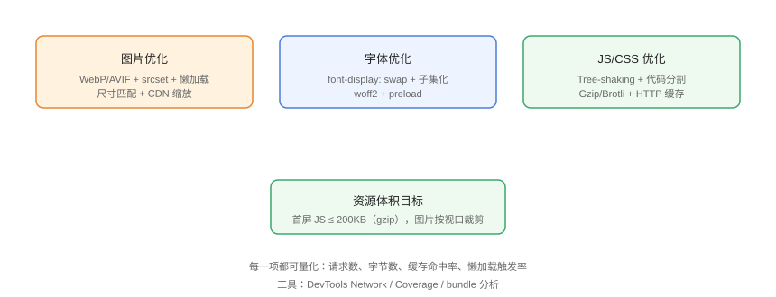

# 资源优化：图片、字体与代码

资源优化聚焦**字节数**：图片、字体、JS/CSS 是页面体量的三大来源。目标是把「用户实际需要的字节」降到最低，同时保证清晰度与体验。

## 资源优化全景



## 图片优化

### 格式选择（2026 现状）

| 格式 | 支持率 | 体积 | 适用 |
| --- | --- | --- | --- |
| WebP | ~97% | 比 JPEG 小 25~35% | 默认推荐 |
| AVIF | ~93% | 比 WebP 再小约 20~30% | 照片、大图 |
| JPEG/PNG | 100% | 大 | 兜底/透明 PNG |

### 响应式图片

```html
<!-- Resources/responsive-img.html -->

```

```html
<!-- picture：按格式与媒体条件选图 -->
<picture>
  <source type="image/avif" srcset="hero.avif">
  <source type="image/webp" srcset="hero.webp">
  
</picture>
```

::: danger 图片尺寸属性
不给 `width`/`height` 或 CSS 宽高，图片加载后会**撑开布局 → CLS 飙升**。始终预留尺寸或用 `aspect-ratio`。
:::

### 懒加载与解码

```html
<!-- Resources/lazy-img.html -->

```

### CDN 图片处理

```text
# 主流 CDN 支持 URL 参数实时缩放/格式转换（示例）
https://cdn.example.com/img/hero.jpg?w=960&q=80&format=webp
```

上传原图，展示时按需裁剪，避免「一张 2MB 原图缩到 300px 展示」。

## 字体优化

### font-display: swap

```css
/* Resources/font-face.css */
@font-face {
  font-family: "MyFont";
  src: url("/fonts/MyFont.woff2") format("woff2");
  font-display: swap;   /* 先显示回退字体，加载完成再换 */
}
```

| `font-display` | 行为 |
| --- | --- |
| `swap` | 立即用回退字体，加载完替换（默认推荐） |
| `block` | 隐藏文字等待字体（可能长时间白屏） |
| `fallback` | 短暂等待，超时用回退 |
| `optional` | 网络差时干脆不用自定义字体 |

### 字体子集化与预加载

```shell
# 用 fonttools 等工具只保留用到的字符（中文字体子集化效果显著）
pyftsubset source.woff2 --text="常用汉字子集" --output-file=subset.woff2
```

```html
<link rel="preload" as="font" href="/fonts/MyFont.woff2" crossorigin>
```

::: tip 中文字体的体积
中文字体动辄几 MB，**必须子集化**；或用「按需字体」方案（如 fontmin、子集化服务）只下发页面用到的字。
:::

## JS/CSS 代码优化

### 压缩与传输

```nginx
# Resources/compression.conf
gzip on;
gzip_types text/css application/javascript application/json image/svg+xml;
gzip_min_length 1024;

# 更优：Brotli（若 CDN/服务器支持）
brotli on;
```

### 代码分割（Vite）

```typescript
// Resources/vite-manual-chunks.ts
export default defineConfig({
  build: {
    rollupOptions: {
      output: {
        manualChunks: {
          vendor: ['vue', 'vue-router', 'pinia'],
          charts: ['echarts'],
        },
      },
    },
  },
});
```

### 按需引入

```javascript
// Resources/tree-shaking.js
// 只引入用到的函数（Tree-shaking 前提：ESM 导入）
import { debounce } from 'lodash-es';

// 组件库按需：unplugin-vue-components 自动引入
// ECharts 等大库：只注册用到的图表
import { BarChart } from 'echarts/charts';
```

## 体积预算

| 资源 | 目标（gzip 后） |
| --- | --- |
| 首屏 JS | ≤ 200KB |
| 首屏 CSS | ≤ 50KB |
| LCP 图片 | ≤ 200KB |
| 单页总请求 | ≤ 50 个 |

```shell
# 检查产物体积
ls -lh dist/assets/*.js
du -sh dist
```

## 易错点与最佳实践

::: danger 常见坑
1. **PNG 存照片**：照片用 WebP/AVIF/JPEG，PNG 只用于图标/透明。
2. **字体没子集化**：中文字体全量加载几 MB。
3. **CDN 图片不做缩放**：原图直出浪费 10 倍流量。
4. **`gzip` 与 `brotli` 叠加配置错误**：二选一，Brotli 更优。
5. **所有依赖打成一个 vendor**：体积巨大且缓存粒度差，按库的更新频率分包。
:::

::: tip 最佳实践
- 图片上传原图、展示时 CDN 处理 + 响应式尺寸；
- 字体 `swap` + 子集化 + preload；
- 用 bundle 分析工具（rollup-plugin-visualizer）定位大块依赖。
:::

## 验证方式

1. DevTools Network 开启「Disable cache」，统计总字节数并对比预算；
2. 用 Coverage 面板看未使用 JS/CSS 比例，按需移除；
3. 用 `npx vite-bundle-visualizer` 查看依赖体积分布；
4. 图片右键查看实际加载尺寸与显示尺寸是否接近（2x 内）。

## 参考资料

- [web.dev：图片优化](https://web.dev/articles/fast#optimize-your-images)
- [MDN：Web 性能资源](https://developer.mozilla.org/zh-CN/docs/Learn_web_development/Extensions/Performance)
- [caniuse：AVIF](https://caniuse.com/avif)
