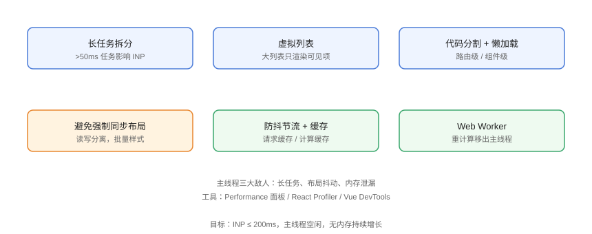

# 运行时优化

页面加载完成后的体验由**主线程**决定：JS 执行、渲染、事件响应都在主线程排队。运行时优化围绕「减少长任务、避免布局抖动、控制内存、合理缓存」展开，直接改善 INP 与交互流畅度。

## 主线程三大敌人



| 敌人 | 影响 | 手段 |
| --- | --- | --- |
| 长任务（>50ms） | 阻塞交互 → INP 变差 | 拆分任务、异步化 |
| 强制同步布局（布局抖动） | 频繁重排 → 卡顿 | 读写分离、批量操作 |
| 内存泄漏 | 页面越用越卡 | 清理监听/定时器/缓存 |

## 1. 长任务拆分

```javascript
// Runtime/long-task.js
// 坏：一次性处理 10 万条数据，主线程卡死
function processAll(items) {
  items.forEach(item => expensiveWork(item));
}

// 好：分批处理，让出主线程
async function processInChunks(items, chunkSize = 500) {
  for (let i = 0; i < items.length; i += chunkSize) {
    const chunk = items.slice(i, i + chunkSize);
    await new Promise(r => setTimeout(r, 0));   // 让出主线程
    chunk.forEach(expensiveWork);
  }
}
```

### 用 requestIdleCallback 处理非紧急任务

```javascript
// Runtime/idle.js
// 空闲时才执行（如上报、预计算）
requestIdleCallback(() => {
  precomputeHeavyStuff();
}, { timeout: 2000 });
```

## 2. 虚拟列表

渲染 1 万行 DOM 必然卡顿；虚拟列表只渲染可见项：

```javascript
// Runtime/virtual-list.js（原理示意）
// 1. 外层容器固定高度 + overflow: auto
// 2. 内部占位层高度 = 总行数 × 行高
// 3. 滚动时只渲染视口 ± overscan 的行
// 4. 绝对定位渲染行

// 生产用现成库：vue-virtual-scroller / @tanstack/virtual
```

```html
<!-- Runtime/virtual.html -->
<div class="viewport" style="height: 500px; overflow: auto;">
  <div style="position: relative; height: 1000000px;">
    <!-- 只渲染可见的 20 行 -->
  </div>
</div>
```

## 3. 避免强制同步布局

```javascript
// Runtime/layout-thrash.js
// 坏：读-写交替强制同步布局（layout thrashing）
for (const el of elements) {
  const w = el.offsetWidth;      // 读
  el.style.width = (w - 10) + 'px';  // 写 → 下一次读强制重排
}

// 好：先统一读，再统一写
const widths = elements.map(el => el.offsetWidth);
elements.forEach((el, i) => {
  el.style.width = (widths[i] - 10) + 'px';
});
```

::: danger 高频触发重排的属性
读取 `offsetWidth` / `offsetHeight` / `getBoundingClientRect()` 等几何属性会强制同步布局；动画帧内反复读写会严重卡顿。
:::

## 4. 动画只动合成属性

```css
/* Runtime/animation.css */
.box {
  transition: transform 0.3s ease;   /* 合成层，不触发重排 */
  /* 避免 width/left/top 动画 */
}
```

详细原理见 [动画进阶](../../../Basic/CSS/Advanced/Animation/index.md)。

## 5. 防抖与节流

```javascript
// Runtime/debounce-throttle.js
function debounce(fn, delay = 300) {
  let timer;
  return (...args) => {
    clearTimeout(timer);
    timer = setTimeout(() => fn(...args), delay);
  };
}

function throttle(fn, interval = 200) {
  let last = 0;
  return (...args) => {
    const now = Date.now();
    if (now - last >= interval) {
      last = now;
      fn(...args);
    }
  };
}

// 输入搜索：防抖；滚动监听：节流
input.addEventListener('input', debounce(doSearch, 300));
window.addEventListener('scroll', throttle(onScroll, 200), { passive: true });
```

## 6. 计算缓存

```javascript
// Runtime/memo.js
// 幂等计算缓存结果
const cache = new Map();

function expensiveTransform(input) {
  if (cache.has(input)) return cache.get(input);
  const result = doExpensive(input);
  cache.set(input, result);
  return result;
}
```

React/Vue 侧用 `useMemo` / `computed` 避免重复计算与无效渲染。

## 7. Web Worker 移出重计算

```javascript
// Runtime/worker.js
// 主线程
const worker = new Worker('/worker.js');
worker.postMessage({ type: 'parse', data: hugeText });
worker.onmessage = (e) => renderResult(e.data);

// worker.js（独立线程）
self.onmessage = (e) => {
  if (e.data.type === 'parse') {
    const result = expensiveParse(e.data.data);
    self.postMessage(result);
  }
};
```

适合 Worker 的场景：数据解析、图像处理、加密、大数组计算；不适合：DOM 操作、频繁小任务。

## 8. 内存管理

```javascript
// Runtime/memory.js
// 清理监听器（组件卸载时）
window.addEventListener('resize', onResize);

// 组件卸载 / 页面隐藏时移除
function cleanup() {
  window.removeEventListener('resize', onResize);
  clearInterval(timerId);
  cache.clear();
}

// 大图/Blob 用完释放
URL.revokeObjectURL(objectUrl);
```

::: danger 内存泄漏常见来源
1. 未移除的事件监听器（尤其 SPA 路由切换）；
2. 全局变量/闭包持有大对象；
3. 定时器未清理；
4. `Map`/`Set` 无限增长；
5. 未 revoke 的 ObjectURL、未关闭的 IndexedDB 游标。
:::

## 易错点与最佳实践

::: danger 常见坑
1. **盲目用虚拟列表**：数据量小（<1000）时收益为零还增加复杂度。
2. **防抖节流不分**：输入用防抖、滚动用节流，反了会「粘滞」或「漏事件」。
3. **Worker 传大对象**：postMessage 结构化克隆有拷贝成本，超大对象可能更慢。
4. **`passive: false` 的滚动监听**：会阻塞滚动，能 passive 就 passive。
5. **优化前不测量**：先 Profile 定位瓶颈再动手。
:::

::: tip 最佳实践
- 用 Performance 面板录制交互，找红色长任务与「Forced reflow」警告；
- React 用 Profiler、Vue 用 DevTools 性能面板定位无效渲染；
- 建立「主线程空闲率」「INP」两个监控指标。
:::

## 验证方式

1. DevTools Performance 录制一次交互，确认无 >50ms 长任务、无强制同步布局警告；
2. 打开 Memory 面板做「快照 → 交互 → 快照」，确认无对象持续增长；
3. 用 `requestAnimationFrame` 计时验证动画帧率稳定在 60fps（无掉帧）。

## 参考资料

- [web.dev：长任务](https://web.dev/articles/long-tasks)
- [web.dev：布局抖动](https://web.dev/articles/avoid-large-complex-layouts-and-layout-thrashings)
- [MDN：Web Workers](https://developer.mozilla.org/zh-CN/docs/Web/API/Web_Workers_API)
