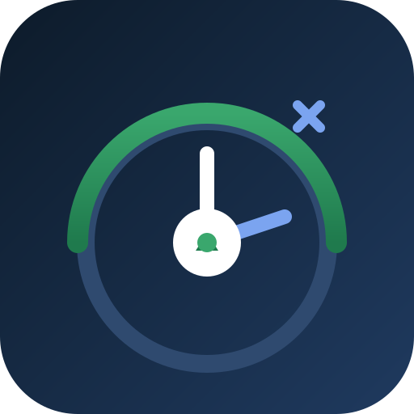

# 前端性能优化

前端性能优化的目标是用**可测量的指标**驱动改进：让页面更快加载、更快可交互、更流畅运行，并通过监控与性能预算防止回归。本专题从指标、加载、资源、运行时、构建、监控到实战，形成完整的优化方法论。

参考基线：Core Web Vitals 2026 年标准（LCP ≤ 2.5s、INP ≤ 200ms、CLS ≤ 0.1），构建工具以 Vite 生态为主。

- [性能指标与评估](Metrics/index.md)
- [加载优化](Loading/index.md)
- [资源优化：图片、字体与代码](Resources/index.md)
- [运行时优化](Runtime/index.md)
- [构建优化与体积预算](Build/index.md)
- [监控与性能预算](Monitoring/index.md)
- [实战：性能优化全流程](Practice/index.md)
- [常见问题与最佳实践](FAQ/index.md)
