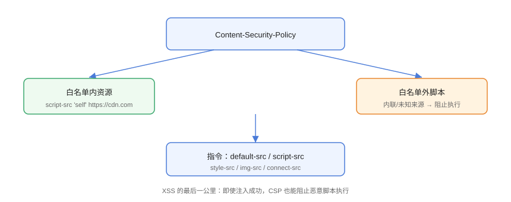

# CSP 内容安全策略

CSP（Content Security Policy，内容安全策略）通过响应头声明「页面允许加载/执行哪些来源的资源」，让浏览器在**资源加载层**拦截恶意脚本与注入。它是 XSS 防御的最后一公里。

## 工作方式



```http
Content-Security-Policy: default-src 'self'; script-src 'self'
```

含义：所有资源默认只允许同源；脚本只允许同源。白名单外的内联脚本、外部脚本一律阻止。

## 常用指令

| 指令 | 控制对象 |
| --- | --- |
| `default-src` | 未单独声明时的兜底来源 |
| `script-src` | 脚本（最关键的指令） |
| `style-src` | 样式与内联 style |
| `img-src` | 图片来源 |
| `connect-src` | fetch / XHR / WebSocket |
| `font-src` | 字体来源 |
| `frame-src` / `frame-ancestors` | 可被嵌入的 iframe / 允许嵌入本页的站点 |
| `object-src` | `<object>` / `<embed>`（建议 `'none'`） |
| `base-uri` | `<base>` 标签来源 |
| `form-action` | 表单提交目标 |

## 基础配置示例

```http
Content-Security-Policy:
  default-src 'self';
  script-src 'self' https://cdn.example.com;
  style-src 'self' 'unsafe-inline';
  img-src 'self' data: https://img.example.com;
  connect-src 'self' https://api.example.com;
  object-src 'none';
  base-uri 'self';
  frame-ancestors 'none';
```

::: danger 不要轻易用 'unsafe-inline'
`script-src 'unsafe-inline'` 会让内联脚本全部放行，等于**关闭了 CSP 对 XSS 的主要拦截能力**。现代推荐「严格 CSP」：nonce 或 hash 代替 unsafe-inline。
:::

## 严格 CSP：nonce

为每个响应生成随机 nonce，只有带正确 nonce 的脚本才执行：

```http
Content-Security-Policy: script-src 'nonce-随机值' 'strict-dynamic'
```

```html
<script nonce="随机值">
  // 只允许带 nonce 的脚本执行
  initApp();
</script>
```

```javascript
// 服务端每次响应生成新 nonce（伪代码）
const nonce = crypto.randomBytes(16).toString('base64');
res.setHeader('Content-Security-Policy',
  `script-src 'nonce-${nonce}' 'strict-dynamic'`);
```

`'strict-dynamic'` 允许被 nonce 脚本动态加载的脚本也放行（CSP Level 3，2024 年后主流浏览器广泛支持），解决 SPA 动态加载脚本被 CSP 拦截的问题。

## 上报模式：Report-Only

上线前先用「只报告不拦截」模式收集违规，避免误伤业务：

```http
Content-Security-Policy-Report-Only:
  default-src 'self'; script-src 'self';
  report-uri /csp-report;
  report-to csp-endpoint
```

```javascript
// 浏览器向 report-uri 发送 JSON 违规报告
{
  "csp-report": {
    "document-uri": "https://example.com/",
    "violated-directive": "script-src",
    "blocked-uri": "https://evil.com/x.js"
  }
}
```

## 各框架接入

### VitePress / 静态站点

```javascript
// 以 VitePress config 为例：插入 meta 标签（或用服务器响应头）
// .vitepress/config.mts
export default defineConfig({
  head: [
    ['meta', {
      'http-equiv': 'Content-Security-Policy',
      content: "default-src 'self'; img-src 'self' data:; style-src 'self' 'unsafe-inline'",
    }],
  ],
});
```

::: warning 静态站点的坑
VitePress 等构建产物含内联脚本与样式，`'unsafe-inline'` 往往不可避免；**生产建议在网关/CDN 层设置 CSP 响应头**并用 `Report-Only` 逐步收紧，meta 方式能力有限。
:::

### Express / Koa

```javascript
// 使用 helmet 快速配置
import helmet from 'helmet';

app.use(helmet.contentSecurityPolicy({
  directives: {
    "default-src": ["'self'"],
    "script-src": ["'self'"],
  },
}));
```

### Nginx

```nginx
add_header Content-Security-Policy
  "default-src 'self'; script-src 'self'; img-src 'self' data:;"
  always;
```

## 易错点与最佳实践

::: danger 常见坑
1. **`'unsafe-inline'` 开在 script-src**：CSP 形同虚设。
2. **CDN/第三方脚本未加白名单**：上线后控制台报错、功能异常——先 `Report-Only`。
3. **nonce 复用**：nonce 必须每次响应随机，否则攻击者可通过固定 nonce 绕过。
4. **`frame-ancestors` 与 X-Frame-Options 混用**：前者是 CSP 指令（更细），后者是单独响应头，可只用一个。
5. **meta 标签不支持 `report-uri` 等部分指令**：完整能力需响应头方式。
:::

::: tip 最佳实践
- 默认 `default-src 'self'`，逐项放行；
- 有内联脚本需求的 SPA 用 nonce + `strict-dynamic`；
- 先 `Content-Security-Policy-Report-Only` 观察 2~4 周，再切换为强制模式；
- 用 [CSP Evaluator](https://csp-evaluator.withgoogle.com/) 检查策略有效性。
:::

## 验证方式

1. 打开带 CSP 的页面，在控制台执行 `eval('1')`，确认被 CSP 阻止并输出违规信息；
2. 用 `Report-Only` 模式访问正常业务路径，收集违规报告，逐个确认是「误报」还是「真实风险」；
3. 用 Google CSP Evaluator 输入策略，确认无 `'unsafe-inline'` 等警告；
4. 用 securityheaders.com 或 curl 查看响应头，确认策略已生效。

## 参考资料

- [MDN：Content-Security-Policy](https://developer.mozilla.org/zh-CN/docs/Web/HTTP/Reference/Headers/Content-Security-Policy)
- [OWASP：CSP 速查表](https://cheatsheetseries.owasp.org/cheatsheets/Content_Security_Policy_Cheat_Sheet.html)
- [Google CSP Evaluator](https://csp-evaluator.withgoogle.com/)
