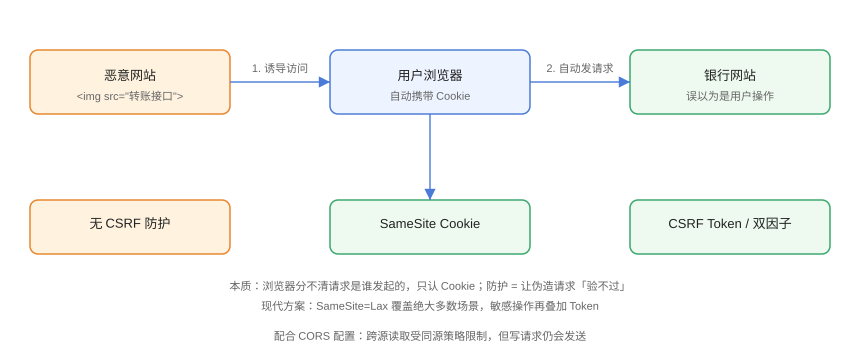

# CSRF 跨站请求伪造

CSRF（Cross-Site Request Forgery，跨站请求伪造）利用浏览器「自动携带 Cookie」的机制，在用户已登录状态下，让恶意网站**伪造用户请求**提交到目标站点（转账、改密、发帖）。

## 攻击流程



```html
<!-- 恶意网站页面中的攻击载荷 -->

```

当用户访问恶意页面时，浏览器自动向银行接口发起请求，并**自动携带银行的 Cookie**——银行无法区分这是用户本人操作还是伪造请求。

::: tip 为什么 CSRF 能「跨站」？
同源策略限制的是**读取**跨源响应，不限制发送请求；``、表单、链接天然可以跨站发起。核心问题：Cookie 是浏览器自动带的，站点无法通过 Cookie 判断「用户是否自愿操作」。
:::

## 现代默认防护：SameSite

现代浏览器（Chrome 80+ 起）对未显式设置的 Cookie 默认 `SameSite=Lax`，跨站请求不再自动携带 Cookie，**大部分 CSRF 已被默认缓解**。

| SameSite 值 | 行为 | 适用 |
| --- | --- | --- |
| `Lax` | 跨站「安全方法」（GET 导航）携带，跨站 POST 不携带 | 默认推荐 |
| `Strict` | 所有跨站请求都不携带 | 高安全要求（可能影响外链跳转登录态） |
| `None` | 跨站携带，必须配 `Secure` | 第三方嵌入场景，需配合其他防护 |

```javascript
// 服务端显式设置（不要依赖默认值）
res.cookie('session', token, {
  httpOnly: true,
  secure: true,
  sameSite: 'lax',
});
```

::: warning Firefox 差异提示
Firefox 曾默认启用 `laxByDefault`，近期版本行为有调整；**显式设置 SameSite 属性**是跨浏览器一致的稳妥做法。
:::

## 传统方案：CSRF Token

```html
<!-- 服务端在表单中嵌入一次性 Token -->
<form action="/transfer" method="post">
  <input type="hidden" name="_csrf" value="随机不可预测的Token">
  <input name="amount">
  <button>转账</button>
</form>
```

服务端校验：

```javascript
// 服务端：校验请求携带的 Token 与会话中的一致
if (req.body._csrf !== req.session.csrfToken) {
  return res.status(403).json({ error: 'CSRF 校验失败' });
}
```

原理：恶意站点无法读取目标站点的 Token（同源策略），自然无法在伪造请求中带上正确的值。

## 前端配合要点

```javascript
// 前端：自定义请求头携带 Token（Fetch 示例）
const csrfToken = document.querySelector('meta[name="csrf-token"]').content;

await fetch('/api/transfer', {
  method: 'POST',
  headers: {
    'Content-Type': 'application/json',
    'X-CSRF-Token': csrfToken,
  },
  body: JSON.stringify({ amount: 100 }),
});
```

## 请求方法规范

| 请求类型 | 规范 |
| --- | --- |
| `GET` | 只读，禁止执行写操作 |
| `POST` | 写操作，配合 Token/SameSite |
| `PUT` / `DELETE` | 写操作，同样防护 |

::: danger GET 不要做写操作
`GET /delete?id=1` 这类接口，图片标签、预加载、爬虫都可能触发，属于「设计即漏洞」。写操作一律用 POST/PUT/DELETE。
:::

## 易错点与最佳实践

::: danger 常见坑
1. **只依赖 `Origin`/`Referer` 校验**：部分场景 Referer 缺失（HTTPS→HTTP、隐私设置），应作为辅助而非唯一防线。
2. **JSON 请求以为天然安全**：`text/plain` 的 JSON 也能被表单方式发送，仍需 Token。
3. **SameSite=None 场景忘补防护**：第三方嵌入必须叠加 Token 或双重提交 Cookie。
4. **Token 复用不轮换**：登录后、敏感操作后应更换 Token。
5. **CORS 配置过宽**：`Access-Control-Allow-Origin: *` + 凭据同时开启是危险组合。
:::

::: tip 最佳实践
- 现代应用：`SameSite=Lax/Strict` + 敏感操作 CSRF Token + 请求方法规范；
- 框架内置：Spring Security、Laravel、Django 均有 CSRF 中间件，默认开启；
- 双重提交 Cookie（Double Submit）：Token 放 Cookie 与请求体，服务端比对两者一致即可，无需服务端存储。
:::

## 验证方式

1. 打开两个站点（A 为业务站，B 为恶意页），在 B 中构造 `` 攻击载荷；
2. 在 A 已登录且 Cookie 为 `SameSite=None` 时，请求被接受（证明漏洞存在）；
3. 将 Cookie 改为 `SameSite=Lax` 或开启 Token 校验，重试确认请求被拒绝（403）；
4. 检查浏览器 Network 面板的 Cookie 请求头是否携带。

## 参考资料

- [OWASP：CSRF 速查表](https://cheatsheetseries.owasp.org/cheatsheets/Cross-Site_Request_Forgery_Prevention_Cheat_Sheet.html)
- [MDN：SameSite Cookie](https://developer.mozilla.org/zh-CN/docs/Web/HTTP/Reference/Headers/Set-Cookie)
- [OWASP：双重提交 Cookie](https://cheatsheetseries.owasp.org/cheatsheets/Cross-Site_Request_Forgery_Prevention_Cheat_Sheet.html#double-submit-cookie)
