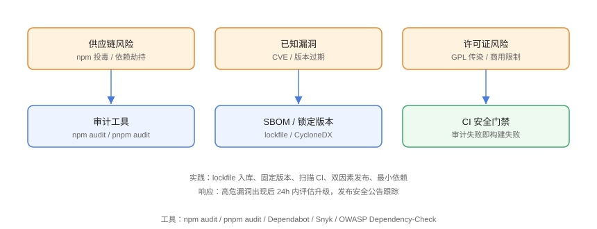

# 依赖与供应链安全

现代前端项目 80% 以上的代码来自依赖包。**供应链攻击**（npm 投毒、依赖劫持、已知漏洞未修复）已成为 OWASP Top 10 前三风险。本页覆盖依赖审计、锁定、门禁与响应流程。

## 供应链风险



| 风险 | 示例 |
| --- | --- |
| 恶意包投毒 | 仿冒包名（`event-stream` 事件、`ua-parser-js` 后门） |
| 已知漏洞未升级 | 旧版本含 CVE，长期不更新 |
| 依赖劫持 | 维护者账号被盗、发包被替换 |
| 许可证风险 | GPL 传染、商用限制 |
| 传递依赖失控 | 一个包间接引入上百个包，难以审计 |

## 锁定依赖版本

```bash
# 提交 lockfile（pnpm-lock.yaml / package-lock.json / yarn.lock）
# lockfile 记录每个传递依赖的精确版本与完整性哈希
pnpm install --frozen-lockfile   # CI 中严格按锁文件安装
```

```json
// package.json：生产依赖避免大范围版本区间
{
  "dependencies": {
    "axios": "1.7.9",          // 精确版本
    "vue": "^3.4.0"            // 也可用受控区间，配合 lockfile
  }
}
```

::: danger 不要忽略 lockfile
lockfile 不入库 = 每次安装结果不可复现 = 供应链风险失控。**lockfile 必须提交**，CI 用 `--frozen-lockfile` 安装。
:::

## 依赖审计

```bash
# npm
npm audit
npm audit fix

# pnpm
pnpm audit
pnpm audit --audit-level=high    # 只关注高危及以上

# 查看指定包安全信息
pnpm audit --prod
```

输出示例：

```text
┌───────────────┬──────────────────────────────────────────────┐
│ High          │ Regular Expression Denial of Service         │
├───────────────┼──────────────────────────────────────────────┤
│ Package       │ semver                                        │
│ Patched in    │ >=7.5.2                                      │
│ Dependency of │ vite [dev]                                    │
└───────────────┴──────────────────────────────────────────────┘
```

## CI 安全门禁

```yaml
# .github/workflows/security.yml
name: Dependency Audit
on:
  push:
  schedule:
    - cron: "0 2 * * 1"   # 每周一凌晨

jobs:
  audit:
    runs-on: ubuntu-latest
    steps:
      - uses: actions/checkout@v6
      - uses: pnpm/action-setup@v5
        with:
          version: 9
      - uses: actions/setup-node@v6
        with:
          node-version: 24
      - run: pnpm install --frozen-lockfile
      - name: Audit dependencies
        run: pnpm audit --audit-level=high
```

高危漏洞存在时构建失败，阻止上线。

## Dependabot 自动升级

GitHub 内置 Dependabot 自动扫描并提 PR：

```yaml
# .github/dependabot.yml
version: 2
updates:
  - package-ecosystem: "npm"
    directory: "/"
    schedule:
      interval: "weekly"
    open-pull-requests-limit: 10
    ignore:
      - dependency-name: "vitepress"
        update-types: ["version-update:semver-major"]
```

## 最小依赖原则

```bash
# 检查依赖树与体积
pnpm why <package>
pnpm list --depth 0

# 移除未使用依赖
pnpm remove <package>
```

::: tip 依赖纪律
1. 能用平台 API 就不引库（`fetch` 代替 axios？按需取舍）；
2. 新引入依赖前审查：维护活跃度、star、最近发布时间、许可证；
3. devDependencies 与 dependencies 严格区分；
4. 定期 `pnpm outdated` 评估升级。
:::

## SBOM 与软件成分分析

```bash
# 生成 SBOM（CycloneDX 格式）
npx @cyclonedx/cyclonedx-npm --output-file sbom.json
```

SBOM（软件物料清单）列出所有组件与版本，配合 SCA 工具持续扫描：

| 工具 | 类型 |
| --- | --- |
| GitHub Dependabot / CodeQL | 集成到 GitHub |
| Snyk | 漏洞 + 许可证扫描 |
| OWASP Dependency-Check | 开源扫描器 |
| Socket.dev | npm 恶意包检测 |

## 易错点与最佳实践

::: danger 常见坑
1. **不提交 lockfile**：构建不可复现，风险不可控。
2. **`npm audit fix` 盲目执行**：可能破坏性升级（major），先看 `npm audit` 详情再决定。
3. **生产依赖装了 dev 包**：`--production` 安装时不含 devDependencies，构建产物要裁剪。
4. **忽略传递依赖**：`pnpm audit` 会覆盖，但要留意 `overrides` 用于强制修复无法升级的传递依赖。
5. **漏洞响应慢**：高危 CVE 发布后应 24h 内评估，紧急修复走发布流程。
:::

::: tip 最佳实践
- 审计纳入 CI 门禁 + 定期计划任务双保险；
- 重大漏洞（如原型污染、RCE）优先处理，先升到修复版本再回归测试；
- 私有 npm 源（Verdaccio/私有 registry）同样要接入扫描；
- 关注 [GitHub Advisory Database](https://github.com/advisories) 与 [npm 安全公告](https://www.npmjs.com/advisories)。
:::

## 验证方式

```shell
pnpm audit
pnpm outdated
pnpm why lodash
```

预期：审计无 high/critical 漏洞；`outdated` 列出可升级依赖；`why` 显示依赖引入路径。故意在 package.json 引入一个已知漏洞旧版本，确认 `pnpm audit` 能检出并给出修复版本。

## 参考资料

- [npm audit 文档](https://docs.npmjs.com/cli/v10/commands/npm-audit)
- [pnpm audit 文档](https://pnpm.io/cli/audit)
- [GitHub Dependabot 文档](https://docs.github.com/zh/code-security/dependabot)
- [OWASP Dependency-Check](https://owasp.org/www-project-dependency-check/)
- [GitHub Advisory Database](https://github.com/advisories)
