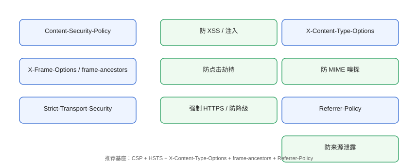

# 安全响应头

安全响应头是**零成本**的基础防护：一行配置，浏览器就帮你拦截一类攻击。推荐基座包含 CSP、HSTS、X-Content-Type-Options、frame-ancestors 与 Referrer-Policy，配合 CORS 与 Cookie 属性形成完整防线。

## 推荐基座



```http
Content-Security-Policy: default-src 'self'; frame-ancestors 'none'
Strict-Transport-Security: max-age=31536000; includeSubDomains
X-Content-Type-Options: nosniff
Referrer-Policy: strict-origin-when-cross-origin
Permissions-Policy: camera=(), microphone=(), geolocation=()
```

| 响应头 | 作用 |
| --- | --- |
| `Content-Security-Policy` | 资源白名单，防 XSS/注入（详见 [CSP](../CSP/index.md)） |
| `Strict-Transport-Security` | 强制 HTTPS，防降级（详见 [HTTPS](../Https/index.md)） |
| `X-Content-Type-Options: nosniff` | 禁止 MIME 嗅探，防类型混淆攻击 |
| `X-Frame-Options` / `frame-ancestors` | 禁止/限制被 iframe 嵌入，防点击劫持 |
| `Referrer-Policy` | 控制请求携带的 Referrer，防来源泄露 |
| `Permissions-Policy` | 限制摄像头、定位等浏览器权限 |

## X-Frame-Options 与 frame-ancestors

```http
# 传统方式：只能设 DENY / SAMEORIGIN
X-Frame-Options: DENY
X-Frame-Options: SAMEORIGIN

# 现代方式：CSP frame-ancestors 更灵活（可多站点、可覆盖子域）
Content-Security-Policy: frame-ancestors 'self' https://partner.example.com
```

::: tip 点击劫持
攻击者用透明 iframe 覆盖诱饵页面，诱导用户「点错」触发敏感操作。`frame-ancestors 'none'`（不允许被任何站点嵌入）是默认推荐。
:::

## Referrer-Policy

```http
Referrer-Policy: strict-origin-when-cross-origin
```

| 值 | 行为 |
| --- | --- |
| `no-referrer` | 不携带任何来源信息（最严格） |
| `same-origin` | 同源携带完整地址，跨源不携带 |
| `strict-origin-when-cross-origin` | **推荐默认**：同源完整、跨源仅 origin、HTTPS→HTTP 不携带 |
| `unsafe-url` | 总是携带完整 URL（危险，避免使用） |

## Permissions-Policy

```http
Permissions-Policy: camera=(), microphone=(), geolocation=(), payment=()
```

限制页面（含第三方 iframe）使用敏感浏览器能力，减少恶意脚本可利用面。

## CORS 配置

```http
# 正确：精确来源 + 有凭据
Access-Control-Allow-Origin: https://app.example.com
Access-Control-Allow-Credentials: true

# 错误：通配符 + 凭据（危险组合）
Access-Control-Allow-Origin: *
Access-Control-Allow-Credentials: true
```

```nginx
# Nginx 示例：按来源精确放行
add_header Access-Control-Allow-Origin "https://app.example.com" always;
add_header Access-Control-Allow-Methods "GET, POST, PUT, DELETE, OPTIONS" always;
add_header Access-Control-Allow-Headers "Content-Type, Authorization, X-CSRF-Token" always;
```

::: danger CORS 与 CSRF 的边界
CORS 控制「浏览器是否允许前端代码读取跨源响应」；CSRF 关注「跨源请求是否会被当作本人操作」。两者都要管：CORS 别开 `*`，CSRF 靠 SameSite/Token。
:::

## Cookie 安全属性

```http
Set-Cookie: session=abc123; HttpOnly; Secure; SameSite=Lax; Path=/; Max-Age=604800
```

| 属性 | 作用 |
| --- | --- |
| `HttpOnly` | 脚本无法读取，防 XSS 窃取会话 |
| `Secure` | 仅 HTTPS 传输 |
| `SameSite` | 防 CSRF（Lax/Strict） |
| `Max-Age` / `Expires` | 生命周期（会话 Cookie 慎用） |
| `Domain` / `Path` | 作用范围最小化 |

## 各平台配置

### Nginx

```nginx
add_header Content-Security-Policy "default-src 'self'" always;
add_header Strict-Transport-Security "max-age=31536000" always;
add_header X-Content-Type-Options "nosniff" always;
add_header Referrer-Policy "strict-origin-when-cross-origin" always;
add_header X-Frame-Options "DENY" always;
```

### Express（helmet）

```javascript
import helmet from 'helmet';
app.use(helmet());   // 默认包含推荐响应头，可再定制
```

### VitePress（静态站点）

```typescript
// .vitepress/config.mts
export default defineConfig({
  head: [
    ['meta', { 'http-equiv': 'X-Content-Type-Options', content: 'nosniff' }],
    ['meta', { 'http-equiv': 'Referrer-Policy', content: 'strict-origin-when-cross-origin' }],
  ],
});
```

::: warning meta 的局限
meta 标签只能表达部分响应头（CSP、X-Content-Type-Options 等），HSTS、CORS 等必须由服务器/网关设置。生产环境一律在网关层配置。
:::

## 易错点与最佳实践

::: danger 常见坑
1. **`*` + 凭据组合**：浏览器直接拒绝，且语义危险。
2. **HSTS 在 HTTP 上配置**：不生效，必须在 HTTPS 响应中。
3. **`X-Frame-Options` 与 `frame-ancestors` 冲突**：两者同时设置时后者覆盖，但旧浏览器只认前者，建议按目标浏览器取舍。
4. **Referrer-Policy 太松**：`unsafe-url` 会泄露完整 URL（含 Token 参数）。
5. **响应头重复/缺失**：多级代理叠加时用 `add_header ... always` 确保透传。
:::

::: tip 最佳实践
- 用 securityheaders.com 检查评级，目标 A+；
- 响应头统一在网关/CDN 层配置，避免每个应用重复；
- 改动后跑一遍回归：支付回调、第三方登录等依赖 Referrer/Origin 的场景要重点验证。
:::

## 验证方式

```shell
curl -sI https://example.com | grep -iE "content-security|strict-transport|x-content-type|referrer-policy|x-frame"
```

预期能同时看到推荐基座各响应头。用 [securityheaders.com](https://securityheaders.com/) 输入域名，评级应达到 A 以上。

## 参考资料

- [OWASP：安全响应头速查表](https://owasp.org/www-project-secure-headers/)
- [MDN：X-Frame-Options](https://developer.mozilla.org/zh-CN/docs/Web/HTTP/Reference/Headers/X-Frame-Options)
- [MDN：Referrer-Policy](https://developer.mozilla.org/zh-CN/docs/Web/HTTP/Reference/Headers/Referrer-Policy)
- [securityheaders.com](https://securityheaders.com/)
