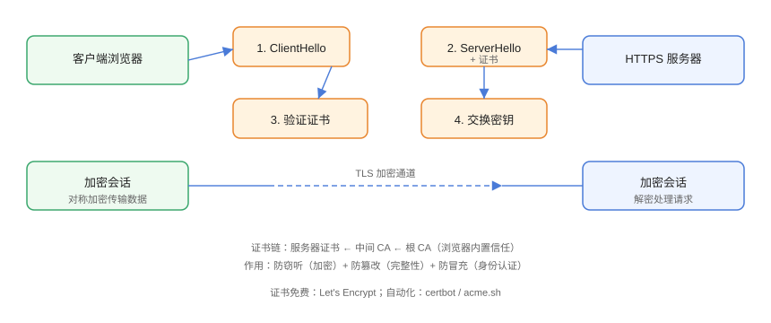

# HTTPS 与证书

HTTPS（HTTP over TLS）在 HTTP 与 TCP 之间加入 TLS 加密层，解决三大问题：**防窃听**（加密）、**防篡改**（完整性）、**防冒充**（身份认证）。现代 Web 默认强制 HTTPS，涉及登录、支付、Cookie 的站点更是硬性要求。

## TLS 握手



简化流程：

1. 客户端发送 `ClientHello`（支持的加密套件、TLS 版本）；
2. 服务端返回 `ServerHello` 与**证书**；
3. 客户端验证证书链（是否受信任、域名是否匹配、是否过期）；
4. 双方通过密钥交换算法协商会话密钥；
5. 之后数据用会话密钥对称加密传输。

## 证书验证

浏览器验证三件事：

| 检查项 | 失败后果 |
| --- | --- |
| 证书是否由受信任 CA 签发（证书链） | 显示「不安全」 |
| 域名是否与证书 SAN 匹配 | 显示「不安全」 |
| 是否在有效期内、是否被吊销 | 显示「不安全」 |

```shell
# 用 openssl 查看站点证书链
openssl s_client -connect example.com:443 -servername example.com
```

输出中可看到证书链：`s:（服务器证书）` → `i:（签发者）`，逐级到根证书。

## 证书类型

| 类型 | 验证级别 | 适用 |
| --- | --- | --- |
| DV（域名验证） | 验证域名控制权 | 绝大多数网站 |
| OV（组织验证） | 额外验证企业身份 | 企业官网 |
| EV（扩展验证） | 最高等级（地址栏显示公司名） | 金融等（趋势：逐步并入 OV） |

证书按覆盖域名分：

- **单域名**：`example.com`
- **多域名（SAN）**：一张证书多个域名
- **通配符**：`*.example.com`（不含根域）

## 免费证书：Let's Encrypt

```bash
# 安装 certbot 并签发（以 Nginx 为例）
sudo apt install certbot python3-certbot-nginx
sudo certbot --nginx -d example.com -d www.example.com

# 自动续期（Let's Encrypt 证书有效期 90 天）
sudo certbot renew --dry-run
```

::: tip 证书到期监控
证书过期是线上事故高发原因。用 `crontab` 定期续期 + 监控（UptimeRobot、certbot 日志、`openssl s_client` 脚本）双保险。
:::

## HSTS 强制 HTTPS

`Strict-Transport-Security` 告诉浏览器「一段时间内只允许 HTTPS 访问本站」，防降级攻击：

```http
Strict-Transport-Security: max-age=31536000; includeSubDomains; preload
```

```nginx
# Nginx 配置
add_header Strict-Transport-Security
  "max-age=31536000; includeSubDomains" always;
```

::: danger HSTS 的坑
1. 只在 HTTPS 响应中设置才生效；
2. `preload` 提交后**无法短时间撤回**（浏览器预载清单最长 60 天），先在测试环境验证；
3. 内网 IP、HTTP 站不要设置 HSTS。
:::

## 前端接入要点

```javascript
// 前端：强制跳转 HTTPS（弱方案，正式以服务器 301/HSTS 为准）
if (location.protocol === 'http:' && location.hostname !== 'localhost') {
  location.replace('https://' + location.host + location.pathname + location.search);
}
```

```html
<!-- 混合内容（HTTP 资源在 HTTPS 页面）会被浏览器拦截 -->
<!-- 错误：http 图片/脚本 -->

<!-- 正确：https 或协议相对 -->

```

::: warning 混合内容
HTTPS 页面加载 HTTP 资源属于混合内容：脚本/iframe 被**直接拦截**，图片/音频降级并显示警告。全站统一 HTTPS 后再接 CDN 也要用 HTTPS。
:::

## 易错点与最佳实践

::: danger 常见坑
1. **证书链不完整**：只配置服务器证书漏掉中间证书，部分客户端校验失败。
2. **TLS 版本过旧**：禁用 TLS 1.0/1.1（2021 年后浏览器已默认禁止），用 TLS 1.2/1.3。
3. **HSTS 设错域名**：`includeSubDomains` 会把子域也强制 HTTPS，未就绪的子域会挂。
4. **自签名证书用于生产**：只适合本地开发，生产必须 CA 签发。
5. **Cookie 没加 Secure**：HTTPS 下仍可能被 HTTP 传输（配合 HSTS 缓解）。
:::

::: tip 最佳实践
- 全站 HTTP → HTTPS 301 跳转 + HSTS；
- Cookie 一律 `Secure` + `HttpOnly`；
- 用 `https://` 或协议相对 URL 引用所有资源；
- 定期用 SSL Labs / `curl -vI` 检查配置评级。
:::

## 验证方式

```shell
# 检查响应头与证书
curl -vI https://example.com

# 检查 HSTS 与证书有效期
curl -sI https://example.com | grep -i strict
openssl s_client -connect example.com:443 -servername example.com \
  </dev/null 2>/dev/null | openssl x509 -noout -dates
```

用浏览器打开站点，确认地址栏锁标识；用 [SSL Labs](https://www.ssllabs.com/ssltest/) 评分应达到 A 以上。

## 参考资料

- [MDN：HTTPS](https://developer.mozilla.org/zh-CN/docs/Glossary/HTTPS)
- [MDN：混合内容](https://developer.mozilla.org/zh-CN/docs/Web/Security/Mixed_content)
- [Let's Encrypt 官方文档](https://letsencrypt.org/zh-cn/docs/)
- [SSL Labs](https://www.ssllabs.com/ssltest/)
