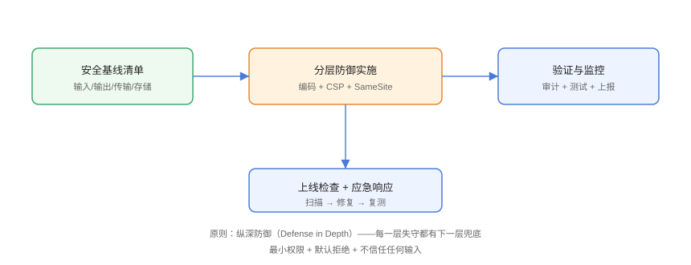

# 实战：安全基线落地

把前面的知识点整合成一份可执行的安全基线：从**代码规范、依赖门禁、响应头、Cookie、HTTPS** 到**上线检查与应急响应**，按步骤落地到一个真实前端项目（Vite + Vue/React 均可）。

## 安全基线清单



### 1. 输入输出规范

```javascript
// Practice/sanitize.js
import DOMPurify from 'dompurify';

export function renderSafeHtml(container, html) {
  container.innerHTML = DOMPurify.sanitize(html, {
    ALLOWED_TAGS: ['p', 'b', 'i', 'a', 'ul', 'ol', 'li', 'img', 'code', 'pre'],
    ALLOWED_ATTR: ['href', 'src', 'alt', 'title'],
  });
}

// 文本一律 textContent；富文本一律过 DOMPurify
```

### 2. 请求封装（防 CSRF 与超时）

```javascript
// Practice/http.js
const csrfToken = document.querySelector('meta[name="csrf-token"]')?.content ?? '';

export async function request(url, options = {}) {
  const res = await fetch(url, {
    credentials: 'same-origin',
    headers: {
      'Content-Type': 'application/json',
      'X-CSRF-Token': csrfToken,
      ...options.headers,
    },
    ...options,
  });
  if (!res.ok) throw new Error(`请求失败：${res.status}`);
  return res.json();
}
```

### 3. Cookie 与会话

```javascript
// 服务端设置（以 Express 为例）
res.cookie('session', token, {
  httpOnly: true,
  secure: process.env.NODE_ENV === 'production',
  sameSite: 'lax',
  maxAge: 7 * 24 * 3600 * 1000,
});

// 前端不要用 localStorage 存敏感 Token
// 会话态走 HttpOnly Cookie；CSRF Token 走 meta 标签
```

::: danger 不要把敏感 Token 存 localStorage
localStorage 无 HttpOnly，XSS 一读就走。会话凭证放 HttpOnly Cookie；CSRF Token 放 meta 并在请求头回传。
:::

### 4. 安全响应头（Nginx）

```nginx
# Practice/nginx-security.conf
server {
  listen 443 ssl;
  server_name example.com;

  ssl_certificate     /etc/letsencrypt/live/example.com/fullchain.pem;
  ssl_certificate_key /etc/letsencrypt/live/example.com/privkey.pem;
  ssl_protocols       TLSv1.2 TLSv1.3;

  add_header Content-Security-Policy
    "default-src 'self'; script-src 'self'; style-src 'self' 'unsafe-inline';
     img-src 'self' data:; connect-src 'self'" always;
  add_header Strict-Transport-Security
    "max-age=31536000; includeSubDomains" always;
  add_header X-Content-Type-Options "nosniff" always;
  add_header Referrer-Policy "strict-origin-when-cross-origin" always;
  add_header X-Frame-Options "DENY" always;

  # HTTP → HTTPS
  if ($scheme = http) {
    return 301 https://$host$request_uri;
  }
}
```

### 5. 依赖审计 CI

```yaml
# .github/workflows/security.yml
name: Security Checks
on:
  push:
  pull_request:
  schedule:
    - cron: "0 2 * * 1"

jobs:
  audit:
    runs-on: ubuntu-latest
    steps:
      - uses: actions/checkout@v6
      - uses: pnpm/action-setup@v5
        with: { version: 9 }
      - uses: actions/setup-node@v6
        with: { node-version: 24, cache: pnpm }
      - run: pnpm install --frozen-lockfile
      - run: pnpm audit --audit-level=high
      - run: npx @cyclonedx/cyclonedx-npm --output-file sbom.json
      - uses: actions/upload-artifact@v4
        with:
          name: sbom
          path: sbom.json
```

## 上线检查表

| 检查项 | 命令/工具 | 通过标准 |
| --- | --- | --- |
| HTTPS 与证书 | `curl -vI` / SSL Labs | 评级 A 以上 |
| 安全响应头 | securityheaders.com | A 以上 |
| CSP 有效性 | Google CSP Evaluator | 无 unsafe-inline 警告 |
| 依赖漏洞 | `pnpm audit` | 无 high/critical |
| XSS 冒烟 | 手动注入测试 | 恶意脚本不执行 |
| CSRF 冒烟 | 跨站伪造请求测试 | 403/拒绝 |
| 敏感信息泄露 | `rg -i "password\|secret\|token"` | 无硬编码 |
| 混合内容 | DevTools Console | 无 mixed content 警告 |

## 应急响应流程

```text
1. 发现/报告漏洞
2. 评估影响面（哪些版本、哪些用户、能否利用）
3. 修复：升级依赖 / 补丁 / 临时封禁
4. 回归测试 + 灰度发布
5. 复盘：根因、同类问题排查、流程改进
6. 记录到安全文档，纳入基线检查
```

::: tip 常见漏洞响应时间
- 高危可利用（RCE/任意文件读取）：**24 小时内**出修复方案；
- 中危（XSS/CSRF 局部）：**一周内**修复；
- 低危/加固项：纳入迭代排期。
:::

## 易错点与最佳实践

::: danger 常见坑
1. **只做前端防御**：后端校验/授权才是底线，前端是「用户体验层的纵深」。
2. **安全配置只做一次**：依赖、证书、响应头都会过期，必须有监控与例行巡检。
3. **测试环境与生产配置不同**：`secure: true` 等只在生产生效，测试要覆盖「生产模式」验证。
4. **CSP 一步到位太激进**：先 Report-Only，误报清零后再强制。
5. **不记录安全事件**：没有日志与复盘，同类问题会重复发生。
:::

::: tip 最佳实践
- 把基线做成**模板仓库 / 脚手架默认配置**，新项目开箱即安全；
- 安全巡检加入周计划任务（自动化扫描 + 人工抽查）；
- 参考 OWASP ASVS（应用安全验证标准）做分级检查。
:::

## 验证方式

按上线检查表逐项执行：`pnpm audit` 零高危、securityheaders.com A 级、CSP Evaluator 无警告；用浏览器手动验证恶意输入被编码、跨站伪造请求被拒绝；最后在 DevTools Console 确认无 mixed content 与 CSP 违规。

## 参考资料

- [OWASP ASVS](https://owasp.org/www-project-application-security-verification-standard/)
- [OWASP Top 10（2025）](https://owasp.org/Top10/)
- [securityheaders.com](https://securityheaders.com/)
- [Google CSP Evaluator](https://csp-evaluator.withgoogle.com/)
