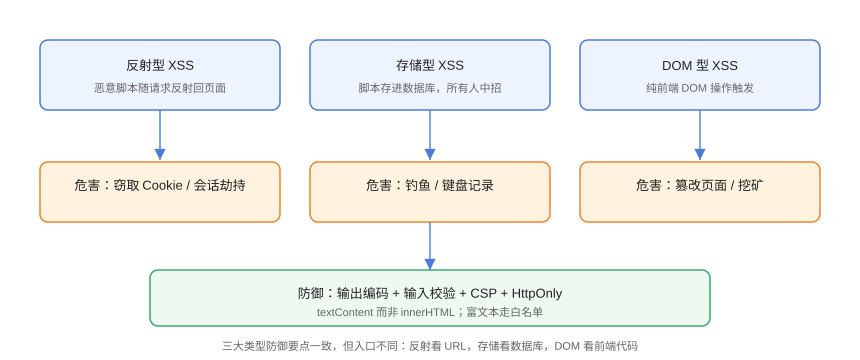

# XSS 跨站脚本

XSS（Cross-Site Scripting，跨站脚本）指攻击者把**恶意脚本注入**网页并在受害者浏览器中执行。它是 OWASP Top 10 长期在列的注入类漏洞，危害包括窃取会话、钓鱼、篡改页面。

## 三种类型



| 类型 | 触发入口 | 特征 |
| --- | --- | --- |
| 反射型 | URL 参数、搜索框 | 一次性，诱导点击链接触发 |
| 存储型 | 评论、昵称、富文本 | 持久化，所有访问者中招 |
| DOM 型 | 前端 JS 操作 DOM | 不经过服务器，纯客户端 |

## 反射型 XSS 示例

```html
<!-- XSS/reflected.html（危险写法，仅演示） -->
<input id="q" placeholder="搜索">
<div id="result"></div>

<script>
  // 危险：把 URL 参数直接插入 innerHTML
  const keyword = new URLSearchParams(location.search).get('q');
  document.getElementById('result').innerHTML = '你搜索了：' + keyword;
</script>
```

攻击者构造：

```text
https://example.com/search?q=
```

受害者点击后，`innerHTML` 把 `` 解析为可执行脚本，攻击代码在受害者浏览器运行。

## 存储型 XSS 示例

```html
<!-- XSS/stored.html（危险写法，仅演示） -->
<ul id="comments"></ul>

<script>
  // 假设来自后端：攻击者提交了 <script>...</script>
  const comments = ['正常评论', '<script>steal()<\/script>'];
  const ul = document.getElementById('comments');
  comments.forEach(c => {
    const li = document.createElement('li');
    li.innerHTML = c;            // 危险：插入脚本
    ul.appendChild(li);
  });
</script>
```

恶意评论一旦入库，所有打开页面的用户都会执行脚本——**危害最大的一种**。

## 防御：输出编码

### 正确：textContent

```javascript
// XSS/safe-text.js
// 把用户内容当「文本」插入，浏览器不会解析为标签
const el = document.getElementById('result');
el.textContent = '你搜索了：' + keyword;
```

### Vue / React 自动转义

```vue
<!-- Vue：{{ }} 自动转义，v-html 才是危险出口 -->
<template>
  <div>{{ userInput }}</div>       <!-- 安全 -->
  <div v-html="richText"></div>    <!-- 危险，必须白名单过滤 -->
</template>
```

```jsx
// React：JSX 默认转义
function App({ userInput }) {
  return <div>{userInput}</div>;         // 安全
  // return <div dangerouslySetInnerHTML={{ __html: userInput }} />;  // 危险
}
```

::: danger 高危 API 清单
- `innerHTML` / `outerHTML` / `insertAdjacentHTML`
- `document.write` / `document.writeln`
- `eval` / `new Function`
- `v-html`（Vue）与 `dangerouslySetInnerHTML`（React）

使用前必须确认内容经过**白名单过滤**（如 DOMPurify）。
:::

## 防御：输入校验与富文本

```javascript
// XSS/sanitize.js
import DOMPurify from 'dompurify';

// 富文本白名单：只保留安全标签与属性
const clean = DOMPurify.sanitize(userRichText, {
  ALLOWED_TAGS: ['p', 'b', 'i', 'a', 'ul', 'li', 'img'],
  ALLOWED_ATTR: ['href', 'src', 'alt'],
});
```

输入校验（服务端同样必须做）：

```javascript
// 校验而非信任：年龄必须是数字
const age = Number(input);
if (!Number.isInteger(age) || age < 0 || age > 150) {
  return reject('年龄不合法');
}
```

## 防御：Cookie HttpOnly

```javascript
// 服务端设置 Cookie（以 Express 为例）
res.cookie('session', token, {
  httpOnly: true,      // 脚本无法读取，XSS 拿不到会话
  secure: true,        // 仅 HTTPS 传输
  sameSite: 'lax',     // 防 CSRF
  maxAge: 7 * 24 * 3600 * 1000,
});
```

## 防御：CSP 兜底

即使注入成功，CSP 也能阻止脚本执行：

```http
Content-Security-Policy: default-src 'self'; script-src 'self'
```

详细配置见 [CSP 内容安全策略](../CSP/index.md)。

## 验证方式

1. 用 `innerHTML` 版本打开带恶意参数的 URL，确认弹窗/脚本执行（证明漏洞存在）；
2. 换成 `textContent` 后重试，确认恶意代码以文本显示、不执行；
3. 在 DevTools 检查会话 Cookie 是否带 `HttpOnly`；
4. 用 [DOMPurify](https://github.com/cure53/DOMPurify) 过滤富文本后插入，确认脚本被剥离。

## 参考资料

- [OWASP：XSS 速查表](https://cheatsheetseries.owasp.org/cheatsheets/Cross_Site_Scripting_Prevention_Cheat_Sheet.html)
- [MDN：XSS](https://developer.mozilla.org/zh-CN/docs/Glossary/Cross-site_scripting)
- [DOMPurify](https://github.com/cure53/DOMPurify)
