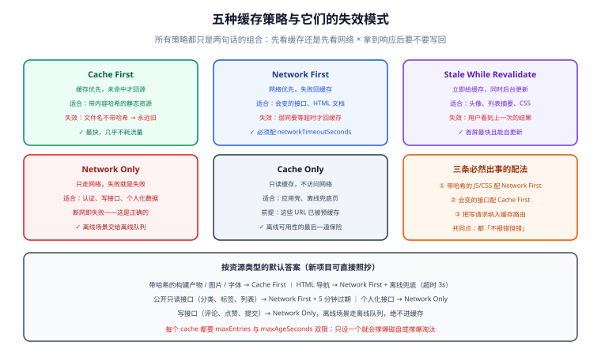

# 缓存策略：从预缓存到运行时缓存

Service Worker 的 `fetch` 拦截本身不含任何策略——它只是给了你一个「请求的决策点」。真正的工程问题是：**这条请求该走缓存还是走网络，谁先谁后，失败了怎么办。**

一句话定位：**本页给出一套两维判据（内容的新鲜度要求 × 可用性要求），把成千上万条请求归类到五种策略上，并给出可直接落地的 Workbox 配置与踩坑清单。**

## 一、五种策略与它们的失败模式

所有缓存策略都可以还原成两句话：**先看缓存还是先看网络**，**拿到响应后要不要写回缓存**。组合出来就是下面五种。



| 策略 | 方向 | 适用场景 | 失效时的表现（必须提前接受） |
| --- | --- | --- | --- |
| **Cache First** | 缓存优先，未命中才回源 | 带内容哈希的静态资源（`/assets/app-a1b2c3.js`）、字体、图片 | **永远拿旧版本**——前提是文件名带哈希，否则就是灾难 |
| **Network First** | 网络优先，失败回缓存 | 会变的接口数据、HTML 文档（不预缓存时） | 弱网下首屏要等网络超时（默认约 10s）才有内容，体验差 |
| **Stale While Revalidate** | 立即给缓存，同时更新 | 更新频率中等、旧版本可接受的资源（头像、列表摘要、CSS） | **用户看到的是上一次的结果**；连续刷两次才拿到最新 |
| **Network Only** | 只走网络 | 认证、支付、写接口、任何「必须最新」的请求 | 断网即失败——**这是正确的**，此时应该由 UI 给出明确提示 |
| **Cache Only** | 只走缓存 | 预缓存的应用壳、离线兜底页 | 缓存里没有就是失败——所以只用于你确定预缓存过的 URL |

:::danger 三种必然出事的配法
1. **把带哈希的 JS/CSS 配成 Network First**：文件名一变就是新 URL，旧 URL 永远不会再变，Network First 只是白白拖慢首屏。正确做法：**带哈希的静态资源一律 Cache First**。
2. **把接口配成 Cache First**：用户会稳定地看到过期数据，而且**没有任何错误、没有任何日志**，是最难被发现的一类 bug。正确做法：会变的接口用 Network First（或 Stale While Revalidate）并设过期时间。
3. **把写请求（`POST`/`PUT`/`DELETE`）纳入缓存路由**：缓存写请求在语义上就说不通（响应不幂等、无法重放）。正确做法：写请求一律 **Network Only**，离线场景交给[离线队列](../OfflineData/index.md)。
:::

## 二、按「资源类型」落到策略：一张对照表

这张表是本专题的默认答案，新项目可以直接照抄：

| 资源 | 策略 | 关键参数 | 理由 |
| --- | --- | --- | --- |
| 构建产物 `/_nuxt/*`、`/assets/*`（带哈希） | Cache First | `maxEntries: 200` | URL 含内容哈希，改了就是新 URL |
| HTML 文档 / 导航请求 | Network First + 离线回退 | `networkTimeoutSeconds: 3` + 兜底页 | 保证能拿到最新壳，弱网 3 秒后放弃 |
| 站点图片与字体 | Cache First | `maxEntries: 60`, `maxAgeSeconds: 30 天` | 体积大、变更少 |
| 公开只读接口（分类、标签、文章列表） | Network First | `networkTimeoutSeconds: 3`, `maxAgeSeconds: 5 分钟` | 允许短暂陈旧，但不允许长期陈旧 |
| 个人化接口（我的资料、未读计数） | Network Only | — | 缓存个人数据会串号、会泄露 |
| 写接口（评论、点赞、提交） | Network Only | — | 交给离线队列处理，不进缓存 |
| 统计/埋点上报 | Network Only（不阻塞） | — | 缓存上报数据毫无意义且会放大误差 |

## 三、Workbox 配置骨架

Workbox 有两种模式，**先选模式再写配置**：

| 模式 | 生成方式 | 适合谁 | 代价 |
| --- | --- | --- | --- |
| **`generateSW`** | 插件根据配置**生成**整个 SW，你一行 `fetch` 代码都不写 | 绝大多数项目；只要标准策略 | 无法插入自定义逻辑（要写自定义逻辑就得用下一种） |
| **`injectManifest`** | 你自己写 `sw.js`，插件只负责把**预缓存清单**注入进去 | 需要自定义路由、离线队列、推送混合逻辑 | 需要自己维护 SW 代码 |

`vite-plugin-pwa` 里两种模式的差别就是配置项名：`workbox: {...}` 对应 `generateSW`，`injectManifest: {...}` + `srcDir`/`filename` 对应 `injectManifest`。

下面是一个可直接用的 `generateSW` 配置（Vite 项目）：

```ts [vite.config.ts]
import { defineConfig } from 'vite'
import vue from '@vitejs/plugin-vue'
import { VitePWA } from 'vite-plugin-pwa'

export default defineConfig({
  plugins: [
    vue(),
    VitePWA({
      // 'prompt' = 新版本进 waiting 时提示用户（配合注册代码里的 SKIP_WAITING）
      registerType: 'prompt',
      // 注册脚本由插件注入，不用手写 register('/sw.js')
      injectRegister: 'auto',
      manifest: {
        name: '博客平台',
        short_name: '博客',
        start_url: '/',
        display: 'standalone',
        theme_color: '#2563eb',
        background_color: '#ffffff',
        icons: [
          { src: '/icons/pwa-192.png', sizes: '192x192', type: 'image/png' },
          { src: '/icons/pwa-512.png', sizes: '512x512', type: 'image/png' },
          // maskable 单独提供一份，不要用同一个文件糊弄两种用途
          { src: '/icons/maskable-512.png', sizes: '512x512', type: 'image/png', purpose: 'maskable' },
        ],
      },
      workbox: {
        // ① 预缓存：只放壳与兜底页，不放业务数据
        globPatterns: ['**/*.{js,css,html,svg,woff2}'],
        globIgnores: ['**/report.html', '**/stats.json'],
        // 单个文件超过 2MB 不进预缓存（避免 install 失败与首访流量暴涨）
        maximumFileSizeToCacheInBytes: 2 * 1024 * 1024,
        // 新版本激活时自动清理旧预缓存
        cleanupOutdatedCaches: true,
        // ② 导航请求：网络优先，3 秒超时后回离线页
        navigateFallback: '/offline.html',
        navigateFallbackDenylist: [/^\/api\//, /^\/admin\//],
        // ③ 运行时缓存
        runtimeCaching: [
          {
            urlPattern: ({ request }) => request.destination === 'image',
            handler: 'CacheFirst',
            options: {
              cacheName: 'images',
              expiration: { maxEntries: 60, maxAgeSeconds: 30 * 24 * 60 * 60 },
              cacheableResponse: { statuses: [0, 200] },
            },
          },
          {
            urlPattern: /^https?:\/\/[^/]+\/api\/v1\/(categories|tags|posts)(\/|\?|$)/,
            handler: 'NetworkFirst',
            options: {
              cacheName: 'api-public',
              networkTimeoutSeconds: 3,
              expiration: { maxEntries: 50, maxAgeSeconds: 5 * 60 },
              cacheableResponse: { statuses: [200] },
            },
          },
        ],
      },
    }),
  ],
})
```

### 配置里的四个关键点

1. **`globPatterns` 决定预缓存清单**。它按**构建产物**匹配，构建期就把带哈希的文件名写进清单——这也是为什么预缓存的 URL 天然不会过期。
2. **`maximumFileSizeToCacheInBytes` 是安全阀**。默认 2MB；一个巨大的 sourcemap 或视频封面就会让整个 `install` 失败（因为 `precacheAndRoute` 是「全成或全败」）。
3. **`navigateFallbackDenylist` 必须排除 `/api/`**。否则一个断网的接口请求会被回退成 HTML，前端 `res.json()` 抛出的错误会指向完全无关的地方。
4. **`cacheableResponse.statuses: [0, 200]` 中的 `0` 代表 opaque 响应**（跨域且无 CORS 头的图片）。这不是可选项：跨域图片不加 `0` 就永远不会被缓存（见下一节）。

## 四、导航回退：离线时到底给用户看什么

导航请求（用户在地址栏输入、点链接）是所有请求里最特殊的一类：它**不能**返回一张图片或一段 JSON，只能返回 HTML。三种做法：

| 做法 | 效果 | 取舍 |
| --- | --- | --- |
| 只预缓存壳 HTML | 离线可打开但**内容为空**，用户会以为站点坏了 | 不推荐单独使用 |
| 预缓存 + 回退到 `offline.html` | 明确告知「当前离线」，并提供「已缓存的内容入口」 | **推荐**，实现成本最低 |
| 为每个页面做离线快照 | 旧文章真的可读 | 成本最高，只对「读」为主的站点值得做 |

第三种的实现就是「把访问过的文章详情页也写进缓存」（Network First 或 Stale While Revalidate），并在离线页列出「离线可读的文章」。本项目实战页采用的就是这个折中：**离线页 + 已读文章可回看**，具体见[实战](../Practice/index.md)。

## 五、缓存键、跨域与不透明响应

Cache Storage 以**请求 URL** 为键。几个容易出错的点：

- **`Vary` 响应头会影响匹配**。如果服务端对同一个 URL 因 `Accept-Language` 返回不同内容，而缓存没考虑这一点，用户可能拿到另一种语言。做法：给这类请求显式设置 `ignoreVary: true`（当你确认内容一致时）或把区分维度写进 URL。
- **跨域 opaque 响应只能存、不能判断**。`response.ok` 为 `false`、`status` 为 `0`、读不到 body，所以「响应是否正确」根本判断不了。做法：`cacheableResponse: { statuses: [0, 200] }` —— **明确接受「可能缓存了一张 404 图」这个风险**，或改用 CORS 图片。
- **带凭据的请求默认不缓存**。SW 里对跨域请求用 `fetch(event.request)` 时若原请求 `credentials: 'include'`，写缓存策略要显式处理，否则会出现「登录后接口突然不可缓存」的困惑。

## 六、配额、过期与清理

Cache Storage 与 IndexedDB 共享同一个 **Storage 配额**（通常为磁盘可用空间的一定比例，具体由浏览器决定）。三条纪律：

1. **每个缓存都要设上限**。`maxEntries` 与 `maxAgeSeconds` **两个都要设**：只设条目数会在「小文件很多」时撑爆磁盘，只设时间会在「大文件很多」时撑爆内存淘汰。
2. **区分缓存名并按生命周期分组**：`precache`（版本驱动，`activate` 里清）、`images`（LRU）、`api-public`（时间驱动）。混在一个 cache 里就没法分别清理。
3. **`cleanupOutdatedCaches: true`** 只清理**预缓存**的旧版本；运行时缓存仍需自己用 `expiration` 管理。

## 七、验证方式

```shell
pnpm build && pnpm preview
```

1. DevTools → Application → **Cache Storage**：应看到 `workbox-precache-*`（含若干带哈希的资源）与 `images`；不应看到任何 `/api/` 写请求的响应。
2. Network 面板刷新一次，筛选 **JS**：第二次刷新时 `Size` 列应显示 `(ServiceWorker)`，且 `Time` 极短——证明命中的是缓存而非网络。
3. 勾 **Offline** 后访问一个**没有缓存过**的文章详情页：应看到 `offline.html` 的离线提示，而不是浏览器错误页。
4. 修改某个接口返回内容，再次刷新：**公开接口应看到新数据**（Network First 生效）；这一步是「缓存没有吃掉业务数据」的关键证明。
5. DevTools → Application → **Storage**，查看 `Cache Storage` 占据的体积，确认没有出现「一个缓存占几百 MB」的失控情况。

## 参考资料

- [Workbox：Caching strategies](https://developer.chrome.com/docs/workbox/caching-strategies-overview)
- [Workbox：`workbox-runtime-caching` 配置参考](https://developer.chrome.com/docs/workbox/modules/workbox-build)
- [MDN：CacheStorage](https://developer.mozilla.org/en-US/docs/Web/API/CacheStorage)
- [MDN：Storage quotas and eviction criteria](https://developer.mozilla.org/en-US/docs/Web/API/Storage_API/Storage_quotas_and_eviction_criteria)
- [web.dev：Offline cookbook](https://web.dev/articles/offline-cookbook)
