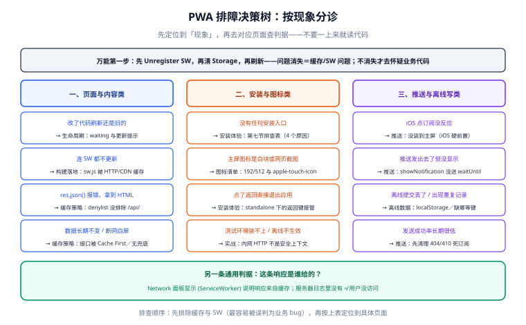

# 常见问题与最佳实践

前八页讲的是「怎么建」，这一页讲的是「建完之后出问题怎么办」，以及「上线前该检查什么」。

一句话定位：**按现象分诊的排查树 + 十二个高频问答 + 上线自查清单 + 最佳实践**，全部来自前面几页总结出的判据。

## 一、排障决策树

先按**现象**定位到页，再看该页的判据。

| 现象 | 第一嫌疑 | 去看 |
| --- | --- | --- |
| **改了代码，页面还是旧的** | Service Worker 缓存或 `waiting` 状态 | [Service Worker：生命周期与更新](../ServiceWorker/index.md) |
| **改了代码，连 SW 也不更新** | `sw.js` 被 HTTP/CDN 长期缓存 | [框架与构建落地](../Framework/index.md) 第七节 |
| **接口返回的是 HTML，`res.json()` 报错** | `navigateFallbackDenylist` 没排除 `/api/` | [缓存策略](../CachingStrategy/index.md) 第四节 |
| **数据长期不变，刷新也没用** | 把接口配成了 Cache First | [缓存策略](../CachingStrategy/index.md) 第一节 |
| **没网就白屏** | `navigateFallback` 未配或兜底页没进预缓存 | [缓存策略](../CachingStrategy/index.md) 第四节 |
| **服务器日志里看不到用户的请求** | 请求被 SW 直接命中缓存返回 | [概述](../Overview/index.md) 第二节 |
| **没有安装按钮** | Manifest 不合格 / 参与度不足 / Safari | [安装体验](../Installability/index.md) 第七节 |
| **装上后图标是白块或截图** | 图标尺寸不符 / 缺 `apple-touch-icon` | [安装体验](../Installability/index.md) 第五节 |
| **iOS 点了订阅推送没反应** | 没装到主屏（iOS 的硬前置） | [消息推送](../Push/index.md) 第六节 |
| **推送发出去了但没显示** | `showNotification()` 没放进 `waitUntil` | [消息推送](../Push/index.md) 第五节 |
| **离线提交的东西丢了** | 队列写在了 `localStorage` | [离线数据](../OfflineData/index.md) 第一节 |
| **离线提交产生了重复记录** | 客户端没生成幂等键，或服务端没有去重 | [离线数据](../OfflineData/index.md) 第五节 |
| **测试环境装不上/离线不生效** | 内网 HTTP 不是安全上下文 | [实战](../Practice/index.md) 第五节 |
| **缓存越来越大** | 没设 `maxEntries` / `maxAgeSeconds` | [缓存策略](../CachingStrategy/index.md) 第六节 |

:::tip 万能第一步
**先把 SW 注销（DevTools → Application → Service Workers → Unregister），再清 Storage，再刷新。** 如果问题消失，就是缓存/SW 问题；如果不消失，才去怀疑业务代码。这一步能砍掉一半的排查路径。
:::

## 二、十二个高频问答

**Q1：PWA 到底需要哪些东西才算「做完了」？**
**A**：没有统一标准。按能力拆开看：只要一个声明——`Manifest + HTTPS` 就能安装，不需要 Service Worker；要离线才需要 Service Worker；要推送才需要 Push + VAPID；要后台提交才需要 IndexedDB + 队列。**先定清要哪几项，再决定做多少。**

**Q2：为什么我改了代码，刷新还是旧的？**
**A**：因为新版本的 SW **故意停在 `waiting`**，等旧页面全部关闭才接管（[生命周期](../ServiceWorker/index.md)第三节）。开发期勾 **Update on reload** 即可；生产期必须做**更新提示**，让用户主动切。

**Q3：`skipWaiting()` 直接写在 `install` 里行不行？**
**A**：**不建议**。它会让新 SW 在旧页面还在运行时接管并清理旧缓存，正在使用页面的用户可能拿到 404 的资源。正确做法：`waiting` 时提示，用户确认后 `postMessage` 触发。

**Q4：Cache First 和 Stale While Revalidate 到底怎么选？**
**A**：看**能不能接受一次陈旧**。文件名带内容哈希的静态资源 → Cache First（永远不会旧）；每次访问都可能变、但旧一点没关系（头像、列表摘要）→ Stale While Revalidate；**必须最新** → Network First 或 Network Only。

**Q5：为什么接口不能缓存？**
**A**：能缓存，但**要按接口分类**。公开只读接口（分类、标签）可以短时缓存；个人化接口缓存会串号；写接口缓存语义不成立。三条铁律见[缓存策略](../CachingStrategy/index.md)第一节。

**Q6：iOS 支持 PWA 吗？**
**A**：**支持**，且自 iOS 16.4（2023-03）起支持 Web Push。但有六条硬限制：必须装到主屏、必须用户手势、不支持 WKWebView、必须展示可见通知、不支持 Background Sync、无程序化安装 API。逐条见[消息推送](../Push/index.md)第六节。

**Q7：Background Sync 能跨平台用吗？**
**A**：**不能**。只有 Chromium 系（Chrome 49+ / Edge 79+ / Opera 42+ / Samsung 5+）；Firefox 与所有 Safari（含 iOS）都不支持，Android WebView 也不暴露。所以它只能当增强——**每次应用启动补发一次**才是跨平台的可靠兜底（[离线数据](../OfflineData/index.md)第三节）。

**Q8：Lighthouse 的 PWA 分数怎么没了？**
**A**：Lighthouse **12.0**（2024-04）**移除了 PWA 分类**（因为它的判据就是 Chrome 安装判据，而 Chrome 已放宽）。现在验收要看运行时信号：`beforeinstallprompt`、DevTools 的 Manifest 面板、Offline 勾选后的真实行为。**别再找那个分数了。**

**Q9：Service Worker 会不会影响 SEO？**
**A**：不会——SW 是浏览器侧的东西，抓取工具根本不会执行它，它们拿到的是服务端返回的原始 HTML。反过来说，**如果你的 SEO 依赖 SW 才成立，那一定坏了**（[实战](../Practice/index.md) 的 P10 断言专门守这一条）。

**Q10：缓存占多少空间算正常？**
**A**：取决于站点。经验值：应用壳 < 5MB、图片 < 20MB、接口缓存 < 5MB，总量控制在 30MB 以内。超了先查 `maxEntries` 是否缺失，再查有没有把大文件（视频、sourcemap）配进预缓存。

**Q11：用户装了旧版本，我们怎么强制他升级？**
**A**：**没有可靠的强制手段**。能做的是：① 每次导航与定期 `update()` 主动检查；② 出现 `waiting` 就提示；③ 对于破坏性变更（如接口协议变化），在服务端对旧版本给出**明确的不兼容响应**（如 `426 Upgrade Required`），让旧前端显式提示用户刷新。**不要指望靠缓存控制用户。**

**Q12：离线队列和「乐观 UI」怎么配合？**
**A**：乐观 UI（先显示成功、再等结果）与队列天然契合，但**状态必须来自存储**。刷新页面后要从队列重建状态：队列里在 = 排队中，不在 = 已发送。否则会出现「界面说已发送、其实还在队列里」（[离线数据](../OfflineData/index.md)第七节）。

## 三、上线自查清单（12 项）

逐条勾，任一条不通过都别上线：

1. ☐ 全站 HTTPS（含 `manifest`、`sw.js`、接口），内网测试环境也已配好证书。
2. ☐ DevTools → Manifest 面板**无红色错误**；`/manifest.webmanifest` 的 Content-Type 为 `application/manifest+json`。
3. ☐ Manifest 含 192 与 512 图标，另有独立的 `maskable` 图标与 `apple-touch-icon`（180×180）。
4. ☐ `sw.js` 与 `manifest.webmanifest` 的响应头为 `no-cache`（或 `max-age=0, must-revalidate`）。
5. ☐ 预缓存清单里**没有** HTML、没有 `/api/`、没有 `.map`、没有超过阈值的单文件。
6. ☐ `navigateFallbackDenylist` 已排除 `/api/`（以及 `/admin/` 等不应回退的路径）。
7. ☐ 所有「必须最新」的接口在配置里是 **Network Only 或 Network First**，没有一个配成 Cache First。
8. ☐ 每个 cache 都有 `maxEntries` **与** `maxAgeSeconds` 双限；缓存名带版本或用途。
9. ☐ 更新提示已实现并在真机上验证过（改文案 → 收到提示 → 点击生效）。
10. ☐ `controllerchange` 时刷新页面（避免新 SW 配旧页面代码）。
11. ☐ 离线写的队列在 **IndexedDB**（不是 `localStorage`），且带客户端生成的幂等键。
12. ☐ 按[实战](../Practice/index.md)的 P1~P10 十条断言在**真机**上跑过一遍（至少 Android + iOS 各一台）。

## 四、最佳实践（12 条）

1. **先定能力，再定技术**：只要图标就别写 SW；只要离线就别接推送。每一项能力都有独立的维护成本。
2. **预缓存只放壳**：业务数据一律走运行时缓存。预缓存清单越大，`install` 失败概率与首访流量越高。
3. **版本驱动的缓存要能自愈**：缓存名带版本 + `activate` 里删旧 + `cleanupOutdatedCaches: true`，三件套缺一不可。
4. **更新控制权交给用户**：`waiting` → 提示 → 用户点击 → `skipWaiting` → 刷新。这是唯一不会伤到在线用户的顺序。
5. **一切状态持久化**：SW 随时会被回收，全局变量不可靠。要跨事件活着的数据就进 IndexedDB。
6. **离线队列三件套**：先落盘、带幂等键、有重试上限与终态告知。三者缺一，用户就会丢数据或看到假成功。
7. **把「不能缓存」显式写下来**：认证、支付、写接口、个人化数据——在配置里用注释标出来，比写在文档里更不容易被后人改错。
8. **跨平台能力按最窄的来设计**：iOS 没有 Background Sync、没有程序化安装、没有静默推送。**按 iOS 的约束设计，其他平台自然也能跑。**
9. **不要在页面加载时申请权限**：通知权限只有一次机会，必须绑在用户手势上，并且先给「为什么值得订阅」的价值说明。
10. **订阅要能清理**：收到 `404/410` 立刻删除死订阅，否则发送成功率会长期虚低，掩盖真正的问题。
11. **把 SW 当独立发布物管理**：它有独立的缓存生命周期，不能靠前端发版顺带解决；每次改缓存策略都要单独验证一遍离线路径。
12. **监控要说得出「这条响应是谁给的」**：至少能区分缓存命中与回源（前端可在响应头加自定义标记做统计），否则出事时无法判断影响面。

## 五、术语表

| 术语 | 含义 |
| --- | --- |
| **PWA** | Progressive Web App，一组让网页具备应用级能力的浏览器标准的合称，不是单一技术 |
| **Service Worker（SW）** | 独立于页面的 Worker 线程，可拦截 `fetch`、接收 `push`/`sync`；无 DOM、随时会被回收 |
| **作用域（scope）** | SW 能控制的 URL 范围，由 SW 文件路径决定 |
| **预缓存（precache）** | 构建期写入清单、`install` 时一次性缓存；URL 带内容哈希，因此不会陈旧 |
| **运行时缓存（runtime caching）** | 有请求时按规则缓存，需自己设过期与条目上限 |
| **`waiting`** | 新 SW 已装好但未接管的状态；**更新问题的根源** |
| **`skipWaiting()`** | 让 `waiting` 的 SW 立即接管；应由用户确认后触发 |
| **`clients.claim()`** | 让 SW 接管作用域内未被控制的页面 |
| **不透明响应（opaque response）** | 跨域且无 CORS 头时拿到的响应，`status` 为 0、读不到内容，只能靠 `statuses: [0, 200]` 允许缓存 |
| **VAPID** | 服务端向推送服务证明身份的一对密钥（RFC 8292）；私钥只能留在服务端 |
| **endpoint** | 推送服务分配给某个订阅的 URL；视为长期设备标识，属个人数据 |
| **Stale While Revalidate** | 立即返回缓存、同时后台更新；用户可能看到上一次的结果 |
| **`navigateFallback`** | 导航请求失败时返回的兜底页；**必须排除 API 路径** |
| **`beforeinstallprompt`** | Chromium 判定可安装后触发的事件；Safari / Firefox 不实现 |
| **maskable 图标** | 内容集中在中心安全区、供 Android 自适应裁切使用的图标 |

## 参考资料

- [MDN：Progressive web apps](https://developer.mozilla.org/en-US/docs/Web/Progressive_web_apps)
- [web.dev：Learn PWA](https://web.dev/learn/pwa)
- [Workbox 官方文档](https://developer.chrome.com/docs/workbox)
- [vite-plugin-pwa 官方文档](https://vite-pwa-org.netlify.app/)
- [caniuse：Background Sync API](https://caniuse.com/background-sync)
