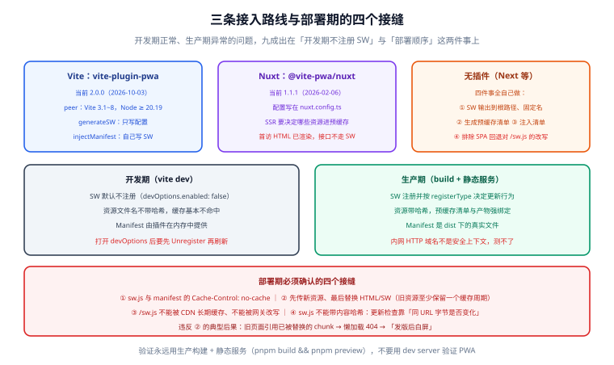

# 框架与构建落地

前五页讲的都是浏览器侧的标准行为，与框架无关。但**接入方式**高度依赖构建工具：SW 是一个独立入口文件、需要一份「构建产物清单」、还要在部署时保证原子性——这三件事在不同框架里的做法差别很大。

一句话定位：**本页讲清 Vite / Nuxt / 无插件（Next 等）三条接入路线的差异，以及「开发期不注册 SW」这个必须理解的默认行为。**



## 一、三条路线对照

| 路线 | 工具 | 你要写的东西 | 适合 | 主要代价 |
| --- | --- | --- | --- | --- |
| **插件（Vite）** | `vite-plugin-pwa` **2.0.0** | 一段配置；`generateSW` 模式下**不写 SW 代码** | Vue / React / Svelte / VitePress 等所有 Vite 项目 | 要写自定义逻辑时得切到 `injectManifest` 模式 |
| **插件（Nuxt）** | `@vite-pwa/nuxt` **1.1.1** | 同上，写在 `nuxt.config.ts` | Nuxt 3 项目 | SSR 场景要额外决定「哪些资源进预缓存」 |
| **无插件（Next 等）** | 自己写 | 一个 SW 源文件 + 一份预缓存清单的生成脚本 | Next.js 或任何不在 Vite 生态里的构建 | 四件事都要自己做（见第六节） |

:::info 版本坐标
`vite-plugin-pwa` **2.0.0**（2026-10-03）的 peer 依赖为 **Vite 3.1~8**、`workbox-build ^7.4.1`，并要求 **Node ≥ 20.19**。Workbox 当前为 **7.4.1**（2026-05-04）。选版本时先看 peer 依赖，不要只看主版本号——这是这类插件最常见的安装失败原因。
:::

## 二、`vite-plugin-pwa`：两种模式先选清楚

| 模式 | 配置键 | 生成的 SW | 什么时候用 |
| --- | --- | --- | --- |
| **`generateSW`** | `workbox: {...}` | 插件按配置**生成**完整 SW | 只用标准策略（预缓存 + 运行时缓存 + 离线回退）——**八成项目属于这种** |
| **`injectManifest`** | `injectManifest: {...}` + `srcDir` / `filename` | 你写 SW 源码，插件只**注入预缓存清单** | 需要自定义逻辑并存：离线队列、推送处理、自定义路由 |

`generateSW` 的完整配置见[缓存策略](../CachingStrategy/index.md)第三节，这里只补**开发期**的关键配置：

```ts [vite.config.ts]
import { defineConfig } from 'vite'
import { VitePWA } from 'vite-plugin-pwa'

export default defineConfig({
  plugins: [
    VitePWA({
      registerType: 'prompt',
      // 关键：开发期默认**不注册** SW；打开它才能本地调试 SW 逻辑
      devOptions: {
        enabled: true,
        // 'module' 允许在 dev 下用 ESM 写 SW（便于直接 import 你的工具函数）
        type: 'module',
        navigateFallback: 'index.html',
      },
      workbox: {
        globPatterns: ['**/*.{js,css,html,svg,woff2}'],
        navigateFallback: '/offline.html',
      },
    }),
  ],
})
```

`injectManifest` 模式下的骨架：

```ts [vite.config.ts]
VitePWA({
  strategies: 'injectManifest',
  srcDir: 'src',
  filename: 'sw.ts',            // 源文件；产物是 /sw.js
  injectRegister: 'auto',
  injectManifest: {
    globPatterns: ['**/*.{js,css,html,svg,woff2}'],
    // 自定义 SW 里要用到 precacheAndRoute 时，这两个模块是运行时依赖
    rollupFormat: 'es',
  },
})
```

```ts [src/sw.ts]
/// <reference lib="webworker" />
import { precacheAndRoute } from 'workbox-precaching'
import { registerRoute } from 'workbox-routing'
import { NetworkFirst } from 'workbox-strategies'

declare const self: ServiceWorkerGlobalScope

// 这一行的 self.__WB_MANIFEST 会被构建期替换成真实清单
precacheAndRoute(self.__WB_MANIFEST)

registerRoute(
  ({ url }) => url.pathname.startsWith('/api/v1/'),
  new NetworkFirst({ cacheName: 'api', networkTimeoutSeconds: 3 }),
)

// 这里可以自由添加 push / sync / message 处理
self.addEventListener('push', (event) => {
  event.waitUntil(self.registration.showNotification('新消息'))
})
```

:::danger 开发期的三个「看起来是 bug，其实是设计」
1. **开发服务器上什么都正常，因为 SW 根本没注册**。`vite-plugin-pwa` 在 dev 下默认 `devOptions.enabled: false`——这是刻意的：否则你改一行代码就被旧缓存盖住，开发体验会彻底崩掉。正确做法：**只在需要调 SW 时临时打开**，调完关掉。
2. **`devOptions.enabled: true` 之后必须硬刷新 + 注销一次**。打开开关的那一刻，SW 才第一次注册；之前打开的页面仍未被控制。正确做法：DevTools → Application → Unregister，再刷新。
3. **`injectManifest` 模式下 `self.__WB_MANIFEST` 未使用会报错**。Workbox 构建时会检查这个占位符是否出现在产物里（防止你忘了注入）。正确做法：即使暂时不需要预缓存，也要保留 `precacheAndRoute(self.__WB_MANIFEST)`。
:::

## 三、开发期与生产期的差异清单

这张表值得贴在工位上——**开发期正常、生产期异常**的问题九成出自这里：

| 维度 | 开发期（`vite dev`） | 生产期（`vite build` + 静态服务） |
| --- | --- | --- |
| SW 是否注册 | **默认不注册** | 注册，且按 `registerType` 决定更新行为 |
| 资源文件名 | 无哈希（`/src/main.ts`） | 带哈希（`/assets/index-a1b2c3.js`） |
| 预缓存清单 | 不存在 | 构建期生成，**清单内容与产物强绑定** |
| Manifest | 由插件在内存中提供 | 输出为 `dist/` 下的真实文件 |
| `localhost` 与 HTTPS | 都通过（`localhost` 是安全上下文） | 部署到 HTTPS 才通过；**内网 HTTP 域名一律失败** |
| 缓存是否命中 | 基本不命中 | 第二次访问开始大规模命中 |

## 四、SSR / SSG：三处必须处理的冲突

Nuxt（SSR）或 VitePress（SSG）这类场景，本质问题是：**HTML 不是静态产物，而是每次请求现场渲染的**。三处冲突：

| 冲突 | 现象 | 处理方式 |
| --- | --- | --- |
| **HTML 不该进预缓存** | 预缓存了构建期的 HTML，随后端更新，用户看到的永远是构建那一刻的快照 | HTML 用 **NetworkFirst**（或干脆不缓存 HTML，只缓存其依赖的 JS/CSS），把「离线兜底」交给 `offline.html` |
| **首帧一致 vs 离线优先** | SSR 首帧由服务端渲染，SW 却可能返回缓存的旧 HTML，造成与 JS 版本不匹配 | 让 HTML 走网络优先；**对 `/api/` 加进 `navigateFallbackDenylist`**，避免接口被回退成 HTML |
| **服务端路由的离线回退** | 断网时 `/posts/123` 没有任何缓存，直接白屏 | 设置 `navigateFallback: '/offline.html'`，并在离线页给出「已缓存内容」入口 |

:::warning SSR 下一个特别隐蔽的问题
SSR 页面里的数据请求由**服务端**发出，SW 完全看不到——于是「我明明在 `runtimeCaching` 里配了文章接口，为什么离线打开文章还是空的？」。根因是：**首访的 HTML 已经是渲染好的完整内容，客户端没有再发那次接口请求**。正确做法：要么缓存 HTML（接受陈旧），要么在客户端对已访问文章主动做一次[离线快照](../Practice/index.md)。
:::

## 五、Nuxt：`@vite-pwa/nuxt` 1.1.1

```ts [nuxt.config.ts]
export default defineNuxtConfig({
  modules: ['@vite-pwa/nuxt'],
  pwa: {
    registerType: 'prompt',
    manifest: {
      name: '博客平台',
      short_name: '博客',
      start_url: '/',
      display: 'standalone',
      icons: [
        { src: '/icons/pwa-192.png', sizes: '192x192', type: 'image/png' },
        { src: '/icons/pwa-512.png', sizes: '512x512', type: 'image/png' },
      ],
    },
    workbox: {
      // Nuxt 产物里 _nuxt/ 下是带哈希的资源，其余按需
      globPatterns: ['**/*.{js,css,html,svg,woff2}'],
      navigateFallback: '/offline.html',
      navigateFallbackDenylist: [/^\/api\//],
    },
    devOptions: { enabled: false },
  },
})
```

Nuxt 场景额外注意两点：

- **`_nuxt/` 下的资源带内容哈希**，是 Cache First 的理想对象；而 `/api/` 路由（Nitro server routes）**不要**进预缓存。
- **`useAsyncData` 的 SSR 数据不会走 SW**（见上一节的隐蔽问题）。离线可读要靠缓存 HTML 或在客户端补一次请求。

## 六、无插件场景：四个必须自己做的接口点

Next.js 等不在 Vite 生态里的项目，官方不含 PWA 支持，需要自己做四件事：

| # | 要做的事 | 具体做法 |
| --- | --- | --- |
| 1 | **SW 输出到根路径** | 把 SW 源文件构建成一个固定名 `sw.js` 放在产物根（**不能带内容哈希**，见下节） |
| 2 | **生成预缓存清单** | 构建后遍历产物目录，排除 `.map` 等，把 `{url, revision}` 列表写进 SW 或作为独立 JSON |
| 3 | **注入清单** | 用 Workbox 的 `injectManifest` 构建工具，或自己把清单字符串替换进 `sw.js` |
| 4 | **阻止回退成 SPA 首页** | Next 的 `rewrites` 会把未知路径都重写到首页；**必须显式排除 `sw.js`**，否则请求 `/sw.js` 会拿回一个 HTML，注册直接失败 |

第 4 点是最容易被忽略、也最致命的：

```js [next.config.js]
const nextConfig = {
  async rewrites() {
    return {
      beforeFiles: [
        // 放在最前面、且明确排除，避免 SPA 回退把 /sw.js 变成 HTML
        { source: '/sw.js', destination: '/sw.js' },
        { source: '/manifest.webmanifest', destination: '/manifest.webmanifest' },
      ],
    }
  },
}
```

:::danger `sw.js` 不能用内容哈希命名
预缓存清单里写的、页面注册时指定的，都是**固定路径** `/sw.js`。如果你把它构建成 `sw-a1b2c3.js`：
- 页面里那句 `register('/sw.js')` 会 404；
- 即使动态生成注册代码，**浏览器检查更新的依据是「同 URL 字节是否变化」**，URL 一变就是「另一个 SW」，旧版本的缓存清理逻辑全部失效。
正确做法：**SW 文件固定名 + 短缓存（或 `no-cache`）**，内容哈希只用在它预缓存的那些资源上。
:::

## 七、部署期的四个接缝

构建通过不代表上线可用。PWA 的部署比普通站点多四个必须确认的点：

| # | 接缝 | 正确做法 | 不做的后果 |
| --- | --- | --- | --- |
| 1 | **SW 文件的 HTTP 缓存** | `Cache-Control: no-cache`（可 `max-age=0, must-revalidate`） | 浏览器拿不到新版 `sw.js`，永远不更新 |
| 2 | **Manifest 的 HTTP 缓存** | 同样 `no-cache` | 改了图标/名字不生效 |
| 3 | **部署原子性** | **先传新资源、最后替换 HTML/SW**；旧资源至少在缓存期内保留 | 旧页面引用已被替换的 chunk → 懒加载 404（经典「发版后白屏」） |
| 4 | **CDN 回源的 SW 路径** | 确保 `/sw.js` 不被 CDN 长期缓存、不被网关改写 | 缓存了旧 SW，全站更新卡死 |

第 3 点的一个具体做法：**保留上一版产物目录**（如 `dist/20261007/`），HTML 里引用带哈希的文件名，这样任何时刻旧页面都能找到自己的资源。

## 八、验证方式

```shell
# 生产构建 + 本地静态服务（不要用 dev server 验证 PWA）
pnpm build && pnpm preview
```

1. 打开 `http://localhost:4173/`，DevTools → Application：
   - **Manifest** 无红色错误；
   - **Service Workers** 有一条 activated 记录，Source 指向 `/sw.js`；
   - **Cache Storage** 里预缓存条目**全是带哈希的静态资源**，**不含任何 HTML 与 `/api/` 响应**。
2. 执行下面的检查，确认清单与产物一致：

   ```js
   // 在控制台执行：列出预缓存里所有 URL
   const cache = await caches.open((await caches.keys()).find((k) => k.startsWith('workbox-precache')))
   console.log((await cache.keys()).map((r) => new URL(r.url).pathname))
   ```

   期望：全是 `/assets/...`、`/icons/...` 之类的静态资源；若出现 `/api/` 或大量 `.html`，说明 `globPatterns` 配错了。
3. 勾 **Offline** 后访问一个未缓存过的路径 → 应看到 `offline.html`，**而不是** SPA 首页或浏览器错误页。
4. 用 `curl` 确认 SW 与 Manifest 的缓存头：

   ```shell
   curl -sI http://localhost:4173/sw.js | grep -i cache-control
   curl -sI http://localhost:4173/manifest.webmanifest | grep -i content-type
   ```

   期望：SW 为 `no-cache`；Manifest 的 Content-Type 为 `application/manifest+json`。
5. 若为 SSR 项目：勾 Offline 后打开某篇文章 → 确认**不会**出现「HTML 回来了但接口是错的数据」这种半残状态（要么完整可读，要么干净地落到离线页）。

## 参考资料

- [vite-plugin-pwa 官方文档](https://vite-pwa-org.netlify.app/)
- [vite-plugin-pwa：Frameworks](https://vite-pwa-org.netlify.app/frameworks/)
- [@vite-pwa/nuxt 文档](https://vite-pwa-org.netlify.app/frameworks/nuxt)
- [Workbox：`injectManifest` 构建工具](https://developer.chrome.com/docs/workbox/reference/workbox-build)
- [web.dev：Update on the installability criteria](https://developer.chrome.com/blog/update-install-criteria)
