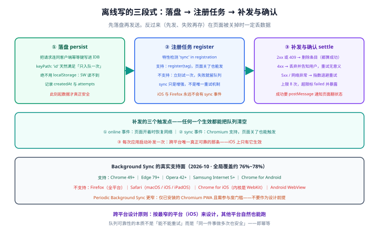

# 离线数据：存储、队列与同步

缓存解决的是「读」——页面壳与静态资源能离线拿到；但用户在断网时**点了一个提交按钮**，那是「写」，缓存帮不上忙。写操作必须被**暂存下来、等有网了再补发**，而「暂存 + 补发 + 保证不重复」这三件事各自有坑。

一句话定位：**本页讲离线写路径的完整工程：数据存哪、队列怎么建、什么时候发、怎么保证不重复、用户离开页面后怎么收尾。**

## 一、四种存储的分工

浏览器给了四个存储位置，**它们不是可互换的选项**，各自有明确的适用面：

| 存储 | 内容形态 | 是否异步 | 容量 | 主要用途 | 别用它做 |
| --- | --- | --- | --- | --- | --- |
| **Cache Storage** | `Request → Response` | 是 | 大 | 静态资源、HTTP 响应缓存 | 存业务对象（它只认 HTTP 语义） |
| **IndexedDB** | 对象、索引、游标 | 是 | 大 | **离线队列、草稿、结构化业务数据** | 简单键值（太重，见下） |
| **OPFS**（Origin Private File System） | 文件 | 是 | 大 | 大文件、低层二进制流（如导出包） | 结构化查询 |
| **localStorage / sessionStorage** | 字符串 | **否** | 约 5MB | 主题、开关等极小配置 | 离线队列（同步 API 阻塞主线程、SW 里**根本访问不到**） |

:::danger 「用 localStorage 做离线队列」为什么必然失败
1. **Service Worker 里访问不到 `localStorage`**（它是 `window` 的属性，SW 没有 `window`）。队列写在 `localStorage`，SW 就永远读不到它，后台发送直接失效。
2. **它是同步 API**，在页面上写几十 KB 就会造成掉帧。
3. **它无法表达「事务性的添加 + 删除」**，跨标签页并发写会互相覆盖。
正确做法：**离线队列一律放 IndexedDB**；嫌原生 API 啰嗦就用 `idb`（**8.0.4**，2026-10-06）这类薄封装。
:::

## 二、离线写的三段式

离线写路径固定是这三步，缺一不可：



1. **落盘（persist）**：把要提交的数据**连同客户端生成的唯一 ID**写进 IndexedDB。
2. **注册任务（register）**：优先调 `registration.sync.register(tag)` 让浏览器在有网时唤醒 SW；**不支持时**立刻尝试直接发送，失败则留队列。
3. **补发与确认（flush + settle）**：SW 或页面在恢复联网后依次发送队列项，成功后删除条目，失败按状态码决定「丢弃 / 重试 / 标记失败」。

关键设计原则：**先落盘，再发送**。反过来（先发、失败再存）在页面被用户关掉的情况下一定会丢数据。

## 三、Background Sync 的真实支持面（2026-10）

这是个**必须按平台分叉**的能力，不要按「现代浏览器都支持」去设计：

| 平台 | Background Sync（一次性 `sync`） | Periodic Background Sync（`periodicsync`） |
| --- | --- | --- |
| Chrome 桌面 / Android | ✅ 49+ | 仅**已安装**的 PWA，且需满足参与度门槛 |
| Edge | ✅ 79+（Chromium 后） | 同上 |
| Opera / Samsung Internet | ✅ 42+ / 5+ | — |
| **Firefox（全平台）** | ❌ 不支持 | ❌ |
| **Safari（macOS / iOS / iPadOS）** | ❌ 不支持 | ❌ |
| **Chrome for iOS**（内核是 WebKit） | ❌ 不支持 | ❌ |
| **Android WebView** | ❌ 不暴露 `SyncManager` | ❌ |

全局覆盖约 **76%~78%**（caniuse 口径）。结论有三条：

1. **Background Sync 只能当增强，不能当唯一重试机制**。iOS 与 Firefox 用户占到相当比例，他们永远不会有 `sync` 事件。
2. **必须特性检测**：`'sync' in registration` 为假就降级到「页面内重试 + 下次打开时对账」。
3. **Periodic Background Sync 不要用**：支持面更窄（只有已安装的 Chromium PWA），且参与度门槛不可控，把它当锦上添花而不是设计前提。

:::tip 跨平台的可靠做法
把「补发」拆成三个触发点，任何一个生效都能补齐：**① `online` 事件**（页面开着时）、**② `sync` 事件**（Chromium 支持时，页面即使关闭也能触发）、**③ 每次应用启动**（最可靠的兜底，覆盖全部平台）。第三点常被忽略，但它才是 iOS 上唯一真正生效的那条。
:::

## 四、队列实现：完整骨架

先建库（`idb`），再写「落盘 + 补发」。

```ts [src/offline/outbox.ts]
import { openDB, type DBSchema } from 'idb'

// 队列项：id 是客户端生成的幂等键，绝不能由服务端生成
export interface OutboxItem {
  id: string
  url: string
  method: 'POST' | 'PUT' | 'PATCH' | 'DELETE'
  headers: Record<string, string>
  body: string
  createdAt: number
  attempts: number
  lastError?: string
}

interface OutboxDB extends DBSchema {
  outbox: { key: string; value: OutboxItem }
}

const dbPromise = openDB<OutboxDB>('app-offline', 1, {
  upgrade(db) {
    // keyPath 用客户端 id：天然满足「同一件事只入队一次」
    db.createObjectStore('outbox', { keyPath: 'id' })
  },
})

export async function enqueue(item: Omit<OutboxItem, 'createdAt' | 'attempts'>) {
  const db = await dbPromise
  await db.put('outbox', { ...item, createdAt: Date.now(), attempts: 0 })
}

export async function flushOutbox(): Promise<{ sent: number; failed: number }> {
  const db = await dbPromise
  const items = await db.getAll('outbox')
  let sent = 0
  let failed = 0

  for (const item of items) {
    try {
      const res = await fetch(item.url, {
        method: item.method,
        headers: {
          ...item.headers,
          // 关键：同一个幂等键重发多少次，服务端都只处理一次
          'Idempotency-Key': item.id,
        },
        body: item.body,
      })

      if (res.ok || res.status === 409) {
        // 2xx 说明成功；409 说明服务端已经处理过同一个键，同样算成功
        await db.delete('outbox', item.id)
        sent += 1
        continue
      }
      if (res.status >= 400 && res.status < 500) {
        // 4xx 是「这条请求本身有问题」，重试一万次也没用 → 丢弃并上报
        await db.delete('outbox', item.id)
        failed += 1
        reportPermanentFailure(item, res.status)
        continue
      }
      // 5xx 与网络异常：保留，等下次补发
      throw new Error(`retryable status ${res.status}`)
    } catch (err) {
      const next: OutboxItem = {
        ...item,
        attempts: item.attempts + 1,
        lastError: String(err),
      }
      // 指数退避的上限：超过 8 次不再自动重试，改为提示用户
      if (next.attempts <= 8) await db.put('outbox', next)
      else {
        await db.put('outbox', next)
        reportPermanentFailure(next, 'max-attempts')
      }
    }
  }
  return { sent, failed }
}
```

页面侧只需三个触发点：

```ts [src/offline/register.ts]
// ① 提交时：先落盘，再尝试发出
export async function submitComment(payload: CommentPayload) {
  const item = {
    id: crypto.randomUUID(),           // 幂等键
    url: '/api/v1/comments',
    method: 'POST' as const,
    headers: { 'Content-Type': 'application/json' },
    body: JSON.stringify(payload),
  }
  await enqueue(item)

  const reg = await navigator.serviceWorker.ready
  if ('sync' in reg) {
    // ② Chromium：交给浏览器，页面关了也能发
    await reg.sync.register('outbox')
  } else {
    // ③ 其他平台：立刻试一次，失败就等下次启动（iOS 上唯一可靠的那条路）
    void flushOutbox()
  }
}

// 兜底：每次应用启动都对账一次
window.addEventListener('online', () => void flushOutbox())
void flushOutbox()
```

SW 侧（在 `injectManifest` 模式或自定义 SW 里）：

```js [sw.js]
self.addEventListener('sync', (event) => {
  if (event.tag !== 'outbox') return
  // background-sync 的一个细节：lastChance 表示浏览器已放弃重试
  event.waitUntil(self.clients.matchAll().then(() => flushOutboxFromSW()))
})
```

:::danger 队列实现里的五个致命错误
1. **幂等键由服务端生成**。服务端生成意味着「第一次请求根本没到达服务端时拿不到键」，重发就是一条全新的记录。正确做法：**客户端 `crypto.randomUUID()`**，入队时就写死。
2. **把 4xx 当作可重试**。用户已被封禁、内容已被删除这类 4xx，重试只会持续报错。正确做法：4xx 丢弃并告知用户，5xx 与网络异常才重试。
3. **用 `response.ok` 判断成功却忽略 409**。幂等键重复时服务端常返回 409，这**代表已经成功**，当成失败会导致无限重试。正确做法：把 409 归入成功分支（如上面的代码）。
4. **没有次数上限**。断网设备可能长期在线下，无限重试会耗尽电量并持续失败。正确做法：指数退避 + 上限 + 明确告知用户「这条没发出去」。
5. **完成之后不通知 UI**。用户看到的是「排队中」，实际早已发出，这个状态差会变成客服工单。正确做法：SW 发送成功后 `postMessage` 给所有 client（`clients.matchAll()`），页面据此把状态翻成「已发送」。
:::

## 五、幂等：为什么它就是全部

离线写的所有麻烦，本质上都能归结为一句话：**客户端无法区分「请求没到」和「请求到了但响应丢了」**。所以唯一可靠的方案是让**同一件事可以被安全地做多次**。

| 层面 | 手段 | 说明 |
| --- | --- | --- |
| 协议层 | `Idempotency-Key` 请求头 | 由 Stripe / PayPal 等推广的约定，目前是 IETF 的 **Internet-Draft**（`draft-ietf-httpapi-idempotency-key-header`），**尚未成为正式标准**，引用时要注意这一点 |
| 服务端 | 唯一索引 + 去重表 | 用幂等键做唯一约束；命中重复时**返回上一次的结果**（成功或错误都返回） |
| 语义层 | 只用天然幂等的操作 | 例如「置为已赞」用 `PUT /posts/1/like` 而不是 `POST /posts/1/likes`（后者两次就是两个赞） |
| 客户端 | 同一 ID 只入队一次 | `keyPath: 'id'` 的 IndexedDB 天然去重 |

**只做其中一层都不够**：客户端去重挡不住「页面刷新导致队列重建」，服务端去重挡不住「同一次操作被用户点了两次」——两层都要。

## 六、冲突与「离线期间数据变了」

离线写还有一个绕不开的问题：用户离线时改的内容，可能与服务器上已经变化的内容冲突。

| 冲突类型 | 处理策略 | 适用场景 |
| --- | --- | --- |
| **只追加，不冲突** | 直接发（评论、点赞、埋点） | 首选：**把业务设计成只追加**，冲突就消失了 |
| **整体覆盖（Last Write Wins）** | 后到者覆盖 | 只适合「个人私有、无协作」的数据（个人设置、草稿） |
| **带版本检测** | 请求带 `If-Match: <etag>` 或 `version`，服务端版本不符返回 **412 / 409**，客户端提示用户「内容已被修改」 | 协作编辑、工单、库存 |
| **字段级合并** | 服务端按字段合并 | 成本最高，只在确有必要时做 |

:::warning 一条容易被忽略的纪律
**不要把「离线期间用户看到的旧内容」当成提交内容。** 用户离线时看到的文章标题可能是旧的，如果他编辑后提交，会把服务端的新标题覆盖掉。正确做法：提交**只发用户实际改动的字段**（PATCH 语义），而不是把整个对象发回去。
:::

## 七、UI 状态机：三态与对账

离线队列一定要有可见的状态，否则用户只能凭感觉猜。最小状态机是三态：

| 状态 | 页面展示 | 流转条件 |
| --- | --- | --- |
| **Queued（排队中）** | 「已保存，等待网络」 | 入队成功 |
| **Sent（已发送）** | 「已发送」 | 收到 SW 的 `postMessage`，或页面自己发送成功 |
| **Failed（发送失败）** | 「发送失败，点击重试」+ 原因 | 4xx、或重试次数耗尽 |

两条实现纪律：

1. **状态要从存储里读，不要只在内存里记一个 flag**。用户刷新页面后，flag 归零，但队列里的条目还在——于是「明明没发出去，界面却显示已发送」。正确做法：页面启动时读一遍队列，**队列里在的 = Queued，不在的 = 已发送**。
2. **必须暴露终态失败**。不要把失败默默吞掉；一条永远发不出去的评论，比一个明确的错误提示伤害大得多。

## 八、验证方式

1. DevTools → Application → **IndexedDB** → `app-offline` → `outbox`：断网提交一条评论后，应看到一条记录，`id` 是 UUID，`attempts` 为 0。
2. 保持断网并刷新页面：`outbox` 里的记录**仍在**，且页面 UI 显示「排队中」——证明状态来自存储而不是内存。
3. 恢复网络（取消 Offline 勾选）→ 应观察到记录在几秒内消失，且 UI 翻成「已发送」；Network 面板里能看到一次带 `Idempotency-Key` 头的真实请求。
4. **重复投递测试**：手动再调一次 `flushOutbox()`，服务端应只保留一条业务记录（如果产生了第二条，说明服务端幂等没做）。
5. **不可重试判定测试**：把队列项指向一个必然返回 400 的 URL，恢复网络 → 记录应被删除并标记 `failed`，而不是无限重试。

## 参考资料

- [MDN：Background Synchronization API](https://developer.mozilla.org/en-US/docs/Web/API/Background_Synchronization_API)
- [MDN：IndexedDB API](https://developer.mozilla.org/en-US/docs/Web/API/IndexedDB_API)
- [MDN：Origin Private File System](https://developer.mozilla.org/en-US/docs/Web/API/File_System_API/Origin_private_file_system)
- [caniuse：Background Sync API](https://caniuse.com/background-sync)
- [idb（IndexedDB 封装）](https://github.com/jakearchibald/idb)
- [IETF draft：The Idempotency-Key HTTP Header Field](https://datatracker.ietf.org/doc/draft-ietf-httpapi-idempotency-key-header/)
- [Workbox：`workbox-background-sync`](https://developer.chrome.com/docs/workbox/modules/workbox-background-sync)
