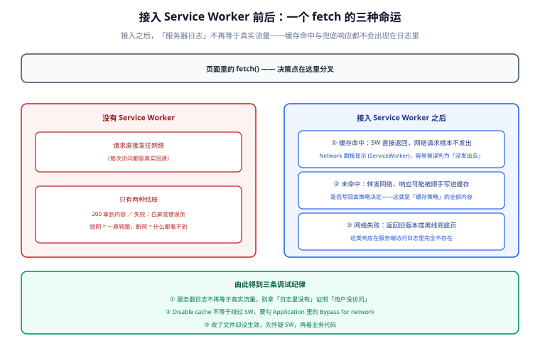

# 概述：离线能力的四个层次

**PWA（Progressive Web App）** 这个词被用得极乱：有人说它是「能安装的网页」，有人说它是「离线可用的网站」，还有人说它是「网页版 App」。这三种说法都对，但都不完整——它们说的是 PWA 的**不同能力**，而每种能力各自依赖一套独立的浏览器标准，可以单独上，也可以单独不上。

一句话定位：**本页先帮你分清「PWA 到底包含哪几件事」，再判断你的项目该做哪几件**。搞清楚这一点，能省掉大量「照着教程把 Service Worker 接上，结果一个需求都没解决」的返工。

## 一、四项能力与它们的真实依赖

| 能力 | 解决的问题 | 依赖的标准 | 不做会怎样 |
| --- | --- | --- | --- |
| **可安装** | 用户能像 App 一样从桌面/主屏启动，且不受浏览器标签页生命周期影响 | Web App Manifest + HTTPS | 用户每次都要打开浏览器、输网址、找标签页 |
| **可离线** | 网络断开或极慢时页面仍然可用 | Service Worker + Cache Storage | 弱网就是白屏或错误页 |
| **可推送** | 页面已关闭时，服务端仍能触达用户 | Service Worker + Push API + Notifications API + VAPID | 只能靠邮件/短信/站内信二次唤回 |
| **可后台** | 页面关闭后仍能完成一次网络任务（如提交表单） | Service Worker + IndexedDB +（可选）Background Sync | 用户断网提交就等于丢失 |

这四件事的**依赖关系是不对称的**，这是最容易搞错的地方：

- **可离线 → 必须**有 Service Worker；**可推送 → 必须**有 Service Worker 和一个能离线运行的兜底；**可后台 → 必须**有 Service Worker。
- **可安装 → 不再强制**要求 Service Worker。Chromium 现行安装判据只有 HTTPS + 合法 Manifest（详见[安装体验](../Installability/index.md)），所以「只想要一个桌面图标」的项目**不需要写一行 Service Worker 代码**。
- **反过来不成立**：装了 Service Worker 不等于页面可安装（可能 Manifest 缺 512 图标），也不等于能推送（还要订阅与 VAPID 公钥）。

:::tip 一句话记住
**Manifest 决定「能不能装」，Service Worker 决定「能不能离线」，Push 决定「关掉页面还能不能找到你」。** 三者是三件事，别当成一件。
:::

## 二、接入 Service Worker 之后，请求多了两条路

没有 Service Worker 时，一个 `fetch` 只有一种结局：发到网络，成功或失败。接入之后，同一个请求有**三条**可能的路径，而这件事会反过来影响你所有的调试直觉。

三条路径分别是：

1. **缓存命中**：SW 直接返回缓存里的响应，**网络请求根本不会发出**。在 Network 面板里你会看到 `(ServiceWorker)` 而不是服务器地址——这是最容易被误判为「请求没发出去」的现象。
2. **缓存未命中，回源**：SW 转发给网络，拿到响应后**可能顺手写进缓存**（取决于策略）。此时响应的来源是网络，但响应体已经被 SW 复制了一份。
3. **SW 主动构造响应**：网络失败时返回缓存的旧版本，或返回一个离线兜底页。这类响应**在服务器日志里完全不存在**。

由此得到三条贯穿本专题的调试纪律：

- **服务器日志不再等于真实流量**。缓存命中与兜底响应都不会出现在服务端访问日志里，别拿「日志里没有」证明「用户没访问」。
- **DevTools 的 Disable cache 不等于绕过 SW**。要真正绕过，必须勾 Application → Service Workers → **Bypass for network**（或直接注销 SW）。
- **改了文件却没生效，先怀疑 SW**。这是 PWA 开发期最高频的困惑，根因在[生命周期](../ServiceWorker/index.md)一节。

## 三、Service Worker 在哪：它不在页面里

Service Worker 是一个**独立于页面的事件驱动 Worker 线程**，理解它的几条硬约束比记住 API 更重要：

| 性质 | 具体表现 | 工程后果 |
| --- | --- | --- |
| **没有 DOM** | 拿不到 `document`、`window`、任何页面元素 | 想改页面只能靠 `postMessage` 与页面通信 |
| **随时会被杀死** | 浏览器为了省电会在空闲时终止它，事件来了再拉起 | **不要在全局变量里存状态**，一切要持久化到 Cache/IndexedDB |
| **作用域受路径限制** | SW 文件放在 `/js/sw.js`，默认只能控制 `/js/` 下的页面 | SW 文件**必须放在站点根目录**（或显式设 `Service-Worker-Allowed` 响应头） |
| **只能跑在安全上下文** | HTTPS 或 `localhost` / `127.0.0.1` | 内网 HTTP 域名一律不行，`localhost` 是唯一例外 |
| **生命周期跨版本** | 旧版本可能仍控制着页面，新版本在 `waiting` | 「更新了但用户看到的还是旧代码」是**默认行为**而非 bug |

:::danger 三个必然踩到的坑
1. **把 SW 当页面脚本用**：在 `sw.js` 顶层写 `document.querySelector(...)` → 直接报错且 SW 安装失败。正确做法：能改页面的只有页面自己，SW 只通过 `postMessage` 通知。
2. **把状态放在 SW 的全局变量里**：`let queue = []` 在 SW 被回收后归零，用户以为提交成功、其实丢了。正确做法：**任何需要跨事件存活的数据都写进 IndexedDB**。
3. **SW 文件放在子目录**：`/static/sw.js` 注册后只能控制 `/static/*`，首页完全不受影响，于是「注册成功了但没有离线能力」。正确做法：SW 产物输出到**站点根**（Vite 下把 `sw.js` 放进 `public/`，或让插件输出到根）。
:::

## 四、什么时候不该上 PWA

PWA 不是「现代前端标配」，它有明确的成本：产物多一个入口、缓存可能让用户拿到旧版本、推送有平台差异要维护。下面这张表给出**不该做**的判据：

| 你的情况 | 结论 | 理由 |
| --- | --- | --- |
| 内容强时效、且用户必须看到最新版本（如行情、后台工单台） | **不要做缓存优先** | 缓存优先会稳定地给用户旧数据；这类项目最多做「网络优先 + 离线提示」 |
| 纯内部后台、要求强一致 | **不建议做离线** | 离线读+在线写的不对称会制造大量状态同步问题，收益却很小 |
| 只是想要一个桌面图标 | **只做 Manifest，不做 SW** | 安装已不依赖 SW；不做 SW 就完全没有缓存带来的陈旧风险 |
| 团队没有能力维护缓存策略 | **先只做「离线兜底页」** | 最小可用形态：预缓存一个 `offline.html`，网络失败时展示它，不缓存任何业务数据 |
| 主要用户在 iOS 且需要后台提交 | **调整预期** | iOS 不支持 Background Sync，必须做页面内重试 + 服务端幂等（见[离线数据](../OfflineData/index.md)） |
| 站点是 VitePress / 静态文档站 | **值得做，且成本很低** | 内容更新频率低、体积可控，是最适合预缓存的场景之一 |

:::warning 一个常被忽略的取舍
Service Worker 一旦上线，**你就欠了一笔长期债**：缓存版本管理、更新提示、旧缓存清理、以及「用户装了旧 SW 导致新版本部署后行为诡异」的排查成本。上线前问一句：**我们打算为这套缓存维护多久？** 答不上来就先只做离线兜底页。
:::

## 五、最小起步三步（每步都有可验证产出）

不要一上来就做「预缓存整个站点 + 推送 + 后台队列」。按下面三步走，每步都能独立验证：

**第一步：让站点有个 Manifest，能安装。**

在站点根目录建 `manifest.webmanifest`，至少包含 `name`、`start_url`、`display`、`icons`（192 与 512），在 HTML 里用 `<link rel="manifest" href="/manifest.webmanifest">` 引上。

验证方式：本地 `http://localhost:5173/` 打开站点 → DevTools → Application → **Manifest**，应能看到应用名与图标，且**没有红色错误**；地址栏右侧出现安装图标（Chromium 需要一定的用户参与度，刷新几次即可）。

**第二步：加一个只做离线兜底的 Service Worker。**

预缓存 `offline.html`，对导航请求用「网络优先、失败回兜底页」，业务接口一律不缓存。

验证方式：DevTools → Application → Service Workers 勾上 **Offline**，刷新页面 → 应看到兜底页而不是浏览器的恐龙页；再取消勾选刷新 → 恢复正常页面。

**第三步：把「更新提示」做出来。**

让新版本 SW 处于 `waiting` 时在页面角落显式提示「有新版本，点击刷新」，用户点击后 `skipWaiting` 并 `location.reload()`。

验证方式：改一行 `offline.html` 文案 → 重新构建 → 在**不勾 Offline、不勾 Bypass** 的状态下刷新页面 → 应出现更新提示；点击后页面加载到新文案。

三步做完，你已经拿到了 PWA 的全部基础设施；推送与后台同步是在这之上再叠的能力，可以按需再加。

## 六、本页的验证方式

本页是概念页，验证落在「判断是否正确」上。请用**你自己的项目**回答下面三个问题，答不上来就说明还没理解本专题的边界：

1. 我们做 PWA 是为了**可安装**还是**可离线**？——如果答案只有「可安装」，那 Manifest 就够了，**不要**加 Service Worker。
2. 我们的接口请求**能不能**被缓存？——凡是「必须最新」的接口，都必须在 SW 里显式排除。
3. 出故障时，我们靠什么确认「这条响应是 SW 给的」？——答不出定位手段，就先别上线。

## 参考资料

- [MDN：Progressive web apps](https://developer.mozilla.org/en-US/docs/Web/Progressive_web_apps)
- [web.dev：Learn PWA](https://web.dev/learn/pwa)
- [MDN：Making PWAs installable](https://developer.mozilla.org/en-US/docs/Web/Progressive_web_apps/Guides/Making_PWAs_installable)
- [MDN：Service Worker API](https://developer.mozilla.org/en-US/docs/Web/API/Service_Worker_API)
