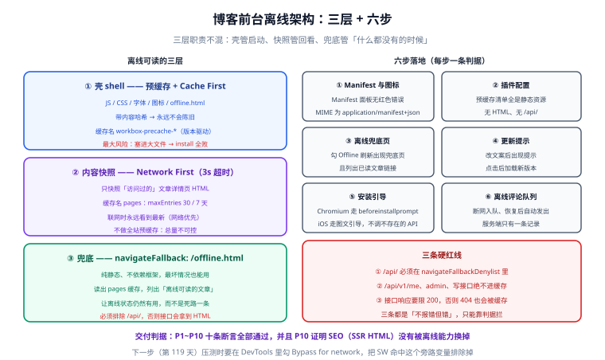

# 实战：给博客前台做离线可读

理论讲完了，这一页把前六页的能力组装到一个真实场景里：**一个 Nuxt SSR 的博客前台**（读者端），目标是把「弱网/断网就白屏」改造成「离线时至少能读最近看过的文章，并明确知道当前离线」。

一句话定位：**本页给出六步落地流程，每一步都有可执行的判据；最终交付 10 条验收断言，全部可以用 DevTools 与命令行验证。**

## 一、需求与验收条件

先写清楚要什么，再动手——「离线可读」这四个字的解释空间太大。

| 编号 | 需求 | 判据 |
| --- | --- | --- |
| R1 | 断网时打开站点，**不出现浏览器错误页** | 显示离线兜底页，含「当前处于离线状态」文案 |
| R2 | 断网时访问**最近读过的**文章，能完整阅读 | 标题、正文、时间正常显示 |
| R3 | 断网时访问**没读过的**文章，给出明确提示 | 落到离线页并可返回首页 |
| R4 | 联网时永远看到**最新内容** | 强制刷新后内容与后台一致 |
| R5 | 站点可安装到桌面/主屏 | 桌面出现安装入口；手机主屏图标为品牌图 |
| R6 | 新版本部署后用户能感知 | 出现「有新版本」提示，点击后刷新到新版 |
| R7 | 断网时的评论提交**不丢失** | 恢复网络后自动发出，且只产生一条记录 |
| R8 | 离线能力**不影响** SEO 与服务端渲染 | 抓取工具（无 SW）看到的仍是完整 SSR HTML |
| R9 | 不缓存任何个人化数据 | `Cache Storage` 中无 `/api/v1/me` 之类的响应 |
| R10 | 缓存体积可控 | `Cache Storage` 总量 < 30MB（默认值上限） |

## 二、架构：离线可读的三层



三层各自职责明确，**不要混在一层里**：

| 层 | 内容 | 策略 | 缓存名 |
| --- | --- | --- | --- |
| **壳（shell）** | JS/CSS/字体/图标、`offline.html` | 预缓存（Cache First） | `workbox-precache-*` |
| **内容快照** | **访问过的**文章详情页 HTML | Network First（超时 3s）→ 命中缓存 | `pages` |
| **兜底** | 离线页本身 | 预缓存 + `navigateFallback` | `workbox-precache-*` |

关键取舍：**只对「访问过的文章」做快照**，而不是预缓存全部文章。理由有三——文章总量不可控、预缓存清单会随内容增长而爆炸、且用户实际回头读的比例很低。

## 三、六步落地

### 第 1 步：Manifest 与图标

```json [public/manifest.webmanifest]
{
  "name": "博客平台",
  "short_name": "博客",
  "id": "/?source=pwa",
  "start_url": "/?source=pwa",
  "scope": "/",
  "display": "standalone",
  "theme_color": "#2563eb",
  "background_color": "#ffffff",
  "icons": [
    { "src": "/icons/pwa-192.png", "sizes": "192x192", "type": "image/png" },
    { "src": "/icons/pwa-512.png", "sizes": "512x512", "type": "image/png" },
    { "src": "/icons/maskable-512.png", "sizes": "512x512", "type": "image/png", "purpose": "maskable" }
  ]
}
```

**判据**：DevTools → Application → Manifest 无红色错误；`curl -I /manifest.webmanifest` 的 `Content-Type` 为 `application/manifest+json`。

### 第 2 步：插件配置（Nuxt 场景）

```ts [nuxt.config.ts]
export default defineNuxtConfig({
  modules: ['@vite-pwa/nuxt'],
  pwa: {
    registerType: 'prompt',
    manifest: false,               // 用 public/ 下自己维护的 manifest
    workbox: {
      // ① 预缓存只放壳
      globPatterns: ['**/*.{js,css,svg,woff2,png}'],
      globIgnores: ['**/screenshots/**'],
      cleanupOutdatedCaches: true,
      // ② 导航请求：网络优先，3s 超时回兜底页
      navigateFallback: '/offline.html',
      // ③ 接口绝不回退成 HTML
      navigateFallbackDenylist: [/^\/api\//],
      runtimeCaching: [
        {
          // ④ 文章详情页：网络优先后落缓存，实现「读过的可离线读」
          urlPattern: /^https?:\/\/[^/]+\/posts\/[^/]+\/?$/,
          handler: 'NetworkFirst',
          options: {
            cacheName: 'pages',
            networkTimeoutSeconds: 3,
            expiration: { maxEntries: 30, maxAgeSeconds: 7 * 24 * 60 * 60 },
            cacheableResponse: { statuses: [200] },
          },
        },
        {
          // ⑤ 公开只读接口：允许 5 分钟陈旧
          urlPattern: /\/api\/v1\/(posts|categories|tags)(\/|\?|$)/,
          handler: 'NetworkFirst',
          options: {
            cacheName: 'api-public',
            networkTimeoutSeconds: 3,
            expiration: { maxEntries: 50, maxAgeSeconds: 5 * 60 },
            cacheableResponse: { statuses: [200] },
          },
        },
        {
          // ⑥ 图片：缓存优先
          urlPattern: ({ request }) => request.destination === 'image',
          handler: 'CacheFirst',
          options: {
            cacheName: 'images',
            expiration: { maxEntries: 60, maxAgeSeconds: 30 * 24 * 60 * 60 },
            cacheableResponse: { statuses: [0, 200] },
          },
        },
      ],
      // ⑦ 明确不缓存个人化接口与写接口（写接口由离线队列处理）
      navigateFallbackDenylist: [/^\/api\//],
    },
    devOptions: { enabled: false },
  },
})
```

:::danger 三条硬红线（配错任意一条都会出线上问题）
1. **`/api/` 必须在 `navigateFallbackDenylist` 里**。否则断网时接口请求会拿到 `offline.html` 的 HTML，`res.json()` 抛出的错误会指向完全无关的位置，排查成本极高。
2. **`/api/v1/me`、`/api/v1/admin/*`、评论写接口绝不能进缓存**。个人化数据缓存后会串号，写接口缓存则语义就不成立。
3. **`cacheableResponse.statuses: [200]` 对接口是必须的**。不加的话，接口返回的 404 也会被缓存，用户会长期看到「文章不存在」。
:::

### 第 3 步：离线兜底页

`public/offline.html`（纯静态、不依赖任何 JS 框架——**它要在最坏的情况下可用**）：

```html [public/offline.html]
<!doctype html>
<html lang="zh-CN">
  <head>
    <meta charset="utf-8" />
    <meta name="viewport" content="width=device-width,initial-scale=1" />
    <title>当前离线 · 博客平台</title>
    <style>
      body { font-family: system-ui, sans-serif; max-width: 34rem; margin: 12vh auto; padding: 0 1.5rem; color: #0f172a; }
      .badge { display: inline-block; padding: .25rem .6rem; border-radius: 999px; background: #fef3c7; color: #92400e; font-size: .8rem; }
      button { margin-top: 1.5rem; padding: .6rem 1.1rem; border: 0; border-radius: .5rem; background: #2563eb; color: #fff; font-size: 1rem; }
    </style>
  </head>
  <body>
    <p class="badge">离线模式</p>
    <h1>当前没有网络连接</h1>
    <p>页面壳已缓存，但这条内容还没有离线副本。</p>
    <p>你可以：重新连接网络后刷新；或返回首页查看<strong>已读过的文章</strong>。</p>
    <button onclick="location.reload()">重新加载</button>
    <p><a href="/">返回首页</a></p>
    <script>
      // 顺便把「已缓存的文章列表」渲染出来，让离线页真的有用
      if ('caches' in window) {
        caches.open('pages').then(async (cache) => {
          const urls = (await cache.keys()).map((r) => new URL(r.url).pathname)
          if (!urls.length) return
          const list = document.createElement('ul')
          urls.slice(0, 10).forEach((u) => {
            const li = document.createElement('li')
            const a = document.createElement('a')
            a.href = u
            a.textContent = decodeURIComponent(u)
            li.appendChild(a)
            list.appendChild(li)
          })
          const box = document.createElement('div')
          box.innerHTML = '<h2>离线可读的文章</h2>'
          box.appendChild(list)
          document.body.appendChild(box)
        })
      }
    </script>
  </body>
</html>
```

**判据**：勾 Offline 后刷新 → 出现这个页面，且「离线可读的文章」下列出了之前访问过的文章链接，点进去能读到完整正文。

### 第 4 步：更新提示

```ts [plugins/pwa.client.ts]
// 只在客户端运行；把「有新版本」做成页面角落的提示条
export default defineNuxtPlugin(() => {
  if (!('serviceWorker' in navigator)) return

  let refreshing = false
  navigator.serviceWorker.addEventListener('controllerchange', () => {
    if (refreshing) return
    refreshing = true
    location.reload()
  })

  navigator.serviceWorker.ready.then((reg) => {
    const notify = (worker: ServiceWorker) => {
      const el = document.querySelector('#pwa-update')
      if (!el) return
      el.hidden = false
      el.querySelector('button')?.addEventListener('click', () => {
        worker.postMessage({ type: 'SKIP_WAITING' })
      })
    }
    if (reg.waiting) notify(reg.waiting)
    reg.addEventListener('updatefound', () => {
      reg.installing?.addEventListener('statechange', (e) => {
        const sw = e.target as ServiceWorker
        if (sw.state === 'installed' && navigator.serviceWorker.controller) notify(sw)
      })
    })
    // 长驻页面每小时主动检查一次，否则用户可能几天拿不到新版
    setInterval(() => void reg.update(), 60 * 60 * 1000)
  })
})
```

**判据**：改一句 `offline.html` 文案 → 重新构建 → 刷新页面 → 出现更新提示；点击后页面自动刷新到新版本，且 `Cache Storage` 里旧缓存名被删除。

### 第 5 步：安装引导（区分 Chromium 与 iOS）

```vue [components/InstallHint.vue]
<script setup lang="ts">
import { onMounted, ref } from 'vue'

const showButton = ref(false)
const isIosHint = ref(false)
let deferred: any = null

onMounted(() => {
  const standalone =
    window.matchMedia('(display-mode: standalone)').matches ||
    (window.navigator as any).standalone === true
  if (standalone) return                                  // 已安装 → 不显示

  const isIos = /iphone|ipad|ipod/i.test(navigator.userAgent)
  if (isIos) {
    isIosHint.value = true                                // iOS 只能图文引导
    showButton.value = true
    return
  }
  window.addEventListener('beforeinstallprompt', (e) => {
    e.preventDefault()
    deferred = e
    showButton.value = true
  })
})

async function onClick() {
  if (deferred) {
    await deferred.prompt()
    await deferred.userChoice
    deferred = null
    showButton.value = false
    return
  }
  // iOS 走这里：弹出图文说明，告诉用户「分享 → 添加到主屏幕」
  alert('点击底部分享按钮，选择「添加到主屏幕」，即可安装本应用')
}
</script>

<template>
  <button v-if="showButton" @click="onClick">
    {{ isIosHint ? '如何安装到主屏幕？' : '安装到桌面' }}
  </button>
</template>
```

**判据**：桌面 Chromium 上出现「安装到桌面」并可用；iOS 真机上出现「如何安装到主屏幕？」并给出图文说明（**不会**尝试调用不存在的 API）。

### 第 6 步：离线评论不丢（复用第七页的队列）

按[离线数据](../OfflineData/index.md)第四节落一份 `outbox`，接入提交评论的动作。

**判据**：断网提交 → `IndexedDB → app-offline → outbox` 出现一条记录且 `attempts = 0`；恢复网络 → 记录消失、UI 翻成「已发送」、服务端只有一条评论。

## 四、验收清单（10 条断言）

| # | 断言 | 操作 | 期望 |
| --- | --- | --- | --- |
| P1 | Manifest 合法 | 访问 `/manifest.webmanifest` | 返回 JSON，Content-Type 为 `application/manifest+json` |
| P2 | SW 已激活 | Application → Service Workers | 状态为 activated，Scope 为 `/` |
| P3 | 预缓存不含 HTML/API | 控制台列出 precache 的 URL | 全是静态资源，无 `.html`、无 `/api/` |
| P4 | 离线有兜底 | 勾 Offline → 访问未读文章 | 显示 `offline.html`，含「离线模式」文案 |
| P5 | 已读文章离线可读 | 先正常访问一篇文章 → 勾 Offline → 刷新该页 | 正文完整显示 |
| P6 | 联网看到最新 | 取消 Offline → 强制刷新 | 内容与后台一致 |
| P7 | 不缓存个人化数据 | 登录后切换账号 → 查看 Cache Storage | 无 `/api/v1/me` 等个人化响应 |
| P8 | 更新提示可用 | 改文案后重新构建并刷新 | 出现提示，点击后加载新版本 |
| P9 | 离线提交不丢且不重 | 断网提交评论 → 恢复网络 | 服务端只有一条记录 |
| P10 | SEO 不受影响 | `curl -s http://localhost:3000/posts/hello` | 返回**完整 SSR HTML**（含标题与正文，不依赖 JS） |

P10 值得强调：**PWA 不能破坏 SSR**。SW 只在浏览器里工作，抓取工具拿到的应该是服务端渲染好的完整 HTML——这条断言是「离线能力没有把 SEO 换掉」的守门人。

## 五、常见阻力与应对

| 阻力 | 应对 |
| --- | --- |
| 「缓存导致用户看到旧内容」 | 明确哪些能陈旧（图片、已读文章快照）、哪些不能（接口数据、后台操作），把不能陈旧的写进 `Network Only` |
| 「QA 说测试环境装不上」 | 内网 HTTP 域名不是安全上下文，**测不了**。给测试环境配 HTTPS（自签证书也可，需在设备上信任） |
| 「用户装了旧版本，问题修不掉」 | 上线当天**必须**能推送新 SW；同时保留「卸载重装」的兜底说明 |
| 「缓存越滚越大」 | 每个 cache 都用 `maxEntries + maxAgeSeconds` 双限，并在监控里看 `Storage` 用量 |
| 「iOS 上实验不了推送」 | iOS 需要「已装到主屏 + 用户手势」两个前置条件，测试前先走一遍安装流程 |

## 六、本页产出的文档与下一步

本页即项目第 118 天的构建步骤产出，同时更新了[项目总览](../../../../project/Complete/BlogPlatform/index.md)与[进展记录](../../../../project/Complete/BlogPlatform/Progress/index.md)。下一步（第 119 天）按既定口径做**压测**，本页新增的离线能力会作为压测的**旁路变量**记录（SW 命中会显著拉低实测 QPS 与服务端压力，压测时要在 DevTools 里勾 **Bypass for network** 排除干扰）。

## 参考资料

- [web.dev：Learn PWA](https://web.dev/learn/pwa)
- [Workbox：Caching strategies](https://developer.chrome.com/docs/workbox/caching-strategies-overview)
- [MDN：Making PWAs installable](https://developer.mozilla.org/en-US/docs/Web/Progressive_web_apps/Guides/Making_PWAs_installable)
- [vite-plugin-pwa 官方文档](https://vite-pwa-org.netlify.app/)
- [博客平台项目：全文搜索（与离线快照的取舍对比）](../../../../project/Complete/BlogPlatform/Search/index.md)
