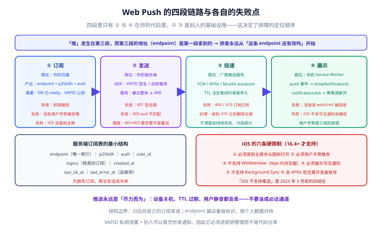

# 消息推送：从订阅到触达

**Web Push（网页推送）** 是唯一一种「浏览器已关闭也能把消息送到用户设备」的 Web 能力。它由四段链路组成：页面订阅 → 服务端加密发送 → 浏览器厂商的推送服务 → Service Worker 展示通知。这四段里，**只有第一段和第四段在你的代码里**，中间两段是别人的基础设施——这一点决定了排障时的定位顺序。

一句话定位：**本页讲清 Web Push 的四段链路与它们各自的失败点，给出可运行的最小实现，并把 iOS 的硬限制摆在最前面——不先确认它们，写多少代码都是白写。**

## 一、四段链路



| 段 | 谁在跑 | 关键产物 | 失败表现 |
| --- | --- | --- | --- |
| **① 订阅** | 你的页面 | `subscription.endpoint` + `keys.p256dh` + `keys.auth` | 权限被拒 / 被浏览器忽略（没走用户手势） |
| **② 发送** | 你的服务端 | 用私钥签名（VAPID）、按 RFC 8291 加密 | 签名错 → `401`；`aud` 与 endpoint 不匹配 → `403` |
| **③ 投递** | 浏览器厂商推送服务（FCM / APNs / Mozilla autopush） | — | `404` / `410`：订阅已失效，**必须删除** |
| **④ 展示** | 你的 Service Worker | `showNotification()` | 不展示 → iOS 会**撤销权限**（见第六节） |

:::tip 一句话理解
**推送的「推」发生在第三段，而第三段的地址（endpoint）是你第一段拿到的。** 所以「推送失败」的第一步排查永远是：**这条 endpoint 还有效吗？**
:::

## 二、四个关键概念

| 概念 | 是什么 | 来源 | 注意 |
| --- | --- | --- | --- |
| `endpoint` | 推送服务的 URL，形如 `https://fcm.googleapis.com/fcm/send/xxxx` | 订阅时由浏览器返回 | 视为**长期不变的设备级标识**；能追踪用户，**属于个人数据**，要按隐私政策处理 |
| `keys.p256dh` / `keys.auth` | 客户端公钥与认证密钥，用于加密 payload | 订阅时返回 | 丢失后无法向该订阅发送，只能让用户重新订阅 |
| **VAPID 公钥 / 私钥** | 服务端身份的签名密钥对（RFC 8292） | **你自己生成**，一辈子一对 | 公钥随 `applicationServerKey` 给页面；**私钥只能待在服务端**，泄露等于别人可以冒充你发通知 |
| **Server Key `sub`** | VAPID 联系邮箱（`mailto:`）或站点 URL | 配置项 | 推送服务在出问题时用它联系你，**不要留空** |

## 三、订阅：页面侧（含 iOS 前置判断）

订阅必须由**用户手势**直接触发——iOS Safari 强制要求，其他浏览器在实践中也只有在手势里调用才稳。所以不要写 `window.onload = subscribe()`。

```js [src/push/subscribe.js]
// 把 VAPID 公钥（base64url）转成 subscribe 需要的 Uint8Array
function urlBase64ToUint8Array(base64Url) {
  const padding = '='.repeat((4 - (base64Url.length % 4)) % 4)
  const base64 = (base64Url + padding).replace(/-/g, '+').replace(/_/g, '/')
  const raw = atob(base64)
  return Uint8Array.from([...raw].map((c) => c.charCodeAt(0)))
}

// iOS 的判断是「先决条件」而不是「兼容性检测」：没装到主屏就根本没有 PushManager
function pushBlocker() {
  if (!('serviceWorker' in navigator) || !('PushManager' in window)) return 'unsupported'
  const isIOS = /iphone|ipad|ipod/i.test(navigator.userAgent)
  const standalone =
    window.matchMedia('(display-mode: standalone)').matches ||
    window.navigator.standalone === true
  // iOS 上必须「已添加到主屏幕」才可能订阅成功
  if (isIOS && !standalone) return 'ios-need-install'
  return null
}

export async function subscribePush(vapidPublicKey) {
  const blocker = pushBlocker()
  if (blocker === 'unsupported') return { ok: false, reason: 'unsupported' }
  if (blocker === 'ios-need-install') {
    // 这里不要弹权限框，弹了也没用；改为引导「分享 → 添加到主屏幕」
    return { ok: false, reason: 'ios-need-install' }
  }

  // 必须紧跟在用户手势里调用；被 await 打断太久可能被判为非手势触发
  const permission = await Notification.requestPermission()
  if (permission !== 'granted') return { ok: false, reason: permission }

  const reg = await navigator.serviceWorker.ready
  const sub = await reg.pushManager.subscribe({
    // 规范要求：所有推送都必须展示可见通知；Safari 不支持静默推送
    userVisibleOnly: true,
    applicationServerKey: urlBase64ToUint8Array(vapidPublicKey),
  })

  // 订阅信息必须交给服务端保存，服务端才有地方发
  await fetch('/api/v1/push/subscriptions', {
    method: 'POST',
    headers: { 'Content-Type': 'application/json' },
    body: JSON.stringify(sub.toJSON()),
  })
  return { ok: true }
}

// 正确用法：绑在手势上
document.querySelector('#push-toggle')?.addEventListener('click', () => {
  void subscribePush(window.__VAPID_PUBLIC_KEY__)
})
```

## 四、服务端：生成密钥与发送

生成一对 VAPID 密钥（只做一次，把私钥放进密钥管理，不要提交进仓库）：

```shell
npx web-push generate-vapid-keys --json
# 输出示例（示例值，切勿照抄使用）：
# { "publicKey": "B...", "privateKey": "..." }
```

发送端最小实现（Node，`web-push` **3.6.7**）：

```js [server/push.js]
import webpush from 'web-push'

webpush.setVapidDetails(
  'mailto:ops@example.com',   // sub：推送服务联系你的方式，不要留空
  process.env.VAPID_PUBLIC_KEY,
  process.env.VAPID_PRIVATE_KEY,
)

// subscription 就是页面上 sub.toJSON() 存下来的那条记录
export async function sendTo(subscription, payload) {
  try {
    await webpush.sendNotification(
      subscription,
      JSON.stringify(payload), // 建议保持小：整体 ≤ 4KB（含加密开销）
      { TTL: 60 * 60 } // 单位秒：设备离线时推送服务的保留时间
    )
    return { ok: true }
  } catch (err) {
    // 404 / 410 表示订阅已死：必须删除，否则会反复失败
    if (err.statusCode === 404 || err.statusCode === 410) {
      await deleteSubscription(subscription.endpoint)
      return { ok: false, reason: 'gone', cleaned: true }
    }
    // 401/403 是配置问题（VAPID 签名或 aud 不匹配），应当告警而不是重试
    if (err.statusCode === 401 || err.statusCode === 403) {
      alertOps('web-push auth failure', err.body)
      return { ok: false, reason: 'auth' }
    }
    return { ok: false, reason: 'transient', status: err.statusCode }
  }
}
```

服务端订阅表的最小结构：

| 字段 | 说明 |
| --- | --- |
| `endpoint` | **唯一索引**；同一个 endpoint 重复订阅只保留一条 |
| `p256dh` / `auth` | 加密所需，随订阅一起存 |
| `user_id` | 归属谁（可空，用于匿名订阅） |
| `topics` | 订阅的类别（文章更新 / 评论回复），**用类别而不是全量推送** |
| `created_at` / `last_ok_at` / `last_error_at` | 运维用：连续失败可提前清理 |

## 五、Service Worker 侧：`push` 与点开

```js [sw.js]
self.addEventListener('push', (event) => {
  // 兼容两种 payload：JSON 与纯文本（有些实现不带 Content-Type）
  let data = {}
  try {
    data = event.data ? event.data.json() : {}
  } catch {
    data = { title: '新消息', body: event.data?.text() ?? '' }
  }

  event.waitUntil(
    self.registration.showNotification(data.title || '博客平台', {
      body: data.body || '',
      icon: '/icons/pwa-192.png',   // Android 用；iOS 忽略
      badge: '/icons/badge-72.png',
      tag: data.tag,                // 同 tag 的通知会互相替换，避免刷屏
      renotify: Boolean(data.tag),
      data: { url: data.url || '/' }, // 供点击处理使用
    })
  )
})

self.addEventListener('notificationclick', (event) => {
  event.notification.close()
  const target = new URL(event.notification.data?.url || '/', self.location.origin).href

  event.waitUntil(
    (async () => {
      // 已有该站点的窗口就聚焦，没有才新开——这是「像 App」的关键细节
      const clients = await self.clients.matchAll({ type: 'window', includeUncontrolled: true })
      for (const client of clients) {
        if (client.url === target && 'focus' in client) return client.focus()
      }
      return self.clients.openWindow(target)
    })()
  )
})
```

:::danger 三个会让推送「发出去但没人收到」的实现错误
1. **`showNotification()` 没有在 `waitUntil` 里调用**。SW 可能在 Promise 完成前被回收，通知就不显示；iOS 会因此**撤销你的推送权限**。正确做法：`event.waitUntil(self.registration.showNotification(...))`。
2. **iOS 依赖浏览器自动展示**。Safari **不支持静默推送**，`showNotification` 必须自己调、且必须真的展示一条可见通知；唯一例外是通知已被用户关闭时的高优先级 `push`（需要 `Notification` 的 `priority` 声明），但这条通道依赖用户操作的时机，**不能作为设计前提**。
3. **用 `notificationclick` 的 `event.notification.data` 前不做空判断**。如果发送时没带 `data.url`，点击处理会抛错，表现为「点了通知没反应」。正确做法：给一个默认 URL。
:::

## 六、iOS 的六条硬限制（必须逐条确认）

这是本页最重要的一节。iOS/iPadOS 自 **16.4** 起支持 Web Push，但限制远多于 Android：

| # | 限制 | 工程后果 |
| --- | --- | --- |
| 1 | **必须「添加到主屏幕」后从主屏图标打开**，普通 Safari 标签页里 `PushManager` 不存在 | 必须先做安装引导；直接在标签页弹权限框会静默失败 |
| 2 | **必须由用户手势直接触发** `requestPermission()` | 不能在 `setTimeout` 或页面加载时调用 |
| 3 | **不支持 `WKWebView`**（App 内嵌浏览器、微信/QQ 内置浏览器） | 在 App 内打开的网页无法订阅，必须引导用 Safari 打开 |
| 4 | **必须展示可见通知**，不支持静默推送 | 与 `userVisibleOnly: true` 一致；不展示会被撤权 |
| 5 | **不支持 Background Sync** | 推送到达后的补发逻辑不能在 iOS 上依赖 `sync` |
| 6 | **推送经 APNs 投递**，但**不需要**加入 Apple Developer Program | 无需苹果开发者账号；只要 VAPID 流程走通即可 |

:::warning 一个常见误判
「iOS 不支持 Web Push」——**这句话在 2023 年 3 月以后就不成立了**（iOS 16.4 起支持）。但它**依然不支持在浏览器标签页里推送**，所以「我们的 iOS 用户点了订阅没反应」这个现象，绝大多数情况下是**没装到主屏**，而不是不支持。
:::

## 七、订阅生命周期治理

订阅不是「存一次管一辈子」。它会因为以下原因失效：用户清空浏览器数据、卸载 PWA、系统回收、端侧密钥轮换。治理规则：

1. **只认推送服务的回执**。判断订阅是否有效，唯一权威信号是发送时返回的 **404 / 410**；`pushsubscriptionchange` 事件**不是所有浏览器都会触发**，只能当尽力而为的提示。
2. **收到 410 立刻删除**。不清就会持续失败，还会污染统计（「发送成功率 40%」很可能只是没清理死订阅）。
3. **同一 endpoint 唯一**。用户反复点订阅会换回同一个 endpoint（通常），用唯一索引保证不重复入库。
4. **按类别订阅，不要全量推送**。让用户能选「只收评论回复」；全量推送的退订率极高，且**用户退订的是整个权限，不是某一个类别**。
5. **提供「关闭推送」入口**。它比让用户去浏览器设置里关要好——后者是一次性全关，你再也唤不回。

## 八、什么时候不该做推送

| 判据 | 结论 |
| --- | --- |
| 站点是内容型博客，更新频率低（每周几篇） | **推送价值很低**，RSS / 邮件更合适；强推会显著提高退订与静音率 |
| 主要用户在 iOS 且不愿意装 PWA | 推送基本触达不了，先别做 |
| 团队没有服务端定时任务与密钥管理能力 | 先别做——VAPID 私钥泄露是安全事故，不是功能 bug |
| 想用它替代站内信 / 邮件 | 不要把推送当必达通道：设备关机、TTL 过期、用户静音都会丢，**它永远是「尽力而为」** |
| 有明确的高时效场景（评论回复、预约提醒、任务完成） | **值得做**，这是推送的正解：**少而准** |

## 九、验证方式

1. 生成密钥后，把公钥配到前端、私钥配到服务端环境变量：

   ```shell
   npx web-push generate-vapid-keys --json
   ```

2. 本地起站点（**必须 localhost 或 HTTPS**），在页面上点击订阅按钮 → DevTools → Application → **Service Workers** 应能看到 Push 订阅已建立（Chrome 的 Application 面板会显示订阅状态）。
3. 用服务端脚本向该订阅发一条：

   ```shell
   node -e "require('./server/send-test.js')"
   ```

   预期：桌面弹出通知；点击后**聚焦到已有标签页**而不是新开一个。
4. 在 DevTools → Application → **Service Workers** 里点 **Push** 按钮可以本地模拟一次推送（不经过服务端），用来验证 SW 的 `push` 处理是否正确。注意：DevTools 的这个按钮**不验证**加密与 VAPID 签名，因此它必须与服务端实发结合使用。
5. 向一个已失效的订阅发送（可手动把 endpoint 改一位）→ 预期服务端日志打印 `410` 并**删除该订阅记录**。

## 参考资料

- [MDN：Push API](https://developer.mozilla.org/en-US/docs/Web/API/Push_API)
- [MDN：Notifications API](https://developer.mozilla.org/en-US/docs/Web/API/Notifications_API)
- [RFC 8030：Generic Event Delivery Using HTTP Push](https://www.rfc-editor.org/rfc/rfc8030)
- [RFC 8291：Message Encryption for Web Push](https://www.rfc-editor.org/rfc/rfc8291) ｜ [RFC 8292：VAPID](https://www.rfc-editor.org/rfc/rfc8292)
- [Apple：Sending web push notifications in web apps and browsers](https://developer.apple.com/documentation/usernotifications/sending-web-push-notifications-in-web-apps-and-browsers)
- [web-push（Node 库）](https://github.com/web-push-libs/web-push)
