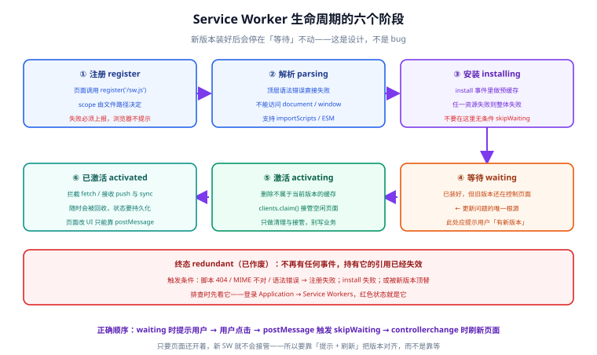

# Service Worker：生命周期与更新

**Service Worker（服务工作线程）** 是本专题其余一切的底座：没有它就没有离线、没有推送、没有后台任务。但真正让团队踩坑的不是它的 API，而是它的**生命周期**——尤其是那个叫 `waiting` 的状态：新版本已经下载好了，却**故意不接管页面**。

一句话定位：**本页讲清 Service Worker 从注册到作废的六个阶段，以及「我明明部署了新版本，用户为什么还在跑旧代码」这个问题的唯一正确解法。**

## 一、六个阶段：一张图看懂



| 阶段 | 触发时机 | 在这一步该做什么 | 出错的典型症状 |
| --- | --- | --- | --- |
| **注册（register）** | 页面调用 `navigator.serviceWorker.register()` | 检查返回值与错误，不要静默失败 | 控制台一行 `Failed to register a ServiceWorker` 被忽略 |
| **解析（parsing）** | 浏览器解析 `sw.js` | 保证 JS 语法正确、不引用浏览器不认识的 API | 顶层语法错误 → 直接进 `redundant`，注册失败 |
| **安装（installing）** | `install` 事件 | 预缓存静态资源；任一资源失败则整体失败 | `precacheAndRoute` 里有 404 → 安装失败，离线永远不可用 |
| **等待（installed / waiting）** | 安装成功，但页面上还有旧版本在控制 | **在此处通知用户「有新版本」** | 不做提示 → 用户永远不会换到新版本 |
| **激活（activating）** | `activate` 事件（旧版本释放后，或旧版本不存在） | **清理旧版本缓存**、接管未受控页面 | 不清理 → 缓存无限增长、旧资源长期驻留 |
| **已激活（activated）** | 激活完成，开始拦截 `fetch` | 正常处理请求与 `message` | 只在这里写「初始化逻辑」而不做持久化 → SW 被回收后状态归零 |

另有一个**终态 `redundant`（已作废）**：注册失败、安装失败、或被新版本顶替时进入。这个状态**不会再有事件**，如果页面持有它的引用，该引用已经失效。

## 二、注册：位置决定能力范围

```js [src/main.js]
// 只注册一次；重复注册同一个 URL 是幂等的
if ('serviceWorker' in navigator) {
  // 注意：用 load 事件推迟注册，避免与首屏资源抢带宽
  window.addEventListener('load', () => {
    navigator.serviceWorker
      .register('/sw.js', { scope: '/' })
      .then((reg) => {
        console.log('[sw] registered, scope =', reg.scope)
      })
      .catch((err) => {
        // 不要吞掉错误：注册失败意味着所有离线能力都没了
        console.error('[sw] register failed', err)
      })
  })
}
```

三条硬规则：

1. **`scope` 由 SW 文件路径决定**，想控制全站就把 `sw.js` 放在站点根。放在 `/assets/sw.js` 只能控制 `/assets/*`——**这是「注册成功但没有离线能力」的头号原因**。
2. **注册要放在 `load` 之后**（或至少不与首屏关键资源竞争）。SW 脚本在后台下载并解析，抢带宽会拖慢首屏。
3. **失败必须上报**。`register()` 的 Promise 会 reject（脚本 404、MIME 类型不对、语法错误），而**浏览器不会在页面上提示任何东西**。

## 三、更新：`waiting` 是设计，不是 bug

浏览器检查更新的时机是**导航到作用域内的页面时**（以及每次 `register()` 调用、以及 `push`/`sync` 等功能事件前）。发现 `sw.js 字节级不同` 就会下载新版本并进入安装。

关键点：**安装完成后，如果旧版本还在控制着页面，新版本会停在 `waiting`**。这是刻意的设计——否则用户正在填表单时页面代码被换掉，会产生难以复现的错乱。

由此产生三个必须知道的事实：

| 事实 | 含义 |
| --- | --- |
| **只要页面还开着，新 SW 就不会接管** | 「部署后刷新一下还是旧代码」在**当前这个标签页**里是正常的，要关掉所有该站标签页再开 |
| **默认按字节比较** | 改一个空格也会触发更新；但同时意味着**只改缓存里的文件不改 `sw.js`，不会触发更新**（除非你在别处改了 SW 的输入） |
| **`updateViaCache` 默认 `'imports'`** | 浏览器仍会对 `importScripts()` 引入的脚本走 HTTP 缓存；把 `sw.js` 的 HTTP 缓存设成 `no-cache` 是最省心的做法 |

### 主动检查更新

```js [src/main.js]
// 长驻页面（SPA）里建议定期手动检查，避免用户一直停留而不触发导航
const reg = await navigator.serviceWorker.getRegistration()
if (reg) {
  // 每小时一次；不必更频繁，管理后台等场景可放宽到每天
  setInterval(() => reg.update(), 60 * 60 * 1000)
}
```

:::danger 两个常见错误写法
1. **在 `install` 里直接 `self.skipWaiting()`，指望「更新立刻生效」**。这会让新 SW 在旧页面还在运行时接管并删掉旧缓存，**正在使用页面的用户可能瞬间拿到 404 的资源**（例如懒加载的旧 chunk 已被清理）。正确做法：把 `skipWaiting` 放到「用户确认更新」之后，由页面 `postMessage` 触发。
2. **只写了 `registration` 却从不调用 `update()`**。用户把一个 PWA 一直开着（这是 PWA 的典型用法），可能**几天都拿不到新版本**。正确做法：长驻应用定期 `update()`，并在检测到 `waiting` 时提示。
:::

## 四、正确做法：`waiting` 时提示，用户点击后再切

这是本页最重要的一段代码。它的核心是**把控制权交还给用户**：

```js [src/register-sw.js]
let refreshing = false

// 关键：新 SW 接管（controlling）后刷新一次页面，让页面代码与 SW 版本对齐
navigator.serviceWorker.addEventListener('controllerchange', () => {
  if (refreshing) return
  refreshing = true
  window.location.reload()
})

const reg = await navigator.serviceWorker.register('/sw.js')

// 情况 A：注册时已经有 waiting 的版本（例如用户上次没点更新）
if (reg.waiting) showUpdateToast(reg.waiting)

// 情况 B：本次运行期间装好了新版本
reg.addEventListener('updatefound', () => {
  const installing = reg.installing
  if (!installing) return
  installing.addEventListener('statechange', () => {
    // 出现 waiting 说明页面上还控制着旧版本，此时才需要提示
    if (installing.state === 'installed' && navigator.serviceWorker.controller) {
      showUpdateToast(installing)
    }
  })
})

function showUpdateToast(worker) {
  // 换成你自己的 UI：这里只表达「用户点击后切换」
  const toast = document.querySelector('#update-toast')
  toast.hidden = false
  toast.addEventListener('click', () => worker.postMessage({ type: 'SKIP_WAITING' }))
}
```

对应地，SW 侧只需监听这条消息：

```js [sw.js]
self.addEventListener('message', (event) => {
  if (event.data?.type === 'SKIP_WAITING') {
    // 只在用户明确确认后调用；不要在 install 里无条件调用
    self.skipWaiting()
  }
})
```

:::tip 用 Workbox 的话
`workbox-window` 把上面这套流程封装成了 `Workbox` 类，并由 `vite-plugin-pwa` 提供了开箱 UI（`registerType: 'prompt'`）。原理与上面完全一致——**先提示、后跳过、再刷新**。用封装没问题，但要能说清它在做什么，否则出问题时无从下手。
:::

## 五、缓存版本与清理：`activate` 里唯一该做的事

```js [sw.js]
// 版本号变化才触发更新；构建时可用构建号替换
const VERSION = 'v3'
const PAGES_CACHE = `pages-${VERSION}`
const ASSETS_CACHE = `assets-${VERSION}`
const KEEP = [PAGES_CACHE, ASSETS_CACHE]

self.addEventListener('activate', (event) => {
  event.waitUntil(
    (async () => {
      // 1) 删除所有不属于当前版本的缓存
      const keys = await caches.keys()
      await Promise.all(keys.filter((k) => !KEEP.includes(k)).map((k) => caches.delete(k)))
      // 2) 让当前 SW 接管作用域内未被控制的页面（首次安装时）
      await self.clients.claim()
    })(),
  )
})
```

三条纪律：

1. **缓存名必须带版本**。用固定名 `pages` 的话，新旧版本会写进同一个缓存，新版本无法靠「清空旧缓存」保证一致性。
2. **`activate` 只做清理与接管**，不要在这里做「业务初始化」——`activate` 在 SW 一生中只跑一次，且可能在无页面时被回收。
3. **`clients.claim()` 只影响「尚未被控制的页面」**。首次安装时它会立刻让当前页面进入控制（这会造成「第一次访问没有离线能力，刷新后才有」的观感差异），要理解这是预期行为。

## 六、开发与调试：四个必用开关

DevTools → **Application → Service Workers**：

| 开关 / 操作 | 作用 | 什么时候用 |
| --- | --- | --- |
| **Update on reload** | 每次刷新都强制走「安装 → 立即激活」 | 开发期，避免每次手动点 skipWaiting |
| **Bypass for network** | `fetch` 事件**完全不经过 SW**，直接走网络 | 排查「是不是 SW 缓存导致的」问题 |
| **Offline** | 模拟完全断网 | 验证离线兜底与缓存是否真的可用 |
| **Unregister**（注销） | 彻底移除注册 | 缓存结构改动后清理现场；**排障最后一招** |

另外两个诊断入口：

- **Cache Storage 面板**可以逐条查看缓存内容与响应头，确认某条 URL 到底缓存在哪个 cache 里。
- **Network 面板里的 `(ServiceWorker)` 标记**说明这次响应的 Size 栏是「来自 ServiceWorker」，**不表示请求没发出去**——要区分「命中缓存」与「SW 转发网络」，看 Timing 里是否有真实网络耗时。

:::danger 三个会让排查彻底跑偏的写法
1. **用 `Ctrl/Cmd + Shift + R` 想绕过 SW**。硬刷新不保证绕过，且它会**保留** SW 控制权。正确做法：DevTools 里勾 **Bypass for network**。
2. **手动删掉 `caches` 里的条目就以为清干净了**。IndexedDB 里的离线队列、以及 SW 的 `waiting` 状态**都不会**被清掉。正确做法：先 **Unregister**，再清 Storage，再硬刷新。
3. **在 `install` 里 `Promise.all` 预缓存一堆大文件**。任一失败就整体失败，且首访流量会暴涨。正确做法：预缓存**只放壳与离线页**，业务资源用运行时缓存（见[缓存策略](../CachingStrategy/index.md)）。
:::

## 七、生命周期相关 API 速查

| API | 位置 | 用途 |
| --- | --- | --- |
| `navigator.serviceWorker.register(url, opts)` | 页面 | 注册；`opts.scope` / `opts.updateViaCache` |
| `navigator.serviceWorker.ready` | 页面 | 等到「有激活中的 SW」的 Promise，`PushManager` 订阅前必等 |
| `navigator.serviceWorker.controller` | 页面 | 当前控制本页的 SW；为 `null` 说明本页尚未被控制 |
| `reg.update()` | 页面 | 主动检查更新 |
| `reg.waiting` / `reg.installing` / `reg.active` | 页面 | 三种状态的 worker 引用 |
| `self.skipWaiting()` | SW | 跳过等待，立即接管（**要用户确认后再调**） |
| `self.clients.claim()` | SW | 接管作用域内未被控制的页面 |
| `self.registration.unregister()` | SW | 注销自身（用于紧急下线） |
| `controllerchange` 事件 | 页面 | SW 接管发生变化；**新版本生效时刷新页面靠它** |

## 八、验证方式

按顺序做完，全部通过才算生命周期接对了：

```shell
# 1) 构建并本地起服务（Vite 项目为例）
pnpm build && pnpm preview
```

1. 打开 `http://localhost:4173/` → DevTools → Application → Service Workers，看到一条 **activated and is running** 记录，`Source` 指向 `/sw.js`。
2. 勾 **Offline** 并刷新 → 应看到离线兜底页（而不是浏览器错误页）。
3. 取消 Offline，修改 `offline.html` 任意文案，重新构建、刷新页面 → 控制台应出现 **waiting** 的 worker，且页面出现更新提示。
4. 点击更新提示 → 页面自动刷新一次，看到新文案；DevTools 里旧 worker 消失、`Cache Storage` 中旧版本缓存名被删除。
5. 勾 **Bypass for network** 刷新 → 页面直接走网络，说明缓存确实是 SW 提供的那一份。

## 参考资料

- [MDN：Service Worker API](https://developer.mozilla.org/en-US/docs/Web/API/Service_Worker_API)
- [MDN：Using Service Workers](https://developer.mozilla.org/en-US/docs/Web/API/Service_Worker_API/Using_Service_Workers)
- [web.dev：Service worker lifecycle](https://web.dev/articles/service-worker-lifecycle)
- [Workbox：`workbox-window`](https://developer.chrome.com/docs/workbox/modules/workbox-window)
