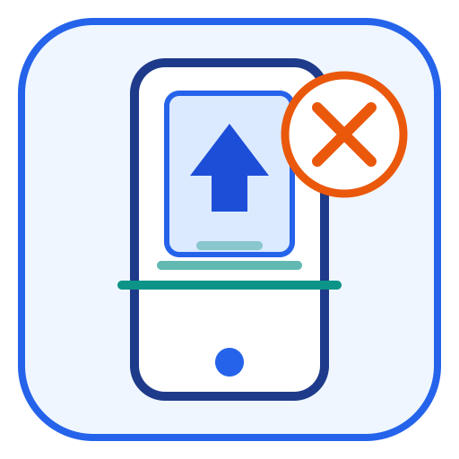
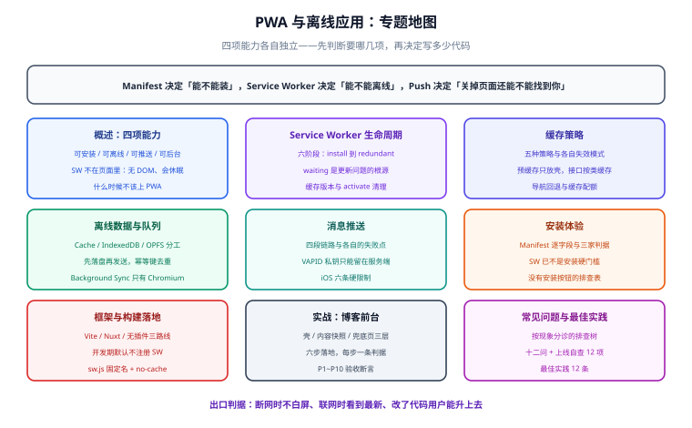

# PWA 与离线应用

**PWA（Progressive Web App，渐进式 Web 应用）** 不是一项技术，而是一组**让网页具备「应用级」能力**的浏览器标准的合称：Service Worker 让网页能在页面之外跑代码，Web App Manifest 让浏览器知道「这是一个可以安装的应用」，Push 与 Notification 让服务端能在页面关闭后触达用户，Cache 与 IndexedDB 让「断网」从崩溃变成一种正常状态。

一句话定位：**这个专题讲的是「网页怎么在页面关闭、代码更新、网络断开这三种非正常状态下还能正常工作」**——把一条只会「在线 + 页面开着 + 跑最新代码」的链路，改造成四条状态里都能自洽的链路。

## 2026-10 版本与工具状态速览

以下是本专题涉及的核心组件状态（**2026-10 联网核对，以 npm 与官方文档为准**）：

| 组件 | 当前版本（发布时间） | 说明 |
| --- | --- | --- |
| Workbox | **7.4.1**（2026-05-04） | Service Worker 的工具库族（预缓存、路由、策略、后台同步、过期清理）；Chrome Aurora 团队接手维护 |
| vite-plugin-pwa | **2.0.0**（2026-10-03） | Vite 生态事实标准；peer 支持 **Vite 3.1~8**、`workbox-build ^7.4.1`、要求 **Node ≥ 20.19** |
| @vite-pwa/nuxt | **1.1.1**（2026-02-06） | Nuxt 3 模块封装；SSR 场景要额外处理「哪些资源进预缓存」 |
| @vite-pwa/assets-generator | **2.0.0**（2026-09-12） | 一张源图生成全套 PWA 图标（含 maskable 与 apple-touch-icon） |
| idb | **8.0.4**（2026-10-06） | IndexedDB 的 Promise 封装，离线队列的常用底座 |
| web-push（Node 服务端） | 3.6.7（2024-01-16） | 服务端 VAPID 签名与加密发送；**长期未更新但协议稳定**，VAPID（RFC 8292）与 Web Push 加密（RFC 8291）未变 |

:::warning 两条最容易过期的旧口径
1. **「PWA = Manifest + Service Worker + HTTPS」这个公式已经不对了**。Chrome 自 **108（Android）/ 112（桌面）** 起移除了「必须有带 fetch 处理器的 Service Worker」这一安装门槛，MDN 现行列出的安装判据里**没有 Service Worker**。Manifest + HTTPS 才是硬门槛；Service Worker 决定的是「能不能离线」，不是「能不能安装」。
2. **「Lighthouse PWA 分数」这个验收手段已经不存在**。Lighthouse **12.0**（2024-04-22，随 Chrome 126，2024-05-10 上线 PageSpeed Insights）**移除了 PWA 分类**，JSON 输出里的 `categories.pwa` 键也一并删除——它的判据本来就是 Chrome 安装判据，Chrome 放宽后这套审计就不再测量任何浏览器真正强制执行的东西。现在验收安装能力要看**运行时信号**：`beforeinstallprompt` 是否触发、DevTools → Application → Manifest 面板是否报红、浏览器的安装入口是否出现。
:::

## 专题地图

## 页面导航

1. [概述：离线能力的四个层次](Overview/index.md) —— PWA 的四项能力、Service Worker 在架构里的位置、什么时候不该上 PWA、最小起步三步
2. [Service Worker：生命周期与更新](ServiceWorker/index.md) —— 六阶段生命周期、`waiting` 状态才是更新问题的根源、`skipWaiting` 的代价、缓存版本与清理纪律
3. [缓存策略：从预缓存到运行时缓存](CachingStrategy/index.md) —— 五种策略的两维判据、Workbox 配置骨架、导航回退、缓存键与配额
4. [离线数据：存储、队列与同步](OfflineData/index.md) —— Cache / IndexedDB / OPFS 的分工、离线写队列、Background Sync 的真实支持面、幂等与冲突
5. [消息推送：从订阅到触达](Push/index.md) —— Web Push 四段链路、VAPID、订阅生命周期治理、iOS 的六条硬限制、点开与统计
6. [安装体验：Manifest 与安装引导](Installability/index.md) —— Chromium 现行安装判据、Manifest 逐字段、`beforeinstallprompt` 正确用法、iOS 的手动路径
7. [框架与构建落地](Framework/index.md) —— Vite / Nuxt / Next 三条路线的差异、开发期与生产期的行为差、SSR 与预缓存的三处冲突
8. [实战：给博客前台做离线可读](Practice/index.md) —— 六步落地（含每步判据）、离线兜底页、验收断言清单
9. [常见问题与最佳实践](FAQ/index.md) —— 按现象分诊的排查树、十二个高频问题、上线自查清单

## 建议的阅读顺序

- **完全没做过 PWA**：从 [概述](Overview/index.md) 读起，重点看第一节的「四项能力」与第三节的「什么时候不该上」——先判断要不要做，再决定做哪几项。
- **只想让页面断网不白屏**：[Service Worker](ServiceWorker/index.md) → [缓存策略](CachingStrategy/index.md)，两页就够，不必碰推送。
- **要支持离线提交表单**：[离线数据](OfflineData/index.md) 是主战场，务必读完「Background Sync 的真实支持面」一节再动手。
- **要发通知**：[消息推送](Push/index.md) 里的 iOS 六条硬限制必须逐条确认，否则会遇到「按钮点了没反应」。
- **要能装到桌面/手机**：[安装体验](Installability/index.md)，重点看 Manifest 逐字段与 `beforeinstallprompt` 的正确时机。
- **用 Vite / Nuxt / Next 落地**：[框架与构建落地](Framework/index.md)，尤其是「开发期不注册 SW」这条。
- **上线前**：[实战](Practice/index.md) 第六节的验收清单 + [常见问题](FAQ/index.md) 的上线自查表。

## 本专题与相邻专题的分工

这几处边界**写死在页面上**，互不替代：

| 相邻专题 | 它讲什么 | 本专题讲什么 |
| --- | --- | --- |
| [浏览器原理](../Basic/Browser/index.md) | 渲染、事件循环、存储机制的**通用原理** | 把这些机制**用在「页面之外」**：Service Worker 的独立线程、Cache Storage 与 IndexedDB 作为离线底座 |
| [国际化与无障碍](../IntlA11y/index.md) | 语言与可用性；其 [测试与门禁页](../IntlA11y/A11yTesting/index.md) 讲 CI 里的质量门禁 | PWA **新增**的两类门禁：SW 注册与离线可用性断言、Manifest 合法性断言；两套门禁可以挂在同一个 CI 里 |
| [前端工程化](../Others/FrontendEngineering/index.md) | 构建、规范、lint 的整体工程结构 | 构建产物**多出一个入口文件**（SW）之后，版本号、缓存清理与部署顺序怎么保证不串味 |
| [前端测试](../Testing/index.md) | 单测、组件测试、E2E 的策略 | 离线与安装**怎么测**：为什么 E2E 要在真实浏览器里勾掉网络，Playwright 的 `context.setOffline()` 与它测不到的部分 |
| [数据可视化](../DataVisualization/index.md) | 图表渲染与大数据量优化 | 与 PWA 无重叠；仅当 PWA 预缓存了体积较大的图表库时才需要回头看**预缓存体积**一节 |
| [Nuxt](../Frame/Nuxt/index.md) | Nuxt 的渲染模式与服务端能力 | 在 Nuxt 上接 PWA 时**新增**的三处冲突：SSR 首帧与 SW 缓存、`_nuxt/*` 的内容哈希、离线时的服务端路由回退 |
| [React / Vue 框架页](../Frame/index.md) | 框架本身的使用 | 框架无关：本专题的判据在任何框架下都成立（SW 跑在页面之外，框架管不到它） |

## 参考资料

- [MDN：Making PWAs installable](https://developer.mozilla.org/en-US/docs/Web/Progressive_web_apps/Guides/Making_PWAs_installable)
- [MDN：Service Worker API](https://developer.mozilla.org/en-US/docs/Web/API/Service_Worker_API)
- [web.dev：Learn PWA（课程）](https://web.dev/learn/pwa)
- [Workbox 官方文档](https://developer.chrome.com/docs/workbox)
- [vite-plugin-pwa 官方文档](https://vite-pwa-org.netlify.app/)
- [RFC 8030：Generic Event Delivery Using HTTP Push](https://www.rfc-editor.org/rfc/rfc8030)
- [RFC 8291：Message Encryption for Web Push](https://www.rfc-editor.org/rfc/rfc8291) ｜ [RFC 8292：VAPID](https://www.rfc-editor.org/rfc/rfc8292)
- [Apple：Sending web push notifications in web apps and browsers](https://developer.apple.com/documentation/usernotifications/sending-web-push-notifications-in-web-apps-and-browsers)
- [Lighthouse 12.0 变更说明（PWA 分类移除）](https://github.com/GoogleChrome/lighthouse/releases/tag/v12.0.0)
