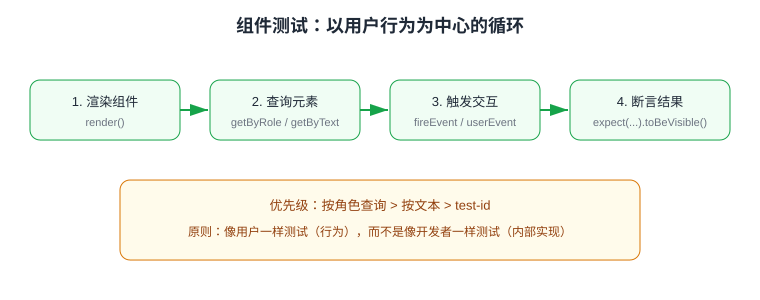

# 组件测试：Testing Library 与 Vue Test Utils

组件测试验证**单个组件在给定 props/状态下的渲染结果与交互行为**，是测试金字塔的中间层。本页以 Testing Library（React / Vue 通用）为主线，Vue Test Utils 作为 Vue 专属补充，覆盖挂载、查询、交互、异步与 Mock。

:::info 当前版本
Testing Library 系列 2026 年仍在活跃维护（`@testing-library/jest-dom` 7.x、`@testing-library/react` 16.x、`@testing-library/vue` 8.x）；`@vue/test-utils` 2.x 配合 Vue 3。运行器按项目选择 [Vitest](../Vitest/index.md) 或 [Jest](../Jest/index.md)，本文示例以 Vitest 为准。
:::

## 两种思路对比

| 维度 | Testing Library | Vue Test Utils |
| --- | --- | --- |
| 理念 | 测用户可见行为（角色、文本、标签） | 测组件实现（实例、props、emit） |
| 查询方式 | `getByRole` / `getByText` 等可访问性查询 | `wrapper.find('css选择器')` |
| 反重构能力 | 强（改内部结构不影响测试） | 弱（依赖类名/结构易碎） |
| 适用 | 交互型业务组件 | 底层通用组件、需要测 emit/provide 的场景 |

核心循环是「渲染 → 查询 → 交互 → 断言」：



## 环境准备

```shell
pnpm add -D vitest jsdom @testing-library/react @testing-library/user-event @testing-library/jest-dom
# Vue 项目把 react 换成 @testing-library/vue @vue/test-utils
```

```typescript [tests/setup.ts]
import "@testing-library/jest-dom/vitest"; // 启用 toBeVisible 等匹配器
import { cleanup } from "@testing-library/react";
import { afterEach } from "vitest";

afterEach(() => cleanup());
```

## React 组件测试

被测组件：

```tsx [src/components/Counter.tsx]
import { useState } from "react";

export function Counter({ step = 1 }: { step?: number }) {
  const [count, setCount] = useState(0);
  return (
    <div>
      <output aria-live="polite">当前：{count}</output>
      <button onClick={() => setCount((c) => c + step)}>增加</button>
    </div>
  );
}
```

测试：

```tsx [src/components/__tests__/Counter.spec.tsx]
import { render, screen } from "@testing-library/react";
import userEvent from "@testing-library/user-event";
import { Counter } from "../Counter";

test("点击增加按钮，计数值 +step", async () => {
  const user = userEvent.setup();
  render(<Counter step={2} />);

  await user.click(screen.getByRole("button", { name: "增加" }));

  expect(screen.getByText("当前：2")).toBeInTheDocument();
});
```

### 查询优先级

| 优先级 | API | 说明 |
| --- | --- | --- |
| 1 | `getByRole` | 按可访问性角色查（最佳，最接近用户/辅助技术） |
| 2 | `getByLabelText` / `getByPlaceholderText` | 表单场景 |
| 3 | `getByText` | 按可见文本查 |
| 4 | `getByTestId` | 兜底（`data-testid`），仅结构无法表达时使用 |

`getBy*` 找不到会直接抛错；`queryBy*` 用于断言「不存在」；`findBy*` 处理异步出现（返回 Promise）。

### 异步与网络 Mock

```tsx
import { render, screen, waitFor } from "@testing-library/react";
import { http, HttpResponse } from "msw";
import { setupServer } from "msw/node";

const server = setupServer(
  http.get("/api/user/1", () => HttpResponse.json({ name: "Tom" }))
);
beforeAll(() => server.listen());
afterEach(() => server.resetHandlers());
afterAll(() => server.close());

test("加载用户名", async () => {
  render(<UserProfile id={1} />);
  await waitFor(() => expect(screen.getByText("Tom")).toBeInTheDocument());
});
```

## Vue 组件测试

### Testing Library（推荐日常用）

```vue [src/components/LoginForm.vue]
<script setup lang="ts">
import { ref } from "vue";
const emit = defineEmits<{ submit: [phone: string] }>();
const phone = ref("");
</script>

<template>
  <form @submit.prevent="emit('submit', phone)">
    <input v-model="phone" aria-label="手机号" />
    <button type="submit">登录</button>
  </form>
</template>
```

```typescript [src/components/__tests__/LoginForm.spec.ts]
import { render, screen } from "@testing-library/vue";
import userEvent from "@testing-library/user-event";
import LoginForm from "../LoginForm.vue";

test("提交时携带手机号", async () => {
  const user = userEvent.setup();
  const submitted = vi.fn(); // 需要通过 onSubmit prop 或事件桥接，见下文 VTU 写法
  render(LoginForm);
  await user.type(screen.getByLabelText("手机号"), "13800138000");
  await user.click(screen.getByRole("button", { name: "登录" }));
});
```

### Vue Test Utils（测 emit / provide / 插件）

```typescript [src/components/__tests__/LoginForm.vtu.spec.ts]
import { mount } from "@vue/test-utils";
import LoginForm from "../LoginForm.vue";

test("submit 事件携带手机号", async () => {
  const wrapper = mount(LoginForm);
  await wrapper.find('input[aria-label="手机号"]').setValue("13800138000");
  await wrapper.find("button").trigger("submit");

  expect(wrapper.emitted("submit")![0]).toEqual(["13800138000"]);
});

// 需要全局插件（pinia/router）时
import { createPinia } from "pinia";
const wrapper = mount(UserMenu, { global: { plugins: [createPinia()] } });
```

## 组件测试清单

写每个组件测试前过一遍：

1. **渲染**：给定 props，关键信息是否出现（文案、数量、禁用态）；
2. **交互**：点击/输入后状态与事件是否正确；
3. **边界**：空数据、超长文本、loading、错误态；
4. **可访问性**：用 `getByRole` 查询本身就是一种 a11y 检查；
5. **隔离**：子组件、网络、定时器全部 Mock，只测当前组件逻辑。

## 易错点

::: danger 组件测试高频坑
1. **用 `fireEvent` 忘了 await**：状态更新是异步的，断言前要 `await user.click(...)` 或包 `waitFor`。
2. **断言内部 state**：Testing Library 无法也不应访问组件内部状态——改为断言 DOM 输出。
3. **`wrapper.find('.btn')` 依赖实现类名**：重构样式即失败——优先 `getByRole`。
4. **act 警告**：在 React 外部直接触发状态更新——统一走 `userEvent`，它会自动包 act。
5. **Vue 里 `trigger` 忘 await**：`await wrapper.find("button").trigger("click")`，否则 DOM 未更新。
6. **cleanup 缺失**：多个测试间 DOM 残留互相污染——在 setup 文件统一 `afterEach(cleanup)`。
:::

## 验证方式

```shell
pnpm vitest run src/components
```

预期输出：

```text
✓ src/components/__tests__/Counter.spec.tsx (2 tests)
✓ src/components/__tests__/LoginForm.spec.ts (3 tests)
Test Files  2 passed (2)
```

## 参考资料

- [Testing Library 官方文档](https://testing-library.com/docs/)
- [Common mistakes with Testing Library](https://kentcdodds.com/blog/common-mistakes-with-react-testing-library)
- [Vue Test Utils 官方文档](https://test-utils.vuejs.org/)
- [MSW 官方文档](https://mswjs.io/)
