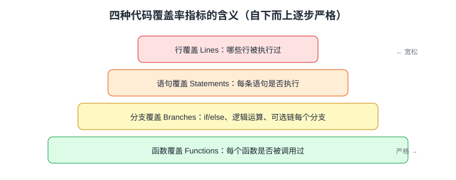

# 覆盖率统计与门禁

代码覆盖率（Code Coverage）回答一个问题：**测试运行时，多少比例的源码被真正执行过**。它是衡量测试完整性的客观指标，也是 CI 里防止「测试越写越少」的门禁。本页覆盖四种指标、V8/Istanbul 两种统计方式、Vitest 与 Jest 的配置、以及如何科学设定阈值。

## 四种覆盖率指标



| 指标 | 含义 | 示例：`if (a || b)` |
| --- | --- | --- |
| 行覆盖 Lines | 哪些代码行被执行 | 跑到该行即算 |
| 语句覆盖 Statements | 每条语句是否执行 | 同上，粒度更细 |
| 分支覆盖 Branches | 每个分支是否都走过 | `a=true` 与 `a=false,b=true` 要各测一次 |
| 函数覆盖 Functions | 每个函数是否被调用 | 未被调用的函数不计入 |

::: tip 一句话理解
行覆盖 100% 只说明「都跑到了」，**分支覆盖**才能暴露 `if` 的另一半没测——四个指标里最值得盯的是分支覆盖。
:::

## 两种统计引擎

| 引擎 | 原理 | 优缺点 |
| --- | --- | --- |
| V8 原生覆盖 | V8 运行时直接记录执行计数 | 快、零转译；不支持分支级排除等细粒度（`v8-to-istanbul` 转换后仍可用） |
| Istanbul（instrumentation） | 构建前给源码注入统计探针 | 指标更全、报告更细；转译慢一些 |

Vitest 默认推荐 `@vitest/coverage-v8`；需要精确到分支的 ignore 注释（`/* c8 ignore next */` / `istanbul ignore`）时选 `@vitest/coverage-istanbul`。Jest 内置 Istanbul。

## Vitest 覆盖率配置

```shell
pnpm add -D @vitest/coverage-v8
```

```typescript [vitest.config.ts 片段]
test: {
  coverage: {
    provider: "v8",
    reporter: ["text", "html", "lcov", "json-summary"], // 终端 + HTML + CI
    reportsDirectory: "./coverage",
    include: ["src/**/*.{ts,tsx,vue}"],
    exclude: ["src/main.ts", "src/**/__mocks__/**", "src/types/**"],
    thresholds: {
      lines: 70,
      branches: 60,
      functions: 75,
      statements: 70,
      // 自动失败：低于阈值 vitest 以非 0 退出码结束，CI 门禁生效
    },
  },
},
```

运行：

```shell
pnpm coverage
```

预期输出（text 报告）：

```text
-------------------|---------|----------|---------|---------|-------------------
File               | % Stmts | % Branch | % Funcs | % Lines | Uncovered Line #s
-------------------|---------|----------|---------|---------|-------------------
All files          |   84.2  |    71.5  |   88.9  |   85.1  |
 utils/format.ts   |     100 |      100 |     100 |     100  |
 api/request.ts    |   68.4  |    52.1  |      75 |   70.2  | 42-58,101
-------------------|---------|----------|---------|---------|-------------------
ERROR: Coverage for branches (52.1%) does not meet threshold (60%)
```

## Jest 覆盖率配置

```javascript [jest.config.js 片段]
module.exports = {
  collectCoverage: true,                    // 也可用 --coverage 开启
  coverageProvider: "v8",                   // Jest 30 默认 v8，可改 babel 默认 istanbul
  collectCoverageFrom: ["src/**/*.{ts,tsx}", "!src/main.tsx"],
  coverageThreshold: {
    global: { lines: 70, branches: 60 },
    "./src/utils/**": { lines: 90 },        // 核心目录单独更高阈值
  },
};
```

## 增量覆盖率与门禁策略

全量阈值的问题：老项目 30% 的存量代码会把新代码也拉下水。两种更科学的做法：

1. **分目录阈值**：`src/utils`、`src/components` 核心目录设 85%+，入口/路由等设 50%。
2. **增量（diff）覆盖率**：只检查本次 PR 改动的行是否被测试覆盖，工具如 `diff-cover`：

```shell
pnpm vitest run --coverage --reporter=json-summary
pnpm dlx diff-cover coverage/lcov.info --compare-branch=origin/main --fail-under=80
```

### CI 集成（GitHub Actions）

```yaml [.github/workflows/ci.yml 片段]
- name: Test with coverage
  run: pnpm coverage
- name: Upload coverage
  uses: actions/upload-artifact@v4
  with:
    name: coverage-report
    path: coverage/
```

也可以接 [Codecov](https://codecov.io/) / Coveralls 做趋势看图与 PR 评论，但**门禁仍应由 `thresholds` 的退出码兜底**，不依赖外部服务。

## 如何科学设定阈值

| 阶段 | 建议阈值（行/分支） | 说明 |
| --- | --- | --- |
| 起步期 | 0% → 只开报告 | 先建立习惯，不开门禁 |
| 成长期 | 60% / 50% | 新代码 diff 覆盖 80% 更实际 |
| 成熟期 | 80% / 70% | 工具函数、状态逻辑可到 90%+ |
| 追求 100% | 不推荐 | 为凑数写无断言测试反而降低质量 |

::: danger 覆盖率的坑
1. **覆盖率 ≠ 测试质量**：没有断言的 `expect(1).toBe(1)` 也能刷高覆盖——Code Review 时抽查测试有效性。
2. **Mock 覆盖了假实现**：把被测模块整个 mock 掉，覆盖的是 mock 文件——用 `include/exclude` 把 `__mocks__` 排除。
3. **只看行覆盖**：`a || b` 类短路逻辑行覆盖满分、分支一半没测——门禁必须含 branches。
4. **阈值一步到位**：从 30% 直接设 80%，团队只能绕过门禁——用 ratchet（棘轮）方式每迭代上调 5%。
5. **报告进了 Git**：`coverage/` 目录应加入 `.gitignore`。
:::

## 验证方式

```shell
pnpm coverage && cat coverage/coverage-summary.json | head -5
```

把 `thresholds.lines` 临时调到 100 再跑一次，应看到非 0 退出码与 `does not meet threshold` 报错——证明门禁生效。

## 参考资料

- [Vitest Coverage 配置](https://vitest.dev/guide/coverage.html)
- [Jest CoverageThreshold](https://jestjs.io/docs/configuration#coveragethreshold-object)
- [Istanbul JS](https://istanbul.js.org/)
- [diff-cover](https://github.com/Bachmann1234/diff_cover)
