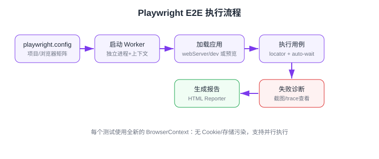

# E2E 测试：Playwright 与 Cypress

端到端（End-to-End，E2E）测试在**真实浏览器**中模拟用户操作完整业务流程（登录、下单、支付），是发布前最后一道防线。本页以 **Playwright**（当前新项目默认选择）为主线，Cypress 作为对照，覆盖安装配置、选择器体系、调试与 CI 集成。

:::info 当前版本（2026-09 核对）
Playwright 当前版本 **1.63**（约每月发版）；Cypress 主线 14/15.x（以[官网](https://www.cypress.io/)为准）。本文命令按 Playwright 1.5x+ 编写，API 兼容。
:::

## Playwright vs Cypress

| 维度 | Playwright | Cypress |
| --- | --- | --- |
| 浏览器矩阵 | Chromium / Firefox / WebKit，含移动仿真 | Chromium 系为主 |
| 驱动方式 | 自研协议，进程外控制（可多 Tab、多域） | 进程内运行，历史限制多 |
| 并行 | 内置多 Worker 并行，CI 免费 | 依赖 Cypress Cloud 编排 |
| 自动等待 | locator 内建 auto-wait | 内建重试 |
| 调试 | Trace Viewer、codegen、UI Mode | Time Travel 界面直观 |
| 语言 | JS/TS、Python、Java、.NET | JS/TS |

结论：**新项目选 Playwright**（跨浏览器、并行、生态全面）；已用 Cypress 的团队不必强迁。

## 安装与初始化

```shell
pnpm create playwright@latest
# 按提示选择：TypeScript = yes；浏览器 = Chromium；目录 = e2e
pnpm exec playwright install chromium   # 安装浏览器二进制
```

目录结构：

```text
e2e/
├─ e2e/
│  └─ login.spec.ts
├─ playwright.config.ts
└─ package.json
```

## 配置

```typescript [playwright.config.ts]
import { defineConfig, devices } from "@playwright/test";

export default defineConfig({
  testDir: "./e2e",
  timeout: 30_000,
  retries: process.env.CI ? 2 : 0,        // CI 上失败重试 2 次
  workers: process.env.CI ? 4 : undefined,
  use: {
    baseURL: "http://localhost:5173",     // 配合 page.goto("/login")
    trace: "on-first-retry",              // 首次重试时记录 trace
    screenshot: "only-on-failure",
  },
  projects: [
    { name: "chromium", use: { ...devices["Desktop Chrome"] } },
    { name: "mobile", use: { ...devices["Pixel 7"] } },
  ],
  webServer: {
    // 自动拉起本地服务，测完自动关闭
    command: "pnpm dev",
    url: "http://localhost:5173",
    reuseExistingServer: !process.env.CI,
  },
});
```

执行流程示意：



## 编写测试

### 选择器：优先角色定位

```typescript [e2e/login.spec.ts]
import { test, expect } from "@playwright/test";

test("用户可以登录并进入首页", async ({ page }) => {
  await page.goto("/login");

  await page.getByLabel("手机号").fill("13800138000");
  await page.getByLabel("密码").fill("pass1234");
  await page.getByRole("button", { name: "登录" }).click();

  await expect(page.getByText("欢迎回来")).toBeVisible();
  await expect(page).toHaveURL(/\/home/);
});
```

| 定位方式 | 示例 | 优先级 |
| --- | --- | --- |
| 角色 + 名称 | `page.getByRole("button", { name: "登录" })` | 最高 |
| 文本 | `page.getByText("欢迎回来")` | 高 |
| 标签 / 占位符 | `page.getByLabel("手机号")` / `getByPlaceholder` | 表单场景 |
| 测试 ID | `page.getByTestId("submit-btn")` | 兜底 |
| CSS / XPath | `page.locator(".btn")` | 尽量避免 |

### 自动等待与 Web-first 断言

`expect(locator).toBeVisible()` 会自动轮询直到超时，**不要**手写 `page.waitForTimeout(1000)`：

```typescript
// 正确：web-first 断言自动等待
await expect(page.getByRole("alert")).toContainText("下单成功");

// 反例：硬等待导致测试不稳定
await page.waitForTimeout(1000);
expect(await page.getByRole("alert").textContent()).toContain("下单成功");
```

### 常用交互 API

| API | 用途 |
| --- | --- |
| `locator.click()` / `dblclick()` | 点击（自动滚动到可见、等待可交互） |
| `locator.fill(text)` | 填充输入框（先清空） |
| `locator.press("Enter")` / `page.keyboard.press("Control+A")` | 键盘 |
| `locator.selectOption("sh")` | 下拉选择 |
| `locator.setInputFiles(file)` | 上传文件 |
| `page.route()` | 拦截网络（Mock 接口、模拟失败） |
| `page.request.get/post()` | API 测试（不经过 UI） |

网络拦截示例：

```typescript
// 模拟接口返回空列表
await page.route("**/api/orders", (route) =>
  route.fulfill({ json: { list: [], total: 0 } })
);
await page.goto("/orders");
await expect(page.getByText("暂无订单")).toBeVisible();
```

### Page Object 模式

```typescript [e2e/pages/login-page.ts]
import { Page, Locator } from "@playwright/test";

export class LoginPage {
  readonly phone: Locator;
  readonly password: Locator;
  readonly submit: Locator;

  constructor(private page: Page) {
    this.phone = page.getByLabel("手机号");
    this.password = page.getByLabel("密码");
    this.submit = page.getByRole("button", { name: "登录" });
  }

  async login(phone: string, password: string) {
    await this.phone.fill(phone);
    await this.password.fill(password);
    await this.submit.click();
  }
}
```

## 调试工具链

| 命令/工具 | 用途 |
| --- | --- |
| `pnpm exec playwright test --ui` | UI Mode：逐步执行、观察每步 DOM 快照 |
| `pnpm exec playwright test --debug` | Playwright Inspector：单步调试、试选择器 |
| `pnpm exec playwright codegen localhost:5173` | 录制操作自动生成测试代码 |
| `pnpm exec playwright show-trace trace.zip` | 回放失败用例的完整 Trace（网络、DOM、控制台） |

## Cypress 速览

```typescript [cypress/e2e/login.cy.ts]
describe("登录", () => {
  it("正确账号可登录", () => {
    cy.visit("/login");
    cy.get('input[name="phone"]').type("13800138000");
    cy.get('input[name="password"]').type("pass1234");
    cy.contains("button", "登录").click();
    cy.contains("欢迎回来").should("be.visible");
  });
});
```

Cypress 命令自带重试链式风格；配置在 `cypress.config.ts`（`e2e.baseUrl` 等），运行 `pnpm cypress open` 进入交互式面板。

## 易错点

::: danger E2E 高频坑
1. **硬编码 `waitForTimeout`**：网络稍慢就红、稍快就浪费——一律用 web-first 断言或 `waitForResponse`。
2. **测试间共享登录态**：用例相互依赖导致顺序敏感——每个测试独立登录（可用 `storageState` 复用登录态文件加速）。
3. **选择器绑定 CSS 类名**：样式重构即全面失败——按角色/文本定位。
4. **CI 没装浏览器二进制**：本地过 CI 红——CI 里执行 `pnpm exec playwright install --with-deps`。
5. **E2E 数量失控**：把所有细节都塞进 E2E，回归半小时起步——细节下沉到组件测试，E2E 只留核心主流程。
6. **忘记配 `webServer`**：CI 里没有服务可测——配置 `webServer.command` 或在流水线先起服务。
:::

## 验证方式

```shell
pnpm exec playwright test
```

预期输出：

```text
Running 6 tests using 4 workers
✓ e2e/login.spec.ts (2 tests)
✓ e2e/order.spec.ts (4 tests)
  6 passed
HTML report: playwright-report/index.html (run `npx playwright show-report`)
```

## 参考资料

- [Playwright 官方文档](https://playwright.dev/docs/intro)
- [Playwright Locators](https://playwright.dev/docs/locators)
- [Cypress 官方文档](https://docs.cypress.io/)
- [Page Object 模式](https://playwright.dev/docs/pom)
