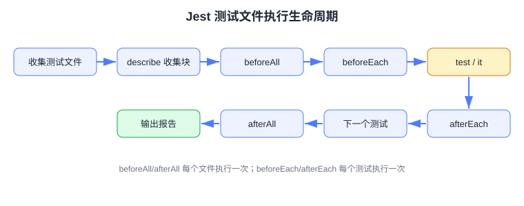

# Jest 单元测试

Jest 是 Meta 开源的 JavaScript 测试框架，内置测试运行器、断言库、Mock 能力和覆盖率报告，是**存量前端项目使用最广**的测试方案。本页面向需要在 Webpack/Babel 技术栈中写测试的开发者，覆盖安装配置、核心 API、Mock 与异步测试。

:::info 当前版本
Jest 当前主版本为 **30.x**（2025-06 发布，速度与内存占用显著优化），要求 Node 18.14+、TypeScript 5.4+。本文示例按 Jest 30 编写，旧版本（29.x）API 兼容。
:::

## 安装与初始化

```shell
cd my-project
pnpm add -D jest
pnpm jest --init        # 生成 jest.config.js，按提示选择 jsdom 环境、覆盖率
```

TypeScript 项目额外安装：

```shell
pnpm add -D ts-jest @types/jest
```

最小配置（JS + Babel 项目）：

```javascript [jest.config.js]
/** @type {import('jest').Config} */
module.exports = {
  testEnvironment: "jsdom",            // 浏览器环境（默认 node）
  testMatch: ["**/__tests__/**/*.spec.[jt]s?(x)"],
  collectCoverageFrom: ["src/**/*.{ts,tsx,js}", "!src/main.tsx"], // 覆盖率统计范围
  moduleNameMapper: {
    "^@/(.*)$": "<rootDir>/src/$1",    // 别名映射，等价于 webpack resolve.alias
    "\\.(css|less)$": "<rootDir>/__mocks__/styleMock.js",
  },
};
```

## 核心 API

### describe / test / expect

```javascript [src/utils/__tests__/math.spec.js]
describe("分组：math 工具", () => {
  beforeAll(() => console.log("整个文件执行一次前置"));
  beforeEach(() => console.log("每个测试前执行"));

  test("add(1, 2) 返回 3", () => {
    expect(add(1, 2)).toBe(3);
  });

  test("跳过未完成的用例", () => {
    expect(add(1, 1)).toBe(2);
  });
});
```

执行顺序遵循固定生命周期，示意图如下：



### 常用匹配器（Matchers）

| 匹配器 | 用途 | 示例 |
| --- | --- | --- |
| `toBe` | 引用相等（===） | `expect(x).toBe(3)` |
| `toEqual` | 深比较（对象/数组） | `expect(obj).toEqual({ a: 1 })` |
| `toBeCloseTo` | 浮点近似比较 | `expect(0.1 + 0.2).toBeCloseTo(0.3)` |
| `toBeTruthy / toBeFalsy` | 真假值 | `expect(list.isEmpty()).toBeTruthy()` |
| `toContain / toHaveLength` | 包含 / 长度 | `expect(arr).toContain(2)` |
| `toThrow` | 抛错匹配 | `expect(() => fn()).toThrow(/invalid/)` |
| `toMatchObject` | 部分字段匹配 | `expect(res).toMatchObject({ code: 0 })` |
| `toMatchSnapshot` | 快照对比 | `expect(tree).toMatchSnapshot()` |
| `toHaveBeenCalledTimes` | 调用次数 | `expect(spy).toHaveBeenCalledTimes(1)` |

### 异步测试

```javascript [src/api/__tests__/user.spec.js]
// 1. Promise：return 是关键
test("getUser 返回用户", () => {
  return getUser(1).then((user) => {
    expect(user.name).toBe("Tom");
  });
});

// 2. resolves / rejects 修饰符
test("getUser resolves", async () => {
  await expect(getUser(1)).resolves.toMatchObject({ id: 1 });
});

// 3. async/await（推荐）
test("getUser 返回用户", async () => {
  const user = await getUser(1);
  expect(user.name).toBe("Tom");
});
```

## Mock

### 函数 Mock

```javascript
const spy = jest.fn((n) => n * 2);
spy(3);                                  // 返回 6
expect(spy).toHaveBeenCalledWith(3);     // 断言调用参数
spy.mockReturnValueOnce(99);             // 下一次调用强制返回 99
```

### 模块 Mock

```javascript [src/utils/__tests__/order.spec.js]
import { createOrder } from "../order";
import { pay } from "../pay";

// 整个模块替换为 Mock
jest.mock("../pay");

test("下单成功后调用支付", async () => {
  pay.mockResolvedValue({ success: true });
  const result = await createOrder({ sku: "A1" });
  expect(result.paid).toBe(true);
  expect(pay).toHaveBeenCalledTimes(1);
});
```

### 计时器 Mock

```javascript
jest.useFakeTimers();

test("防抖函数只触发一次", () => {
  const fn = jest.fn();
  const debounced = debounce(fn, 300);
  debounced();
  debounced();
  jest.advanceTimersByTime(300); // 快进 300ms
  expect(fn).toHaveBeenCalledTimes(1);
});
```

## 常用命令

| 命令 | 作用 |
| --- | --- |
| `pnpm jest` | 跑全部测试 |
| `pnpm jest --watch` | 监听变更只跑相关文件（开发时用） |
| `pnpm jest path/to/file` | 只跑指定文件 |
| `pnpm jest -t "登录"` | 按用例名过滤 |
| `pnpm jest --coverage` | 生成覆盖率报告 |
| `pnpm jest -u` | 更新过期快照 |

## 易错点

::: danger Jest 高频坑
1. **忘记 return / await 异步断言**：测试「假通过」。正确写法：`return expect(p).resolves.toBe(x)` 或 `await`。
2. **`toBe` 比较对象**：对象比较一律用 `toEqual` / `toMatchObject`。
3. **`jest.mock` 提升机制**：`jest.mock` 会被提升到 import 之前，不能在回调里写工厂函数引用外部变量；需要时用 `jest.mock(path, () => {...})` 内联工厂并加 `prefixer` 注释。
4. **快照泛滥**：快照只适合序列化输出稳定的场景（配置、渲染树摘要），业务逻辑断言用显式匹配器。
5. **ESM 包报错**：依赖是纯 ESM 时 Jest 需 `node --experimental-vm-modules` 或改用 Vitest。
:::

## 与 Vitest 的关系

Jest 的 `describe/it/expect/jest.mock` API 已成为事实标准，**Vitest 完全兼容这套 API**（`jest.fn` → `vi.fn`）。团队从 Jest 迁移到 Vitest 通常只需：删掉 `jest.config`、加 `vitest.config`、全局替换 `jest.` 为 `vi.`。详见 [Vitest 单元测试](../Vitest/index.md)。

## 验证方式

```shell
pnpm jest --coverage
```

预期输出类似：

```text
Test Suites: 2 passed, 2 total
Tests:       12 passed, 12 total
Coverage: statement 85% | branch 70% | function 90% | lines 85%
```

## 参考资料

- [Jest 官方文档](https://jestjs.io/docs/getting-started)
- [Jest 30 发布公告](https://jestjs.io/blog/2025/06/04/jest-30)
- [Jest Mock API](https://jestjs.io/docs/mock-functions)
