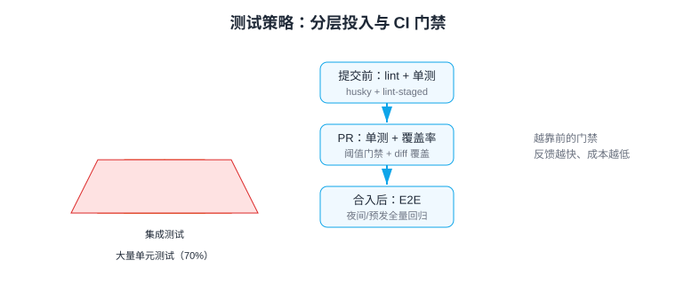

# 测试策略与 CI 集成

测试策略回答的是工程问题：**在有限时间里，测试投在哪里、以什么顺序运行、失败时如何反馈**。本页覆盖分层投入、优先级判断、提交/PR/合入三个阶段的门禁设计，以及 husky 与 GitHub Actions 的完整落地。

## 分层投入模型



| 阶段 | 触发时机 | 运行内容 | 反馈要求 |
| --- | --- | --- | --- |
| 提交前（本地） | `git commit` | lint + 类型检查 + 受影响单测 | < 30 秒 |
| PR（CI） | push / 开 PR | 全量单测 + 组件测试 + 覆盖率门禁 | < 5 分钟 |
| 合入后 / 夜间 | merge to main | 全量 E2E + 视觉回归 + 构建 | 可放宽到 10~30 分钟 |

::: tip 一句话理解
门禁越靠前，反馈越便宜：本地 30 秒能拦住的问题，不要等到 E2E 阶段花 10 分钟才红。
:::

## 决定「测什么、测多深」

写测试前先分类，不同代码类型的投入策略不同：

| 代码类型 | 测试方式 | 投入 |
| --- | --- | --- |
| 纯函数 / 工具（`utils/`、`composables/`） | 单元测试，重点覆盖边界与异常 | 高（90%+ 值得） |
| 业务组件（表单、弹窗、列表） | 组件测试，测交互与状态流转 | 中高 |
| 页面 / 路由级流程 | 组件集成测试（挂整页 + Mock 接口） | 中 |
| 核心用户流程（登录、支付、下单） | E2E，只测主路径与最关键失败路径 | 少而精 |
| 样式、纯展示 | 快照 / 视觉回归，或不测 | 低 |
| 第三方封装（一次性透传） | 测适配层逻辑，不测透传 | 低 |

判断优先级的两个维度：**变更频率 × 业务重要性**。两者都高的模块（支付、权限、表单校验）优先补测试；一年不动的配置页不必强求覆盖。

## 脚本设计

```json [package.json]
{
  "scripts": {
    "lint": "eslint . --max-warnings 0",
    "typecheck": "vue-tsc --noEmit",
    "test": "vitest",
    "test:run": "vitest run",
    "coverage": "vitest run --coverage",
    "test:e2e": "playwright test",
    "test:ci": "pnpm typecheck && pnpm coverage && pnpm test:e2e"
  }
}
```

## 提交前门禁：husky + lint-staged

```shell
pnpm add -D husky lint-staged
pnpm exec husky init
```

```javascript [.husky/pre-commit]
pnpm exec lint-staged
```

```json [package.json 片段]
{
  "lint-staged": {
    "*.{ts,tsx,vue}": ["eslint --fix", "prettier --write"],
    "*.{ts,tsx}": ["vitest related --run"]
  }
}
```

`vitest related --run` 只运行与暂存文件相关的测试，提交等待时间控制在秒级。

## PR 门禁：GitHub Actions

```yaml [.github/workflows/test.yml]
name: Test

on:
  pull_request:
    branches: [main]

jobs:
  unit:
    runs-on: ubuntu-latest
    steps:
      - uses: actions/checkout@v4
      - uses: pnpm/action-setup@v4
      - uses: actions/setup-node@v4
        with:
          node-version: 22
          cache: pnpm
      - run: pnpm install --frozen-lockfile
      - run: pnpm typecheck
      - run: pnpm coverage          # thresholds 不达标则本步骤失败，PR 被拦截
      - uses: actions/upload-artifact@v4
        if: always()
        with:
          name: coverage-report
          path: coverage/

  e2e:
    runs-on: ubuntu-latest
    needs: unit                      # 单测过了才跑 E2E，省资源
    steps:
      - uses: actions/checkout@v4
      - uses: pnpm/action-setup@v4
      - uses: actions/setup-node@v4
        with:
          node-version: 22
          cache: pnpm
      - run: pnpm install --frozen-lockfile
      - run: pnpm exec playwright install --with-deps chromium
      - run: pnpm test:e2e
      - uses: actions/upload-artifact@v4
        if: failure()
        with:
          name: playwright-report
          path: playwright-report/
```

要点：

1. `needs: unit` 形成「单测 → E2E」串行门禁，便宜的检查先跑；
2. 覆盖率 `thresholds` 失败时 `pnpm coverage` 退出码非 0，PR 自动打红；
3. 失败时上传 `playwright-report/`，在 Actions 页面下载 Trace 排障。

## 失败处理与团队协作

| 场景 | 策略 |
| --- | --- |
| E2E 偶发失败（flaky） | CI `retries: 2` 重试；连续两次失败标记 flaky 并建 issue 修复，不长期无视 |
| 测试挂了但紧急上线 | 禁止直接删测试；`test.skip` + 注释 issue 号 + 限期修复 |
| 旧代码拉低覆盖率 | 用 diff 覆盖率（见[覆盖率](../Coverage/index.md)）只约束新增代码 |
| 测试代码没人维护 | 测试同样纳入 Code Review 清单：断言有效性、可读性、速度 |

## 推进节奏（从 0 到 1）

1. **第 1 周**：Vitest + Testing Library 跑通，给 `utils/` 最核心的 3 个模块补单测；
2. **第 2~4 周**：新代码强制带测试（diff 覆盖率 ≥ 80%），核心表单组件补组件测试；
3. **第 2 个月**：接入 Playwright，先写 3~5 条主流程 E2E，配 CI 门禁；
4. **持续**：每迭代用 ratchet 上调全量阈值 5%，直至 80/70 平台期。

## 易错点

::: danger 测试策略的坑
1. **门禁太重**：pre-commit 跑全量测试，提交要 3 分钟，开发者开始用 `--no-verify` 绕过——pre-commit 只做 lint + 相关测试。
2. **E2E 当唯一门禁**：PR 必须等 20 分钟 E2E——分层，PR 只跑单测/组件测试。
3. **没有失败处理规则**：flaky 测试让团队「看见红也不管」——建立 skip + issue 期限机制。
4. **覆盖率门禁不设退出码**：只生成报告不拦截，指标沦为装饰——用 thresholds / diff-cover 强制失败。
:::

## 验证方式

1. 本地：故意写一个断言失败的测试，`git commit` 应被 pre-commit 拦截；
2. 远程：推送一个不达覆盖率的 PR，Actions 的 `unit` job 应红，且 PR 无法合入（需开启分支保护规则要求检查通过）；
3. E2E 失败时能在 Artifacts 下载 `playwright-report` 并打开 Trace。

## 参考资料

- [Testing Strategies in a Microservices Architecture](https://martinfowler.com/articles/microservice-testing/)
- [GitHub Actions 文档](https://docs.github.com/actions)
- [husky 文档](https://typicode.github.io/husky/)
- [Vitest CLI：vitest related](https://vitest.dev/guide/cli.html)
