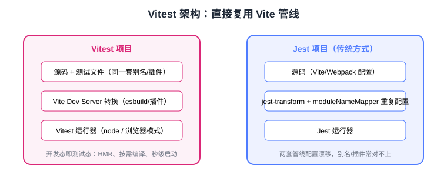

# Vitest 单元测试

Vitest 是由 Vite 团队生态驱动的测试运行器，**直接复用项目的 Vite 配置**（别名、插件、TS/JSX 转换），启动快、Watch 体验接近 HMR，是当前 Vite 项目（Vue3、React + Vite、组件库）的默认测试方案。本页覆盖安装、配置、核心 API 与 Vite 深度集成。

:::info 当前版本
Vitest 主线为 **5.0**（2026-09-03 发布，主打性能提升）；4.x 支持 Vite 8，仍在维护窗口内。API 与 Jest 高度兼容，旧版本语法在 5.x 中依然可用（个别废弃项见官方迁移指南）。
:::

## 为什么是 Vitest

传统 Jest 项目中「构建管线」和「测试管线」是两套配置（webpack/babel vs jest-transform），别名、插件经常对不上；Vitest 直接把测试文件交给 **Vite Dev Server** 转换，一套配置两处复用：



| 能力 | 说明 |
| --- | --- |
| 零配置 TS/JSX | esbuild 转译，无需 ts-jest / babel-jest |
| 别名/插件复用 | 读取 `vite.config.ts` 的 `resolve.alias` 与 `plugins` |
| 原生 ESM | 不需要 `--experimental-vm-modules` |
| 智能 Watch | 只重跑受影响的测试，UI 模式可视化 |
| 浏览器模式 | `--browser` 在真实浏览器里跑组件测试 |
| 兼容 Jest API | `vi.fn` ≈ `jest.fn`，迁移成本低 |

## 安装与配置

```shell
pnpm add -D vitest
```

`package.json` 加脚本：

```json [package.json]
{
  "scripts": {
    "test": "vitest",
    "test:run": "vitest run",
    "coverage": "vitest run --coverage"
  }
}
```

零配置即可运行 `*.test.ts` / `*.spec.ts`。需要定制时创建 `vitest.config.ts`：

```typescript [vitest.config.ts]
import { defineConfig } from "vitest/config";
import vue from "@vitejs/plugin-vue";
import { fileURLToPath } from "node:url";

export default defineConfig({
  plugins: [vue()],
  resolve: {
    alias: {
      "@": fileURLToPath(new URL("./src", import.meta.url)),
    },
  },
  test: {
    environment: "jsdom",       // 或 happy-dom（更快）、node、edge-runtime
    globals: true,              // 允许不用 import { test, expect }
    include: ["src/**/*.{test,spec}.{ts,tsx}"],
    coverage: {
      provider: "v8",           // 或 istanbul
      reporter: ["text", "html", "lcov"],
      thresholds: { lines: 70, branches: 60 },
    },
  },
});
```

::: tip
已有 `vite.config.ts` 的项目，Vitest 会自动读取其中的 `plugins` 与 `alias`；`vitest.config.ts` 优先级更高，存在时不再合并 `vite.config.ts`。
:::

## 核心 API：test / expect / vi

```typescript [src/utils/__tests__/format.spec.ts]
import { describe, it, expect, vi, beforeEach } from "vitest";
import { formatPrice } from "../format";

describe("formatPrice", () => {
  it("把分转换为元并保留两位小数", () => {
    expect(formatPrice(1999)).toBe("19.99");
  });

  it.each([
    [0, "0.00"],
    [5, "0.05"],
    [123456, "1234.56"],
  ])("formatPrice(%i) => %s", (input, expected) => {
    expect(formatPrice(input)).toBe(expected);
  });
});
```

### Mock：vi.fn / vi.mock / 定时器

```typescript
import { vi, it, expect } from "vitest";

// 函数 Mock：与 jest.fn 同构
const notify = vi.fn();
notify("hello");
expect(notify).toHaveBeenCalledWith("hello");
expect(notify).toHaveBeenCalledTimes(1);

// 模块 Mock：自动提升，工厂函数返回模拟实现
vi.mock("../api", () => ({
  fetchUser: vi.fn().mockResolvedValue({ id: 1, name: "Tom" }),
}));

// 定时器
vi.useFakeTimers();
vi.advanceTimersByTime(300);

// spy 已有对象方法
const spy = vi.spyOn(console, "log").mockImplementation(() => {});
spy.mockRestore(); // 恢复
```

### 环境与全局 Setup

```typescript [tests/setup.ts]
import { afterEach } from "vitest";
import { cleanup } from "@testing-library/react";

afterEach(() => {
  cleanup(); // 每个测试后卸载组件，防止泄漏
});
```

```typescript [vitest.config.ts 片段]
test: {
  setupFiles: ["./tests/setup.ts"],
  restoreMocks: true,   // 每个测试后自动还原 spy/mock
},
```

### In-source Testing 与浏览器模式

```typescript [src/utils/debounce.ts 片段]
export function debounce(fn: () => void, ms: number) { /* ... */ }

// 源码内测试：开发时直接运行，构建时被 Vitest 剥离
if (import.meta.vitest) {
  const { it, expect, vi } = import.meta.vitest;
  it("debounce 合并多次调用", () => {
    const fn = vi.fn();
    const d = debounce(fn, 100);
    d(); d();
    vi.advanceTimersByTime(100);
    expect(fn).toHaveBeenCalledTimes(1);
  });
}
```

```shell
pnpm vitest --browser      # 真实浏览器跑测试（需要 playwright 依赖）
pnpm vitest --ui           # Web UI 看测试树与覆盖率
```

## 常用命令

| 命令 | 作用 |
| --- | --- |
| `pnpm vitest` | Watch 模式 |
| `pnpm vitest run` | CI 单次运行 |
| `pnpm vitest run --coverage` | 覆盖率（需 `@vitest/coverage-v8`） |
| `pnpm vitest run --changed HEAD~1` | 只跑相对某次提交变化的测试 |
| `pnpm vitest -t "登录"` | 按用例名过滤 |
| `pnpm vitest --ui` | 浏览器 UI 面板 |

## 易错点

::: danger Vitest 高频坑
1. **未安装环境包**：`environment: "jsdom"` 报找不到环境——`pnpm add -D jsdom`（或 happy-dom）。
2. **覆盖率 provider 未安装**：`--coverage` 报错——`pnpm add -D @vitest/coverage-v8`。
3. **`vi.mock` 路径写错**：路径相对于**当前测试文件**解析，推荐用与 import 一致的相对路径或别名。
4. **Mock 后拿不到原始实现**：需要部分 Mock 时用 `vi.importActual`：`const actual = await vi.importActual("../api")`。
5. **globals 未开**：写了 `test(...)` 但没 import 报「test is not defined」——开启 `globals: true` 并配 `tsconfig` 的 `types: ["vitest/globals"]`。
6. **快照路径**：Vitest 默认把 `__snapshots__` 放在测试同目录，从 Jest 迁移时注意快照格式差异，建议重新生成。
:::

## 验证方式

```shell
pnpm add -D vitest jsdom @vitest/coverage-v8
pnpm vitest run --coverage
```

预期输出：

```text
✓ src/utils/__tests__/format.spec.ts (3 tests)
Test Files  1 passed (1)
     Tests  3 passed (3)
Coverage report: lines 88.5% | branches 72.1%
```

## 参考资料

- [Vitest 官方文档](https://vitest.dev/)
- [Vitest 5.0 发布公告](https://vitest.dev/blog/vitest-5.html)
- [Vitest API：vi 模块](https://vitest.dev/api/vi.html)
