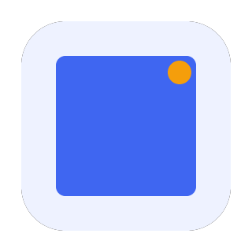

# 前端测试

「前端测试」专题系统讲解 Web 前端项目的自动化测试体系：从单元测试（Jest / Vitest）、组件测试（Testing Library / Vue Test Utils）、端到端测试（Playwright / Cypress）到覆盖率统计与测试策略，帮助你把「测试」从口号变成 CI 里可执行的门禁。

## 目录

- [测试体系概述与选型](Overview/index.md)
- [Jest 单元测试](Jest/index.md)
- [Vitest 单元测试](Vitest/index.md)
- [组件测试：Testing Library 与 Vue Test Utils](ComponentTesting/index.md)
- [E2E 测试：Playwright 与 Cypress](E2E/index.md)
- [覆盖率统计与门禁](Coverage/index.md)
- [测试策略与 CI 集成](Strategy/index.md)
- [常见问题与最佳实践](FAQ/index.md)

## 相关专题

- [前端工程化](../Others/FrontendEngineering/index.md)：测试是工程化的一环，配合代码规范与 CI 使用
- [JavaScript 测试](../Basic/JavaScript/Testing/index.md)：语言层面的测试基础概念
- [React 测试](../Frame/React/Testing/index.md)、[Vue3](../Frame/Vue/Vue3/index.md)：框架专属测试实践
