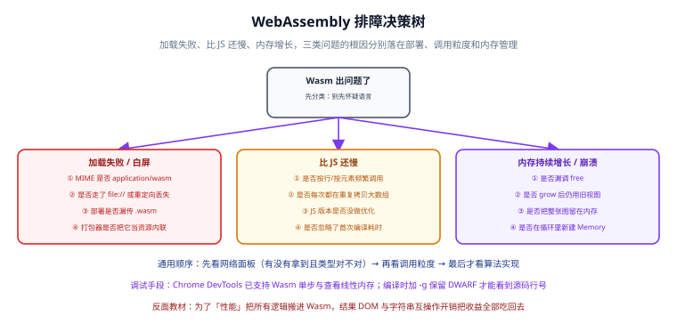

# 常见问题与排错



这一章把 Wasm 落地过程中最高频的 12 个问题整理成「结论 → 原因 → 做法」。遇到问题时先按 H3 标题定位，再照着「做法」走一遍。

一句话前提：**Wasm 的绝大部分坑都不在算法上，而在「加载」和「内存」这两件事上。**

## 加载与部署

### `.wasm` 一直加载失败，常见原因有哪些

**结论**：按顺序排查四项——传输协议、MIME 类型、路径、打包器行为。

**原因**：`WebAssembly.instantiateStreaming()` 对响应有三个硬性要求，缺一个就失败。

**做法**：

1. **确认不是 `file://`**。双击 HTML 打开时 `fetch` 会被 CORS 拦截。必须走 HTTP：

   ```shell [serve.sh]
   python -m http.server 8080
   ```

2. **确认 MIME 类型是 `application/wasm`**：

   ```shell [check-mime.sh]
   curl -I http://localhost:8080/conv.wasm | grep -i content-type
   # 必须看到：content-type: application/wasm
   ```

   Nginx 若缺失，在配置里补一行：

   ```nginx [nginx.conf]
   types {
     application/wasm wasm;
   }
   ```

3. **确认路径正确**，尤其 base 不是 `/` 时。推荐用 `new URL("./conv.wasm", import.meta.url)`，让打包器重写路径。

4. **确认打包器没有把 `.wasm` 内联**：

   ```shell [verify-build.sh]
   pnpm build
   ls -lh dist/assets/*.wasm   # 应该存在独立的 .wasm 文件
   ```

:::tip 兜底写法
真的暂时修不好 MIME 时，可以退回字节加载（性能略差，但能跑通）：

```js
const bytes = await (await fetch(url)).arrayBuffer();
const { instance } = await WebAssembly.instantiate(bytes, imports);
```
:::

### 报 `Incorrect response MIME type` 怎么处理

**结论**：服务器返回的 `Content-Type` 不是 `application/wasm`。

**原因**：`instantiateStreaming` 会检查响应头，避免把 HTML 错误页当成 Wasm 编译。开发服务器（尤其是某些静态服务器与反向代理）默认不认识 `.wasm` 扩展名。

**做法**：按上一问的第 2 步配好 MIME。**不要**用修改文件后缀（比如改成 `.bin`）来绕过——那样会同时失去流式编译，且 `fetch` 仍会按二进制处理，问题只是被掩盖。

### 生产环境 `.wasm` 拿不到、404，但本地正常

**结论**：多半是打包产物路径或部署配置的问题。

**原因**：`new URL("./x.wasm", import.meta.url)` 在构建后会被改写成带 hash 的路径；如果 `.wasm` 被当作内联资源，或者部署时漏传了 `dist/assets/` 下的 `.wasm`，就会 404。

**做法**：

1. 构建后检查 `dist/` 里存在独立的 `.wasm`；
2. 部署脚本确认 `.wasm` 在产物清单里（部分 CI 的 artifact 过滤规则会漏掉它）；
3. 服务器确认 `application/wasm` 已配置。

## 性能问题

### 为什么我的 Wasm 比纯 JS 还慢

**结论**：先看三件事——传参方式、边界调用次数、JS 基线是否被公平优化过。

**原因**：Wasm 的优势只在「纯计算 + 大块数据 + 低频边界」这个形状上成立。以下三种情况必然或可能更慢：

| 症状 | 根因 | 修复方向 |
| --- | --- | --- |
| 每次只处理很小一块数据 | 边界调用固定开销占比过高 | 合并调用，一次传整块 |
| 频繁传字符串/对象 | 每次都要 UTF-8 编解码 | 改成传指针 + 长度，或改传 TypedArray |
| 大量 DOM 操作 | Wasm 不能碰 DOM，全靠 JS 转发 | 把 DOM 操作移回 JS，Wasm 只做计算 |

**做法**：按 [性能对比与实测](../Performance/index.md) 的五个基准纪律重新测一遍。特别确认：**JS 版本是否已经优化过**。如果 JS 用的是对象数组 + `forEach`，那你测的是「Wasm vs 烂 JS」。

:::danger 一个高频误判
「Wasm 慢」的结论里，有相当一部分其实是**计时区间包含了数据准备**。把「JS 数组 → Wasm 内存」的拷贝时间单独打点，往往能立刻看到真相。
:::

### 加了 Wasm 之后首屏变慢了

**结论**：编译与下载开销被算进了关键路径。

**原因**：`.wasm` 需要先下载再**编译**，大模块编译可达 100~300 ms。如果模块在首屏同步加载，用户会明显感受到延迟。

**做法**：

1. **懒加载**：用 `import()` 或 `new Worker()` 在真正需要时才加载；
2. **开压缩**：服务器启用 gzip/brotli，`.wasm` 通常能压到原体积的 30%~40%；
3. **缓存编译结果**：把字节放进 Cache Storage，二次加载跳过网络；
4. **减小体积**：按 [编译工具链](../Toolchain/index.md) 的清单做 LTO + `-Oz` + `wasm-opt -Oz`。

## 内存问题

### Wasm 内存持续增长最后崩溃，怎么查

**结论**：三个来源，按概率排序——Wasm 侧未释放、JS 侧持有旧视图、实例被反复创建未回收。

**原因**：Wasm 没有自动 GC（除非启用 GC 提案），`malloc` 出来的内存必须显式 `free`。

**做法**：

1. **给分配打点**，确认 `malloc` / `free` 次数配对：

   ```js [leak-check.js]
   const { malloc, free } = instance.exports;
   let balance = 0;

   window.__malloc = (bytes) => {
     balance++;
     return malloc(bytes);
   };
   window.__free = (ptr) => {
     balance--;
     return free(ptr);
   };

   setInterval(() => {
     console.log(
       "未释放分配数：",
       balance,
       "线性内存：",
       instance.exports.memory.buffer.byteLength
     );
   }, 2000);
   ```

2. **确认 `free` 放在 `finally` 里**，异常路径也要释放：

   ```js
   const ptr = malloc(bytes);
   try {
     // ... 使用 ptr
   } finally {
     free(ptr);
   }
   ```

3. **用 DevTools Memory 面板做两次堆快照对比**，确认 `WebAssembly.Memory` 对象的持有量是否单调增长。

### `memory.grow()` 之后数据全变成 0 了

**结论**：旧 TypedArray 视图失效了。

**原因**：`grow()` 会**替换**底层的 `ArrayBuffer`，之前创建的视图指向的是被废弃的 buffer。

**做法**：**每次访问内存前现取现用，不要缓存 `memory.buffer`。**

```js [fix-view.js]
// ❌ 缓存视图：grow() 之后就是废的
const view = new Uint8Array(memory.buffer);
wasm_alloc(1024 * 1024); // 可能触发 grow()
view[0] = 1; // 写进了废弃的 buffer

// ✅ 现取现用
const ptr = wasm_alloc(1024 * 1024);
new Uint8Array(memory.buffer, ptr, 16).set(payload);
```

:::warning 这个坑尤其容易在「分配之后」触发
顺序必须是：**先 `malloc`，再创建视图**。反过来就会出现「数据写进去了但读不出来」的诡异现象。详见 [与 JavaScript 互操作](../Interop/index.md)。
:::

## 能力边界

### Wasm 能操作 DOM 吗

**结论**：不能，只能通过 JS 代理。

**原因**：Wasm 的规范里只有整数、浮点数、线性内存和表，没有任何宿主对象的概念。DOM 是浏览器的能力，必须由 JS 在边界上转交。

**做法**：

- **计算进 Wasm，交互留 JS**：Wasm 导出纯函数，接收指针与长度，返回结果指针；
- 如果确实需要大量 DOM 操作，先问自己「这段代码适合 Wasm 吗」——答案通常是不适合；
- Emscripten 提供的 `EM_JS` / `EM_ASM` 宏可以在 C 里内联 JS，但底层仍是 JS 在操作 DOM。

### 能在 Wasm 里用 Node.js 的原生模块（`.node` / N-API）吗

**结论**：不能。

**原因**：`.node` 原生模块是平台相关的动态库（依赖 dlopen、依赖宿主架构），Wasm 是平台无关的沙箱格式，两者模型不兼容。

**做法**：

- 把 C/C++ 源码**重新编译**成 Wasm（这是最直接的路径）；
- 只有在 Node 里运行时，考虑用 **WASI 运行时**（如 Node 的内置 Wasm 能力或 wazero 类方案）提供文件/网络能力；
- 需要保留原生依赖（如 OpenSSL 的特定后端）时，**放弃 Wasm，继续用原生模块**。

### Wasm 能直接读文件吗

**结论**：浏览器里不能直接读；WASI 下需要宿主显式授权。

**原因**：这是沙箱设计的核心——模块默认没有任何系统能力。

**做法**：

| 环境 | 读文件的方式 |
| --- | --- |
| 浏览器 | 让 JS 用 `<input type="file">` / `fetch` / OPFS 读，再把字节写进 Wasm 内存 |
| 浏览器（Emscripten） | 用 **MEMFS**（内存文件系统）或 **IDBFS**（IndexedDB 持久化），POSIX 风格 API 由 JS 绑定在运行时代理 |
| WASI 运行时 | 宿主通过 `--dir` 显式授权目录，模块只能看到被授权的那棵子树 |

**关键认知**：Emscripten 里的 `fopen` 不是真的在磁盘上开文件，它请求的是 JS 侧的内存文件系统。数据要持久化，得自己把它同步到 IndexedDB 或后端。

## 调试与编码

### 报错定位不到源码，怎么调试

**结论**：编译时加 `-g` 保留 **DWARF** 调试信息，然后在 Chrome DevTools 里调试。

**原因**：不加 `-g` 的话，DevTools 里只能看到 `wasm-function[42]` 这种没有意义的符号。

**做法**：

```shell [build-debug.sh]
# 开发构建：-O0 + -g，保留 DWARF 与源码映射
emcc conv.c -O0 -g --no-entry -s STANDALONE_WASM=1 \
  -s EXPORTED_FUNCTIONS='["_grayscale_and_blur","_malloc","_free"]' \
  -o conv.debug.wasm
```

DevTools 里能做四件事：

1. **Sources 面板下断点、单步执行**（需 `-g`）；
2. **Performance 面板看 `wasm-function[...]` 帧**的 Self Time；
3. **Memory 面板查看线性内存字节数**变化；
4. **Console 里直接调 `instance.exports`** 验证单个导出函数。

:::danger 生产构建务必去掉 `-g`
DWARF 信息会让体积显著变大（常见翻倍以上）。开发用 `-O0 -g`，发布用 `-O3`（或 `-Oz`）+ `wasm-opt -Oz`，两条命令分开维护。
:::

### 传中文出现乱码怎么办

**结论**：统一用 **UTF-8** 编码，长度按**字节数**而不是字符数传。

**原因**：Wasm 里没有字符串类型，只有字节。中文在 UTF-8 下占 3 字节，JS 的 `string.length` 统计的是 UTF-16 代码单元数，两者对不上就会截断。

**做法**：

```js [utf8.js]
const text = "你好，Wasm";

// ✅ 编码成 UTF-8 字节，长度用字节长度
const bytes = new TextEncoder().encode(text); // Uint8Array
const byteLen = bytes.length; // 不是 text.length！

const ptr = wasm_alloc(byteLen);
new Uint8Array(memory.buffer, ptr, byteLen).set(bytes);

// ✅ 读回来同样用 UTF-8 解码
const decoded = new TextDecoder("utf-8").decode(
  new Uint8Array(memory.buffer, ptr, byteLen)
);
console.log(decoded); // 你好，Wasm
```

**常见错误对照**：

| 错误写法 | 后果 |
| --- | --- |
| 传 `text.length` 当字节长度 | 中文被截断，末尾出现乱码 |
| 用 `escape` / `unescape` 做编码 | 已废弃，非 ASCII 会出错 |
| 服务端与客户端编码不一致 | 前后端来回转换后彻底乱码 |
| 用 `decodeURIComponent` 手工转 | 容易被 `%` 序列干扰 |

### 多线程为什么起不来

**结论**：页面缺少 COOP / COEP 响应头，`SharedArrayBuffer` 不可用。

**原因**：`SharedArrayBuffer` 涉及跨源共享内存的安全风险，浏览器要求页面处于「跨源隔离（cross-origin isolated）」状态才开放。

**做法**：

1. 服务器必须返回两个响应头：

   ```text [响应头]
   Cross-Origin-Opener-Policy: same-origin
   Cross-Origin-Embedder-Policy: require-corp
   ```

2. 代码里做能力检测：

   ```js [check-sab.js]
   if (typeof SharedArrayBuffer === "undefined") {
     console.warn("SharedArrayBuffer 不可用：检查 COOP / COEP 响应头");
   }
   ```

3. 编译时启用线程：

   ```shell [build-threads.sh]
   emcc conv.c -O3 -pthread --no-entry \
     -s EXPORTED_FUNCTIONS='["_grayscale_and_blur","_malloc","_free"]' \
     -s PTHREAD_POOL_SIZE=4 \
     -o conv.threads.wasm
   ```

:::danger 加 COOP/COEP 会打断既有页面
`require-corp` 会让所有跨域资源（图片、脚本、字体、iframe）都要求显式授权（`crossorigin` 属性或 CORP 响应头），否则加载失败。**上线前必须做全站回归测试。** 另外 Safari 对线程的支持滞后于 Chrome / Firefox，做用户覆盖面评估时要把这一点算进去。
:::

## 决策

### 什么时候该放弃 Wasm

**结论**：出现下面任何一条，就该放弃。

**做法（放弃清单）**：

1. **热点占比低于整帧 10%**——整体收益太小，用户感知不到。
2. **算出来的整体收益小于 20%**——用 `热点占比 × (1 − 1/加速倍数)` 算，低于 20% 就别引入。算法见 [性能对比与实测](../Performance/index.md)。
3. **逻辑本质是 DOM 操作或 UI 状态管理**——Wasm 帮不上忙，只会多一层转发。
4. **需要完整 POSIX、原生动态库、长驻有状态服务**——容器与虚拟机是更自然的选择，详见 [WASI 与服务端运行时](../WASI/index.md)。
5. **团队无法长期维护两套代码与工具链**——引入 Wasm 意味着多一条构建链路、多一套调试方式、多一份版本固定成本。
6. **体积预算已经吃紧**——`.wasm` 与它带来的首屏成本可能比节省的 CPU 时间更值钱。

:::tip 一个更划算的替代顺序
在引入 Wasm 之前，先把这三件事做完：

1. **优化算法本身**——换个时间复杂度更低的实现，收益常常比换语言大；
2. **用 TypedArray / SIMD 优化 JS**——现代 JS 的 SIMD 能力已经能覆盖一部分场景；
3. **把长任务挪进 Worker**——先解决阻塞问题，再谈加速问题。

这三步的 ROI 通常高于引入 Wasm，而且没有体积与维护成本。
:::

## 排错速查表

| 现象 | 最可能的原因 | 第一步动作 |
| --- | --- | --- |
| `Failed to fetch` | 用了 `file://` | 起 `python -m http.server` |
| `Incorrect response MIME type` | 缺 `application/wasm` | `curl -I` 看响应头 |
| `missing import` | 导入对象缺函数 | `wasm-objdump -x` 看 Import 段 |
| `indirect call type mismatch` | `call_indirect` 签名不匹配 | 核对 `type` 段签名 |
| 数据全 0 | `grow()` 后用了旧视图 | 改成现取 `memory.buffer` |
| 内存单调增长 | Wasm 侧没 `free` | 给 malloc/free 打点计数 |
| 比纯 JS 还慢 | 边界调用过密 / JS 基线未优化 | 合并调用，重做基准 |
| 首屏变慢 | 模块进了关键路径 | 懒加载 + 开压缩 |
| 线程起不来 | 没有 COOP/COEP | 补响应头并做全站回归 |
| 中文乱码 | 长度按字符数传了 | 改用 `TextEncoder` 的字节长度 |

## 参考资料

1. WebAssembly 官网 FAQ 与用例：<https://webassembly.org/docs/faq/>
2. MDN —— WebAssembly 错误与排错：<https://developer.mozilla.org/zh-CN/docs/WebAssembly>
3. Emscripten —— 调试与 DWARF 信息：<https://emscripten.org/docs/tools_reference/emcc.html>
4. Emscripten —— 文件系统（MEMFS / IDBFS）：<https://emscripten.org/docs/api_reference/Filesystem-API.html>
5. Emscripten —— Pthreads 与 SharedArrayBuffer 要求：<https://emscripten.org/docs/porting/pthreads.html>
6. Chrome DevTools —— 调试 WebAssembly：<https://developer.chrome.com/docs/devtools/>
