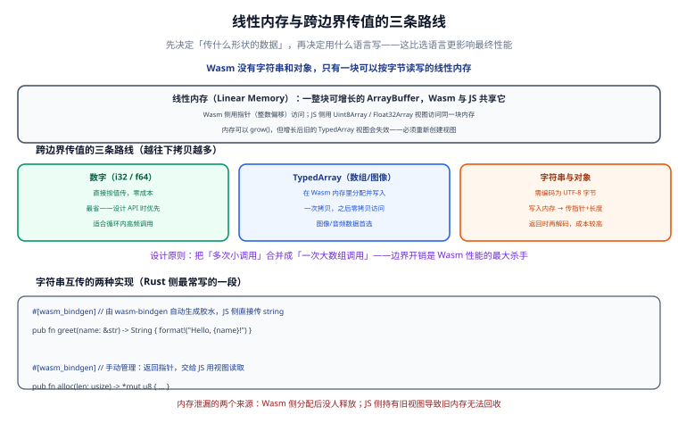
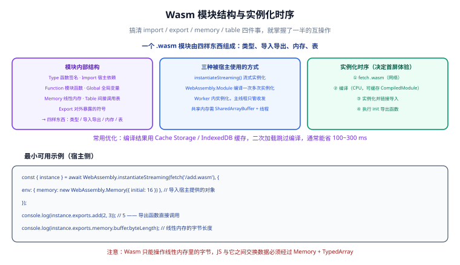

# 与 JavaScript 互操作





**互操作（interop）** 是 Wasm 落地的真正难点：语言本身很简单，难的是「JS 和 Wasm 怎么交换数据」。这一章把内存模型、传值路线、字符串处理、实例化方式、回调和内存泄漏一次讲透。

一句话结论：**Wasm 不共享对象，只共享一块内存。所有互操作的本质，都是把数据编码成字节写进这块内存，再传一个指针和长度过去。**

## 线性内存模型

### 只有一块内存

**线性内存（linear memory）** 是模块唯一的数据区，本质是一个**可增长的 `ArrayBuffer`**。

- **Wasm 侧**：用整数「指针」访问，其实就是从内存起始位置算起的**字节偏移**。
- **JS 侧**：用 `Uint8Array`、`Float32Array` 等 TypedArray 视图访问同一块内存。

两边看的是同一片字节，只是解释方式不同。这就是 Wasm 能做到「零拷贝」的原因——数据写进去之后，两边都不需要搬。

```js [memory.js]
const { instance } = await WebAssembly.instantiateStreaming(fetch("./conv.wasm"), {});
const memory = instance.exports.memory; // WebAssembly.Memory 对象

// 同一块内存的两种视图
const u8 = new Uint8Array(memory.buffer);
const f32 = new Float32Array(memory.buffer);
const i32 = new Int32Array(memory.buffer);

// 从 Wasm 堆上分配 1024 字节，拿到指针（字节偏移）
const ptr = instance.exports.malloc(1024);
console.log("分配到的指针 =", ptr); // 例如 1048576
```

**关键点**：

| 概念 | 含义 | 注意事项 |
| --- | --- | --- |
| 指针 | 线性内存里的字节偏移（整数） | 不是真实地址，不能当 JS 引用用 |
| 对齐 | 类型有对齐要求（`f64` 要 8 字节对齐） | 手工算偏移时要对齐，否则某些引擎会报错或变慢 |
| 视图 | `Uint8Array` 等的 `buffer` 属性 | 是「某一时刻」的内存快照入口 |
| 内存页 | 一页 64 KiB | `initial` / `maximum` 都以页为单位 |

### grow() 之后视图必然失效

这是互操作里最高频的崩溃原因。

```js [grow-pitfall.js]
const memory = instance.exports.memory;
let view = new Uint8Array(memory.buffer);

console.log(view.byteLength); // 65536

// Wasm 内部（或 JS 主动）扩容
memory.grow(1); // 增加 1 页 = 64 KiB

// ❌ 旧的 view 仍然指向被丢弃的 buffer，读取到的是 0 或报错
console.log(view.byteLength); // 65536（旧长度，已经不反映真实内存）

// ✅ 正确做法：重新创建视图
view = new Uint8Array(memory.buffer);
console.log(view.byteLength); // 131072
```

:::danger `grow()` 后继续用旧视图
`memory.grow()` 会**替换**底层的 `ArrayBuffer`，旧视图指向的是已经废弃的那个 buffer。症状是：数据看起来「全是 0」、「读到脏数据」，或者写入的内容悄悄消失。**只要可能出现扩容（尤其开了 `ALLOW_MEMORY_GROWTH=1`），每次访问内存前都要重新创建视图，或者用 `memory.buffer` 现取现用。**
:::

## 传值的三条路线

按成本从低到高排，选择顺序也应按这个顺序。

| 路线 | 传输方式 | 成本 | 适用数据 |
| --- | --- | --- | --- |
| **数字** | 按值传 `i32` / `f64` | 几乎为零 | 标量参数、返回值、标志位 |
| **TypedArray** | 在 Wasm 内存里分配并写入 | 一次拷贝，之后零拷贝访问 | 像素数组、`Float32Array`、大块二进制 |
| **字符串与对象** | UTF-8 编码 → 写内存 → 传指针 + 长度 → 回来再解码 | 双向两次编码/解码 + 胶水开销 | 文本、JSON、结构化数据 |

### 路线一：数字（零成本）

```c [math.c]
#include <emscripten/emscripten.h>

EMSCRIPTEN_KEEPALIVE
double distance(double x1, double y1, double x2, double y2) {
  double dx = x2 - x1;
  double dy = y2 - y1;
  return __builtin_sqrt(dx * dx + dy * dy);
}
```

```js [main.js]
// i32 / f64 直接按值传递，没有编码成本
const d = instance.exports.distance(0, 0, 3, 4);
console.log(d); // 5
```

### 路线二：TypedArray（一次拷贝，之后零拷贝）

```js [array.js]
const { malloc, sum_f32, memory } = instance.exports;

const data = new Float32Array([1.5, 2.5, 3.5, 4.5]);
const ptr = malloc(data.byteLength); // 在 Wasm 堆上分配

// 用视图把数据 set 进 Wasm 内存（这一次是拷贝）
new Float32Array(memory.buffer, ptr, data.length).set(data);

// 一次调用处理整块数据
const total = sum_f32(ptr, data.length);
console.log(total); // 12

// 用完记得释放
instance.exports.free(ptr);
```

**注意 `set()` 只写一次**。写成循环逐元素赋值会慢一个数量级：

```js [array-bad.js]
// ❌ 逐元素写，慢
for (let i = 0; i < data.length; i++) {
  new Float32Array(memory.buffer)[ptr / 4 + i] = data[i];
}

// ✅ 一次性 set
new Float32Array(memory.buffer, ptr, data.length).set(data);
```

### 路线三：字符串与对象（最贵）

字符串没有捷径，流程固定为：

1. JS 侧用 `TextEncoder` 编码成 UTF-8 字节；
2. 在 Wasm 内存里分配空间并写入；
3. 传「指针 + 长度」两个整数给 Wasm；
4. Wasm 处理完，返回结果指针与长度；
5. JS 侧用 `TextDecoder` 解回字符串；
6. 两边各自释放内存。

## 字符串互传的两种 Rust 实现

### 方式 A：`#[wasm_bindgen]` 自动生成胶水（推荐）

```rust [lib.rs]
use wasm_bindgen::prelude::*;

#[wasm_bindgen]
pub fn greet(name: &str) -> String {
    format!("Hello, {}!", name)
}

#[wasm_bindgen]
pub fn char_count(text: &str) -> usize {
    text.chars().count()
}
```

编译并生成绑定：

```shell [build.sh]
wasm-pack build --release --target web --out-dir pkg
```

```js [main.js]
import init, { greet, char_count } from "./pkg/wasm_demo.js";

await init();
console.log(greet("世界"));       // Hello, 世界!
console.log(char_count("世界"));  // 2
```

**优点**：字符串、`Vec`、`Option`、`Result` 都能直接传，`wasm-bindgen` 自动生成编码/解码与 `free`。**代价**：每次调用都有一次编码/解码，所以「一次传大字符串」远好于「循环传小字符串」。

### 方式 B：手动 `alloc` + 视图读取（需要完全控制时）

```rust [lib.rs]
use std::alloc::{alloc, Layout};

/// 返回一块长度为 len 的未初始化内存指针，供 JS 写入
#[no_mangle]
pub extern "C" fn alloc(len: usize) -> *mut u8 {
    unsafe { alloc(Layout::from_size_align_unchecked(len, 1)) }
}

/// 读取 UTF-8 字节并返回字节长度（真实业务里换成你的处理逻辑）
#[no_mangle]
pub extern "C" fn byte_len(ptr: *const u8, len: usize) -> usize {
    let slice = unsafe { std::slice::from_raw_parts(ptr, len) };
    slice.iter().filter(|b| **b != 0).count()
}
```

```js [main.js]
const { alloc, byte_len, memory } = instance.exports;

// 1) 编码
const bytes = new TextEncoder().encode("你好，Wasm");

// 2) 在 Wasm 堆上分配并写入
const ptr = alloc(bytes.length);
new Uint8Array(memory.buffer, ptr, bytes.length).set(bytes);

// 3) 传指针 + 长度
console.log(byte_len(ptr, bytes.length)); // 非 0 字节数

// 4) 如果 Wasm 返回的是「指针 + 长度」，这样读回来
const outPtr = ptr;
const outLen = 12;
const text = new TextDecoder().decode(new Uint8Array(memory.buffer, outPtr, outLen));
console.log(text);
```

:::warning 手动方案必须自己管内存
`alloc` 出来的内存**没有自动回收**。每条路径都要有对应的 `free`，包括异常分支。手写方案只建议在「性能极致敏感且数据形状固定」时使用。
:::

## 模块结构与实例化

### 模块的七段结构

一个 Wasm 模块由若干「段（section）」组成，理解它们才能看懂报错。

| 段 | 作用 | 典型问题 |
| --- | --- | --- |
| **Type** | 函数签名（参数与返回值类型） | `call_indirect` 类型不匹配时报错 |
| **Import** | 从宿主引入的函数/内存/表/全局量 | 少传一个导入就实例化失败 |
| **Function** | 模块自己定义的函数列表 | 与 Type 段按索引对应 |
| **Table** | 间接调用表（存函数引用） | 回调、函数指针的载体 |
| **Memory** | 线性内存 | 可导出给 JS，也可从 JS 导入 |
| **Global** | 全局变量 | 可变全局量需要显式声明 |
| **Export** | 对外暴露的符号 | 名字必须和 JS 侧写法完全一致 |

```shell [inspect.sh]
# 直接看一个模块的段结构
wasm-objdump -x add.wasm
```

预期输出会依次列出 Type / Import / Function / Table / Memory / Global / Export 各段，最后是 Code 段大小。

### 写法一：`instantiateStreaming`（最常用）

```js [load-streaming.js]
// fetch 与编译并行进行，比先 arrayBuffer 再 instantiate 更快
const { instance, module } = await WebAssembly.instantiateStreaming(
  fetch("/conv.wasm"),
  {
    // 导入对象：键名必须与模块的 Import 段完全一致
    env: {
      log: (ptr, len) => console.log("wasm says:", ptr, len),
    },
  }
);

console.log(instance.exports.sum_i32(1024, 8));
```

**硬性要求**：服务器必须以 `application/wasm` 返回，否则直接抛错。

```shell [serve.sh]
# 快速验证 MIME 是否正确
curl -I http://localhost:8080/conv.wasm | grep -i content-type
# 预期：content-type: application/wasm
```

### 写法二：`WebAssembly.Module` 缓存复用

编译是一次性成本，如果同一个模块要实例化多次（例如每个 Worker 一份），应该只编译一次。

```js [load-cached.js]
const wasmUrl = "/conv.wasm";
const cache = await caches.open("wasm-v1");

// 1) 优先从 Cache Storage 取字节，命中就不发网络请求
let bytes;
const hit = await cache.match(wasmUrl);
if (hit) {
  bytes = await hit.arrayBuffer();
} else {
  const res = await fetch(wasmUrl);
  // 响应体只能读一次，先 clone 一份存缓存
  await cache.put(wasmUrl, res.clone());
  bytes = await res.arrayBuffer();
}

// 2) 编译一次（真正耗时的就是这一步）
const compiled = await WebAssembly.compile(bytes);

// 3) 同一份编译结果实例化多次，各自拥有独立内存
async function createInstance() {
  return WebAssembly.instantiate(compiled, { env: {} });
}

const [a, b] = await Promise.all([createInstance(), createInstance()]);
console.log(a.exports.sum_i32(0, 0), b.exports.sum_i32(1, 1));
```

:::tip 编译结果缓存通常能省 100~300 ms
**实例化时序**：`fetch .wasm` → **编译** → 实例化并链接导入 → 调用模块的 `init` 导出函数。

编译这一步是可缓存的：把编译好的模块放进 **Cache Storage** 或 **IndexedDB**，二次加载时跳过编译，**通常能省 100~300 ms**（模块越大收益越明显）。注意 `WebAssembly.Module` 对象本身不能直接结构化克隆存进 IndexedDB，需要存原始字节再重新编译，或者用引擎提供的编译缓存机制。
:::

## 导入导出的命名

命名不匹配是实例化失败的头号原因。

| 场景 | 命名规则 | 示例 |
| --- | --- | --- |
| C 函数导出 | 需要显式列入 `EXPORTED_FUNCTIONS`，编译后带下划线前缀 | `-s EXPORTED_FUNCTIONS='["_sum_i32","_malloc","_free"]'` |
| Emscripten 内部导入 | 通常在 `env` 命名空间下 | `env.emscripten_notify_memory_growth` |
| Rust 手动导出 | `#[no_mangle]` + `extern "C"`，名字原样导出 | `#[no_mangle] pub extern "C" fn alloc` |
| wasm-bindgen 导出 | 生成 JS 包装，直接 `import { greet }` | 无需关心底层名字 |
| WASI 导入 | 在 `wasi_snapshot_preview1` 命名空间下 | `wasi_snapshot_preview1.fd_write` |

```shell [check-imports.sh]
# 实例化报「missing import」时，先看模块到底要什么
wasm-objdump -x conv.wasm | grep -A 20 "Import"
```

## Table 与函数指针回调

Wasm 的 `Table` 是一个「函数引用数组」，`call_indirect` 通过索引间接调用。这是把 JS 函数传给 Wasm 做回调的标准方式。

```wasm [dispatch.wat]
(module
  (type $binop (func (param i32 i32) (result i32)))

  (func $add (type $binop)
    local.get 0
    local.get 1
    i32.add)

  (func $mul (type $binop)
    local.get 0
    local.get 1
    i32.mul)

  (table 2 funcref)
  (elem (i32.const 0) $add $mul)

  ;; 索引 0 走加法，索引 1 走乘法
  (func (export "dispatch") (param $op i32) (param $a i32) (param $b i32) (result i32)
    local.get $a
    local.get $b
    local.get $op
    call_indirect (type $binop)))
```

```js [main.js]
const { instance } = await WebAssembly.instantiateStreaming(fetch("./dispatch.wasm"), {});
const { dispatch } = instance.exports;

console.log(dispatch(0, 3, 4)); // 7  → add
console.log(dispatch(1, 3, 4)); // 12 → mul
```

:::danger `call_indirect` 的类型必须精确匹配
签名（参数个数、类型、返回值）必须和 `type` 段完全一致，否则运行时报 `indirect call type mismatch`。注意这不是编译期错误，而是运行期陷阱，测试时要把每条分支都覆盖到。
:::

## 在 Worker 里跑，避免结构化克隆拷贝

计算密集任务必须放进 Worker，否则长任务会阻塞主线程渲染。参见 [前端性能优化 · 运行时优化](../../Others/PerformanceOptimization/Runtime/index.md) 关于长任务切分的部分。

关键点是**用 Transferable Objects 传数据**——把 `ArrayBuffer` 的**所有权**转移，而不是拷贝：

```js [main.js]
const worker = new Worker("./worker.js", { type: "module" });

const canvas = document.getElementById("canvas");
const ctx = canvas.getContext("2d");
const imageData = ctx.getImageData(0, 0, canvas.width, canvas.height);

// 转移所有权：第二个参数列出要转移的对象
// 转移后主线程的 imageData.data.buffer 会被「neutered」，不能再访问
worker.postMessage(
  {
    buffer: imageData.data.buffer,
    width: canvas.width,
    height: canvas.height,
  },
  [imageData.data.buffer]
);

worker.onmessage = (e) => {
  const out = new ImageData(
    new Uint8ClampedArray(e.data.buffer),
    e.data.width,
    e.data.height
  );
  ctx.putImageData(out, 0, 0);
};
```

```js [worker.js]
let wasm = null;

async function init() {
  const { instance } = await WebAssembly.instantiateStreaming(fetch("./conv.wasm"), {});
  wasm = instance.exports;
}

self.onmessage = async (e) => {
  if (!wasm) await init();

  const { buffer, width, height } = e.data;
  const bytes = width * height * 4;

  // 在 Wasm 堆上分配输入/输出缓冲
  const srcPtr = wasm.malloc(bytes);
  const dstPtr = wasm.malloc(bytes);

  // 一次写入，一次调用
  new Uint8Array(wasm.memory.buffer, srcPtr, bytes).set(new Uint8Array(buffer));
  wasm.grayscale(srcPtr, dstPtr, width, height);

  // 读回结果（拷贝一次，因为要转移给主线程）
  const out = new Uint8Array(wasm.memory.buffer, dstPtr, bytes).slice();
  wasm.free(srcPtr);
  wasm.free(dstPtr);

  // 转移回去，同样零拷贝
  self.postMessage({ buffer: out.buffer, width, height }, [out.buffer]);
};
```

:::warning 转移之后原 buffer 就废了
`postMessage(msg, [arrayBuffer])` 之后，**发送方的 `ArrayBuffer` 变成 detached 状态**，`byteLength` 为 0，任何访问都会抛错。如果需要保留原数据，就要传副本（去掉 transfer 列表）或不转移。
:::

## 内存持续增长的三个来源与排查

内存泄漏只有两个根本来源，但表现有三种。

| 来源 | 现象 | 排查方法 | 修复 |
| --- | --- | --- | --- |
| **Wasm 侧分配未释放** | `memory.buffer.byteLength` 单调增长 | 在 `malloc`/`free` 处打点计数 | 每条路径都配对 `free`，异常分支也别漏 |
| **JS 侧持有旧视图** | 读到脏数据或全 0 | 检查 `grow()` 后是否重新建视图 | 现取现用 `memory.buffer` |
| **缓存实例不释放** | 实例数只增不减 | 用 `WeakMap` 统计实例存活 | 及时置空引用，让 GC 回收 |

```js [leak-check.js]
// 简易内存监控：在渲染循环里定期打点
let lastLen = 0;
function watchMemory(memory, label) {
  const len = memory.buffer.byteLength;
  if (len !== lastLen) {
    console.warn(`[${label}] 线性内存 ${lastLen} → ${len} 字节`);
    lastLen = len;
  }
}

// 每帧调用一次，配合 DevTools Memory 面板的堆快照对比
requestAnimationFrame(function loop() {
  watchMemory(instance.exports.memory, "conv");
  requestAnimationFrame(loop);
});
```

:::info 更专业的排查方式
Chrome DevTools 的 **Memory** 面板可以做堆快照对比（快照 A → 操作 → 快照 B → 比较差值）。Wasm 侧的内存不会直接出现在 JS 堆快照里，但 `WebAssembly.Memory` 对象会显示当前持有的字节数，配合上面的打点足够定位。要精确到函数级，需要编译时加 `-g` 保留 DWARF。
:::

## 完整示例：JS 与 Wasm 互传数组

一个可以直接跑的最小闭环，包含 C、JS 与页面。

```c [array.c]
#include <stdlib.h>
#include <emscripten/emscripten.h>

// 逐元素平方，返回新数组的指针，长度通过 out_len 回传
EMSCRIPTEN_KEEPALIVE
float *square_array(const float *src, int len) {
  float *dst = (float *)malloc(sizeof(float) * (size_t)len);
  if (!dst) return 0;
  for (int i = 0; i < len; i++) {
    dst[i] = src[i] * src[i];
  }
  return dst;
}
```

```shell [build.sh]
emcc array.c -O3 --no-entry -s STANDALONE_WASM=1 \
  -s EXPORTED_FUNCTIONS='["_square_array","_malloc","_free"]' \
  -o array.wasm

# 确认导出齐全
wasm-objdump -x array.wasm | grep -A 8 "Export"
```

```js [main.js]
const { instance } = await WebAssembly.instantiateStreaming(fetch("./array.wasm"), {});
const wasm = instance.exports;

const input = new Float32Array([1, 2, 3, 4, 5]);
const bytes = input.byteLength;

// 1) Wasm 堆上分配输入缓冲
const inPtr = wasm.malloc(bytes);
// 2) 一次性写入（唯一一次拷贝）
new Float32Array(wasm.memory.buffer, inPtr, input.length).set(input);

// 3) 一次调用，返回输出指针
const outPtr = wasm.square_array(inPtr, input.length);

// 4) 直接读回（零拷贝读取，随后立即拷贝到 JS 侧数组）
const result = Array.from(
  new Float32Array(wasm.memory.buffer, outPtr, input.length)
);

console.log(result); // [1, 4, 9, 16, 25]

// 5) 释放两边分配的内存（outPtr 由 Wasm 内部 malloc，需 free）
wasm.free(outPtr);
wasm.free(inPtr);
```

```html [index.html]
<!DOCTYPE html>
<html lang="zh-CN">
  <head>
    <meta charset="UTF-8" />
    <title>JS 与 Wasm 互传数组</title>
  </head>
  <body>
    <pre id="out">加载中……</pre>
    <script type="module" src="./main.js"></script>
  </body>
</html>
```

### 验证收尾

```shell [serve.sh]
python -m http.server 8080
```

浏览器访问 <http://localhost:8080/>，预期现象：

1. 页面显示 `[1, 4, 9, 16, 25]`；
2. Console 无报错；
3. 页面刷新 10 次后，`memory.buffer.byteLength` 保持不变（说明内存释放正常）。

:::tip 互操作的三条铁律
1. **能传数字就别传字符串**，能传 TypedArray 就别传对象。
2. **把 N 次小调用合并成 1 次大数组调用**——边界开销是 Wasm 性能的最大杀手。
3. **每次 `grow()` 之后重新创建视图**，不要缓存 `memory.buffer` 的引用。
:::

## 参考资料

1. MDN —— WebAssembly 的 JavaScript API：<https://developer.mozilla.org/zh-CN/docs/WebAssembly/Reference/JavaScript_interface>
2. MDN —— `WebAssembly.Memory` 与线性内存：<https://developer.mozilla.org/zh-CN/docs/WebAssembly/Reference/JavaScript_interface/Memory>
3. wasm-bindgen 指南 —— 类型映射与字符串处理：<https://rustwasm.github.io/docs/wasm-bindgen/reference/types.html>
4. Emscripten —— 与 JavaScript 互操作：<https://emscripten.org/docs/porting/connecting_cpp_and_javascript/Interacting-with-code.html>
5. WebAssembly 规范 —— 内存与表：<https://webassembly.github.io/spec/core/exec/runtime.html>
6. MDN —— Transferable Objects 与结构化克隆：<https://developer.mozilla.org/zh-CN/docs/Web/API/Web_Workers_API/Structured_clone_algorithm>
