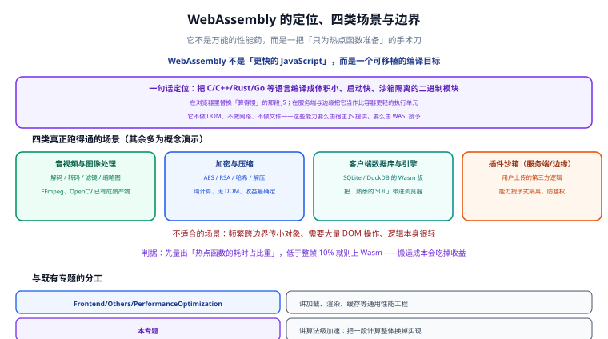

# 概述与场景



**WebAssembly**（简称 **Wasm**）是一种面向栈式虚拟机的**二进制指令格式**（binary instruction format）。它的定位不是「替代 JavaScript」，而是「给 JavaScript 补上一层高性能计算」：把已有的 C/C++、Rust、Go 代码编译成 `.wasm`，在浏览器里安全、快速地运行；同一份产物也能在浏览器之外被独立运行时加载。

要不要引入 Wasm，一句话的判据是：**页面里存在一个能被隔离出来、CPU 占比高、且能承受一次数据拷贝的热点**。三者缺一个，引入成本都可能大于收益。

## Wasm 是什么，不是什么

先把边界说清楚，后面所有取舍都从这里推。

**它是**：

- **可移植的二进制格式**：一份 `.wasm` 在 Chrome、Firefox、Safari、Node.js、Wasmtime 里语义一致，与 CPU 架构和操作系统无关。
- **可被多语言编译的目标**：C/C++、Rust、Go、C#、Kotlin、Dart、AssemblyScript 都能编译到 Wasm。
- **沙箱化执行**：模块默认不能碰文件、网络、DOM，只能调用宿主（浏览器或运行时）显式提供的导入函数。
- **接近原生的速度**：现代引擎把 Wasm 编译成机器码，计算密集场景常见 2~10 倍于 JS 的提速。

**它不是**：

- **不是 JavaScript 的替代品**：Wasm 没有垃圾回收（取决于是否启用 GC 提案）、没有内置字符串类型、不能操作 DOM。
- **不是「什么代码都快」**：跨边界调用有固定开销，细粒度互操作可能比纯 JS 还慢。
- **不是直接用 `file://` 双击就能跑的**：必须经 HTTP 加载，且 MIME 类型要正确。
- **不是前端专属**：服务端、边缘计算、插件系统都在用。

:::info 版本基线
截至 2026-09 核对：W3C **WebAssembly 2.0 规范**于 2025 年底发布，2026 年已获主流浏览器完整实现。文中所有提案状态均以此时点为准，具体项目请以目标浏览器版本为准，并在本地验证。
:::

## 它到底解决了什么问题

JavaScript 引擎（V8、SpiderMonkey、JavaScriptCore）已经很快，但有几类事情它天然吃亏：

1. **数值计算密集**：矩阵运算、卷积、编解码、加密，JS 的动态类型与边界检查带来额外开销。
2. **存量代码复用**：几十年积累的 C/C++ 库（FFmpeg、OpenCV、SQLite、zlib、加密库）不可能用 JS 重写一遍。
3. **确定性与可预测性**：Wasm 的指令集固定，编译后的性能更稳定，不像 JS 那样受 JIT 优化与去优化影响。
4. **跨语言、跨平台的统一交付物**：同一份 `.wasm` 可同时在浏览器、服务端、边缘节点运行。

## 四类真正跑得通的场景

### 音视频与图像处理

- **典型代表**：FFmpeg.wasm（浏览器剪视频）、Squoosh（图片压缩）、各种在线图片编辑器。
- **为什么适合**：算法本身就是纯计算循环，输入输出都是连续内存块，天然对应 Wasm 的线性内存模型。
- **注意事项**：大图/长视频要放进 **Worker**，否则主线程会被长任务卡住。参见 [前端性能优化 · 运行时优化](../../Others/PerformanceOptimization/Runtime/index.md)。

### 加密与压缩

- **典型代表**：zlib/brotli 压缩、AES/RSA、哈希与签名校验、密码学钱包。
- **为什么适合**：位运算密集、逻辑确定，Wasm 几乎就是它们的主场；很多库已有成熟 C 实现直接复用。
- **注意事项**：加解密涉及密钥时，务必确认模块来源可信并自行校验哈希。

### 客户端数据库与引擎

- **典型代表**：SQLite 编译成 Wasm 跑在浏览器里（配合 OPFS/IndexedDB 持久化）、DuckDB-Wasm、图数据库引擎。
- **为什么适合**：完整的关系型 SQL 引擎无法用 JS 高效重写，而 Wasm 能直接把 C 实现的 SQLite 搬进来。
- **注意事项**：持久化要自己接存储层，Emscripten 提供 MEMFS（内存）与 IDBFS（IndexedDB）两种文件系统模拟。

### 插件沙箱

- **典型代表**：CDN 边缘函数、数据库的 UDF、可扩展应用的第三方插件。
- **为什么适合**：Wasm 的能力型安全模型让宿主可以精确授权，插件无法越权访问宿主的文件与网络。
- **注意事项**：这一路线通常走 **WASI**，详见 [WASI 与服务端运行时](../WASI/index.md)。

## 不适合的场景与判据

下面这些情况，引入 Wasm 大概率是负收益：

- **热点占比过低**：如果目标函数只占整帧耗时的 5%，即使它快 4 倍，整体也只快 3.75%。**经验判据：热点占比低于整帧 10% 就别上**。
- **大量 DOM 操作**：Wasm 不能碰 DOM，所有节点操作都要通过 JS 转发，等于把开销翻倍。
- **高频小对象互传**：每帧成千上万次调用、每次传一个字符串或小结构，边界开销会吃掉全部收益。
- **一次性、非热点逻辑**：表单校验、路由跳转、模板渲染这类代码，编译成 Wasm 只是徒增体积。

:::tip 先量再换
先做一次 profiling，拿到「热点占整帧百分比」和「可预期的加速倍数」，再决定是否引入。完整的决策算法见 [性能对比与实测](../Performance/index.md)。
:::

## Wasm 与 JavaScript 的分工边界

两者是协作关系，各管一段，边界越清晰越不容易踩坑。

| 关注点 | JavaScript | WebAssembly |
| --- | --- | --- |
| DOM / BOM 操作 | 唯一入口，全权负责 | 完全不能，必须回调 JS |
| UI 状态与框架 | Vue / React 等框架负责 | 不参与 |
| 网络请求、存储 | 负责 | 由宿主代劳（WASI 下由运行时提供） |
| 数值密集计算 | 能做但慢 | 主场，常见 2~10 倍提速 |
| 存量 C/C++ 库 | 需要重写 | 直接编译复用 |
| 字符串处理 | 原生、方便 | 需手动编码为 UTF-8 字节 |
| 内存管理 | 自动 GC | 手动 malloc/free 或依赖 GC 提案 |

**划分原则**：

1. **计算进 Wasm，交互留 JS**：Wasm 导出的是纯函数，输入输出都是数字或内存块。
2. **批量传数据，不要逐条调用**：一次调用处理一整块像素/一整个数组，而不是循环 100 万次。
3. **共享内存块，而不是共享对象**：两边看到的是同一块 `ArrayBuffer` 的不同视图。

:::warning 关于「前端性能优化」专题
[前端性能优化](../../Others/PerformanceOptimization/index.md) 管的是加载、渲染、包体积、缓存这些**工程级**手段；本专题管的只是**算法级加速**。两者在「包体积」上有交集：引入 Wasm 会增加体积，这笔账要算，但具体怎么压体积仍以本专题的 [编译工具链](../Toolchain/index.md) 为准。
:::

## 与相邻专题的分工

- 和 [前端性能优化](../../Others/PerformanceOptimization/index.md) 的分工：它负责**指标、加载与渲染链路**，本专题负责**单个热点函数的执行效率**。
- 和 [浏览器渲染原理](../../Basic/Browser/Rendering/index.md) 的分工：它负责**从 HTML 到像素的渲染管线**，Wasm 只是被管线之外的 JS 调用的计算单元。
- 和 [云原生](../../../Ops/CloudNative/index.md) / [Serverless](../../../Ops/CloudNative/Serverless/index.md) 的分工：它们负责**部署与调度**，本专题负责 **Wasm 组件本身的形态与能力边界**。
- 和 [数据库](../../../DB/index.md) 的分工：它负责**服务端数据库的设计与运维**，本专题只讲把 SQLite 这类引擎编译成 Wasm 放到客户端运行。

## WebAssembly 2.0 关键能力速览

这是决定「能不能用某个特性」的对照表，状态截至 **2026-09 核对**。

| 能力 | 状态 | 对使用者的影响 |
| --- | --- | --- |
| **SIMD** | 已标准化，主流浏览器均支持 | 一次处理 128 位数据，图像/编解码提速显著<br/>需 `-msimd128` 等编译开关 |
| **Threads（线程）** | Chrome / Firefox 较早支持，Safari 滞后 | 配合 SharedArrayBuffer 做多核并行<br/>页面必须启用 COOP/COEP 响应头 |
| **GC 提案** | Chrome 121+ / Firefox 120+ 可用 | Java、Kotlin、Dart、C# 等依赖垃圾回收的语言可直接编译到 Wasm |
| **Exception Handling** | 2025 年走完标准化（phase 5），含新的 `exnref` 值<br/>Safari 18.4 落地 | 异常可跨 Wasm/JS 边界传播，C++ 异常与 Rust panic 语义更完整 |
| **JavaScript String Builtins** | 2025 年标准化<br/>Safari 26.2 落地 | Wasm 直接调用 JS 的 String 原语<br/>字符串比较/拼接不再需要大量胶水代码 |
| **Memory64** | 2025 年标准化 | 线性内存上限从 32 位索引的 4 GB 提升到 64 位寻址<br/>但浏览器当前仍限制在约 16 GB，且会失去 32 位指针的部分优化 |
| **Tail Call** | 已标准化 | 支持尾调用优化，函数式语言编译更自然 |
| **Extended Constant Expressions** | 已标准化 | 常量表达式能力增强，初始化更灵活 |
| **Relaxed SIMD** | 已标准化 | 允许引擎在 SIMD 上做更激进的指令选择 |
| **Component Model（组件模型）** | 实现推进阶段 | 让不同语言编译的组件按类型组合互调，详见 [WASI](../WASI/index.md) |
| **Multi Memory** | 实现推进阶段 | 一个模块可拥有多块线性内存 |
| **JIT-less Wasm / 原地解释器** | Safari 新增 | 禁用 JIT 时仍可运行<br/>大模块先解释执行，起步更快 |

:::warning Memory64 不要无脑用
只有确实需要**超过 4 GB** 线性内存时才该启用 Memory64。代价有两个：浏览器当前仍把内存限制在约 16 GB；同时会失去部分 32 位指针相关的优化，小模块反而变慢。
:::

## 最小可运行示例

先用最短路径看到效果，再决定要不要深入工具链。

### 路线 A：手写 WAT，直接编译

**WAT**（WebAssembly Text Format）是 Wasm 的文本表示，适合学习和调试。

```wasm [add.wat]
(module
  (func $add (param $a i32) (param $b i32) (result i32)
    local.get $a
    local.get $b
    i32.add)
  (export "add" (func $add)))
```

用 WABT 工具集的 `wat2wasm` 编译：

```shell [build.sh]
# 安装 wabt（含 wat2wasm / wasm2wat / wasm-objdump）
npm install -g wabt

# 编译成二进制模块
wat2wasm add.wat -o add.wasm

# 验证产物（能看到导出的 add 函数）
wasm-objdump -x add.wasm
```

预期输出里会出现 `Export[1]: - func[0] <add> -> "add"`，说明导出成功。

### 路线 B：写 C，用 Emscripten 编译

```c [hello.c]
#include <stdio.h>

int main(void) {
  printf("Hello from WebAssembly!\n");
  return 0;
}
```

```shell [build.sh]
# 安装并激活 emsdk（详见编译工具链章节）
emcc hello.c -O3 -o hello.html

# 产物：hello.html + hello.js + hello.wasm
```

### 在页面里加载

无论产物来自哪条路线，浏览器侧的加载方式都一样：

```html [index.html]
<!DOCTYPE html>
<html lang="zh-CN">
  <head>
    <meta charset="UTF-8" />
    <title>Wasm 最小示例</title>
  </head>
  <body>
    <p id="out">加载中……</p>
    <script type="module" src="./main.js"></script>
  </body>
</html>
```

```js [main.js]
// 流式实例化：要求服务器把 .wasm 以 application/wasm 返回
const { instance } = await WebAssembly.instantiateStreaming(
  fetch("./add.wasm"),
  {}
);

document.getElementById("out").textContent = `2 + 3 = ${instance.exports.add(2, 3)}`;
```

### 验证收尾

`.wasm` 不能通过 `file://` 直接打开（fetch 会被 CORS 拦掉），必须起一个静态服务器：

```shell [serve.sh]
# 在 index.html / main.js / add.wasm 同级目录执行
python -m http.server 8080
```

浏览器访问 <http://localhost:8080/>，预期现象：

1. 页面显示 `2 + 3 = 5`；
2. Network 面板里 `add.wasm` 的响应头为 `Content-Type: application/wasm`；
3. Console 无报错。

## 常用清单

**必记概念**：

- **线性内存（linear memory）**：可增长的 `ArrayBuffer`，Wasm 用整数指针访问，JS 用 TypedArray 视图访问。
- **实例（instance）**：模块实例化后的可运行对象，导出挂在 `instance.exports` 上。
- **导入（import）/ 导出（export）**：模块与宿主的接口契约，按名字匹配。
- **胶水代码（glue code）**：工具链自动生成的 JS，负责编码字符串、管理内存、桥接 Web API。

**必记命令**：

| 命令 | 作用 |
| --- | --- |
| `emcc` / `em++` | Emscripten 编译驱动，C/C++ 各自入口 |
| `emrun` | 起本地静态服务器，专门用于预览 Emscripten 产物 |
| `wasm-opt -Oz` | Binaryen 优化器，产物二次压缩 |
| `wasm-objdump -x` | 查看模块的段、导入、导出 |
| `wasm2wat` | 把二进制反编译回可读文本 |

## 易错点

:::danger 三个新手必踩的坑
1. **用 `file://` 直接打开 HTML**，然后看到 `Failed to fetch` 或 CORS 报错。Wasm 必须经 HTTP 加载，请用 `python -m http.server` 或 `emrun`。
2. **服务器没配 `application/wasm`**，`instantiateStreaming` 直接抛 `Incorrect response MIME type`。此时可退回 `WebAssembly.instantiate(await (await fetch(url)).arrayBuffer(), imports)` 兜底，但正确做法仍是修好响应头。
3. **把 Wasm 当成「提速开关」**，不看热点占比就引入，结果体积涨了几百 KB、整体耗时几乎没变。
:::

:::tip 一句话总结
Wasm 是「给 JS 打下手的高性能计算模块」，不是万能的。**先量热点，再算收益，最后才决定编译。**
:::

## 参考资料

1. WebAssembly 官网 —— 概念与使用场景：<https://webassembly.org/docs/use-cases/>
2. MDN —— WebAssembly 概念：<https://developer.mozilla.org/zh-CN/docs/WebAssembly/Concepts>
3. WebAssembly 2.0 规范（W3C Candidate Recommendation）：<https://www.w3.org/TR/wasm-core-2/>
4. WebAssembly 提案路线图（含各提案阶段）：<https://github.com/WebAssembly/proposals>
5. Emscripten 官方文档：<https://emscripten.org/docs/>
6. MDN —— `WebAssembly.instantiateStreaming()`：<https://developer.mozilla.org/zh-CN/docs/WebAssembly/Reference/JavaScript_interface/instantiateStreaming>
