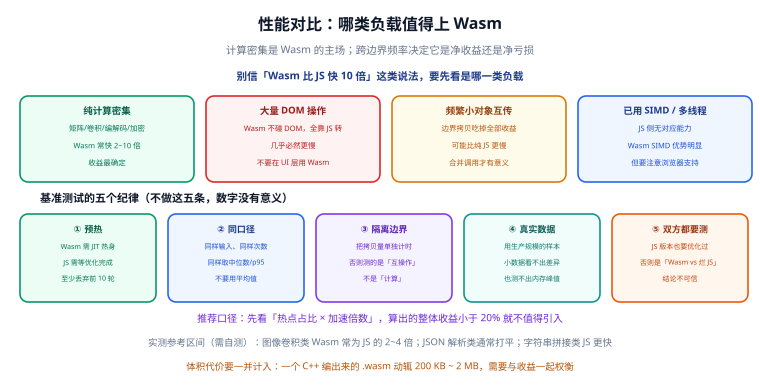

# 性能对比与实测



**性能**是引入 Wasm 最常被提起的理由，也是最容易被误判的地方：同一个模块，换个负载类型结论可能完全反过来。这一章只做两件事——给出可以直接引用的结论表，以及一套能产出可信数据的基准测试方法。

一句话结论：**Wasm 只赢在「纯计算 + 大块数据 + 低频次边界」这一种形状上，其余形状请先测再决定。**

## 先给结论：四类负载

这张表是全章的核心，状态截至 **2026-09 核对**，具体倍数会因浏览器、模块、数据规模而变，务必以你自己的实测为准。

| 负载类型 | 相对纯 JS 的表现 | 原因 | 使用建议 |
| --- | --- | --- | --- |
| **计算密集**（矩阵、卷积、编解码、加密） | 常见 **2~10 倍**提速 | 无动态类型开销<br/>无边界检查<br/>指令集固定，不受 JIT 去优化影响 | Wasm 的主场，放心上 |
| **DOM 密集**（大量节点增删改查） | **必然更慢** | Wasm 完全不碰 DOM<br/>所有操作都要回调 JS，等于多一层转发 | 不要用 Wasm 做 DOM 操作<br/>UI 逻辑留在 JS |
| **小对象频繁互传** | **可能比纯 JS 更慢** | 每次调用都有固定的边界开销<br/>字符串还要两遍编解码 | 合并调用、批量化<br/>否则不如纯 JS |
| **已用 SIMD / 多线程** | Wasm 优势**明显扩大** | SIMD 一次处理 128 位<br/>多线程可吃满多核 | 效果显著，但要确认浏览器支持<br/>线程还需 COOP/COEP |

:::warning 「必然更慢」和「可能更慢」是两回事
**DOM 密集场景是真·必然更慢**，没有优化空间，不要在架构上这样设计。**小对象互传是「可能」更慢**——通过合并调用、改成传 TypedArray，通常能把结论翻过来。所以前者要重新设计，后者要重构数据接口。
:::

### 典型提速区间参考

按经验区间给出量级参考（同一台机器上，与优化良好的 JS 对比）：

- **矩阵乘 / 卷积**：3~8 倍（开 SIMD 后更高）。
- **图片编解码（JPEG/WebP）**：2~5 倍。
- **压缩（zlib / brotli）**：2~4 倍。
- **加密（AES / SHA）**：3~10 倍，且带原生实现可复用。
- **字符串处理**：视情况可能为 0.5~1.5 倍，**不建议**用 Wasm 重写。

## 五个基准测试纪律

不遵守这五条，测出来的数字基本没有参考价值。

### 1. 预热：至少丢弃前 10 轮

Wasm 模块首次调用的开销包含惰性编译、JIT 分层编译、缓存未命中等。第一次跑永远最慢。

### 2. 同口径：同样输入、同样次数、取中位数或 p95

- **不要用平均值**：一次 GC 停顿就能把平均值拉偏。
- **优先 p95 或中位数**：更贴近用户实际体感。
- 两边的**迭代次数、数据规模、运行环境**必须完全一致。

### 3. 隔离边界：把拷贝量单独计时

这是最容易犯的错。如果计时区间里包含了「JS 数组 → Wasm 内存」的拷贝，那你测的是**互操作成本**，不是**计算速度**。

**正确做法**：分三段计时——写入内存、调用计算、读回结果，分别记录。

### 4. 真实数据：用生产规模的样本

用 4×4 的矩阵测出来的倍数，放到 1920×1080 的图片上毫无意义。数据规模会显著改变缓存命中率与并行度。

### 5. JS 版本也要优化过

这是最重要的一条：**如果 JS 版本写得随意（比如用 `forEach` + 对象数组），你测的是「Wasm vs 烂 JS」，结论不可信。**

公平的对照必须是：**优化良好的 JS**（TypedArray、循环展开、避免属性查找）**vs 优化良好的 Wasm**（`-O3`、SIMD、批量化）。

:::danger 五个反模式
1. **只跑一次就下结论**——测的是冷启动。
2. **对平均值做比较**——一次抖动就翻转结论。
3. **把数据准备算进计算耗时**——测的是拷贝。
4. **用玩具数据**——规模不具代表性。
5. **JS 侧不做优化**——结论毫无意义。
:::

## 可跑的 benchmark 骨架

下面这份代码把五条纪律全部落到实现里，可以直接复制使用。

```js [bench.js]
const WARMUP_ROUNDS = 10; // 至少丢弃前 10 轮
const MEASURE_ROUNDS = 50;

/** 取一组样本的统计量：中位数与 p95 */
function summarize(samples) {
  const sorted = [...samples].sort((a, b) => a - b);
  const pick = (q) => sorted[Math.min(sorted.length - 1, Math.floor(sorted.length * q))];
  return {
    min: sorted[0],
    median: pick(0.5),
    p95: pick(0.95),
    max: sorted[sorted.length - 1],
  };
}

function toMs(n) {
  return Number(n.toFixed(2));
}

/**
 * 只对 fn 内部计时，数据准备放在外面
 * @param {() => void} fn
 */
function measure(fn) {
  for (let i = 0; i < WARMUP_ROUNDS; i++) fn(); // 预热，不计时
  const samples = [];
  for (let i = 0; i < MEASURE_ROUNDS; i++) {
    const t0 = performance.now();
    fn();
    samples.push(performance.now() - t0);
  }
  return summarize(samples);
}

// ---------- 被测对象：一个纯计算函数 ----------

// 纯 JS 版本（已经优化过：TypedArray + 单层循环，无属性查找）
function runJs(src, dst, len) {
  for (let i = 0; i < len; i++) {
    const v = src[i];
    dst[i] = v * 0.299 + v * 0.587 + v * 0.114;
  }
  return dst;
}

// Wasm 版本
function makeWasmRunner(wasm) {
  const { malloc, free, process, memory } = wasm;
  return function runWasm(srcArray, len) {
    const bytes = len * 4;
    const inPtr = malloc(bytes);
    const outPtr = malloc(bytes);

    // 分段计时：写入（边界成本）
    const tWrite = performance.now();
    new Float32Array(memory.buffer, inPtr, len).set(srcArray);
    const writeMs = performance.now() - tWrite;

    // 分段计时：计算（我们关心的部分）
    const tCalc = performance.now();
    process(inPtr, outPtr, len);
    const calcMs = performance.now() - tCalc;

    // 分段计时：读回（边界成本）
    const tRead = performance.now();
    const out = new Float32Array(memory.buffer, outPtr, len).slice();
    const readMs = performance.now() - tRead;

    free(inPtr);
    free(outPtr);
    return { out, writeMs, calcMs, readMs };
  };
}

// ---------- 主流程 ----------

const LEN = 1920 * 1080; // 用生产规模数据，不要用玩具数据
const src = new Float32Array(LEN).map((_, i) => (i % 255) / 255);
const dstJs = new Float32Array(LEN);

const jsStats = measure(() => runJs(src, dstJs, LEN));
console.log("JS   中位数 / p95:", toMs(jsStats.median), toMs(jsStats.p95));

const { instance } = await WebAssembly.instantiateStreaming(fetch("./process.wasm"), {});
const runWasm = makeWasmRunner(instance.exports);

// 边界成本单独统计
const boundary = [];
const wasmStats = measure(() => {
  const r = runWasm(src, LEN);
  boundary.push(r.writeMs + r.readMs);
});
const boundaryStats = summarize(boundary);

console.log("Wasm 中位数 / p95:", toMs(wasmStats.median), toMs(wasmStats.p95));
console.log(
  "边界拷贝 中位数 / p95:",
  toMs(boundaryStats.median),
  toMs(boundaryStats.p95)
);

console.log("加速倍数（p95）:", (jsStats.p95 / wasmStats.p95).toFixed(2), "x");
```

```c [process.c]
#include <emscripten/emscripten.h>

EMSCRIPTEN_KEEPALIVE
void process(const float *src, float *dst, int len) {
  for (int i = 0; i < len; i++) {
    float v = src[i];
    dst[i] = v * 0.299f + v * 0.587f + v * 0.114f;
  }
}
```

```shell [build.sh]
emcc process.c -O3 -msimd128 --no-entry -s STANDALONE_WASM=1 \
  -s EXPORTED_FUNCTIONS='["_process","_malloc","_free"]' \
  -o process.wasm

python -m http.server 8080
```

**预期输出形态**（数值以实机为准）：

```text
JS   中位数 / p95: 8.42 9.87
Wasm 中位数 / p95: 1.63 1.91
边界拷贝 中位数 / p95: 1.12 1.38
加速倍数（p95）: 5.17 x
```

:::tip 怎么读这组数字
看到「加速 5.17 倍」先别高兴：**其中 1.38 ms 是边界拷贝成本**。如果继续优化，方向可能不是「把算法写得更快」，而是「减少拷贝次数」（比如把多次调用合并、用 SharedArrayBuffer 共享内存）。
:::

## 用 DevTools Performance 面板读 Wasm 帧

1. 打开 Chrome DevTools → **Performance** 面板 → 点录制 → 操作页面 → 停止录制。
2. 在火焰图里找 **`wasm-function[...]`** 或带模块名前缀的条目，那就是 Wasm 函数的执行帧。
3. 展开看 **Self Time**（自身耗时）与 **Total Time**（含调用者）的差值，判断是否被 JS 边界调用包裹。
4. 在 **Bottom-Up** 视图里按 Self Time 排序，直接看到「谁最耗时」。

:::info 想让帧里显示源码行号
编译时加 **`-g`** 保留 **DWARF** 调试信息，DevTools 才能把 `wasm-function[42]` 映射回 `conv.c:37`。生产构建务必去掉 `-g`，否则体积会明显变大。
:::

**DevTools 还能做三件事**：

- **单步调试**：Sources 面板里可以给 Wasm 下断点、单步执行（**需要 `-g`**）。
- **查看线性内存**：Memory 面板或 `WebAssembly.Memory` 对象可以直接查看当前内存字节数。
- **看编译耗时**：Performance 面板里 Compile Script / WasmModule 相关条目会显示编译阶段耗时，方便判断缓存策略是否生效。

## SIMD 与多线程的开启方式

### SIMD

```shell [build-simd.sh]
emcc conv.c -O3 -msimd128 --no-entry -s STANDALONE_WASM=1 \
  -s EXPORTED_FUNCTIONS='["_convolve3x3","_malloc","_free"]' \
  -o conv.wasm
```

- **C/C++**：加 `-msimd128`，最好配合 `#include <wasm_simd128.h>` 显式使用向量类型。
- **Rust**：需要 nightly 特性开关，或用 `std::simd`（按官方文档，建议本地验证）。
- **收益**：图像、编解码类算法常见再提速 **1.5~3 倍**。
- **注意**：三大引擎对 SIMD 的支持已比较普遍，但仍建议做能力检测后再启用。

### 多线程

```shell [build-threads.sh]
emcc conv.c -O3 -pthread --no-entry \
  -s EXPORTED_FUNCTIONS='["_convolve3x3","_malloc","_free"]' \
  -s PTHREAD_POOL_SIZE=4 \
  -o conv.threads.wasm
```

**硬性前提**：页面必须由服务器返回以下两个响应头，否则 `SharedArrayBuffer` 不可用。

```text [响应头]
Cross-Origin-Opener-Policy: same-origin
Cross-Origin-Embedder-Policy: require-corp
```

```js [check-sab.js]
// 运行时检测：没有这两个头时 SharedArrayBuffer 是 undefined
if (typeof SharedArrayBuffer === "undefined") {
  console.warn("SharedArrayBuffer 不可用：请检查 COOP / COEP 响应头");
}
```

| 能力 | Chrome | Firefox | Safari |
| --- | --- | --- | --- |
| SIMD | 支持 | 支持 | 支持 |
| Threads + SharedArrayBuffer | 较早支持 | 较早支持 | **支持滞后** |

:::warning 加 COOP/COEP 会打断既有页面
`require-corp` 会让所有跨域资源（图片、脚本、字体、iframe）都要求显式授权（`crossorigin` 属性或 CORP 响应头），否则加载失败。**上线前必须做全站回归**，别只在测试环境验证。
:::

## 体积与加载代价的权衡

提速不是免费的，`.wasm` 的体积与编译耗时都要计入。

| 项目 | 典型量级 | 说明 |
| --- | --- | --- |
| C++ 编出的 `.wasm` | 200 KB ~ 2 MB | 依赖越多越大，FFmpeg 类可达数 MB |
| Rust 编出的 `.wasm` | 100 KB ~ 1 MB | `opt-level = "z"` + `lto` 后通常更小 |
| gzip / brotli 传输后 | 原体积的 30%~40% | 服务器务必开启压缩 |
| 编译耗时 | 大模块可达 100~300 ms | 可用 Cache Storage / IndexedDB 跳过 |
| 二次加载（命中编译缓存） | 通常省 100~300 ms | 模块越大收益越明显 |

**体积预算建议**：

- **首屏关键路径**：`.wasm` 总量控制在 **200 KB** 以内（压缩后），超出就考虑懒加载。
- **非关键路径**：可以放宽，用 `import()` 按需加载。
- **明确不算首屏的模块**：放进 Worker 里异步初始化，完全不阻塞渲染。

:::tip 懒加载写法
```js
// 用到时才加载，避免影响首屏
button.addEventListener("click", async () => {
  const { instance } = await WebAssembly.instantiateStreaming(fetch("./conv.wasm"), {});
  runHeavyTask(instance.exports);
});
```
:::

## 「热点占比 × 加速倍数」决策算法

这是决定「要不要引入 Wasm」的核心公式，按顺序执行：

```text [决策流程]
1. 用 Profiler 测出目标函数占总耗时的比例 R（例如 35%）
2. 用同类项目经验或小规模原型估出加速倍数 S（例如 3x）
3. 计算整体收益：gain = R × (1 - 1/S)
      例：0.35 × (1 - 1/3) ≈ 23.3%
4. 判据：
   - gain < 20%  → 不值得引入
   - 20% ≤ gain < 40% → 可以引入，但先做体积预算评估
   - gain ≥ 40% → 值得引入，优先排期
5. 同时计入成本：体积增量、开发维护成本、调试复杂度
```

**几个算例**：

| 热点占比 R | 加速倍数 S | 整体收益 | 结论 |
| --- | --- | --- | --- |
| 5% | 4x | 3.75% | 不值得，别动 |
| 10% | 4x | 7.5% | 不值得，低于 10% 的判据 |
| 35% | 3x | 23.3% | 可以引入，先评估体积 |
| 50% | 3x | 33.3% | 可以引入 |
| 70% | 4x | 52.5% | 值得引入，优先排期 |
| 70% | 1.5x | 23.3% | 值得，但先确认加速倍数是否还有提升空间 |

:::danger 三条判据红线
1. **热点占比低于整帧 10%，直接放弃**——收益不足以覆盖体积与维护成本。
2. **整体收益小于 20%，不要引入**——用户感知不到，但你要长期维护两套代码。
3. **加速倍数低于 1.5 倍，先找原因**——通常是传参方式不对（小对象高频互传）或忘了开优化，不是 Wasm 本身不行。
:::

## 实战：给一个已有项目做收益评估

```shell [profile.sh]
# 1) 起本地服务，打开页面
pnpm dev

# 2) 在 DevTools Performance 面板录制 10 秒典型操作

# 3) 在 Bottom-Up 视图按 Self Time 排序，找出 Top 5 耗时函数
#    假设得到：applyFilter = 420ms / 总时长 1200ms → R ≈ 35%
```

```text [评估记录]
目标函数：applyFilter（图片滤镜）
热点占比 R：35%
预估加速倍数 S：3x（同类算法经验值）
整体收益：0.35 × (1 - 1/3) = 23.3%
体积增量：预计 +180 KB（gzip 后约 +62 KB）
结论：收益略高于 20% 阈值，且模块可懒加载 → 值得引入
下一步：按「实战：图像处理加速」章节落地，落地后重新实测验证
```

**验证收尾**：

```shell [verify.sh]
python -m http.server 8080
# 打开页面，在 Console 里看 benchmark 输出
# 判据：Wasm p95 相对 JS p95 下降 ≥ 40%，且边界拷贝 p95 不超过计算耗时的 50%
```

## 参考资料

1. WebAssembly 官网 —— 性能与用例：<https://webassembly.org/docs/use-cases/>
2. MDN —— WebAssembly 性能考量：<https://developer.mozilla.org/zh-CN/docs/WebAssembly/Concepts>
3. Chrome DevTools —— Performance 面板使用指南：<https://developer.chrome.com/docs/devtools/performance/>
4. web.dev —— `performance.now()` 与高精度计时：<https://developer.mozilla.org/zh-CN/docs/Web/API/Performance/now>
5. Emscripten —— SIMD 支持：<https://emscripten.org/docs/porting/simd.html>
6. Emscripten —— Pthreads 与多线程：<https://emscripten.org/docs/porting/pthreads.html>
