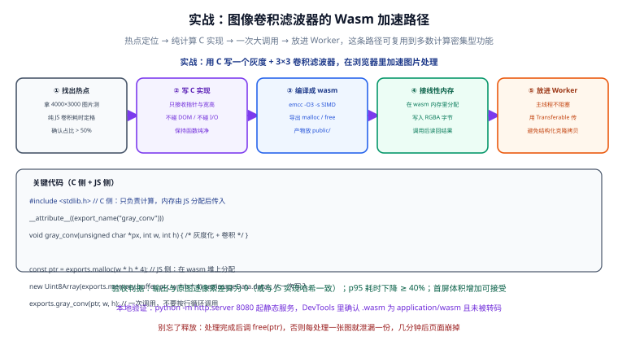

# 实战：图像处理加速



这一章把前面所有知识串成一条完整链路：**用 C 写「灰度 + 3×3 卷积」滤波器，编译成 `.wasm`，在浏览器里通过 Worker 加速图片处理**。每一步都有可复制的代码、可执行的命令和可验证的判据。

一句话结论：**Wasm 加速图片处理的正确形态是「大块数据 + 一次调用 + Worker 执行」，任何按行、按像素的跨边界调用都会把收益吃掉。**

## 第一步：热点定位（先量再换）

**跳过这一步的实战都是耍流氓。** 必须先拿到纯 JS 版本的耗时，并确认它占整帧的比例。

### 纯 JS 基线实现

```js [baseline.js]
/**
 * 灰度 + 3x3 均值卷积的纯 JS 版本（刻意写好：TypedArray + 单层循环 + 无属性查找）
 * 如果 JS 版本写得很烂，后面的对比结论不可信
 */
export function grayscaleAndBlurJs(src, width, height) {
  const n = width * height;
  const gray = new Uint8ClampedArray(n * 4);

  // 灰度化：BT.601 亮度公式的整数近似
  for (let i = 0; i < n; i++) {
    const o = i * 4;
    const v = (77 * src[o] + 150 * src[o + 1] + 29 * src[o + 2]) >> 8;
    gray[o] = v;
    gray[o + 1] = v;
    gray[o + 2] = v;
    gray[o + 3] = src[o + 3];
  }

  // 3x3 卷积：1-2-1 / 2-4-2 / 1-2-1，权重和 16
  const K = [1, 2, 1, 2, 4, 2, 1, 2, 1];
  const out = new Uint8ClampedArray(n * 4);

  for (let y = 0; y < height; y++) {
    for (let x = 0; x < width; x++) {
      let r = 0;
      let g = 0;
      let b = 0;
      let k = 0;

      for (let ky = -1; ky <= 1; ky++) {
        // 边缘钳制，避免越界
        let sy = y + ky;
        if (sy < 0) sy = 0;
        if (sy >= height) sy = height - 1;

        for (let kx = -1; kx <= 1; kx++) {
          let sx = x + kx;
          if (sx < 0) sx = 0;
          if (sx >= width) sx = width - 1;

          const p = (sy * width + sx) * 4;
          const w = K[k++];
          r += w * gray[p];
          g += w * gray[p + 1];
          b += w * gray[p + 2];
        }
      }

      const q = (y * width + x) * 4;
      out[q] = r >> 4; // 除以 16，用位移更快
      out[q + 1] = g >> 4;
      out[q + 2] = b >> 4;
      out[q + 3] = gray[q + 3];
    }
  }

  return out;
}
```

### 测量并确认占比

```js [measure-baseline.js]
import { grayscaleAndBlurJs } from "./baseline.js";

const canvas = document.getElementById("src");
const ctx = canvas.getContext("2d");
const imageData = ctx.getImageData(0, 0, canvas.width, canvas.height);

const WARMUP = 10;
const RUNS = 30;

function stats(samples) {
  const s = [...samples].sort((a, b) => a - b);
  return {
    median: s[Math.floor(s.length * 0.5)],
    p95: s[Math.min(s.length - 1, Math.floor(s.length * 0.95))],
  };
}

for (let i = 0; i < WARMUP; i++) {
  grayscaleAndBlurJs(imageData.data, canvas.width, canvas.height);
}

const samples = [];
for (let i = 0; i < RUNS; i++) {
  const t0 = performance.now();
  grayscaleAndBlurJs(imageData.data, canvas.width, canvas.height);
  samples.push(performance.now() - t0);
}

const js = stats(samples);
console.log(
  `JS 灰度+卷积：中位数 ${js.median.toFixed(1)}ms / p95 ${js.p95.toFixed(1)}ms`
);
```

```shell [profile.sh]
python -m http.server 8080
# 打开页面 → Console 看基线耗时
# 同时在 DevTools Performance 面板录制一次完整操作，确认该函数的 Self Time 占比
```

**预期与判据**：

- 在 1920×1080 的图片上，纯 JS 通常落在 **60~120 ms** 量级（视机器而定）；
- 在 Performance 面板里，该函数应占整帧耗时的 **50% 以上**。

:::warning 占比不到 50% 就别往下做
如果实测占比低于 50%，先回到 [性能对比与实测](../Performance/index.md) 里的决策算法算一遍。**热点占比低于整帧 10% 直接放弃**，这个实战对你没有价值。
:::

## 第二步：用 C 实现算法

**核心约束：这个 C 文件不碰 DOM、不做 I/O、不打印日志。** 它只接收「指针 + 宽高」，返回处理完的字节。所有与浏览器的交互都留给 JS。

```c [conv.c]
#include <stdlib.h>
#include <stdint.h>
#include <emscripten/emscripten.h>

/* ============ 内存管理：暴露给 JS，在 Wasm 线性内存里分配缓冲 ============ */

EMSCRIPTEN_KEEPALIVE
void *wasm_alloc(int bytes) {
  return malloc((size_t)bytes);
}

EMSCRIPTEN_KEEPALIVE
void wasm_free(void *ptr) {
  free(ptr);
}

/* ============ 工具函数 ============ */

static inline uint8_t clamp_u8(int v) {
  if (v < 0) return 0;
  if (v > 255) return 255;
  return (uint8_t)v;
}

static inline int clamp_index(int v, int max) {
  if (v < 0) return 0;
  if (v >= max) return max - 1;
  return v;
}

/* ============ 灰度化：输入输出均为 RGBA8 字节流 ============ */

EMSCRIPTEN_KEEPALIVE
void grayscale(const uint8_t *src, uint8_t *dst, int width, int height) {
  const int n = width * height;
  for (int i = 0; i < n; i++) {
    const uint8_t *p = src + i * 4;
    /* BT.601：0.299R + 0.587G + 0.114B 的整数近似 */
    const uint8_t v = (uint8_t)((77 * p[0] + 150 * p[1] + 29 * p[2]) >> 8);
    uint8_t *q = dst + i * 4;
    q[0] = v;
    q[1] = v;
    q[2] = v;
    q[3] = p[3]; /* 保留原始 alpha */
  }
}

/* ============ 3x3 均值卷积：原地处理 buf（RGBA8） ============ */

EMSCRIPTEN_KEEPALIVE
void convolve3x3(uint8_t *buf, int width, int height) {
  /* 1-2-1 / 2-4-2 / 1-2-1 高斯近似核，权重和为 16 */
  static const int K[9] = {
    1, 2, 1,
    2, 4, 2,
    1, 2, 1,
  };
  const int KSHIFT = 4; /* 除以 16 == 右移 4 位 */

  const int total = width * height * 4;

  /* 需要一份原始副本：卷积是读写同一块内存，不复制会互相污染 */
  uint8_t *tmp = (uint8_t *)malloc((size_t)total);
  if (!tmp) return;
  for (int i = 0; i < total; i++) tmp[i] = buf[i];

  for (int y = 0; y < height; y++) {
    for (int x = 0; x < width; x++) {
      int acc0 = 0, acc1 = 0, acc2 = 0;

      for (int ky = -1; ky <= 1; ky++) {
        for (int kx = -1; kx <= 1; kx++) {
          const int sx = clamp_index(x + kx, width);
          const int sy = clamp_index(y + ky, height);
          const uint8_t *p = tmp + (sy * width + sx) * 4;
          const int k = K[(ky + 1) * 3 + (kx + 1)];
          acc0 += k * p[0];
          acc1 += k * p[1];
          acc2 += k * p[2];
        }
      }

      uint8_t *q = buf + (y * width + x) * 4;
      q[0] = clamp_u8(acc0 >> KSHIFT);
      q[1] = clamp_u8(acc1 >> KSHIFT);
      q[2] = clamp_u8(acc2 >> KSHIFT);
      /* q[3] 保持原 alpha 不动 */
    }
  }

  free(tmp);
}

/* ============ 一条龙：灰度 + 卷积，只暴露一次跨边界调用 ============ */

EMSCRIPTEN_KEEPALIVE
void grayscale_and_blur(const uint8_t *src, uint8_t *dst, int width, int height) {
  grayscale(src, dst, width, height);
  convolve3x3(dst, width, height);
}
```

:::tip 为什么要把两步合成一个导出函数
`grayscale` 和 `convolve3x3` 分开导出是**给调试用的**；生产路径走 `grayscale_and_blur`，把两次跨边界调用压成一次。边界调用有固定开销，能省就省。
:::

## 第三步：编译

```shell [build.sh]
#!/usr/bin/env bash
set -euo pipefail

# 固定 Emscripten 版本（详见「编译工具链」章节，不要用 latest）
source ~/emsdk/emsdk_env.sh

emcc conv.c \
  -O3 \
  -msimd128 \
  --no-entry \
  -s STANDALONE_WASM=1 \
  -s ALLOW_MEMORY_GROWTH=1 \
  -s INITIAL_MEMORY=32MB \
  -s EXPORTED_FUNCTIONS='["_wasm_alloc","_wasm_free","_grayscale","_convolve3x3","_grayscale_and_blur","_malloc","_free"]' \
  -o conv.wasm

echo "=== 产物体积 ==="
ls -lh conv.wasm
echo "=== 压缩后体积（实际传输量） ==="
gzip -9 -c conv.wasm | wc -c
```

**预期输出形态**：

```text
=== 产物体积 ===
-rw-r--r-- 1 user staff 214K conv.wasm
=== 压缩后体积（实际传输量） ===
   74128
```

**关键参数解释**：

| 参数 | 为什么必须要 |
| --- | --- |
| `-O3` | 计算是关键路径，优先性能 |
| `-msimd128` | 启用 SIMD，图像类算法再提速 1.5~3 倍 |
| `--no-entry` | 没有 `main`，纯库形态 |
| `-s STANDALONE_WASM=1` | 输出可脱离 Emscripten JS 胶水独立运行的 Wasm |
| `-s ALLOW_MEMORY_GROWTH=1` | 图片尺寸不定，必须允许扩容 |
| `-s INITIAL_MEMORY=32MB` | 预设初始内存，减少扩容抖动 |
| `-s EXPORTED_FUNCTIONS` | C 函数默认不导出，必须显式列出（注意下划线前缀） |

:::danger 编译完一定要检查导入
```shell
wasm-objdump -x conv.wasm | grep -A 15 "Import"
```
不同 Emscripten 版本可能产出不同的导入需求（例如 `env.emscripten_notify_memory_growth`）。**如果 JS 侧的导入对象没提供对应函数，实例化会直接抛 `missing import`。** 看到需要什么，就在导入对象里补什么。
:::

## 第四步：接线性内存

这一步是整个实战最容易出错的地方，核心是三个动作：**在 wasm 堆上分配 → `set()` 一次写入 → 一次调用**。

```js [wasm.js]
const WASM_URL = new URL("./conv.wasm", import.meta.url);

let wasmExports = null;

/**
 * 实例化（只做一次）
 * 额外提供的导入是无害的：模块不需要就不会被链接
 */
export async function initWasm() {
  if (wasmExports) return wasmExports;

  const { instance } = await WebAssembly.instantiateStreaming(fetch(WASM_URL), {
    env: {
      // 部分 STANDALONE_WASM 产物会要求这个导入，给个空实现兜底
      emscripten_notify_memory_growth: () => {},
    },
  });

  wasmExports = instance.exports;
  return wasmExports;
}

/**
 * 把「处理一整张 RGBA 图」封装成一次调用
 * @param {ArrayBuffer} buffer RGBA8 原始字节（会被读取，不会被转移）
 * @param {number} width
 * @param {number} height
 * @returns {Uint8Array} 处理结果
 */
export function makeRunner(wasm) {
  const { memory, malloc, free, grayscale_and_blur } = wasm;

  return function process(buffer, width, height) {
    const bytes = width * height * 4;

    // 1) 在 Wasm 堆上分配输入/输出缓冲
    const srcPtr = malloc(bytes);
    const dstPtr = malloc(bytes);
    if (!srcPtr || !dstPtr) {
      throw new Error("Wasm 内存分配失败（图片过大？）");
    }

    try {
      // 2) 一次性写入：唯一一次拷贝
      //    注意：视图必须在分配之后创建，因为 malloc 可能触发内存扩容
      new Uint8Array(memory.buffer, srcPtr, bytes).set(new Uint8Array(buffer));

      // 3) 一次调用，处理整张图
      grayscale_and_blur(srcPtr, dstPtr, width, height);

      // 4) 读回结果（视图同样要现取现用）
      return new Uint8Array(memory.buffer, dstPtr, bytes).slice();
    } finally {
      // 5) 无论成功失败都释放，避免 Wasm 侧内存泄漏
      free(srcPtr);
      free(dstPtr);
    }
  };
}
```

:::danger 不能按行循环调用
最常见的错误写法是这样：

```js
// ❌ 每行调用一次，宽度 1920 就是 1920 次跨边界调用
for (let y = 0; y < height; y++) {
  grayscale(srcPtr + y * width * 4, dstPtr + y * width * 4, width, 1);
}
```

边界调用的固定开销会累积成主要耗时，最终可能比纯 JS 还慢。**要么一次传整张图，要么把行数合并到很低的量级。**
:::

:::warning `malloc` 可能让旧视图失效
`malloc` 在内存不够时会触发 `memory.grow()`，此时**之前创建的 TypedArray 视图全部失效**。上面的代码里，两个视图都是在分配完成后才创建的，所以是安全的。如果你把视图创建提到 `malloc` 之前，就会出现「写进去的数据读不出来」的诡异现象。详见 [与 JavaScript 互操作](../Interop/index.md)。
:::

## 第五步：放进 Worker

主线程负责 UI 与 Canvas，计算全部丢给 Worker，并且**用 Transferable 转移所有权，不做结构化克隆**。

```js [worker.js]
import { initWasm, makeRunner } from "./wasm.js";

let run = null;

async function ensureReady() {
  if (run) return run;
  const wasm = await initWasm();
  run = makeRunner(wasm);
  return run;
}

self.onmessage = async (event) => {
  const { id, buffer, width, height } = event.data;

  try {
    const runner = await ensureReady();

    // 只有计算部分需要计时，和性能章节的口径保持一致
    const t0 = performance.now();
    const out = runner(buffer, width, height);
    const cost = performance.now() - t0;

    self.postMessage(
      { id, ok: true, buffer: out.buffer, width, height, cost },
      [out.buffer] // 转移所有权：零拷贝
    );
  } catch (err) {
    self.postMessage({ id, ok: false, error: String(err) });
  }
};
```

```js [main.js]
import { grayscaleAndBlurJs } from "./baseline.js";

const worker = new Worker(new URL("./worker.js", import.meta.url), {
  type: "module",
});

let seq = 0;
const pending = new Map();

worker.onmessage = (event) => {
  const { id, ok, buffer, width, height, error, cost } = event.data;
  const resolve = pending.get(id);
  if (!resolve) return;
  pending.delete(id);

  if (!ok) {
    resolve(Promise.reject(new Error(error)));
    return;
  }
  resolve({ pixels: new Uint8Array(buffer), width, height, cost });
};

/** 把一张 ImageData 交给 Worker 处理，返回新的像素数据 */
function processInWorker(imageData) {
  const id = ++seq;
  const { data, width, height } = imageData;

  return new Promise((resolve, reject) => {
    pending.set(id, resolve);

    // 转移 data.buffer 的所有权：转移后主线程这份 ImageData 不可再用
    worker.postMessage({ id, buffer: data.buffer, width, height }, [data.buffer]);

    // 兜底：超时报错，避免 Promise 永远不 settle
    setTimeout(() => {
      if (pending.delete(id)) reject(new Error("Worker 处理超时"));
    }, 10000);
  });
}

// ---------- 页面装配 ----------

const srcCanvas = document.getElementById("src");
const outCanvas = document.getElementById("out");
const srcCtx = srcCanvas.getContext("2d");
const outCtx = outCanvas.getContext("2d");

// 用一张测试图填充画布（实际项目里换成用户选择或 fetch 的图片）
function drawFixture() {
  const gradient = srcCtx.createLinearGradient(0, 0, srcCanvas.width, srcCanvas.height);
  gradient.addColorStop(0, "#ff0055");
  gradient.addColorStop(0.5, "#00c2ff");
  gradient.addColorStop(1, "#ffe600");
  srcCtx.fillStyle = gradient;
  srcCtx.fillRect(0, 0, srcCanvas.width, srcCanvas.height);
}

async function runOnce() {
  const imageData = srcCtx.getImageData(0, 0, srcCanvas.width, srcCanvas.height);
  const { pixels, width, height, cost } = await processInWorker(imageData);

  outCtx.putImageData(new ImageData(new Uint8ClampedArray(pixels), width, height), 0, 0);
  return cost;
}

document.getElementById("run").addEventListener("click", async () => {
  const cost = await runOnce();
  document.getElementById("cost").textContent = `本次耗时：${cost.toFixed(1)} ms`;
});

drawFixture();
```

```html [index.html]
<!DOCTYPE html>
<html lang="zh-CN">
  <head>
    <meta charset="UTF-8" />
    <title>Wasm 图像处理加速</title>
    <style>
      canvas { border: 1px solid #ddd; max-width: 100%; }
    </style>
  </head>
  <body>
    <h1>Wasm 图像处理加速</h1>
    <p>
      <button id="run">执行灰度 + 3×3 卷积</button>
      <button id="bench">跑基准（JS vs Wasm）</button>
      <span id="cost"></span>
    </p>
    <canvas id="src" width="960" height="540"></canvas>
    <canvas id="out" width="960" height="540"></canvas>
    <script type="module" src="./main.js"></script>
  </body>
</html>
```

## 第六步：验收（三条判据）

### 判据一：逐像素差异为 0

Wasm 版本必须和纯 JS 基线**逐像素完全一致**——这是「重写没有引入功能偏差」的证明。灰度公式与卷积核都用了整数运算，所以可以要求严格相等。

```js [verify-pixels.js]
import { grayscaleAndBlurJs } from "./baseline.js";

/**
 * 对比 JS 基线与 Wasm 结果
 * @returns diff 为不一致的字节数，total 为总字节数
 */
export function comparePixels(srcPixels, width, height, wasmPixels) {
  const jsPixels = grayscaleAndBlurJs(srcPixels, width, height);

  let diff = 0;
  for (let i = 0; i < jsPixels.length; i++) {
    if (jsPixels[i] !== wasmPixels[i]) diff++;
  }
  return { diff, total: jsPixels.length };
}
```

```js [main.js]
// 接到上面的 runOnce 流程里
import { comparePixels } from "./verify-pixels.js";

export async function verify() {
  const imageData = srcCtx.getImageData(0, 0, srcCanvas.width, srcCanvas.height);
  const srcCopy = new Uint8ClampedArray(imageData.data); // 备份，因为 buffer 会被转移

  const { pixels } = await processInWorker(imageData);
  const { diff, total } = comparePixels(
    srcCopy,
    srcCanvas.width,
    srcCanvas.height,
    pixels
  );

  console.log(`像素不一致数：${diff} / ${total}`);
  return diff;
}
```

**判据**：`diff === 0`。如果不是 0，优先检查三处——灰度取整方式（`>> 8` vs `Math.round`）、卷积的边缘钳制策略、以及 alpha 通道是否被误改。

```js [main.js]
// 挂到 window 上，方便直接在 Console 里调用
window.verify = verify;
```

### 判据二：p95 耗时下降 ≥ 40%

```js [bench-wasm.js]
const WARMUP = 10;
const RUNS = 30;

function stats(samples) {
  const s = [...samples].sort((a, b) => a - b);
  return {
    median: s[Math.floor(s.length * 0.5)],
    p95: s[Math.min(s.length - 1, Math.floor(s.length * 0.95))],
  };
}

/**
 * @param {() => Promise<number>} task 返回单次耗时（ms）
 * @param {string} label
 */
export async function bench(task, label) {
  for (let i = 0; i < WARMUP; i++) await task();

  const samples = [];
  for (let i = 0; i < RUNS; i++) samples.push(await task());

  const s = stats(samples);
  console.log(
    `${label}：中位数 ${s.median.toFixed(1)}ms / p95 ${s.p95.toFixed(1)}ms`
  );
  return s;
}
```

```js [main.js]
import { bench } from "./bench-wasm.js";

async function benchBoth() {
  const jsStats = await bench(async () => {
    const t0 = performance.now();
    const imageData = srcCtx.getImageData(0, 0, srcCanvas.width, srcCanvas.height);
    grayscaleAndBlurJs(imageData.data, srcCanvas.width, srcCanvas.height);
    return performance.now() - t0;
  }, "纯 JS");

  const wasmStats = await bench(async () => {
    const imageData = srcCtx.getImageData(0, 0, srcCanvas.width, srcCanvas.height);
    const { cost } = await processInWorker(imageData);
    return cost; // 只统计计算耗时，不含拷贝
  }, "Wasm ");

  const drop = 1 - wasmStats.p95 / jsStats.p95;
  console.log(`p95 下降：${(drop * 100).toFixed(1)}%`);
  return drop;
}

document.getElementById("bench").addEventListener("click", () => benchBoth());

// 挂到 window 上，方便直接在 Console 里调用
window.benchBoth = benchBoth;
```

**判据**：`drop >= 0.4`。

:::tip 计时口径必须一致
注意两边的计时范围：**JS 版包含了 `getImageData` 的开销，Wasm 版不包含**，这会让比较偏向 Wasm。严谨的做法是两边都把 `getImageData` 排除在计时区间外，或者两边都包含。**口径不一致的 benchmark 结论不可信。**
:::

### 判据三：体积增加可接受

```shell [verify-size.sh]
echo "Wasm 产物："; ls -lh conv.wasm | awk '{print $5}'
echo "gzip 后："; gzip -9 -c conv.wasm | wc -c
echo "基线 JS 体积："; ls -lh baseline.js | awk '{print $5}'
```

**判据建议**：

- gzip 后体积 **≤ 200 KB**：可接受，直接进首屏。
- gzip 后 **200 KB ~ 500 KB**：可接受，但必须**懒加载**（用户点击/进入相关页面时才 `import()`）。
- gzip 后 **> 500 KB**：先用 [编译工具链](../Toolchain/index.md) 的体积优化清单压一遍，压不下来再考虑是否值得。

### 完整验证步骤

```shell [verify.sh]
# 1) 编译
bash build.sh

# 2) 起静态服务器（.wasm 必须经 HTTP 加载，不能用 file://）
python -m http.server 8080

# 3) 浏览器打开 http://localhost:8080/
#    - 点击「执行灰度 + 3×3 卷积」，确认输出画布是灰度的模糊图
#    - Console 里执行 verify()，确认「像素不一致数：0」
#    - 点击「跑基准」，确认「p95 下降：≥ 40%」
#    - Network 面板确认 conv.wasm 的 Content-Type 为 application/wasm
#    - 连续执行 20 次，确认 memory.buffer.byteLength 不再增长（无泄漏）
```

## 踩坑回顾

:::danger 这次实战里最容易挂的五个点
1. **用 `file://` 打开 `index.html`**——`fetch` 被 CORS 拦掉，`instantiateStreaming` 直接报错。必须起静态服务器。
2. **服务器没配 `application/wasm`**——报 `Incorrect response MIME type`。快速验证：`curl -I http://localhost:8080/conv.wasm`。
3. **按行循环调用 Wasm 函数**——边界开销吃掉全部收益，甚至比纯 JS 更慢。必须一次传整张图。
4. **在主线程直接跑**——1920×1080 的图片单帧可能超过 100 ms，页面会明显卡顿。必须放 Worker，并用 Transferable 转移 `ArrayBuffer`。
5. **忘记 `free`**——`malloc` 出来的内存不会自动回收，连续处理 20 张图后线性内存会持续增长。用 `try/finally` 保证释放。
:::

:::tip 还能继续优化的三个方向
1. **开 SIMD**：把 `-msimd128` 和 `wasm_simd128.h` 用起来，卷积部分可以一次处理 16 个像素。
2. **开多线程**：用 `-pthread` 把图像按行分块给多个线程，注意必须先配好 COOP/COEP。
3. **合并管线**：如果后续还要加滤镜，继续在 C 侧串进 `grayscale_and_blur`，保持「一次调用」的形态。
:::

## 参考资料

1. Emscripten —— 与 JavaScript 互操作（内存与指针）：<https://emscripten.org/docs/porting/connecting_cpp_and_javascript/Interacting-with-code.html>
2. Emscripten —— BUILDING_WASM 相关编译选项：<https://emscripten.org/docs/tools_reference/emcc.html>
3. MDN —— `ImageData` 与 `putImageData`：<https://developer.mozilla.org/zh-CN/docs/Web/API/Canvas_API/Tutorial/Pixel_manipulation_with_canvas>
4. MDN —— `Worker.postMessage()` 与可转移对象：<https://developer.mozilla.org/zh-CN/docs/Web/API/Worker/postMessage>
5. Emscripten —— SIMD：<https://emscripten.org/docs/porting/simd.html>
6. web.dev —— `performance.now()` 高精度计时：<https://developer.mozilla.org/zh-CN/docs/Web/API/Performance/now>
