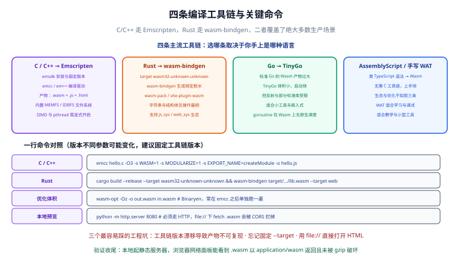

# 编译工具链



**工具链**决定了你要写什么语言、产出什么样的 `.wasm`、以及需要配套多少 JavaScript 胶水代码。这一章的目标是让你在 30 分钟内选定路线、装好环境、编译出第一个产物，并且知道怎么把体积压下去。

一句话结论：**C/C++ 走 Emscripten，Rust 走 wasm-bindgen，Go 只适合 TinyGo，纯前端团队可以先从 AssemblyScript 试水。**

## 四条工具链怎么选

| 路线 | 输入语言 | 典型产物 | 优点 | 缺点 | 适用场景 |
| --- | --- | --- | --- | --- | --- |
| **Emscripten** | C / C++ | `.wasm` + `.js` 胶水（可只出 `.wasm`） | 生态最成熟<br/>可直接复用 FFmpeg、OpenCV 等大库<br/>自带文件系统模拟 | 胶水代码体积偏大<br/>默认产物较臃肿 | 音视频、图像、加密、存量 C/C++ 库 |
| **wasm-bindgen / wasm-pack** | Rust | `.wasm` + `.js` 绑定 | 类型安全<br/>字符串与 Web API 绑定体验最好<br/>生态工具链现代 | 需要理解所有权与 `#[wasm_bindgen]` 约束 | 新写的计算模块、已有 Rust 库复用 |
| **TinyGo** | Go | `.wasm` | 产物比标准 Go 小很多<br/>语法仍是 Go | 反射受限、部分标准库缺失<br/>goroutine 在 Wasm 上无原生调度 | 已在 Go 团队、逻辑简单的小模块 |
| **AssemblyScript / 手写 WAT** | 类 TypeScript / WAT | `.wasm` | 前端上手最快<br/>手写 WAT 适合学习与调试 | AssemblyScript 生态较小<br/>WAT 不适合写业务 | 教学、原型、极小工具函数 |

:::warning Go 标准工具链的坑
标准 Go 工具链（`GOOS=js GOARCH=wasm`）能编出 Wasm，但**产物体积大**（通常数 MB 起），并且需要配套 `wasm_exec.js`。生产环境如果坚持用 Go，应优先评估 **TinyGo**。另外 goroutine 在 Wasm 里没有原生调度器，并发模型需要重新设计。
:::

## 装 Emscripten：emsdk 与固定版本

Emscripten 主线为 **4.x**（截至 2026-09 核对：4.0.19 发布于 2025-11，4.0.22 / 4.0.23 为当时近版）。**必须固定版本**——不同版本之间编译参数的行为会变，团队协作时尤其明显。

```shell [install-emsdk.sh]
# 1) 拉取 emsdk（放在项目外，避免污染仓库）
cd ~
git clone https://github.com/emscripten-core/emsdk.git
cd emsdk

# 2) 装指定版本并激活（示例固定到 4.0.22，请替换为你验证过的版本）
./emsdk install 4.0.22
./emsdk activate 4.0.22

# 3) 让当前 shell 生效
source ./emsdk_env.sh

# 4) 验证
emcc --version
```

Windows 下把最后一步换成 `emsdk_env.bat`，或直接用 PowerShell 执行 `.\emsdk_env.ps1`。

预期输出（版本号以你实际固定的为准）：

```text
emcc (Emscripten gcc/clang-like replacement + linker emulating GNU ld) 4.0.22
```

**固定版本的三种做法**，按可靠性排序：

1. **CI 与本地都用同一个版本号**，写进 README 或 `package.json` 的注释里。
2. 用 `emsdk` 的 `.emscripten` 版本记录文件提交到仓库（团队共享）。
3. 容器镜像里固定 `emscripten/emsdk:<版本>` 标签。

:::danger 不要用 `emsdk install latest`
`latest` 会随上游滚动，今天能编过的参数明天可能报错。一旦发现某个 `-s` 选项行为变化，排查成本极高。**永远显式写版本号。**
:::

## emcc 常用参数表

`emcc` 编译 C，`em++` 编译 C++，其余参数通用。

| 参数 | 含义 | 使用建议 |
| --- | --- | --- |
| `-O3` | 最高等级优化，优先性能 | 计算密集型模块的默认选择 |
| `-Oz` | 极限压缩体积 | 发布到 Web 的默认选择<br/>性能敏感处再局部调回 `-O3` |
| `-O0` / `-g` | 关闭优化 / 保留调试信息（DWARF） | 只在调试时用<br/>`-g` 是 DevTools 能看到源码行号的前提 |
| `-o out.wasm` | 只输出 `.wasm`，不生成胶水 | 自己手写 JS 加载逻辑时用<br/>常配合 `--no-entry` |
| `--no-entry` | 声明没有 `main` 函数 | 纯库形态的模块必加 |
| `-s MODULARIZE=1` | 把产物包成一个工厂函数 | 避免污染全局<br/>现代打包工程的推荐写法 |
| `-s EXPORT_NAME='createModule'` | 指定工厂函数名 | 与 `MODULARIZE` 搭配 |
| `-s EXPORT_ES6=1` | 输出 ES Module 形式的胶水 | 与 Vite / webpack 配合时用 |
| `-s ALLOW_MEMORY_GROWTH=1` | 允许线性内存动态增长 | 处理尺寸不定的图片/文件时必加<br/>代价是无法用固定 `ArrayBuffer` 做优化 |
| `-s INITIAL_MEMORY=64MB` | 指定初始内存 | 已知数据规模时预设，减少扩容抖动 |
| `-s EXPORTED_FUNCTIONS='["_foo"]'` | 显式导出函数（下划线前缀） | C 函数默认不导出，必须列出来 |
| `-s EXPORTED_RUNTIME_METHODS='["ccall","cwrap"]'` | 导出运行时辅助方法 | 调试期方便，生产可去掉 |
| `-s ENVIRONMENT=web,worker` | 限定运行环境 | 减小产物，避免打包 Node 分支代码 |
| `-s STANDALONE_WASM=1` | 输出可脱离 Emscripten JS 运行的 Wasm | 要让 Wasmtime / wazero 加载时用 |
| `-msimd128` | 启用 SIMD | 图像、编解码提速，需确认浏览器支持 |
| `-pthread` | 启用多线程 | 必须先解决 COOP/COEP 响应头 |
| `-s USE_SDL=2` | 使用 SDL2 端口 | 游戏、图形类项目 |
| `--use-port=emdawnwebgpu` | 使用 WebGPU 后端 | **Emscripten 4.0.10+ 的写法** |
| `-s USE_WEBGPU=1` | 旧的 WebGPU 开关 | 已标记过时，不要再用 |

:::warning WebGPU 后端的写法变了
截至 2026-09 核对：Emscripten **4.0.10+** 已把 WebGPU 后端改为 `--use-port=emdawnwebgpu`，旧的 `-s USE_WEBGPU=1` 被标记为过时。如果你从旧教程里抄命令，这一步会直接报错。
:::

### 一个完整的编译命令

```c [conv.c]
#include <stdlib.h>
#include <emscripten/emscripten.h>

EMSCRIPTEN_KEEPALIVE
int sum_i32(const int *data, int len) {
  int acc = 0;
  for (int i = 0; i < len; i++) {
    acc += data[i];
  }
  return acc;
}
```

```shell [build.sh]
emcc conv.c \
  -O3 \
  -msimd128 \
  --no-entry \
  -s STANDALONE_WASM=1 \
  -s ALLOW_MEMORY_GROWTH=1 \
  -s EXPORTED_FUNCTIONS='["_sum_i32","_malloc","_free"]' \
  -o conv.wasm
```

产物只有一个 `conv.wasm`，可以直接用 `WebAssembly.instantiateStreaming` 加载。

## 二次优化：wasm-opt

`wasm-opt` 属于 **Binaryen** 工具集（`emsdk` 会一并安装），它对已经编译好的 `.wasm` 做指令级优化，效果通常在 **5%~20%** 体积区间。

```shell [optimize.sh]
# -Oz 极限压体积
wasm-opt -Oz conv.wasm -o conv.opt.wasm

# 对比体积
ls -lh conv.wasm conv.opt.wasm

# 看模块信息（导入/导出/段大小）
wasm-opt --metrics conv.opt.wasm
```

**推荐顺序**：`emcc -O3` 先保证性能 → `wasm-opt -Oz` 再压体积 → `gzip`/`brotli` 做传输层压缩。

:::tip 什么时候该用 `-O3` 而不是 `-Oz`
先算一笔账：`-Oz` 相对 `-O3` 通常能省 10%~25% 体积，但可能损失 5%~15% 的运行性能。**如果计算是最关键路径，用 `-O3`；如果模块只在边缘场景偶尔用到，用 `-Oz`。** 两者都要用真实数据实测，不要凭感觉。
:::

## Rust 路线的完整命令

Rust 侧的核心是三个工具：

- **`cargo` + `--target wasm32-unknown-unknown`**：把 Rust 编译成 Wasm。
- **`wasm-bindgen`**：读取 Wasm 里的绑定信息，生成 JS 胶水与 `.d.ts`。
- **`wasm-pack`**：把上面两步串起来，输出可直接给打包器用的 npm 包。

```shell [rust-setup.sh]
# 1) 装 target（必须显式固定，默认 target 会编出宿主平台的产物）
rustup target add wasm32-unknown-unknown

# 2) 装 wasm-bindgen CLI（版本要与 Cargo.toml 里的依赖一致）
cargo install wasm-bindgen-cli

# 3) 装 wasm-pack（集成工具，推荐日常使用）
cargo install wasm-pack
```

```toml [Cargo.toml]
[package]
name = "wasm-demo"
version = "0.1.0"
edition = "2021"

[lib]
crate-type = ["cdylib", "rlib"]

[dependencies]
wasm-bindgen = "0.2"

[profile.release]
opt-level = "z"
lto = true
codegen-units = 1
panic = "abort"
```

```rust [src/lib.rs]
use wasm_bindgen::prelude::*;

#[wasm_bindgen]
pub fn sum_i32(data: &[i32]) -> i32 {
    data.iter().sum()
}
```

```shell [build.sh]
# 方式一：手动两步（便于理解流程）
cargo build --release --target wasm32-unknown-unknown
wasm-bindgen --target web \
  --out-dir pkg \
  target/wasm32-unknown-unknown/release/wasm_demo.wasm

# 方式二：一条命令（wasm-pack 会顺带跑 wasm-opt）
wasm-pack build --release --target web
```

**`js_sys` 与 `web_sys`** 是配套的两个 crate：`js_sys` 提供 JavaScript 标准内置对象（`Array`、`Map`、`Promise` 等）的绑定，`web_sys` 提供 Web API（`Document`、`Canvas`、`Worker` 等）的绑定。它们让 Rust 侧可以像调用本地 API 一样调用浏览器能力。

:::warning `--target` 忘了写会怎样
`cargo build --release` 不带 `--target wasm32-unknown-unknown` 时，产物是本机平台的可执行文件（`.exe` / 无后缀 ELF），不是 `.wasm`。症状是 `wasm-bindgen` 报「input file is not a wasm file」。**把 target 写死到构建脚本里，不要靠记忆。**
:::

## 产物体积优化清单

按收益从高到低排：

| 手段 | 典型收益 | 说明 |
| --- | --- | --- |
| **裁剪依赖** | 高 | 只引入真的用到的模块，避免整包 `std` / 大库 |
| **LTO（链接时优化）** | 中高 | Rust 用 `lto = true`，C/C++ 用 `-flto` |
| **`-Oz` / `opt-level = "z"`** | 中高 | 体积优先的优化等级 |
| **`wasm-opt -Oz`** | 中 | 对成品做指令级再优化 |
| **`panic = "abort"`** | 中 | 去掉 panic 展开代码 |
| **`codegen-units = 1`** | 中 | 提升优化效果，代价是编译变慢 |
| **`strip` 调试信息** | 中 | 发布产物不要带 DWARF |
| **gzip / brotli** | 高（传输层） | `.wasm` 压缩率通常 60%+<br/>务必在服务器开启 |

```shell [size-report.sh]
# 查看各模块体积占比，定位「谁把包撑大了」
wasm-opt --metrics conv.wasm | head -20

# Gzip / Brotli 后的实际传输体积
gzip -9 -c conv.wasm | wc -c
brotli -q 11 -c conv.wasm | wc -c

# 对比压缩前后
ls -lh conv.wasm
```

预期输出：未压缩通常在 200 KB ~ 2 MB 量级（C++ 编出的模块更接近上限），gzip 后一般能降到 30%~40%。

## 工程实战：把 Emscripten 产物接进 Vite

```js [vite.config.js]
import { defineConfig } from "vite";

export default defineConfig({
  // 确保 .wasm 被当作静态资源单独输出，不要被内联
  assetsInclude: ["**/*.wasm"],
  build: {
    // .wasm 走单独文件，避免被 base64 内联进 JS
    assetsInlineLimit: 0,
  },
});
```

```js [src/wasm.ts]
let instance: WebAssembly.Instance | null = null;

export async function loadWasm() {
  if (instance) return instance;

  // Vite 会把 URL 重写为构建后的真实路径
  const url = new URL("./conv.wasm", import.meta.url);
  const { instance: inst } = await WebAssembly.instantiateStreaming(fetch(url), {});
  instance = inst;
  return inst;
}
```

**验证收尾**：

```shell [verify.sh]
pnpm build
# 确认产物目录里存在独立的 .wasm 文件，而不是被内联
ls -lh dist/assets/*.wasm

pnpm preview
```

浏览器打开预览地址，DevTools 的 Network 面板里应看到一条 `conv.wasm` 请求，响应头 `Content-Type: application/wasm`，Status 200。

## 环境验证清单

装完之后逐条过一遍，能提前排掉大部分「命令跑不通」的问题。

| 检查项 | 命令 | 期望结果 |
| --- | --- | --- |
| Emscripten 版本 | `emcc --version` | 输出你固定的版本号（如 `4.0.22`）<br/>不是 `latest` 或未安装 |
| C++ 入口 | `em++ --version` | 与 `emcc` 同版本 |
| wasm-opt 可用 | `wasm-opt --version` | 输出 Binaryen 版本 |
| 查看模块结构 | `wasm-objdump -x app.wasm` | 正常输出各段信息 |
| Rust target | `rustup target list --installed` | 含 `wasm32-unknown-unknown` |
| wasm-bindgen | `wasm-bindgen --version` | 版本与 `Cargo.toml` 里的依赖一致 |
| TinyGo（可选） | `tinygo version` | 输出 TinyGo 版本 |
| 静态服务器 | `python -m http.server 8080` | 能访问 http://localhost:8080/ |

```shell [verify-toolchain.sh]
# 一次性把关键版本打出来，方便贴进 issue 或写进构建日志
echo "emcc:      $(emcc --version | head -1)"
echo "wasm-opt:  $(wasm-opt --version 2>/dev/null || echo '未安装')"
echo "rustc:     $(rustc --version)"
echo "wasm-bindgen: $(wasm-bindgen --version 2>/dev/null || echo '未安装')"
echo "tinygo:    $(tinygo version 2>/dev/null || echo '未安装')"
```

:::info 为什么要把版本一起打进构建日志
线上出现「本地能跑、CI 挂了」时，第一件事就是对比工具链版本。把上面这段命令的输出写进 CI 日志，能省掉大量来回排查。**版本信息属于构建产物的一部分，不是可选项。**
:::

## 三条工程坑

:::danger 三条必须记住的坑
1. **工具链版本漂移**：`emsdk install latest` 或 Rust 依赖不锁版本，导致「昨天能编，今天报错」。正确做法是固定 Emscripten 版本号、在 `Cargo.toml` 里锁 `wasm-bindgen` 版本，并把版本写进构建脚本。
2. **忘记固定 `--target`**：`cargo build --release` 少了 `--target wasm32-unknown-unknown`，产物就不是 Wasm。构建脚本里请完整写出命令，不要依赖 shell 历史。
3. **用 `file://` 直接打开编译产物 HTML**：Emscripten 的 `hello.html` 双击打开必然失败，因为 `fetch` 在 `file://` 下被 CORS 拦截。请用 `emrun hello.html` 或 `python -m http.server 8080`。
:::

:::tip 工具链选择的最终建议
- **团队已有 C/C++ 代码**：Emscripten，别重写。
- **新写模块且团队会 Rust**：wasm-bindgen + wasm-pack，开发体验最好。
- **只有前端团队、逻辑不复杂**：AssemblyScript 起步，需要极致控制时再降级到 C/Rust。
- **只想理解原理**：手写 WAT，配 `wasm2wat` 反复对照。
:::

## 参考资料

1. Emscripten 官方文档 —— 快速入门与 SDK 下载：<https://emscripten.org/docs/getting_started/downloads.html>
2. emsdk 仓库（版本列表与安装命令）：<https://github.com/emscripten-core/emsdk>
3. Emscripten `emcc` 编译选项完整列表：<https://emscripten.org/docs/tools_reference/emcc.html>
4. Binaryen（`wasm-opt`）仓库：<https://github.com/WebAssembly/binaryen>
5. wasm-bindgen 与 wasm-pack 文档：<https://rustwasm.github.io/docs/wasm-bindgen/>
6. TinyGo 官方 Wasm 指南：<https://tinygo.org/docs/guides/webassembly/>
