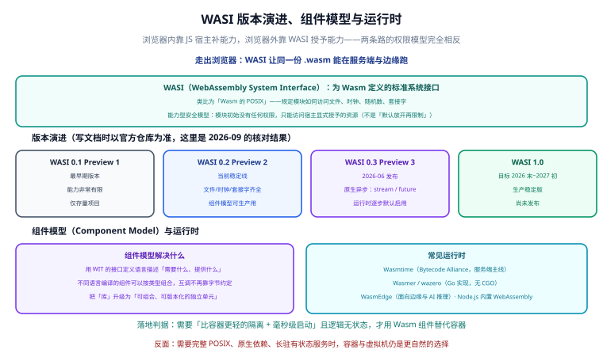

# WASI 与服务端运行时



**WASI**（**WebAssembly System Interface**，WebAssembly 系统接口）是浏览器之外的 Wasm 标准接口层，可以类比成「**Wasm 的 POSIX**」：它定义了一组与操作系统无关的系统调用（文件、时钟、网络、随机数），让同一份 `.wasm` 能在不同的运行时上跑起来。

一句话结论：**浏览器里的 Wasm 靠宿主 JS 补能力，服务端的 Wasm 靠 WASI 补能力，而且 WASI 默认什么都不给。**

## 为什么需要 WASI

浏览器里 Wasm 的「能力」来自 JavaScript：要读文件就用 `fetch`，要显示 UI 就操作 DOM，一切由 JS 代理。但把 Wasm 拿到服务端之后，**没有 JS 宿主了**，模块怎么读写文件？怎么拿当前时间？怎么开 TCP 连接？

有三个选择：

1. **每个运行时自己定义一套接口**——那 `.wasm` 就不具备可移植性了，违背了 Wasm 的初衷。
2. **让 Wasm 模块直接调用操作系统 syscall**——那沙箱就破了，模块可以任意读写宿主机文件。
3. **定义一层标准化、可授权、可拒绝的接口**——这就是 WASI。

WASI 的价值在于同时满足三个目标：

- **可移植**：一份 `.wasm` 在 Wasmtime、wazero、WasmEdge 上行为一致。
- **可沙箱**：宿主可以精确控制模块能碰什么。
- **多语言**：C、Rust、Go、Python 都能编译出符合 WASI 的模块。

:::info 版本基线
截至 **2026-09 核对**：**WASI 0.2（Preview 2）** 是当前稳定线；**WASI 0.3（Preview 3）** 于 **2026-06 发布**，核心是原生异步；**WASI 1.0** 目标为 2026 年末至 2027 年初，**尚未发布**。Wasmtime 新版已逐步默认启用 0.3 相关能力。
:::

## 能力型安全模型

这是 WASI 与「传统操作系统接口」最根本的区别。

**传统模型（基于身份）**：进程以某个用户身份运行，只要这个用户有权限，就能访问对应资源。程序一旦被攻破，攻击者拿到的是这个用户的全部权限。

**WASI 模型（基于能力）**：模块**初始没有任何权限**，只能访问宿主**显式授予**的具体资源。想读 `/data` 目录？宿主必须在启动时把 `/data` 作为 `--dir` 传进来，否则模块连「文件系统存在」这件事都不知道。

```shell [run.sh]
# 不授予任何目录：模块里的文件操作全部失败
wasmtime run app.wasm

# 只授予当前目录（只读）
wasmtime run --dir=. app.wasm

# 授权后，模块只能看到这一棵子树
wasmtime run --dir=/data::/data app.wasm
```

:::danger 为什么 `--dir=.` 之外的宽授权很危险
WASI 早期有个习惯写法是授权 `--dir=/` 或通配形式，等于把整个文件系统交给模块。**一旦模块本身有漏洞（或它其实是恶意模块），后果与直接在宿主机跑原生程序没有区别，沙箱的意义完全消失。** 正确做法是：

1. 只授予**必需的、最小的目录**；
2. 需要写入时显式区分读写权限（部分运行时支持 `--dir` 与只读映射的区分）；
3. 网络能力单独授权，不要默认打开；
4. 环境变量同理，默认不传递。

**通配授权（如 `*.` 这类模式）之所以危险，是因为它把「精确的资源清单」退化成「某一类资源的全部」**，授权边界从具体资源变成了抽象模式，一旦资源命名可控，就能越权访问预期之外的对象。
:::

### 能力模型对照表

| 维度 | 浏览器里的 Wasm | WASI 下的 Wasm |
| --- | --- | --- |
| 能力来源 | 宿主提供 JS 导入函数 | 宿主通过命令行/API 授权 |
| 默认能力 | 无（但宿主 JS 能力齐全，容易兜底） | **无，且没有兜底** |
| 文件访问 | 通过 JS（`fetch`、OPFS、IDBFS） | 需显式 `--dir` 授权 |
| 网络访问 | 通过 JS（`fetch`、WebSocket） | 需运行时显式开启套接字能力 |
| 时钟 / 随机数 | 通过 JS | WASI 标准接口提供 |
| 越权后果 | 受同源策略与浏览器沙箱限制 | 受授权范围限制 |

## 版本演进：0.1 / 0.2 / 0.3 / 1.0

| 版本 | 别称 | 状态（截至 2026-09 核对） | 关键能力 | 适用建议 |
| --- | --- | --- | --- | --- |
| **0.1** | Preview 1 | 仅存量 | 能力极其有限<br/>仅 `fd_write` 等基础接口 | 已有项目的兼容目标，新项目不要选 |
| **0.2** | Preview 2 | **当前稳定线** | 文件 / 时钟 / 套接字齐全<br/>组件模型可生产使用 | 新项目的默认选择 |
| **0.3** | Preview 3 | 2026-06 发布<br/>运行时逐步默认启用 | **原生异步**：`async func`、`stream`、`future` 成为 WIT 一等类型<br/>异步由 Canonical ABI 统一实现 | 需要异步 I/O 或组件链式组合时使用 |
| **1.0** | — | 目标 2026 年末 ~ 2027 年初<br/>**尚未发布** | 稳定承诺（长期兼容） | 等发布后再作为长期基线 |

### 0.2 解决了什么，0.3 又解决了什么

**0.2 的贡献**是把 WASI 从「只能写文件」扩展成「能写服务」：有了完整的文件、时钟、套接字接口，加上组件模型进入可生产使用阶段，Wasm 组件终于可以作为独立单元被组合。

**0.3 的核心是原生异步**。0.2 时代有一个结构性问题：**组件链式组合时，异步唤醒信号无法跨组件边界传递**。比如组件 A 调用组件 B，B 内部做异步 I/O，等 B 完成时这个信号传不回 A，只能靠轮询或者退化成同步实现。

0.3 把 `async func`、`stream`、`future` 提升为**组件模型的一等 WIT 类型**，异步语义由 **Canonical ABI** 统一实现，跨组件边界也能正确传递。

```text [async-io.wit]
package example:async-demo@0.1.0;

interface fetcher {
  // 异步函数：调用方可以 await
  fetch-text: async func(url: string) -> string;

  // stream：可增量消费的字节流
  read-chunks: func(url: string) -> stream<u8>;
}

world service {
  export fetcher;
}
```

:::warning 0.3 的生态仍在推进
0.3 于 2026-06 发布，运行时正在**逐步默认启用**。如果你现在就要用于生产，建议：

1. 先确认目标运行时是否已支持对应特性（Wasmtime 新版已支持）；
2. 在 CI 里锁定运行时版本，避免默认行为变化；
3. 对异步路径做完整的超时与取消测试。

其余细节**按官方文档，建议本地验证**。
:::

## 组件模型与 WIT

**组件模型（Component Model）** 要解决的问题是：**不同语言编译出来的 Wasm 模块怎么互相调用。**

传统 Wasm 模块之间的接口只有「整数指针 + 一块线性内存」，这是语言无关的，但也意味着没有任何类型信息。A 用 Rust 写、B 用 C 写，A 想调用 B 的函数，双方必须先约定「参数怎么摆内存里」，这非常脆弱。

组件模型的方案是：用 **WIT**（**WebAssembly Interface Types**）接口定义语言描述「我需要什么、我提供什么」，编译时由工具链生成适配层。

**WIT 的三个概念**：

- **`interface`**：一组函数签名，可被导入或导出。
- **`world`**：一个组件的完整对外契约（导入什么、导出什么）。
- **`package`**：带版本号的命名空间，让接口可以独立演进。

```text [calculator.wit]
package example:calculator@0.1.0;

/// 运算接口：注意错误用 result 表达，而不是返回错误码
interface ops {
  add: func(a: s32, b: s32) -> s32;
  div: func(a: s32, b: s32) -> result<s32, string>;
}

/// 需要宿主提供的日志能力
interface logger {
  log: func(message: string);
}

/// 组件的完整契约：导入 logger，导出 ops
world calculator {
  import logger;
  export ops;
}
```

```shell [build.sh]
# 用 wit-bindgen 从 WIT 生成 Rust 侧的绑定骨架
wit-bindgen rust calculator.wit --out-dir src/bindings

# 编译成组件（需要目标支持组件模型）
cargo build --release --target wasm32-wasip2

# 检查组件对外暴露的接口
wasm-tools component wit target/wasm32-wasip2/release/calculator.wasm
```

**组件模型带来的实际好处**：

| 好处 | 说明 |
| --- | --- |
| **类型安全** | 接口有真实类型，不再是「一堆整数」 |
| **语言无关组合** | Rust 写的组件可以被 Go/Python 写的组件调用 |
| **可版本化** | 接口带语义版本，可以并行存在多个版本 |
| **「库」升级为「单元」** | 从「链接进同一个二进制」变成「独立部署、按类型组合」 |

:::tip 组件模型的思维方式转变
传统做法是把库**链接**进你的程序；组件模型是把每个库变成**独立运行单元**，运行时按 WIT 契约把它们**组合**起来。这更接近微服务的思路，但粒度更细、开销更小。
:::

## 四个运行时的对照

| 运行时 | 语言实现 | 特点 | 适合场景 |
| --- | --- | --- | --- |
| **Wasmtime** | Rust（Bytecode Alliance） | 服务端主线<br/>组件模型支持最完整<br/>性能与标准跟进都靠前 | 服务端服务、CLI 工具、边缘计算 |
| **Wasmer** | Rust | 生态工具多<br/>有自己的包管理与多语言 SDK | 需要多语言嵌入、快速集成 |
| **wazero** | Go | 纯 Go 实现、**无 CGO**<br/>交叉编译友好 | Go 服务内嵌 Wasm 插件 |
| **WasmEdge** | C++ | 面向边缘与 AI 推理<br/>自带 TensorFlow 等扩展 | 边缘侧推理、Serverless 函数 |
| **Node.js 内置** | V8 | 无需额外依赖<br/>与 JS 生态无缝集成 | 已有 Node 服务里跑小模块 |

**选型建议**：

- **服务端通用**：Wasmtime，标准跟进最快。
- **Go 项目内嵌**：wazero，不引入 CGO，构建简单。
- **边缘 / AI**：WasmEdge。
- **已有 Node 服务**：直接用内置能力，别引入额外运行时。

## 用 Wasmtime 跑一份 .wasm

### 安装

```shell [install.sh]
# Linux / macOS
curl https://wasmtime.dev/install.sh -sSf | bash

# 也可以走包管理器
brew install wasmtime
# 或
cargo install wasmtime-cli

# 验证
wasmtime --version
```

### 编译一份 WASI 程序

```rust [src/main.rs]
use std::env;
use std::fs;

fn main() {
    let args: Vec<String> = env::args().collect();
    let path = args.get(1).map(String::as_str).unwrap_or("input.txt");

    match fs::read_to_string(path) {
        Ok(text) => {
            println!("读取到 {} 个字符", text.chars().count());
            println!("前 20 个字符：{}", text.chars().take(20).collect::<String>());
        }
        Err(err) => {
            eprintln!("读取失败：{err}");
        }
    }
}
```

```shell [build.sh]
# 添加 WASI 目标（按官方文档，目标名以当前 Rust 版本为准，建议本地验证）
rustup target add wasm32-wasip1

# 编译
cargo build --release --target wasm32-wasip1

# 产物位置
ls -lh target/wasm32-wasip1/release/wasi-demo.wasm
```

### 运行

```shell [run.sh]
# 1) 不授权任何目录：模块看不到 input.txt
wasmtime run target/wasm32-wasip1/release/wasi-demo.wasm input.txt
```

预期输出（体现能力模型的严格）：

```text
读取失败：No such file or directory (os error 44)
```

```shell [run.sh]
# 2) 授权当前目录（可读）
wasmtime run --dir=. target/wasm32-wasip1/release/wasi-demo.wasm input.txt
```

预期输出：

```text
读取到 128 个字符
前 20 个字符：WebAssembly 是一个可移植的二进制
```

**这两次运行的差异，就是能力型安全模型的全部意义**：同一份 `.wasm`、同样的命令，只因为授权范围不同，行为完全不同。

### 其他常用命令

```shell [inspect.sh]
# 查看运行时信息
wasmtime --version

# 限制资源（防止模块吃满内存）
wasmtime run --wasm max-wasm-stack=1048576 --dir=. app.wasm

# 查看模块的导入需求（能看出它要哪些 WASI 接口）
wasm-tools component wit app.wasm
wasm-objdump -x app.wasm | grep -A 20 "Import"
```

## 与容器 / 函数计算的取舍判据

Wasm 组件不是容器的替代品，两者解决的是不同问题。

### 什么时候用 Wasm 组件

同时满足以下条件时，Wasm 组件比容器更合适：

- 需要**比容器更轻的隔离**（单个进程级沙箱，而不是一套命名空间）；
- 需要**毫秒级启动**（容器冷启动通常在数百毫秒到数秒，Wasm 模块可以做到毫秒级）；
- 逻辑**无状态**，或者状态完全可以外置；
- 代码是**计算密集型**，或者来自**不完全可信的第三方**（插件场景）。

### 什么时候坚持容器 / 虚拟机

- 需要**完整 POSIX** 语义（`fork`、信号、复杂线程原语）；
- 依赖**原生动态库**、需要 `dlopen`、依赖特定内核特性；
- 是**长驻有状态服务**（数据库、消息队列、缓存）；
- 需要成熟的**可观测与运维体系**（调试器、`strace`、性能剖析）。

### 对照表

| 维度 | Wasm 组件（WASI） | 容器 | 虚拟机 |
| --- | --- | --- | --- |
| 启动时间 | 毫秒级 | 数百 ms ~ 数秒 | 数秒 ~ 数十秒 |
| 隔离粒度 | 进程内沙箱 | 内核命名空间 + cgroups | 硬件虚拟化 |
| 镜像/产物体积 | 几十 KB ~ 几 MB | 几十 MB ~ 数 GB | GB 级 |
| 完整 POSIX | 不支持 | 支持 | 支持 |
| 原生依赖 | 需一并编译进 wasm | 直接安装 | 直接安装 |
| 无状态函数 | 非常合适 | 合适 | 偏重 |
| 有状态长驻服务 | 不合适 | 合适 | 合适 |
| 生态成熟度 | 上升中 | 成熟 | 成熟 |

### 和函数计算的衔接

函数计算的核心痛点是**冷启动**：容器镜像越大、运行时越重，冷启动越慢。Wasm 组件天然适合做函数计算的运行时载体——产物小、启动快、隔离干净。

但要注意分工：[Serverless](../../../Ops/CloudNative/Serverless/index.md) 讲的是**触发、伸缩、计费、可观测这套工程体系**；这里只讲**Wasm 组件本身的形态与能力边界**。同理，[云原生](../../../Ops/CloudNative/index.md) 讲的是**容器、编排与集群治理**，两者的边界不要混。

:::danger WASI 落地的四个坑
1. **用 0.1（Preview 1）当新项目基线**——能力太少，很快会撞墙。新项目请用 0.2。
2. **授权目录开得太宽**（如授权根目录）——沙箱形同虚设，等于直接跑原生程序。
3. **误以为 Wasm 能替代容器**——遇到需要完整 POSIX 或原生依赖的场景会立刻卡死。
4. **异步逻辑按 0.2 的思路写**——0.2 时代异步唤醒信号无法跨组件边界传递，链式组合时会静默退化成轮询甚至死锁。涉及多组件异步组合，请确认运行时是否已支持 0.3。
:::

## 实战：把一个 Rust CLI 工具搬进边缘函数

**目标**：把上面那个「读文件统计字符数」的工具改造成无状态版本，跑在 Wasmtime 上。

```rust [src/main.rs]
use std::io::{self, Read};

/// 无状态版本：从标准输入读，向标准输出写
/// 便于被边缘函数或 Serverless 平台调用
fn main() {
    let mut input = String::new();
    if io::stdin().read_to_string(&mut input).is_err() {
        eprintln!("读取输入失败");
        std::process::exit(1);
    }

    let count = input.chars().count();
    println!("字符数：{count}");
}
```

```shell [build-and-run.sh]
# 1) 编译
cargo build --release --target wasm32-wasip1

# 2) 本地验证：管道输入
echo -n "hello wasm" | wasmtime run target/wasm32-wasip1/release/wasi-demo.wasm
```

预期输出：

```text
字符数：10
```

```shell [deploy.sh]
# 3) 部署前检查：确认它需要哪些导入能力
wasm-objdump -x target/wasm32-wasip1/release/wasi-demo.wasm | grep Import

# 4) 记录最终产物体积，用于对比容器镜像
ls -lh target/wasm32-wasip1/release/wasi-demo.wasm
```

**验证收尾（三条判据）**：

1. **无授权运行时**不报权限错误（因为无状态版本不碰文件系统）；
2. **管道输入输出正确**，`echo -n "hello wasm"` 输出 `字符数：10`；
3. **产物体积**在数百 KB 量级，明显小于同等功能的容器镜像。

## 参考资料

1. WASI 官方网站（版本与规范入口）：<https://wasi.dev/>
2. WASI 规范仓库：<https://github.com/WebAssembly/WASI>
3. Bytecode Alliance —— 组件模型与 WASI 0.2/0.3：<https://bytecodealliance.org/articles/>
4. Wasmtime 官方文档（CLI 与运行时配置）：<https://docs.wasmtime.dev/>
5. WIT 与组件模型指南：<https://component-model.bytecodealliance.org/>
6. wazero 官方文档：<https://wazero.io/>
