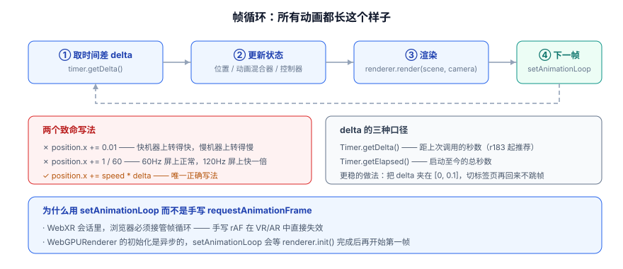
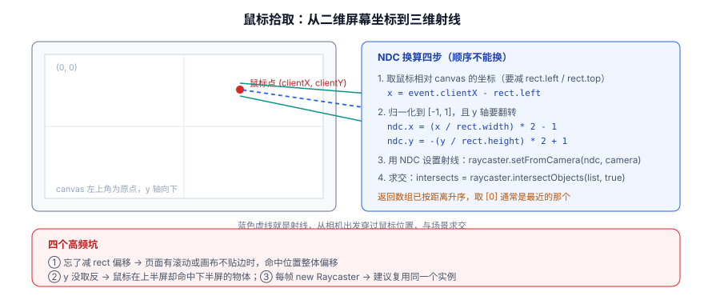

# 动画与交互

3D 场景和普通页面最大的区别是：**它有一个永不停止的循环**。页面是「事件驱动」的，3D 场景是「帧驱动」的。

一句话定位：这一页讲清 **帧循环该怎么写、时间该怎么算、用户的操作怎么变成场景里的响应**。

## 帧循环：`setAnimationLoop` 是唯一推荐写法

```javascript [frame-loop.js]
const timer = new Timer();     // r183 起 THREE.Clock 被弃用，官方推荐 Timer

renderer.setAnimationLoop((time, frame) => {
  timer.update();
  // getDelta() 返回「距上次调用过了多少秒」
  const dt = Math.min(timer.getDelta(), 0.1);   // 夹住上限，切标签页回来不跳帧

  cube.rotation.y += 0.6 * dt;                  // 帧率无关
  controls.update();                             // 有 damping / autoRotate 就必须调
  renderer.render(scene, camera);
});
```



:::danger 千万别写「每帧加一个固定值」
```javascript
// ✗ 错误一：固定步长 —— 高端机转得快，低端机转得慢
cube.rotation.y += 0.01;

// ✗ 错误二：假设 60fps —— 120Hz 屏幕上快一倍，省电模式下慢一半
cube.rotation.y += 1 / 60;

// ✓ 唯一正确：乘以 delta（秒）
cube.rotation.y += speed * dt;
```
这是 3D 动画里**最容易犯、也最难察觉**的错误：在你自己的机器上一切正常，到用户的高刷手机上速度就翻倍。**任何与时间相关的量都必须乘 `dt`。**
:::

### 为什么不用手写 `requestAnimationFrame`

| 对比项 | `setAnimationLoop` | 手写 `requestAnimationFrame` |
| --- | --- | --- |
| WebXR（VR/AR） | **必要**，浏览器要接管帧循环 | **直接失效** |
| WebGPURenderer 异步初始化 | 会等 `renderer.init()` 完成再开始第一帧 | 需要自己写等待逻辑 |
| 暂停/恢复 | 传 `null` 即可停止 | 要自己管理 `cancelAnimationFrame` |
| 后台标签页 | 自动降频/停止 | 同样会停，但恢复时机不易控 |

**结论：没有理由不用 `setAnimationLoop`。**

:::warning delta 一定要夹上限
浏览器切到后台标签页时会暂停 `requestAnimationFrame`，回来时第一帧的 `delta` 可能是**几秒**。此时 `position.x += speed * dt` 会让物体瞬移到屏幕外。所以：

- 物理模拟类：把 `dt` 夹在 `[0, 0.05]` 或 `[0, 0.1]`；
- 或者用「固定步长 + 累积器」模式（固定每步 1/60 秒，多余时间留到下一帧补），这样物理表现最稳定。
:::

## 关键帧动画：`AnimationMixer`

模型自带的动画（骨骼、变形、物体位移）通过 `AnimationMixer` 播放，不依赖手写帧循环逻辑。

```javascript [animation-mixer.js]
// gltf.animations 是一个 AnimationClip 数组，由模型文件提供
const mixer = new THREE.AnimationMixer(gltf.scene);

const actions = {};
for (const clip of gltf.animations) {
  const action = mixer.clipAction(clip);
  action.clampWhenFinished = true;    // 播完停在最后一帧，不要回到第一帧
  action.setLoop(THREE.LoopOnce);     // 循环/单次
  actions[clip.name] = action;
}

// 播放
actions['Idle'].reset().fadeIn(0.3).play();

// 切换：交叉淡化，避免生硬跳变
function play(name, duration = 0.3) {
  const next = actions[name];
  if (!next || next.isRunning()) return;
  for (const [, a] of Object.entries(actions)) {
    if (a !== next && a.isRunning()) a.fadeOut(duration);
  }
  next.reset().setEffectiveTimeScale(1).fadeIn(duration).play();
}

// 帧循环里驱动（必须放在 render 之前）
renderer.setAnimationLoop(() => {
  timer.update();
  const dt = Math.min(timer.getDelta(), 0.1);
  mixer.update(dt);            // 少了这一行，任何关键帧动画都不会动
  renderer.render(scene, camera);
});
```

| 方法 | 作用 | 注意 |
| --- | --- | --- |
| `mixer.clipAction(clip)` | 拿到动作对象 | 同一个 clip 多次调用返回同一个 action |
| `action.play()` / `stop()` / `pause()` | 播放控制 | `stop()` 会重置时间 |
| `action.reset()` | 复位到初始状态 | 切换动画前几乎总要调 |
| `action.fadeIn(d)` / `fadeOut(d)` | 淡入淡出 | 做过渡的标准手段 |
| `action.crossFadeTo(other, d)` | 两条动作互相交叉 | 要求两个都已 `play()` |
| `action.setEffectiveTimeScale(s)` | 播放速度倍率 | 负值 = 倒放 |
| `mixer.timeScale` | 整体速度 | 做「慢动作」很方便 |
| `mixer.update(dt)` | **驱动动画** | 必须每帧调用 |

:::info r185 修了一个倒放相关的 bug
r185 修复了 `AnimationAction` 的 **time warping** 问题——以负播放速度（倒带）驱动 mixer 时会产生错误的混合状态。如果你的场景里有「倒放动画」或时间轴拖动，升级到 r185+ 会直接受益，而且**不需要改代码**。
:::

## 手写补间：三种够用的做法

不是所有动效都值得上动画系统。三种最简单的手段：

```javascript [tween.js]
// ① 线性插值：从 a 到 b，按 t 比例取中间值
const t = (Math.sin(elapsed * 2) + 1) / 2;              // 0→1 往复
cube.position.y = THREE.MathUtils.lerp(0, 2, t);

// ② 阻尼逼近：朝目标靠近，越近越慢，天然带「手感」
//    第三个参数 lambda 越大越快，与帧率无关（这是它优于 lerp 的地方）
camera.position.x = THREE.MathUtils.damp(camera.position.x, targetX, 4, dt);

// ③ 缓动曲线：位置用 smoothstep，避免起停生硬
const smooth = THREE.MathUtils.smoothstep(t, 0, 1);
mesh.scale.setScalar(THREE.MathUtils.lerp(1, 1.5, smooth));
```

:::tip `damp` 而不是 `lerp` 做跟随
`lerp(current, target, 0.1)` 这类写法**依赖帧率**：60fps 下 1 秒内能走完约 99.8%，30fps 下只走 96%，两台上机器的跟随速度肉眼可见不同。`MathUtils.damp(current, target, lambda, dt)` 内部按 `exp(-lambda*dt)` 衰减，**结果是帧率无关的**——所有「相机平滑跟随」「UI 元素浮动跟随」都应该用它。
:::

## 交互：轨道控制器

```javascript [controls.js]
import { OrbitControls } from 'three/addons/controls/OrbitControls.js';

const controls = new OrbitControls(camera, renderer.domElement);
controls.enableDamping = true;         // 阻尼：松开鼠标后还会滑一小段
controls.dampingFactor = 0.05;
controls.autoRotate = true;            // 自动旋转（展厅模式）
controls.autoRotateSpeed = 0.8;
controls.target.set(0, 1, 0);          // 围绕哪个点转
controls.minDistance = 2;              // 限制缩放范围，防止穿模/飞走
controls.maxDistance = 20;
controls.maxPolarAngle = Math.PI / 2;  // 不允许转到地面以下
controls.enablePan = false;            // 大屏展示通常禁掉平移，避免用户「找不到北」

// 有 damping 或 autoRotate 时，必须每帧调用 update()
renderer.setAnimationLoop(() => {
  controls.update();
  renderer.render(scene, camera);
});

// 销毁时释放事件监听（单页应用里切换路由不释放会泄漏）
// controls.dispose();
```

| 控制器 | 用途 | 特点 |
| --- | --- | --- |
| `OrbitControls` | 绕目标点旋转/缩放/平移 | 最通用，产品展示、看板首选 |
| `MapControls` | 地图式平移（左键平移、右键旋转） | 俯视场景更自然 |
| `TrackballControls` | 无「上方向」约束的自由旋转 | 检查模型用，用户容易迷路 |
| `PointerLockControls` | 第一人称（锁定鼠标） | 室内漫游、游戏 |
| `FirstPersonControls` | 第一人称（不锁鼠标） | 早期方案，少用 |
| `FlyControls` / `ArcballControls` | 飞行/轨迹球 | 特定场景 |

## 射线拾取：把「点到了谁」算出来

鼠标是二维的，场景是三维的。`Raycaster` 做的就是从相机出发、穿过鼠标位置发一条射线，与场景求交。



```javascript [picking.js]
const raycaster = new THREE.Raycaster();      // 复用同一个实例，别每帧 new
const pointer = new THREE.Vector2();
const pickables = [];                         // 只放「可被点中」的物体，比遍历全场景快得多

renderer.domElement.addEventListener('pointerdown', (event) => {
  const rect = renderer.domElement.getBoundingClientRect();

  // ① 换算到 [-1, 1]，注意 y 轴要取反（屏幕向下、NDC 向上）
  pointer.x = ((event.clientX - rect.left) / rect.width) * 2 - 1;
  pointer.y = -((event.clientY - rect.top) / rect.height) * 2 + 1;

  // ② 用相机与 NDC 生成射线
  raycaster.setFromCamera(pointer, camera);

  // ③ 求交：第二个参数 true 表示递归子节点
  const hits = raycaster.intersectObjects(pickables, true);
  if (!hits.length) return;

  const hit = hits[0];       // 数组已按距离升序

  // InstancedMesh 会返回实例序号，用它反查数据行
  if (hit.instanceId !== undefined) {
    console.log('点中了第', hit.instanceId, '个实例', data[hit.instanceId]);
  } else {
    console.log('点中了', hit.object.name, '距离', hit.distance.toFixed(2));
  }
  console.log('世界坐标点：', hit.point);
});
```

命中的 `intersection` 对象包含这些字段：

| 字段 | 含义 | 用途 |
| --- | --- | --- |
| `distance` | 相机到交点的距离 | 结果已按它排序，取 `[0]` 即最近 |
| `point` | 交点的世界坐标 | 放标记、贴 tooltip |
| `object` | 命中的对象 | 反查业务数据（常配 `object.userData`） |
| `instanceId` | 实例化物体中的序号 | **数据可视化里最关键的一个字段** |
| `face` / `faceIndex` | 命中的三角面 | 做贴花、面级高亮 |
| `uv` | 命中点的 UV | 在贴图上画标记 |

:::danger 拾取的三个高频坑
1. **忘了减 `rect.left/top`**。页面有滚动、画布不贴边、或画布有 padding 时，命中位置会整体偏移。**必须用 `getBoundingClientRect()` 换算，不要直接用 `clientX`。**
2. **y 轴没取反**。表现为「鼠标在上半屏却命中下半屏的物体」，且往往对称，很容易误判成模型问题。
3. **拾取范围给太大**。给 `intersectObjects` 传整个 `scene.children` 时，射线会去撞地面、灯光辅助物体、看不见的包围盒，导致「明明没点到却被判定点中」。**维护一个 `pickables` 数组，只放真正要交互的对象。**
:::

## 屏幕标签：`CSS2DRenderer`

在 3D 物体上方固定一个 HTML 标签（tooltip、数值气泡），最省事的方案是 `CSS2DRenderer`——它用真实的 DOM 元素，能直接用 CSS 排版。

```javascript [css2d-label.js]
import { CSS2DRenderer, CSS2DObject } from 'three/addons/renderers/CSS2DRenderer.js';

const labelRenderer = new CSS2DRenderer();
labelRenderer.setSize(innerWidth, innerHeight);
labelRenderer.domElement.style.position = 'absolute';
labelRenderer.domElement.style.top = '0';
labelRenderer.domElement.style.pointerEvents = 'none';   // 不挡住鼠标拾取
document.body.appendChild(labelRenderer.domElement);

const div = document.createElement('div');
div.className = 'tooltip';
div.textContent = '设备 A · 运行中';
const label = new CSS2DObject(div);
label.position.set(0, 2, 0);
mesh.add(label);            // 挂在物体上，跟着一起动

// 帧循环里多渲染一次
renderer.setAnimationLoop(() => {
  controls.update();
  renderer.render(scene, camera);
  labelRenderer.render(scene, camera);
});
```

:::warning `CSS3DRenderer` 的边界
`CSS3DRenderer` 能把真实 DOM 元素**贴进 3D 空间**（类似「平面的 3D 物体」），适合做网页墙、3D 相册。但它与 WebGL 内容是**两个独立的合成层**，无法互相遮挡，也不能给 DOM 加着色器效果。需要真正的 3D 交互时，还是用纹理把页面画到平面上。
:::

## 综合示例：可交互的场景

```javascript [interactive.js]
import * as THREE from 'three';
import { OrbitControls } from 'three/addons/controls/OrbitControls.js';

const renderer = new THREE.WebGLRenderer({ antialias: true });
renderer.setPixelRatio(Math.min(devicePixelRatio, 2));
renderer.setSize(innerWidth, innerHeight);
document.body.appendChild(renderer.domElement);

const scene = new THREE.Scene();
scene.background = new THREE.Color(0x0f172a);
const camera = new THREE.PerspectiveCamera(50, innerWidth / innerHeight, 0.1, 100);
camera.position.set(5, 4, 7);

scene.add(new THREE.AmbientLight(0xffffff, 0.6));
const sun = new THREE.DirectionalLight(0xffffff, 2.5);
sun.position.set(5, 10, 7);
scene.add(sun);

// 三个可拾取的立方体
const boxes = [];
const geo = new THREE.BoxGeometry(1, 1, 1);
const colors = [0x2563eb, 0x0d9488, 0xd97706];
colors.forEach((c, i) => {
  const mesh = new THREE.Mesh(geo, new THREE.MeshStandardMaterial({ color: c, roughness: 0.4 }));
  mesh.position.set((i - 1) * 1.8, 0.5, 0);
  mesh.userData = { id: i, label: `设备 ${i + 1}` };
  mesh.name = `box-${i}`;
  scene.add(mesh);
  boxes.push(mesh);
});

const controls = new OrbitControls(camera, renderer.domElement);
controls.enableDamping = true;
controls.minDistance = 3;
controls.maxDistance = 20;
controls.maxPolarAngle = Math.PI / 2.05;
controls.target.set(0, 0.5, 0);
controls.autoRotate = true;
controls.autoRotateSpeed = 0.6;

// 拾取
const raycaster = new THREE.Raycaster();
const pointer = new THREE.Vector2();
let hovered = null;
const HOVER_Y = 1.0;   // 悬停时抬升的高度

renderer.domElement.addEventListener('pointermove', (e) => {
  const rect = renderer.domElement.getBoundingClientRect();
  pointer.x = ((e.clientX - rect.left) / rect.width) * 2 - 1;
  pointer.y = -((e.clientY - rect.top) / rect.height) * 2 + 1;
  raycaster.setFromCamera(pointer, camera);
  const hit = raycaster.intersectObjects(boxes, false)[0];

  if (hit?.object !== hovered) {
    if (hovered) hovered.scale.setScalar(1);
    hovered = hit ? hit.object : null;
    if (hovered) hovered.scale.setScalar(1.15);
    renderer.domElement.style.cursor = hovered ? 'pointer' : 'default';
  }
});

renderer.domElement.addEventListener('pointerdown', (e) => {
  const rect = renderer.domElement.getBoundingClientRect();
  pointer.x = ((e.clientX - rect.left) / rect.width) * 2 - 1;
  pointer.y = -((e.clientY - rect.top) / rect.height) * 2 + 1;
  raycaster.setFromCamera(pointer, camera);
  const hit = raycaster.intersectObjects(boxes, false)[0];
  if (hit) {
    console.log('点击：', hit.object.userData.label, '距离', hit.distance.toFixed(2));
    controls.autoRotate = false;      // 用户开始交互就停掉自动旋转
  }
});

// 帧循环
const timer = new Timer();
renderer.setAnimationLoop(() => {
  timer.update();
  const dt = Math.min(timer.getDelta(), 0.1);

  boxes.forEach((b, i) => {
    // 用 damp 平滑抬升，帧率无关
    const target = (b === hovered ? HOVER_Y : 0.5);
    b.position.y = THREE.MathUtils.damp(b.position.y, target, 8, dt);
    b.rotation.y += (0.3 + i * 0.1) * dt;
  });

  controls.update();
  renderer.render(scene, camera);
});

addEventListener('resize', () => {
  camera.aspect = innerWidth / innerHeight;
  camera.updateProjectionMatrix();
  renderer.setSize(innerWidth, innerHeight);
});
```

**验证方式**：启动后逐项确认：

1. 三个立方体在缓慢自转，相机围绕场景自动环绕；
2. 鼠标移到某个立方体上，它**平滑抬起并略微放大**，光标变成手型（说明拾取与阻尼都生效）；
3. 点击立方体，控制台打印「点击：设备 N 距离 x.xx」；
4. 点击后自动旋转停止（说明交互优先级正确）；
5. 拖动窗口大小，画面不拉伸；
6. 控制台无报错。

## 易错点

:::danger 动画与交互的六个坑
1. **忘了 `mixer.update(dt)`**。模型加载出来了、动画也 `play()` 了，就是不动——99% 是这一行没写，或者写在了 `render()` 之后。
2. **有 `enableDamping` 却忘了 `controls.update()`**。表现为拖动很生涩、松手就停，或者自动旋转完全不动。
3. **`pointerdown` 里用了 `mouseX`**。移动端没有鼠标事件；统一用 `pointer*` 系列事件可以同时覆盖鼠标、触摸与触控笔。
4. **每帧 `new Raycaster()` / `new Vector3()`**。这些是高频对象，每帧新建会给 GC 制造压力，表现是**周期性的帧率尖刺**（GC 暂停），而不是整体变慢，很难通过看平均 FPS 发现。
5. **拾取列表里混进了不该拾取的东西**。地面、辅助网格、`CSS2DObject` 都会被射线命中。
6. **单页应用切换路由不 `dispose`**。`OrbitControls` 挂了全局事件监听，`renderer.setAnimationLoop(null)` 也必须调用，否则旧场景的循环还在跑，内存与 GPU 资源都不会释放。
:::

:::tip 帧率问题的第一反应是「看分布」而不是「看平均」
平均 60fps 不代表体验好：如果每 20 帧卡一次（单帧 80ms），用户会明显感觉顿，但平均值看起来还行。度量时至少看 **P95/P99 帧时间**，并用 `performance.mark` 把「逻辑更新」与「渲染」分开计时，才能知道是 CPU 侧还是 GPU 侧的问题。详见 [性能与 WebGPU 边界](../Performance/index.md)。
:::

## 参考资料

1. three.js 文档 · `WebGLRenderer.setAnimationLoop`：<https://threejs.org/docs/#api/en/renderers/WebGLRenderer>
2. three.js 文档 · `AnimationMixer` 与 `AnimationAction`：<https://threejs.org/docs/#api/en/animation/AnimationMixer>
3. three.js 文档 · `Raycaster`：<https://threejs.org/docs/#api/en/core/Raycaster>
4. three.js 手册 · 相机控制：<https://threejs.org/manual/#en/cameras>
5. three.js 示例 · 射线拾取：<https://threejs.org/examples/#webgl_interactive_cubes>
6. MDN · Pointer events：<https://developer.mozilla.org/zh-CN/docs/Web/API/Pointer_events>
